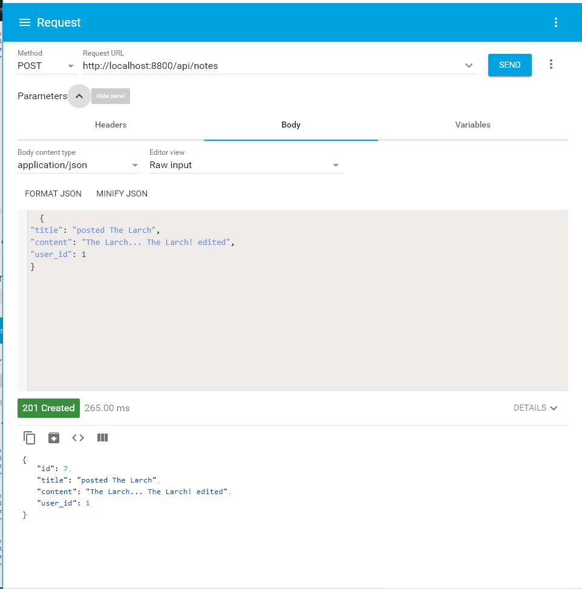
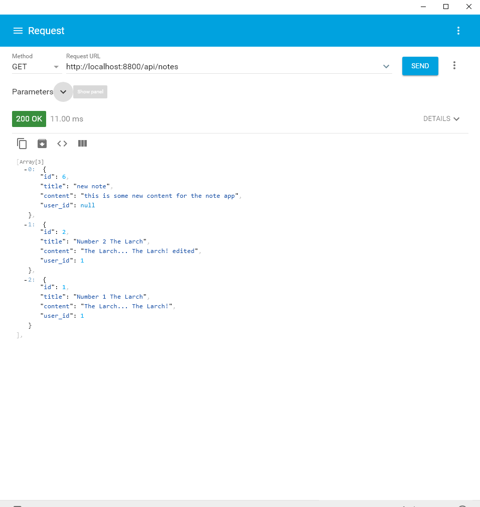
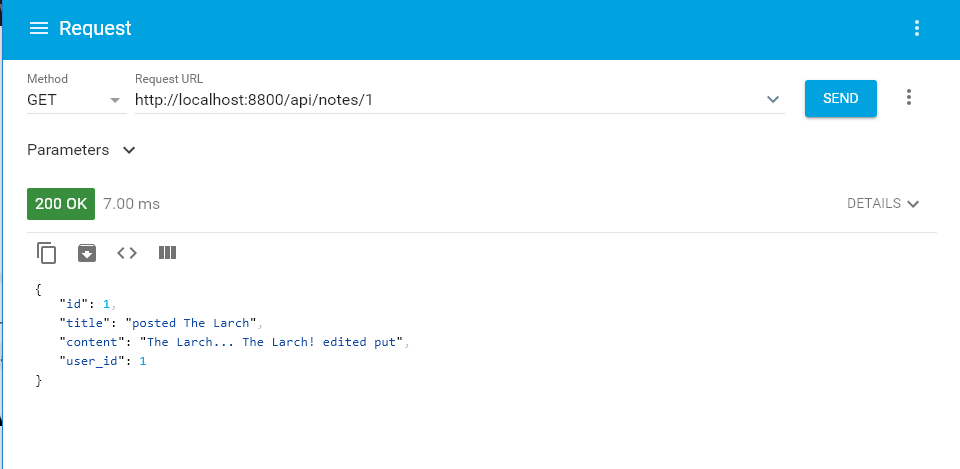
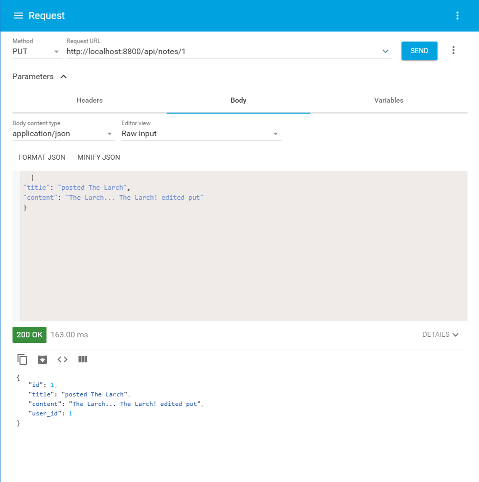
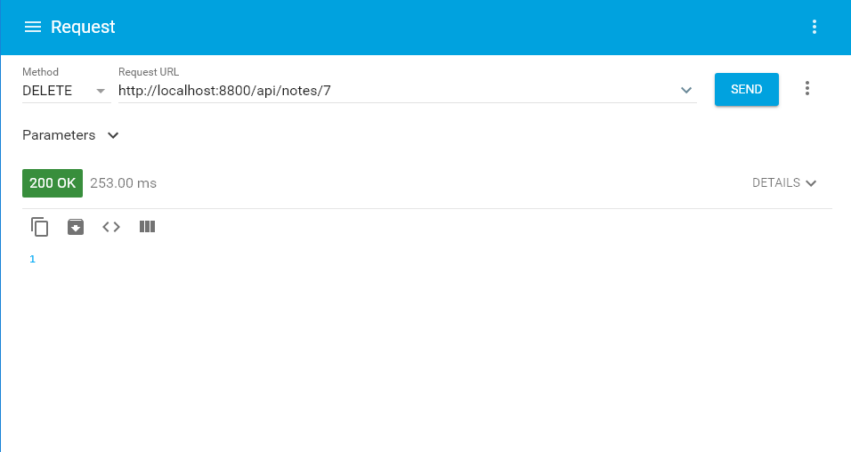

# BACK END PROJECT WEEK - (TOM TARPEY)

This is a REST CRUD API with endpoints to create, read, edit and update data in a database.

## RUNNING API

The API can be run in a few different ways the simplest to get it up and running in a fast fasion is to run the server locally. for this you can fork and / clone it to your local machine.

**There are some prerequisites for this however:**

- [git](https://www.linode.com/docs/development/version-control/how-to-install-git-on-linux-mac-and-windows/)
- [nodejs](https://nodejs.org/en/download/)
- [npm](https://docs.npmjs.com/getting-started/installing-node)
- [yarn](https://yarnpkg.com/lang/en/docs/install/#windows-stable) (optional but reccomended)

FORK
`to fork see the link below`
[how to fork](https://help.github.com/articles/fork-a-repo/)

CLONE
`git clone git@github.com:decagondev/back-end-project-week-tom-tarpey.git`
this will clone the repository locally to your machine.

SETUP
`cd back-end-project-week-tom-tarpey`
`yarn`
this will move you in to the project directory then using yarn you will download and install the dependencies.

RUN
`yarn dev`
This will run the development server at `http://localhost:8800/` using nodemon
you can use `yarn start` to run it with node. **for usage see the endpoints**

---

## USAGE

**CRUD OPERATION ENDPOINTS**
The endpoints link you to the functionality of the database and include:

- `C`reate - `POST` endpoint to do `INSERT` on the database
- `R`ead - `GET` endpoint to do `GET` on the database
- `U`pdate - `PUT` endpoint to do `UPDATE` on the database
- `D`elete - `DELETE` endpoint to do `DELETE` on the database

### CREATE

**create a note**

URI: `http://<server_address:port>`

ENDPOINT: `POST -> /api/notes`

URL: `URI/ENDPOINT`

this endpoint takes in a json object as the body of the request that must contain a title, a content and a user_id :

```
{
  "title": "some title",
  "content": "some content",
  "user_id": 1
}
```



### READ

**read a list of notes**

URI: `http://<server_address:port>`

ENDPOINT: `GET -> /api/notes`



**read a single note by id**
`GET -> /api/notes/:id`



### UPDATE

**update a note by id**
`PUT -> /api/notes/:id`

this endpoint takes in a json object as the body of the request that must contain a title and a content :

```
{
  "title": "some title",
  "content": "some content"
}
```



### DELETE

**delete a note by id**
`DELETE -> /api/notes/:id`



---

## DATABASE

The current database in use is a simple sqlite database but this API is extensible in that you can change the `./data/dbConfig.js` file to decide what type of database provider is used (see [knex documentation](https://knexjs.org/) for further information)

For production we can use a postgres database by using the production config instead of the development config which is using sqlite3.

---

## DEPLOY

**here is the instructions for deploying the server to heroku**

- create a [heroku](https://www.heroku.com/) account for free
- download and install the [heroku cli](https://devcenter.heroku.com/articles/heroku-cli)
- create an app on heroku
- follow the instructions to add your heroku remote
- commit any changes
- deploy `git push heroku`
- migrate tables for data `heroku run knex migrate:latest`
- seed data `heroku run knex seed:run`
