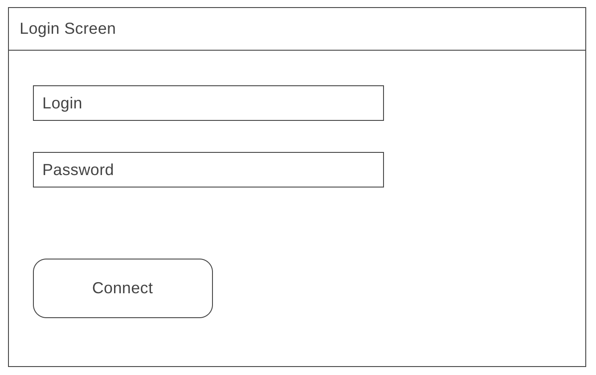
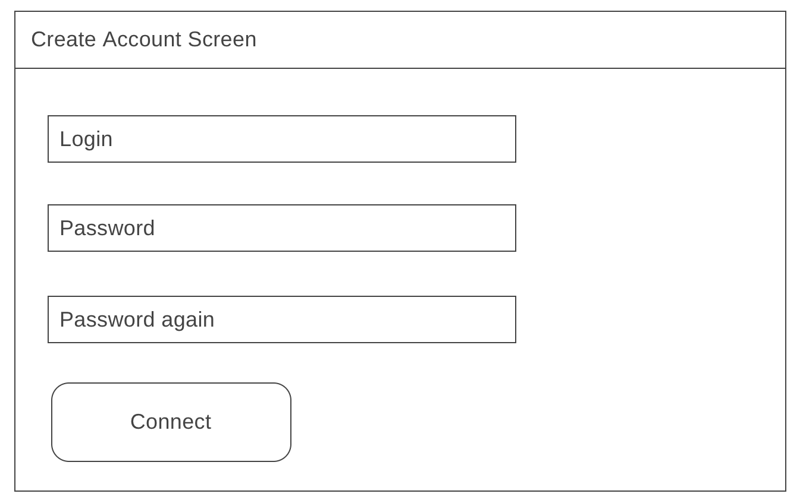
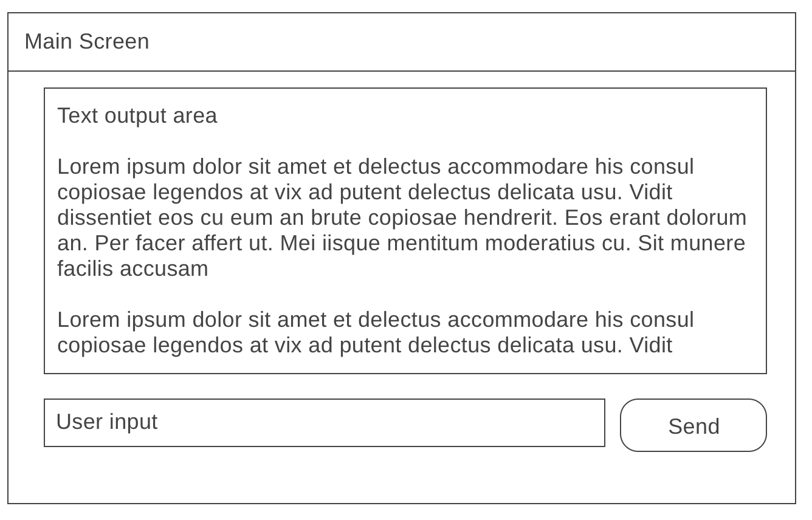
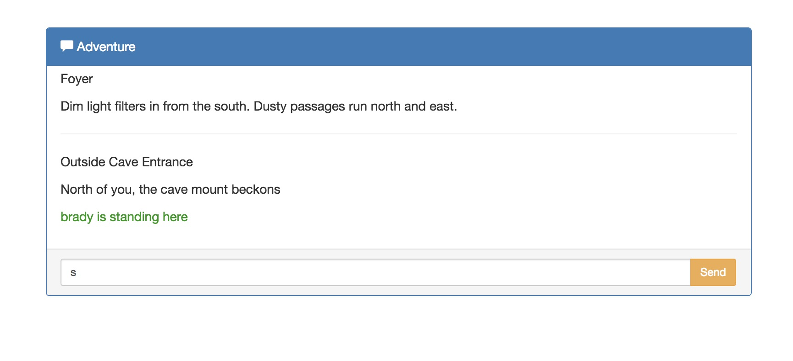

Client-approved wireframes are here.

These wireframes show minimum expected functionality. You should be creative here both in features and design.

If you're in another program other than FSW, consider ways that the design could be improved for your platform.

-----

Example web implementation:

