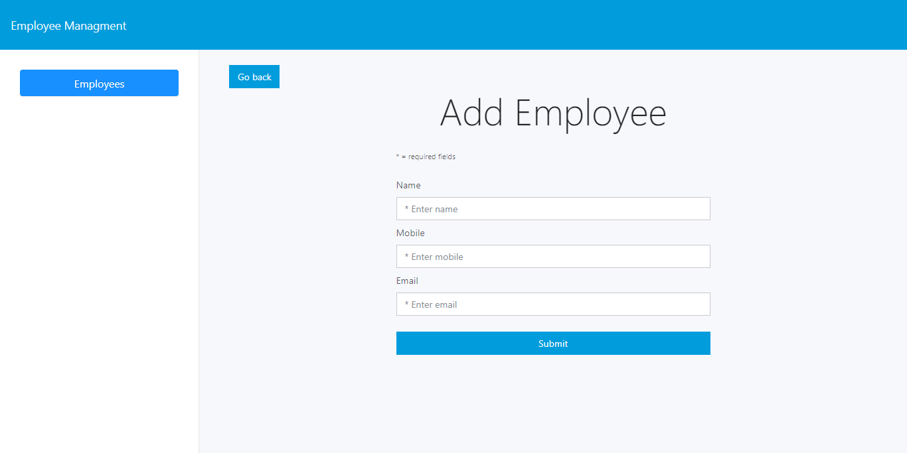
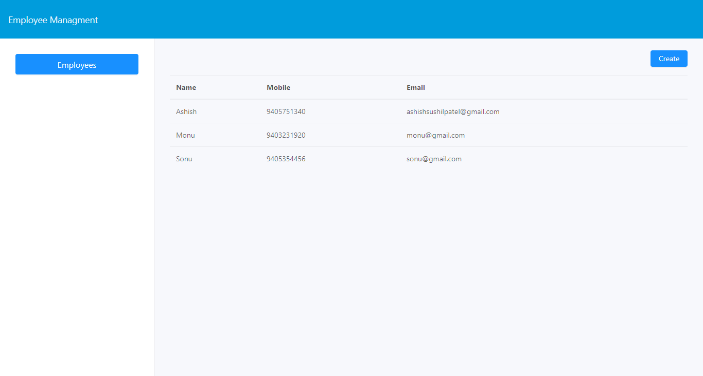

# Employee Management

Simple crud app made with react.

## Setup

```bash
$ git clone https://github.com/ashishdotme/employee-manager.git
$ cd employee-manager
$ yarn install
$ yarn run client-install
```

## Run app

```bash
$ npm run dev
```

## Demo

https://employee-team.herokuapp.com/

## Screenshots




