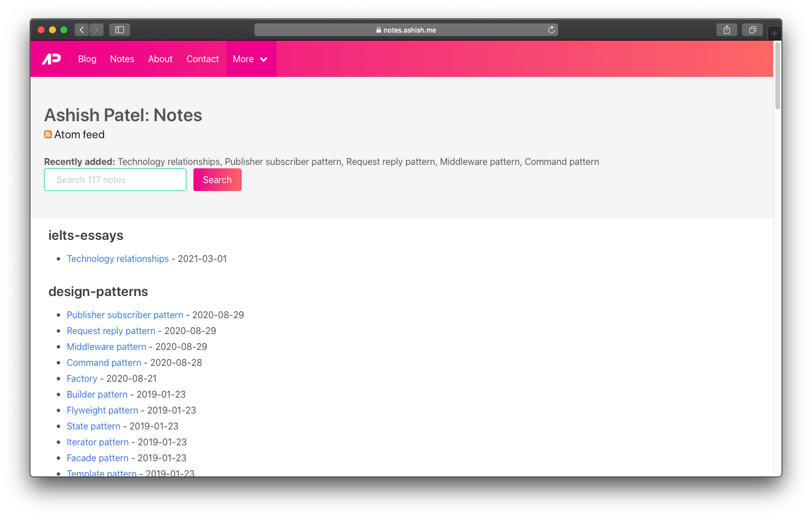

  

<h2 align="center">notes.ashish.me</h2>

    

📻 my notes on various topics

  

<a href="https://notes.ashish.me">https://notes.ashish.me</a>

<!-- index starts -->

## C sharp

- [Xunit](https://github.com/ashishdotme/notes/blob/master/c-sharp/xunit.md) - _last updated at 2021-03-07_
- [Delegates](https://github.com/ashishdotme/notes/blob/master/c-sharp/delegates.md) - _last updated at 2019-01-23_
- [Entity](https://github.com/ashishdotme/notes/blob/master/c-sharp/entity.md) - _last updated at 2019-01-23_
- [Generics](https://github.com/ashishdotme/notes/blob/master/c-sharp/generics.md) - _last updated at 2019-01-23_
- [Introduction](https://github.com/ashishdotme/notes/blob/master/c-sharp/introduction.md) - _last updated at 2019-01-23_
- [Linq](https://github.com/ashishdotme/notes/blob/master/c-sharp/linq.md) - _last updated at 2019-01-23_
- [Oops](https://github.com/ashishdotme/notes/blob/master/c-sharp/oops.md) - _last updated at 2019-01-23_
- [Design patterns](https://github.com/ashishdotme/notes/blob/master/c-sharp/design-patterns.md) - _last updated at 2019-01-23_
- [Lamdas](https://github.com/ashishdotme/notes/blob/master/c-sharp/lamdas.md) - _last updated at 2019-01-23_
- [Clr](https://github.com/ashishdotme/notes/blob/master/c-sharp/CLR.md) - _last updated at 2019-01-23_
- [Ado](https://github.com/ashishdotme/notes/blob/master/c-sharp/ado.md) - _last updated at 2019-01-23_

## Ielts essays

- [Technology relationships](https://github.com/ashishdotme/notes/blob/master/ielts-essays/technology-relationships.md) - _last updated at 2021-03-01_

## Design patterns

- [Publisher subscriber pattern](https://github.com/ashishdotme/notes/blob/master/design-patterns/publisher-subscriber-pattern.md) - _last updated at 2020-08-29_
- [Request reply pattern](https://github.com/ashishdotme/notes/blob/master/design-patterns/request-reply-pattern.md) - _last updated at 2020-08-29_
- [Template pattern](https://github.com/ashishdotme/notes/blob/master/design-patterns/template-pattern.md) - _last updated at 2020-08-29_
- [Middleware pattern](https://github.com/ashishdotme/notes/blob/master/design-patterns/middleware-pattern.md) - _last updated at 2020-08-29_
- [Observer pattern](https://github.com/ashishdotme/notes/blob/master/design-patterns/observer-pattern.md) - _last updated at 2020-08-28_
- [Command pattern](https://github.com/ashishdotme/notes/blob/master/design-patterns/command-pattern.md) - _last updated at 2020-08-28_
- [Strategy pattern](https://github.com/ashishdotme/notes/blob/master/design-patterns/strategy-pattern.md) - _last updated at 2020-08-28_
- [Composite pattern](https://github.com/ashishdotme/notes/blob/master/design-patterns/composite-pattern.md) - _last updated at 2020-08-27_
- [Decorator pattern](https://github.com/ashishdotme/notes/blob/master/design-patterns/decorator-pattern.md) - _last updated at 2020-08-23_
- [Proxy pattern](https://github.com/ashishdotme/notes/blob/master/design-patterns/proxy-pattern.md) - _last updated at 2020-08-23_
- [Adapter pattern](https://github.com/ashishdotme/notes/blob/master/design-patterns/adapter-pattern.md) - _last updated at 2020-08-23_
- [Builder pattern](https://github.com/ashishdotme/notes/blob/master/design-patterns/builder-pattern.md) - _last updated at 2020-08-21_
- [Factory](https://github.com/ashishdotme/notes/blob/master/design-patterns/factory.md) - _last updated at 2020-08-21_
- [Singleton pattern](https://github.com/ashishdotme/notes/blob/master/design-patterns/singleton-pattern.md) - _last updated at 2020-08-21_
- [Flyweight pattern](https://github.com/ashishdotme/notes/blob/master/design-patterns/flyweight-pattern.md) - _last updated at 2019-01-23_
- [State pattern](https://github.com/ashishdotme/notes/blob/master/design-patterns/state-pattern.md) - _last updated at 2019-01-23_
- [Iterator pattern](https://github.com/ashishdotme/notes/blob/master/design-patterns/iterator-pattern.md) - _last updated at 2019-01-23_
- [Facade pattern](https://github.com/ashishdotme/notes/blob/master/design-patterns/facade-pattern.md) - _last updated at 2019-01-23_
- [Introduction](https://github.com/ashishdotme/notes/blob/master/design-patterns/introduction.md) - _last updated at 2019-01-23_
- [Factory method](https://github.com/ashishdotme/notes/blob/master/design-patterns/factory-method.md) - _last updated at 2019-01-23_
- [Memento pattern](https://github.com/ashishdotme/notes/blob/master/design-patterns/memento-pattern.md) - _last updated at 2019-01-23_
- [Prototype pattern](https://github.com/ashishdotme/notes/blob/master/design-patterns/prototype-pattern.md) - _last updated at 2019-01-23_
- [Visitor pattern](https://github.com/ashishdotme/notes/blob/master/design-patterns/visitor-pattern.md) - _last updated at 2019-01-23_
- [Interpreter pattern](https://github.com/ashishdotme/notes/blob/master/design-patterns/interpreter-pattern.md) - _last updated at 2019-01-23_
- [Delegate pattern](https://github.com/ashishdotme/notes/blob/master/design-patterns/delegate-pattern.md) - _last updated at 2019-01-23_
- [Bridge pattern](https://github.com/ashishdotme/notes/blob/master/design-patterns/bridge-pattern.md) - _last updated at 2019-01-23_
- [Chain of responsibility](https://github.com/ashishdotme/notes/blob/master/design-patterns/chain-of-responsibility.md) - _last updated at 2019-01-23_
- [Mediator pattern](https://github.com/ashishdotme/notes/blob/master/design-patterns/mediator-pattern.md) - _last updated at 2019-01-23_

## Javascript

- [Generator](https://github.com/ashishdotme/notes/blob/master/javascript/generator.md) - _last updated at 2020-08-27_
- [Async await](https://github.com/ashishdotme/notes/blob/master/javascript/async-await.md) - _last updated at 2020-08-23_
- [Callback hell](https://github.com/ashishdotme/notes/blob/master/javascript/callback-hell.md) - _last updated at 2020-08-23_
- [Es6](https://github.com/ashishdotme/notes/blob/master/javascript/es6.md) - _last updated at 2019-04-18_
- [Babel](https://github.com/ashishdotme/notes/blob/master/javascript/babel.md) - _last updated at 2019-04-18_
- [Exports imports](https://github.com/ashishdotme/notes/blob/master/javascript/exports-imports.md) - _last updated at 2019-04-18_
- [Prototypes and classes](https://github.com/ashishdotme/notes/blob/master/javascript/prototypes-and-classes.md) - _last updated at 2019-04-18_
- [Webpack](https://github.com/ashishdotme/notes/blob/master/javascript/webpack.md) - _last updated at 2019-04-18_
- [Introduction](https://github.com/ashishdotme/notes/blob/master/javascript/introduction.md) - _last updated at 2019-01-23_
- [Es5](https://github.com/ashishdotme/notes/blob/master/javascript/es5.md) - _last updated at 2019-01-23_

## React

- [Redux](https://github.com/ashishdotme/notes/blob/master/react/redux.md) - _last updated at 2020-08-21_
- [Lifecycle](https://github.com/ashishdotme/notes/blob/master/react/lifecycle.md) - _last updated at 2020-08-21_
- [Binding](https://github.com/ashishdotme/notes/blob/master/react/binding.md) - _last updated at 2019-04-18_
- [Testing](https://github.com/ashishdotme/notes/blob/master/react/testing.md) - _last updated at 2019-04-18_
- [Redux sideeffects](https://github.com/ashishdotme/notes/blob/master/react/redux-sideeffects.md) - _last updated at 2019-04-18_

## Docker

- [Cheatsheet](https://github.com/ashishdotme/notes/blob/master/docker/cheatsheet.md) - _last updated at 2019-09-03_
- [Architecture](https://github.com/ashishdotme/notes/blob/master/docker/architecture.md) - _last updated at 2019-04-08_
- [Container](https://github.com/ashishdotme/notes/blob/master/docker/container.md) - _last updated at 2019-04-08_

## Personal

- [Skin care](https://github.com/ashishdotme/notes/blob/master/personal/skin-care.md) - _last updated at 2019-04-22_
- [Diet plan](https://github.com/ashishdotme/notes/blob/master/personal/diet-plan.md) - _last updated at 2019-04-19_
- [Hair care](https://github.com/ashishdotme/notes/blob/master/personal/hair-care.md) - _last updated at 2019-04-18_
- [Gym](https://github.com/ashishdotme/notes/blob/master/personal/gym.md) - _last updated at 2019-04-17_

## Macbook

- [Setup](https://github.com/ashishdotme/notes/blob/master/macbook/setup.md) - _last updated at 2019-04-18_

## English

- [Vocalary](https://github.com/ashishdotme/notes/blob/master/english/vocalary.md) - _last updated at 2019-04-18_
- [Prepositions](https://github.com/ashishdotme/notes/blob/master/english/prepositions.md) - _last updated at 2019-04-18_

## Perforce

- [Introduction](https://github.com/ashishdotme/notes/blob/master/perforce/introduction.md) - _last updated at 2019-04-18_
- [Basic operations](https://github.com/ashishdotme/notes/blob/master/perforce/basic-operations.md) - _last updated at 2019-04-18_
- [Stream](https://github.com/ashishdotme/notes/blob/master/perforce/stream.md) - _last updated at 2019-04-18_

## Data structures

- [Stack](https://github.com/ashishdotme/notes/blob/master/data-structures/stack.md) - _last updated at 2019-01-23_
- [Hash table](https://github.com/ashishdotme/notes/blob/master/data-structures/hash-table.md) - _last updated at 2019-01-23_
- [Time complexity](https://github.com/ashishdotme/notes/blob/master/data-structures/time-complexity.md) - _last updated at 2019-01-23_
- [Introduction](https://github.com/ashishdotme/notes/blob/master/data-structures/introduction.md) - _last updated at 2019-01-23_
- [Array](https://github.com/ashishdotme/notes/blob/master/data-structures/array.md) - _last updated at 2019-01-23_
- [Linked list](https://github.com/ashishdotme/notes/blob/master/data-structures/linked-list.md) - _last updated at 2019-01-23_
- [Queue](https://github.com/ashishdotme/notes/blob/master/data-structures/queue.md) - _last updated at 2019-01-23_
- [Tree](https://github.com/ashishdotme/notes/blob/master/data-structures/tree.md) - _last updated at 2019-01-23_
- [Graph](https://github.com/ashishdotme/notes/blob/master/data-structures/graph.md) - _last updated at 2019-01-23_

## Algorithms

- [Asymptotic analysis](https://github.com/ashishdotme/notes/blob/master/algorithms/asymptotic-analysis.md) - _last updated at 2019-01-23_
- [Backtracking](https://github.com/ashishdotme/notes/blob/master/algorithms/backtracking.md) - _last updated at 2019-01-23_
- [Introduction](https://github.com/ashishdotme/notes/blob/master/algorithms/introduction.md) - _last updated at 2019-01-23_
- [Recursion](https://github.com/ashishdotme/notes/blob/master/algorithms/recursion.md) - _last updated at 2019-01-23_
- [Divide and conquer](https://github.com/ashishdotme/notes/blob/master/algorithms/divide-and-conquer.md) - _last updated at 2019-01-23_
- [Dynamic programming](https://github.com/ashishdotme/notes/blob/master/algorithms/dynamic-programming.md) - _last updated at 2019-01-23_
- [Sorting](https://github.com/ashishdotme/notes/blob/master/algorithms/sorting.md) - _last updated at 2019-01-23_
- [Greedy algorithms](https://github.com/ashishdotme/notes/blob/master/algorithms/greedy-algorithms.md) - _last updated at 2019-01-23_

## Angular

- [Routing](https://github.com/ashishdotme/notes/blob/master/angular/routing.md) - _last updated at 2019-01-23_
- [Lifecycle](https://github.com/ashishdotme/notes/blob/master/angular/lifecycle.md) - _last updated at 2019-01-23_
- [Template](https://github.com/ashishdotme/notes/blob/master/angular/template.md) - _last updated at 2019-01-23_
- [Directives](https://github.com/ashishdotme/notes/blob/master/angular/directives.md) - _last updated at 2019-01-23_
- [Pipes](https://github.com/ashishdotme/notes/blob/master/angular/pipes.md) - _last updated at 2019-01-23_
- [Observables](https://github.com/ashishdotme/notes/blob/master/angular/observables.md) - _last updated at 2019-01-23_
- [Data binding](https://github.com/ashishdotme/notes/blob/master/angular/data-binding.md) - _last updated at 2019-01-23_
- [Components](https://github.com/ashishdotme/notes/blob/master/angular/components.md) - _last updated at 2019-01-23_
- [Module](https://github.com/ashishdotme/notes/blob/master/angular/module.md) - _last updated at 2019-01-23_
- [Introduction](https://github.com/ashishdotme/notes/blob/master/angular/introduction.md) - _last updated at 2019-01-23_
- [Dependency injection](https://github.com/ashishdotme/notes/blob/master/angular/dependency-injection.md) - _last updated at 2019-01-23_
- [Metadata](https://github.com/ashishdotme/notes/blob/master/angular/metadata.md) - _last updated at 2019-01-23_
- [Angular cli](https://github.com/ashishdotme/notes/blob/master/angular/angular-cli.md) - _last updated at 2019-01-23_

## Html

- [Position](https://github.com/ashishdotme/notes/blob/master/html/position.md) - _last updated at 2019-01-23_

## Computer architecture

- [Memory](https://github.com/ashishdotme/notes/blob/master/computer-architecture/memory.md) - _last updated at 2019-01-23_

## Swift

- [Extensions](https://github.com/ashishdotme/notes/blob/master/swift/extensions.md) - _last updated at 2019-01-23_
- [Collections](https://github.com/ashishdotme/notes/blob/master/swift/collections.md) - _last updated at 2019-01-23_
- [Generics](https://github.com/ashishdotme/notes/blob/master/swift/generics.md) - _last updated at 2019-01-23_
- [Classes and structures](https://github.com/ashishdotme/notes/blob/master/swift/classes-and-structures.md) - _last updated at 2019-01-23_
- [Pattern matching](https://github.com/ashishdotme/notes/blob/master/swift/pattern-matching.md) - _last updated at 2019-01-23_
- [Types and flow](https://github.com/ashishdotme/notes/blob/master/swift/types-and-flow.md) - _last updated at 2019-01-23_
- [Introduction](https://github.com/ashishdotme/notes/blob/master/swift/introduction.md) - _last updated at 2019-01-23_
- [Optionals](https://github.com/ashishdotme/notes/blob/master/swift/optionals.md) - _last updated at 2019-01-23_
- [Operators](https://github.com/ashishdotme/notes/blob/master/swift/operators.md) - _last updated at 2019-01-23_
- [Memory management](https://github.com/ashishdotme/notes/blob/master/swift/memory-management.md) - _last updated at 2019-01-23_
- [Functions and closures](https://github.com/ashishdotme/notes/blob/master/swift/functions-and-closures.md) - _last updated at 2019-01-23_
- [Error handling](https://github.com/ashishdotme/notes/blob/master/swift/error-handling.md) - _last updated at 2019-01-23_
- [Protocols](https://github.com/ashishdotme/notes/blob/master/swift/protocols.md) - _last updated at 2019-01-23_
- [Enumerations](https://github.com/ashishdotme/notes/blob/master/swift/enumerations.md) - _last updated at 2019-01-23_

## Maths

- [Misc](https://github.com/ashishdotme/notes/blob/master/maths/misc.md) - _last updated at 2019-01-23_
- [Logarithm](https://github.com/ashishdotme/notes/blob/master/maths/logarithm.md) - _last updated at 2019-01-23_

## Sql

- [Basics](https://github.com/ashishdotme/notes/blob/master/sql/basics.md) - _last updated at 2019-01-23_
- [Joins](https://github.com/ashishdotme/notes/blob/master/sql/joins.md) - _last updated at 2019-01-23_
<!-- index ends -->
