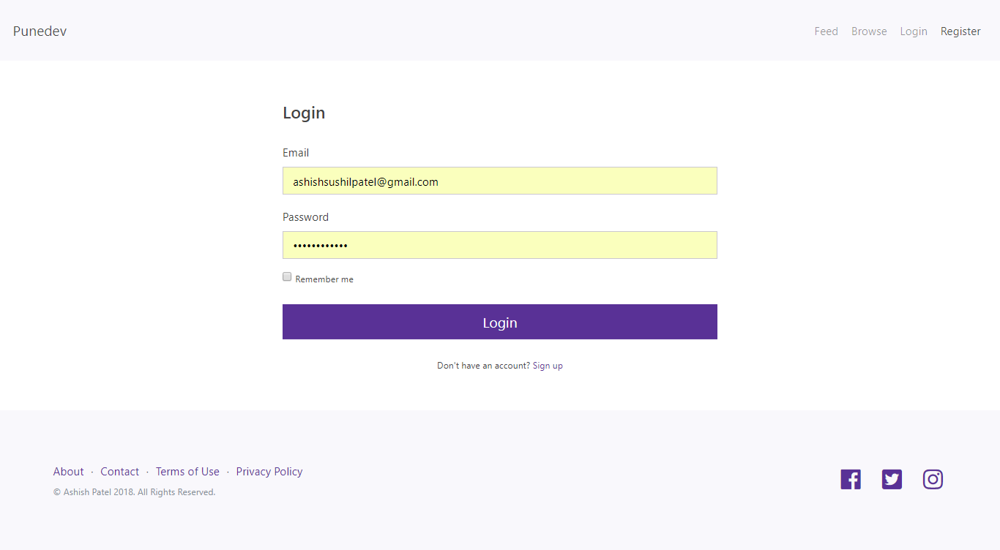
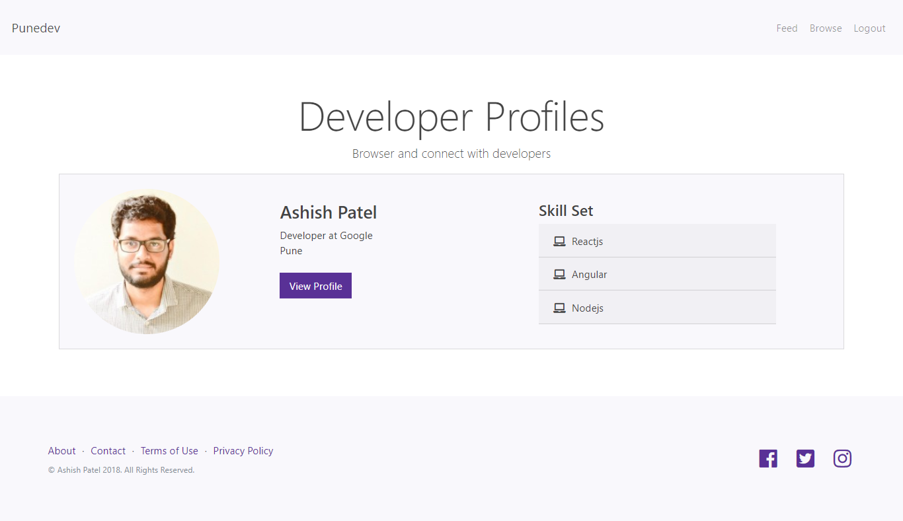
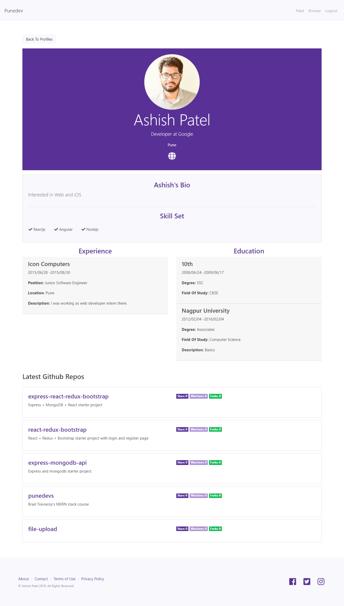
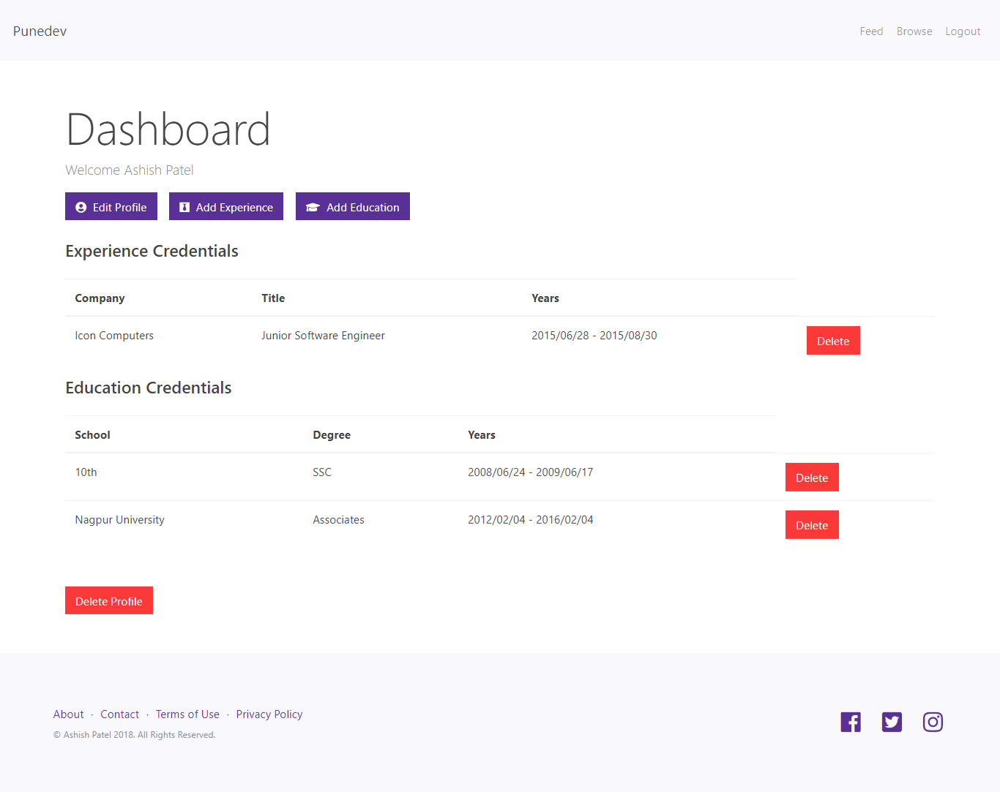
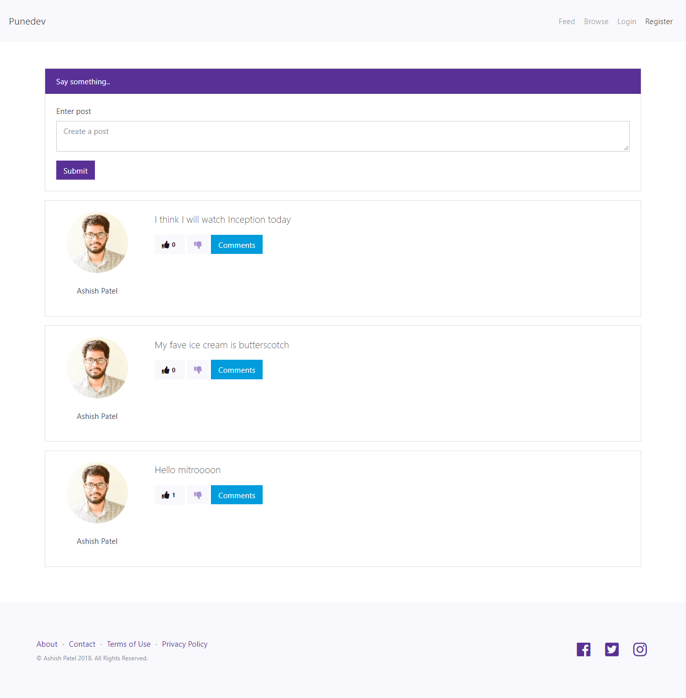

# Punedevs

A social network for developers based on Brad Traversy's MERN stack course.

## Setup

```bash
$ git clone https://github.com/ashishdotme/punedevs.git
$ cd pundevs
$ yarn install
$ yarn run client-install
```

## Run app

```bash
$ npm run dev
```

## Screenshots










