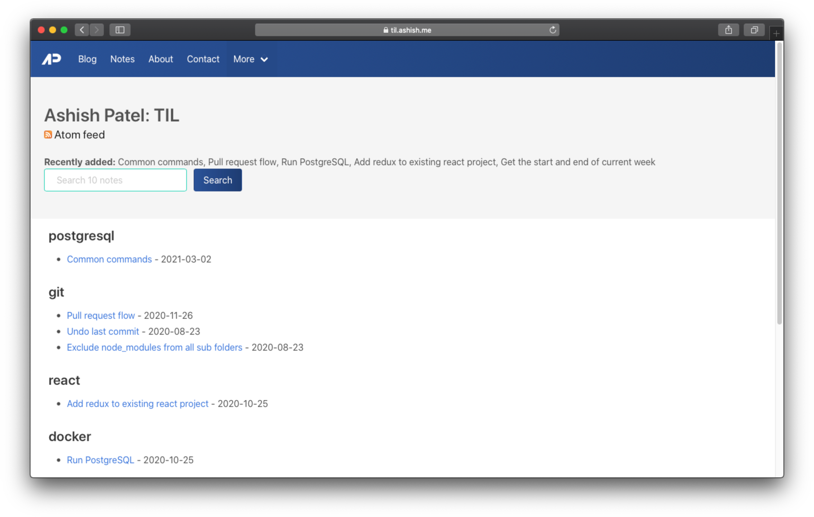

  

<h2 align="center">til.ashish.me</h2>

📝 My Today I Learned snippets. Inspired by <a href="hhttps://github.com/simonw/til">simonw/til</a>

  

<a href="https://til.ashish.me">https://til.ashish.me</a>

<!-- index starts -->

## mocha

- [Debugging testcase](https://github.com/ashishdotme/til.ashish.me/blob/master/mocha/debug-testcase.md) - 2020-04-20

## nodejs

- [Show console.log output in vscode debug console](https://github.com/ashishdotme/til.ashish.me/blob/master/nodejs/show-output-in-vscode.md) - 2020-08-21

## mongodb

- [Sort results in descending](https://github.com/ashishdotme/til.ashish.me/blob/master/mongodb/sort-results-descending.md) - 2020-08-23

## git

- [Exclude node_modules from all sub folders](https://github.com/ashishdotme/til.ashish.me/blob/master/git/exlude-node-moudles-from-all-subfolders.md) - 2020-08-23
- [Undo last commit](https://github.com/ashishdotme/til.ashish.me/blob/master/git/undo-last-commit.md) - 2020-08-23
- [Pull request flow](https://github.com/ashishdotme/til.ashish.me/blob/master/git/pull-request-flow.md) - 2020-11-26

## dayjs

- [Get the start and end of current week](https://github.com/ashishdotme/til.ashish.me/blob/master/dayjs/get-the-start-and-end-of-current-week.md) - 2020-08-25

## docker

- [Run PostgreSQL](https://github.com/ashishdotme/til.ashish.me/blob/master/docker/run-postgresql.md) - 2020-10-25

## react

- [Add redux to existing react project](https://github.com/ashishdotme/til.ashish.me/blob/master/react/add-redux-to-existing-react-project.md) - 2020-10-25

## postgresql

- [Common commands](https://github.com/ashishdotme/til.ashish.me/blob/master/postgresql/common-commands.md) - 2021-03-02
<!-- index ends -->
