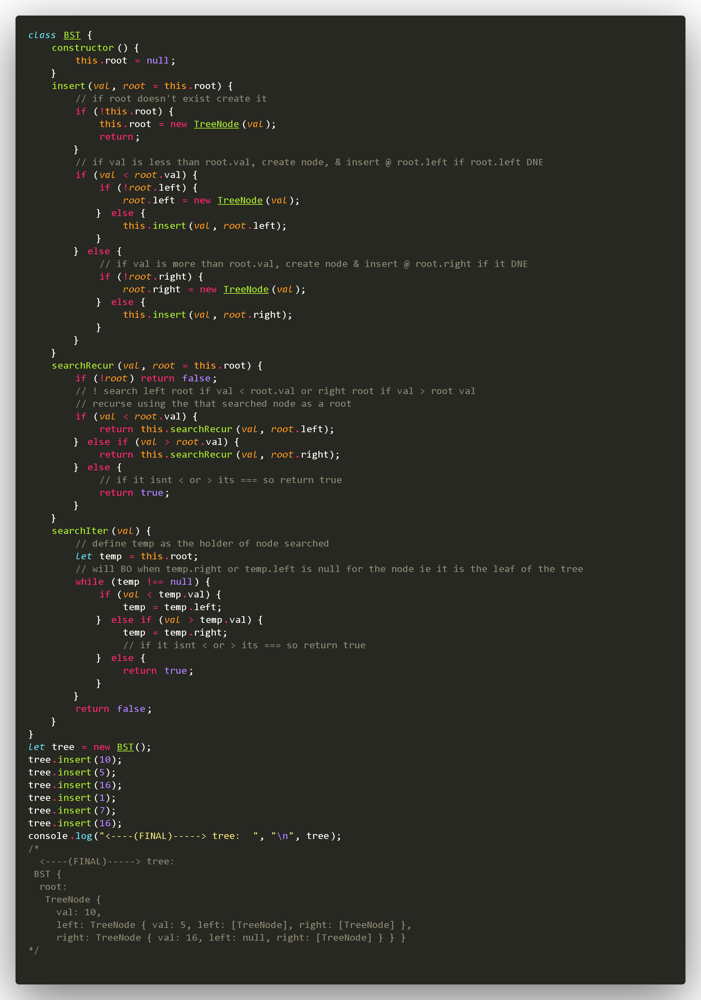
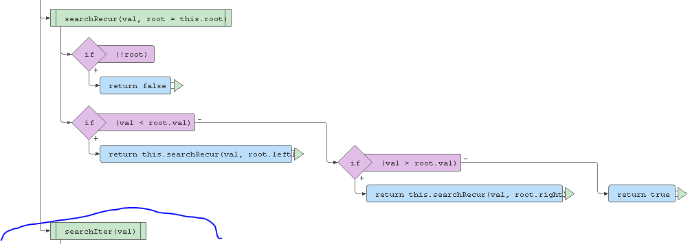

- useful Unicode:
- 🌲 🖧🕸│╱╲╭╮↪↩⇗⇘⇙⇱⇲⩑⦢⧬
①②③④⑤⑥⑦⑧⑨⑩ 
Ⓐ Ⓑ Ⓒ Ⓓ Ⓔ Ⓕ Ⓖ Ⓗ Ⓘ Ⓙ Ⓚ Ⓛ Ⓜ Ⓝ Ⓞ Ⓟ Ⓠ Ⓡ Ⓢ Ⓣ Ⓤ Ⓥ Ⓦ Ⓧ Ⓨ Ⓩ
 ['①','②','③','④','⑤,'⑥','⑦','⑧','⑨','⑩']
[🌲, 🖧,🕸,│,╱,╲,╭,╮,↪,↩,⇗,⇘,⇙,⇱,⇲,⩑,⦢,⧬]
---
> end of useful Unicode:
---


 - binary tree is a special case of a graph


------
# <center> ⬇️  <====(BINARY SEARCH TREE :)====>       ⬇️</center>
------  
------

```
                                            root   =======>Ⓐ 
                                                          ╱  ╲
                                                         Ⓑ   Ⓒ
                                                        ╱  ╲   ╲ 
                                                       Ⓓ   Ⓔ   Ⓕ
```

## <center>   BST (constructor):  </center>  
  
------
------
  
## <center>   BST (constructor):  </center>
  
---  
  
##  <center>   BST (insert-node-method):   </center>

---

## <center>  BST (Recursive search):  </center>

---

## <center>  BST (Iterative search):     </center>

---


