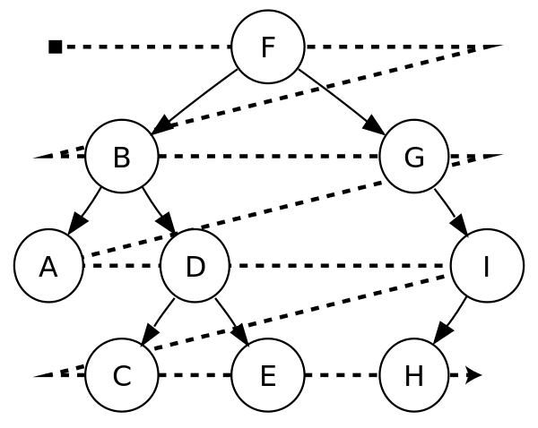

## What is a Tree?
  - Collection of nodes and edges between them.
  - A tree can have any number of nodes (0 nodes can still technically be a tree, it's just empty)
  - A tree cannot have any cycles (edges that form loop between nodes). If there are cycles, it is a graph.
  - In computer science, we typically only consider rooted trees; a tree that has a "root" node where we can access every other node. We can visualize this as a collection of nodes that branch outward from one main root.
  

## Tree Terminology
  - root: The very top of a tree. It allows us to reach any other node in the tree.
  - parent node: Any node that has child nodes. Has nodes that are connected further down the tree.
  - child node: Any node that has a parent node. Has a node that connects to it from higher up the tree.
  - sibling nodes: Child nodes that have the same parent.
  - leaf node: Node with no children.
  - internal node: A node that has children. (May or may not be referencing the root)
  - path: Chain from one node to another within a tree.
  - subtree: A parent node and everything under it.

## Tree Traversal
  - Breadth First
    - What order do we access nodes?
      - Top to bottom, left to right; reading as if it were words
    
    - Access order: F B G A D I C E H
  - Depth First
    - Explore each branch as far as we can before backtracking
    - Start at top, go down left as far as you can
    - Three different ways we can access our nodes' values
      - Pre-order: Access the value when we first encounter the node.
      - In-order: Explore all of our left children, then access our value, then explore our right children.
      - Post-order: Access both left and then right children before getting your own value.

    
    - Access order:
      - Pre-order (red): F B A D C E G I H
      - In-order (yellow): A B C D E F G H I
      - Post-order (green): A C E D B H I G F

## Traversal Practice
  - What order would the nodes be accessed in for each traversal type?
  
  - Breadth First: 
  - Pre-order: 
  - In-order: 
  - Post-order: 

## What is an N-ary Tree?
  - Aren't concerned with the number of children
  - A node can have as many children as it wants
  - Examples: File system, DOM

## What is a Binary Tree?
  - Max of two two branches at each node

## What is a Binary Search Tree?
  - Smaller data always to the left, larger always to the right
  - Why is this structure useful?
    - Allows us to search more efficiently. If it's a balanced tree, we get an O(log n) time complexity for searching.

## Adding Nodes to a BST
  - Since our data is so structured, we know that the value we are adding has to go to the left if it is less than the current node or to the right if it is greater than our current node.
  - Continue making our way down the tree until we would get to a location that we have to compare to but no node exists yet. This is location where our new value should be placed.

## Removing Nodes from a BST
  - Leaf Node
    - Remove the reference to this child from the parent.
  - Node with One Child
    - Update the reference to this child from the parent to point to the child instead of the removed node.
  - Node with Two Children
    - Go to the right once, then all the way to the left.
    - This process gets us the node with the next-highest value after the one we are trying to remove. Our goal is to replace the removed node with this one.
    - Copy the value of the replacement node into the node that we are removing.
    - Now we need to remove the original node that we just copied. This is a recursive procedure, since the process will follow one of the two scenarios above (either removing a leaf node or a node with one child).
