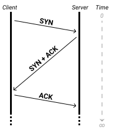

# TCP Connections
________________________________________________________________________________
<!-- @import "[TOC]" {cmd="toc" depthFrom=2 depthTo=6 orderedList=false} -->

<!-- code_chunk_output -->

- [Segments](#segments)
  - [Segment Header Fields](#segment-header-fields)
- [TCP Connection Lifecycle](#tcp-connection-lifecycle)
  - [Control Flag Options](#control-flag-options)
  - [Getting to know each other: the three-way handshake](#getting-to-know-each-other-the-three-way-handshake)
  - [Data transmission & error handling](#data-transmission-error-handling)
  - [Saying goodbye: closing the connection](#saying-goodbye-closing-the-connection)
  - [The TCP Socket State Lifecycle](#the-tcp-socket-state-lifecycle)
- [What we've learned](#what-weve-learned)

<!-- /code_chunk_output -->
________________________________________________________________________________

The _Transmission Control Protocol (TCP)_ is the backbone of the Internet. The
majority of services we use rely on it, and a deeper understanding of it will
help you navigate those services with ease.

Let's deep-dive into TCP! We'll cover:

- TCP segments what information they carry,
- "control bits" that manage the TCP lifecycle,
- and the process of forming & discarding connections.

## Segments

Just like the _Internet Protocol (IP)_ uses _packets_, TCP uses data units
called _segments_. Segments are formed from application data: TCP receives this
data, breaks it down into transmittable units, and attaches a _header_ to each
unit. This header contains everything we need to ensure a reliable connection is
established.

### Segment Header Fields

As with IP, TCP header fields are critical to understand. They help satisfy two
needs of the protocol: **reliable data transfer** and **consistent
connections**.

Here's an overview of each field in the order they appear:

  

- **Source / Destination Port:** The first two fields indicate which port the
  request originated on and which port it's directed to. This will be used,
  along with the IP address in the IP wrapper containing the segment, to
  determine which _sockets_ to use for the TCP connection.

- **Sequence Number:** This number is used to establish the correct ordering of
  data. At the start of a connection, TCP sets an _Initial Sequence Number
  (ISN)_ that's sufficiently large enough to avoid conflicts. Each byte of data
  transferred is then counted, beginning at the ISN, and used to calculate the
  sequence number for the segment. Sequence numbers go hand-in-hand with the ...

- **Acknowledgement Number:** This number lets the sender know which sequence is
  expected next. Acknowledgement numbers are cumulative, which is how TCP
  maintains proper ordering of segments. The receiver will send an
  acknowledgement number that's one higher than the last sequence number plus
  the length of the last data received. For example: if the last sequence number
  received was `10`, and the accompanying data was 4 bits long, the response
  will include an acknowledgement number of `15` - meaning "I'm ready for
  sequence number 15!".

- **Data Offset:** Defines how long the segment header is. This lets us know if
  there are options later on in the header or not.

- **Reserved:** A short range of three bits, held over for later use. These will
  always be `0`.

- **Control Flags:** These nine bits drive the TCP connection process. We'll
  break them down in more detail soon.

- **Window Size:** This field is used to let the sender know how much data the
  receiver can accept. This helps maintain the reliability of a connection: if a
  receiver is getting overloaded, they can lower the window size as a way of
  saying "slow down!". If a slow connection can move faster, a larger window
  size is a way of saying "bring it on!".

- **Checksum:** The _checksum_ is an error-checking mechanism. Checksums are
  used to check the validity of a particular segment, not the whole series of
  segment (as with sequence/acknowledgement). The TCP client can use the
  checksum to ensure the segment has been received correctly. If it doesn't
  match expectations, the segment will be discarded & ignored.

- **Urgent Pointer:** TCP allows for data to be marked as _urgent_. This means
  it should be processed right away, regardless of sequence, interrupting any
  other transfer in process. This is useful when trying to terminate a long
  transfer, as we'd like to kill the connection without waiting for it to
  complete. This field indicates how much urgent data to expect, if there is
  any.

- **Options:** Like most other protocols, the TCP segment header includes a
  range for _options_ at its end. There may be no options, or there may be a
  handful! We can verify whether there are options be comparing the length of
  the header so far to the _data offset_ field. TCP header options are mostly
  used for flow control and may even include _padding_ to fill out the expected
  length of the header with empty data.

Immediately after any options (or after the _urgent pointer_, if no options are
given), the encapsulated data from our application begins.

## TCP Connection Lifecycle

Remember that TCP is a _connection-oriented protocol_. This means that it
establishes a long-running line of communication between two points, instead of
just shouting into the Internet void like UDP. Establishing this connection
involves a series of predictable steps, each with specific names. Most of these
steps are driven by the _control flags_ in the segment headers.

### Control Flag Options

The segment header has 12 bits reserved for control flags. The first three of
these are currently unused and will always be zero, and the next three are all
used by congestion-management extensions to the protocol. The control flags that
most concern us are the final six bits, each known by a short three-letter name.
Let's review them in order:

  

- **URG:** The "**urg**ent" bit. Lets us know if this segment contains urgent
  data.

- **ACK:** The "**ack**nowledgement" bit. Setting this bit means a message has
  been received successfully.

- **PSH:** The "**p**u**sh**" bit. This bit is used to indicate that buffered
  data should be passed on to the connected application.

- **RST:** The "**r**e**s**e**t**" bit. This bit means we should reset the
  connection. Receivers will send an RST segment when they receive unexpected
  data, either to a port that's not listening or dramatically out-of-sequence.

- **SYN:** The "**syn**chronize" bit. This flag is set on the the first segment
  from each side of the connection, and should include an ISN for the socket to
  begin sequencing from.

- **FIN:** The "**fin**ished" bit. This bit lets each side know that
  transmission is done and the connection may be closed.

> Note that we mention all twelve bits here as "control bits" even though the
> first three are unassigned. While they are currently unused, protocols evolve
> frequently! The [TCP specification][1] lists "six reserved bits, six control
> bits", but newer specs have claimed some of those. For this reason, you should
> think of the remaining three reserved bits as "control flags still under
> development".

### Getting to know each other: the three-way handshake

TCP connections begin with a process called a _three-way-handshake_, also
sometimes referred to as _SYN-SYN-ACK_.  This name comes from the three
interactions before the connection is officially "open":

- The client notifies the server that data is incoming with a `SYN` segment.
- The server acknowledges that data and sends its own segment, including both an
  `ACK` and its own `SYN`.
- The client `ACK`nowledges with another segment to the server. Now both sides
  are ready to go!

Notice that we can send both a `SYN` and `ACK` on a single segment. This is
called _piggybacking_ and saves us a ton of requests! The three-way handshake
would become a four-way handshake if we had to send the `SYN` and `ACK`
separately.

TCP connections are often visualized using _ladder diagrams_, also sometimes
called _timing diagrams_. Let's take a look at one for the three-way handshake:

  

This diagram should be read top-to-bottom. Each arrow represents a single
segment being passed between hosts. You can see how the client initiates the
request, but the server mirrors the process. This ensures both sides are ready
to work: if the client's `SYN` request fell on deaf ears, we would expect an
`RST` segment back.

You can also see how the _sequence number_ and _acknowledgement number_ are
incremented for each segment. Since these initial segments contain no data, each
only increments by one. During data transfer, the numbers will increment based
on the length of data received so far.

TCP maintains timers for most behaviors to ensure that connections don't hang
empty forever. This is one reason time-based diagrams are so helpful: by
adjusting the angle of the arrows between the client & server, we can indicate a
faster or slower connection. This can be helpful for visualizing connections on
a granular level. For example, here's a simplified diagram of the same three-way
handshake with a slow server response:

  

### Data transmission & error handling

Once the connection has been _established_, we're off to the races! The client
will send data segments over and the server will respond with `ACK` segments.

Remember that the sequence number in each data segment indicates where our data
starts, and the corresponding acknowledgement number should be the next position
after our data ends. For example, a data segment with a sequence number of `4`
and data of length `3` will be `ACK`'ed with an acknowledgement number of `7`:
our data included `4`, `5`, and `6` in the sequence, and the server is letting
us know that it's ready for data beginning at sequence number `7`.

Here's a fun way of visualizing this concept via text messages between the
client & server:

  

Note that there
won't be any more `SYN` segments unless the connection terminates unexpectedly:
we only send segments with the `SYN` flag enabled when initializing a
connection.

The acknowledgement number is important for keeping the TCP connection reliable.
It will only increment when a segment is successfully received, so an `ACK`
response to the client with a lower acknowledgement number than the client's
current sequence number means a segment was missed and must be retransmitted.

A diagram is worth a thousand words:

  

This is a **major** part of TCP, and one of the reasons it's both reliable and
slow: data may need to be retransmitted frequently, but the end result is always
a full & correct payload on the server.

### Saying goodbye: closing the connection

Once we've sent all our data across the wire, it's time to say _au revoir_. By
default, TCP closes open connections similarly to the way they're opened: lots
of handshakery! By default, this time it's a _four-way handshake_.

Let's take a look at a diagram of a TCP connection closing:

  

This diagram is similar to the three-way handshake we looked at for connection
establishment, so it may raise a question for you: why the extra handshake? The
reason, as usual, is _reliability_!

Remember how TCP maintains timers between segments.? This is because no matter
how much reliability we've worked into transport protocols, they're still built
on top of unreliable protocols and infrastructure. The same is true of a closing
connection: we don't want to act too quickly or we may miss a piece of extra
important data.

When closing a connection, both sides wait a beat before actually closing. This
allows any delayed segments to slip in at the last minute! This also means it is
impractical for the server to send a piggybacked `FIN` & `ACK` in the same way
it sends a `SYN` & `ACK` to open the connection. If the server waited before
sending an `ACK`, the client may think something went wrong and begin
retransmitting. To prevent this, the server responses are separated:

- the server returns an `ACK` to the client's first `FIN` right away,
- it waits a moment to ensure there are no remaining data segments inbound,
- and then it sends a corresponding `FIN` segment to let the client know it's
  shutting down.

The client will `ACK`nowledge immediately, but may also wait a bit before truly
closing, just in case. With all the handshaking and waiting around, you might
call TCP a "considerate" protocol as well!

### The TCP Socket State Lifecycle

Remember that a TCP connection is between two _sockets_, or joint IP
address/port pairs. As the connection progresses, these sockets change _state_.
For example, during the process of data transfer, both sockets are considered to
be in the `ESTABLISHED` state, while before a connection is established a
server's open socket would be in the `LISTEN` state.

It's important to remember that this flow isn't identical for the client &
server, too: after the client sends its `SYN`, it enters a `SYN SENT` state
while the server enters a `SYN RCVD` (or "`SYN` Received") state of its own.

Here's a diagram of a simple data transfer from start to finish. Notice that
we've added the socket states for each side of the connection outside the
diagram. These may be noted by network tools and can be helpful to reference if
you find yourself debugging a TCP connection problem:

  

The original TCP specification includes an [alternative text-based chart][2] for
the lifecycle of these socket states, and you can read more about this process
on the [Wikipedia page][3] for TCP.

## What we've learned

Wow! It's incredible to visualize everything happening across the wire when you
browse the Web. TCP is such a foundational piece of your daily interactions with
the Internet and will only become more so as you begin contributing to the Web
yourself!

After reading this lesson, you should have a clear understanding of:

- TCP segment headers and how they relate to the segment's contents,
- TCP control flags,
- the TCP connection process, including the many handshakes,
- and basic error handling across TCP connections.

[1]: https://tools.ietf.org/html/rfc793.html#page-15
[2]: https://tools.ietf.org/html/rfc793.html#page-23
[3]: https://en.wikipedia.org/wiki/Transmission_Control_Protocol#Protocol_operation
