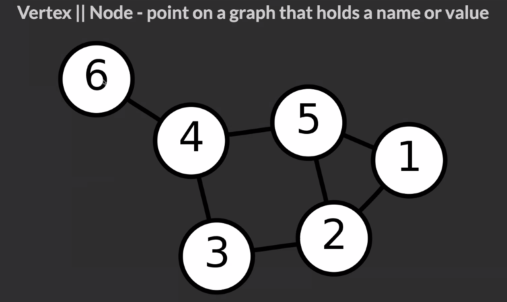
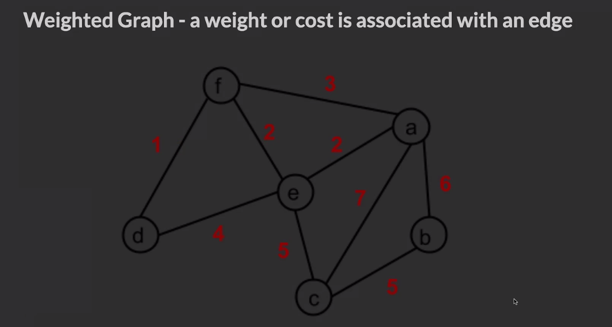
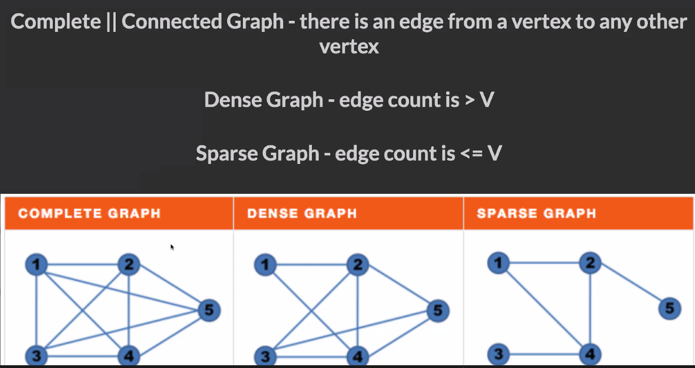
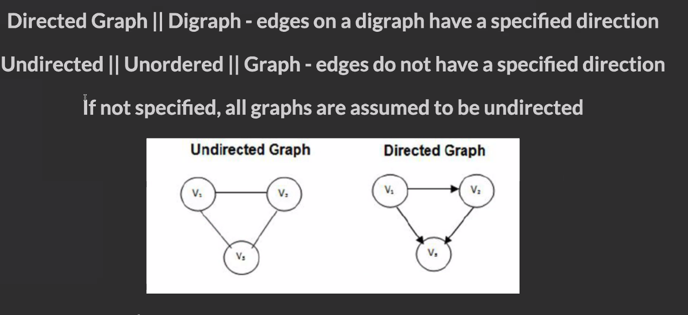

## What is a Graph?

A **graph** is **any** collection of nodes and edges. In contrast to our
previous trees, a graph is much more relaxed in it's structure. A graph may:

+ lack a root node
+ have cycles
+ have any number edges leaving a node

In this section, we will draw heavily from our tree algorithms. The adjustments
we will make to those algorithms will be motivated by these core differences.

Below are a few examples of graphs that don't agree with our CompSci definition
of a binary tree:


Here are some highlights:

+ `Graph 1` lacks a root. This means there is no single node that can access all
  other nodes in a path through edges. This is important because we previously
  referenced "entire" trees by referring to the ultimate root. We can no longer
  do that in a graph. If we provide just `T`, you can't access `U`. If we
  provide just `U`, you can't access `T`. If we provide just `V`, you can't
  access `T` or `U`.
+ `Graph 2` has a cycle. This means there is no longer a parent-child
  relationship. Choose any node in `Graph 2`, its grandchild will also be its
  parent. Wait - what? From now on we'll have to use less specific language such
  as "`X` is a neighbor of `Y`."  Perhaps even more deadly, imagine we ran a
  "simple" Depth-First traversal on this graph. We could get trapped in an
  infinite loop if we are not careful.
+ `Graph 3` features nodes that have more than 2 edges. Anarchy!

## Graph Implementations

There are many ways to represent a graph programmatically. Let's take a moment
to explore each and describe the tradeoffs we make when choosing among them. We
will use `Graph 3` from above as our candidate. Bear in mind that our graph is
directed. For example, this means that `C` can access `D`, but `D` cannot access
`C`.

### GraphNode Class

This implementation is most similar to how we implemented binary trees. That is,
we create a node class that maintains a value and an array of references to
neighboring nodes. This easily solves the problem that a node can have any
number of neighbors, no longer just a left and right.

```javascript
class GraphNode {
    constructor(val) {
        this.val = val;
        this.neighbors = [];
    }
}

let a = new GraphNode('a');
let b = new GraphNode('b');
let c = new GraphNode('c');
let d = new GraphNode('d');
let e = new GraphNode('e');
let f = new GraphNode('f');
a.neighbors = [b, c, e];
c.neighbors = [b, d];
e.neighbors = [a];
f.neighbors = [e];
```

This implementation is great because it feels familiar to how we implemented
trees. However, this implementation is clunky in that we have no easy way to
refer to the entire graph. How can we pass this graph to a function? Recall that
there is no root to act as the definite starting point.

### Adjacency Matrix

This is the often the mathematician's preferred way of representing a graph. We
use a 2D array to represent edges. We'll first map each node's value to an
index. This means `A -> 0`, `B -> 1`, `C -> 2`, etc.. Below is the mapping for
`Graph 3`:


From here, the row index will correspond to the source of an edge and the column
index will correspond to its destination. A value of `true` will mean that there
does exist an edge from source to destination.

```javascript
let matrix = [
/*          A       B       C       D       E       F   */
/*A*/    [true,  true,   true,   false,  true,   false],
/*B*/    [false, true,   false,  false,  false,  false],
/*C*/    [false, true,   true,   true,   false,  false],
/*D*/    [false, false,  false,  true,   false,  false],
/*E*/    [true,  false,  false,  false,  true,   false],
/*F*/    [false, false,  false,  false,  true,   true]
];
```

A few things to note about using an adjacency matrix:

+ when the edges have direction, `matrix[i][j]` may not be the same as
  `matrix[j][i]`
+ it is common to say that a node is adjacent to itself, so `matrix[x][x] ===
  true` for any `x`

An advantage of the matrix implementation is that it allows us to refer to the
entire graph by simply referring to the 2D array. A huge disadvantage of using a
matrix is the space required. To represent a graph of n nodes, we must allocate
n<sup>2</sup> space for the 2D array. This is even more upsetting when there are
few edges in graph. We will have to use n<sup>2</sup> space, even though the
array would be sparse with only a few `true` elements.

### Adjacency List

An adjacency list seeks to solve the shortcomings of the matrix implementation.
We use an object where keys represent the node labels. The values associated
with the keys will be an array containing all adjacent nodes:

```javascript
let graph = {
    'a': ['b', 'c', 'e'],
    'b': [],
    'c': ['b', 'd'],
    'd': [],
    'e': ['a'],
    'f': ['e']
};
```

An adjacency list is easy to implement and allows us to refer to the entire
graph by simply referencing the object. The space required for an adjacency list
is the number of edges in the graph. Since there will be at most n<sup>2</sup>
edges in a graph of n nodes, the adjacency list will use at most the same amount
of space as the matrix. You'll find adjacency lists useful when attacking
problems that are not explicitly about graphs. We'll elaborate more on this
soon.

________________________________________________________________________________
# Graph Traversal

Let's explore our classic Depth-First, but for **graphs** this time! We'll be
utilizing the `GraphNode` and `Adjacency List` implementations of the following
graph:


Since we already discussed the differences between Depth-First and
Breadth-First, we'll focus just on Depth-First here. We'll leave the
Breadth-First exploration in the upcoming project.

### Graph Traversal w/ GraphNode

Let's begin by assuming we have our candidate graph implemented using our
`GraphNode` class:

```javascript
class GraphNode {
    constructor(val) {
        this.val = val;
        this.neighbors = [];
    }
}

let a = new GraphNode('a');
let b = new GraphNode('b');
let c = new GraphNode('c');
let d = new GraphNode('d');
let e = new GraphNode('e');
let f = new GraphNode('f');
a.neighbors = [e, c, b];
c.neighbors = [b, d];
e.neighbors = [a];
f.neighbors = [e];
```

One thing we'll have to decide on is what node to begin our traversal. Depending
on the structure of the graph, there may not be a suitable starting point.
Remember that a graph may not have a "root". However in our candidate, `F` is
like a root. It is the only valid choice because it is the only node that may
access all other nodes through some path of edges. We admit, the choice of `F`
is somewhat contrived and in a practical setting you may not have a nice
starting point like this. We'll cover how to overcome this obstacle soon. For
now we'll take `F`.

We want to build a recursive `depthFirstRecur` function that accepts a node and
performs a Depth-First traversal through the graph. Let's begin with a baseline
solution, although it is not yet complete to handle all graphs:

```javascript
// broken
function depthFirstRecur(node) {
    console.log(node.val);

    node.neighbors.forEach(neighbor => {
        depthFirstRecur(neighbor);
    });
}

depthFirstRecur(f);
```

Can you see where this code goes wrong? It will get caught in an infinite cycle
`f, e, a, e, a, e, a, e, ...` ! To fix this, simply store which nodes we have
visited already. Whenever we hit a node that has previously been visited, then
return early. We'll use JavaScript
[Sets](https://developer.mozilla.org/en-US/docs/Web/JavaScript/Reference/Global_Objects/Set)
to store `visited` because they allow for constant time lookup.

```javascript
// using GraphNode representation

function depthFirstRecur(node, visited=new Set()) {
    // if this node has already been visited, then return early
    if (visited.has(node.val)) return;

    // otherwise it hasn't yet been visited,
    // so print it's val and mark it as visited.
    console.log(node.val);
    visited.add(node.val);

    // then explore each of its neighbors
    node.neighbors.forEach(neighbor => {
        depthFirstRecur(neighbor, visited);
    });
}

depthFirstRecur(f);
```

This code works well and will print the values in the order `f, e, a, c, b, d`.
Note that this strategy only works if the values are guaranteed to be unique.

If you are averse to recursion (don't be), we can write an iterative version
using the same principles:

```javascript
function depthFirstIter(node) {
    let visited = new Set();
    let stack = [ node ];

    while (stack.length) {
        let node = stack.pop();

        // if this node has already been visited, then skip this node
        if (visited.has(node.val)) continue;

        // otherwise it hasn't yet been visited,
        // so print it's val and mark it as visited.
        console.log(node.val);
        visited.add(node.val);

        // then add its neighbors to the stack to be explored
        stack.push(...node.neighbors);
    }
}

depthFirstIter(f);
```

### Graph Traversal w/ Adjacency List

Let's now assume our candidate graph in the form of an Adjacency List:

```javascript
let graph = {
    'a': ['b', 'c', 'e'],
    'b': [],
    'c': ['b', 'd'],
    'd': [],
    'e': ['a'],
    'f': ['e']
};
```

Bear in mind that the nodes are just strings now, not `GraphNode`s. Other than
that, the code shares many details from our previous implementations:

```javascript
// using Adjacency List representation

function depthFirstRecur(node, graph, visited=new Set()) {
    if (visited.has(node)) return;

    console.log(node);
    visited.add(node);

    graph[node].forEach(neighbor => {
        depthFirstRecur(neighbor, graph, visited);
    });
}

depthFirstRecur('f', graph);
```

Cool! We print values in the order `f, e, a, b, c, d`. We'll leave the iterative
version to you as an exercise for later.

Instead, let's draw our attention to a point from before: having to choose `f`
as the starting point isn't dynamic enough to be impressive. Also, if we choose
a poor initial node, some nodes may be unreachable. For example, choosing `a` as
the starting point with a call to `depthFirstRecur('a', graph)` will only print
`a, b, c, d, e`. We missed out on `f`. Bummer.

We can fix this. A big advantage of using an Adjacency List is that it contains
the full graph! We can use a surrounding loop to allow our traversal to jump
between disconnected regions of the graph. Refactoring our code:

```javascript
function depthFirst(graph) {
    let visited = new Set();

    for (let node in graph) {
        _depthFirstRecur(node, graph, visited);
    }
}

function _depthFirstRecur(node, graph, visited) {
    if (visited.has(node)) return;

    console.log(node);
    visited.add(node);

    graph[node].forEach(neighbor => {
        _depthFirstRecur(neighbor, graph, visited);
    });
}

depthFirst(graph);
```

Notice that our main function `depthFirst` is iterative and accepts the entire
Adjacency List as an Argo. Our helper `_depthFirstRecur` is recursive.
`_depthFirstRecur` serves the same job as before, it will explore a full
connected region in a graph. The main `depthFirst` method will allow us to
"bridge" the gap between connection regions.

Still fuzzy? Imagine we had the following graph. Before you ask, these are not
two separate graphs. This is a **single** graph that contains two connected
components. Another term for a graph of this structure is a "Forest" because it
contains multiple "Trees", ha:


It is easy to represent this graph using an Adjacency List. We can then pass the
graph into our `depthFirst` from above:

```javascript
let graph = {
    'h': ['i', 'j'],
    'i': [],
    'j': ['k'],
    'k': [],
    'l': ['m'],
    'm': []
}

depthFirst(graph);
// prints h, i, j, k, l, m






DFS-->   


---
---

BFS-->


```js
// class GraphNode {
//     constructor(val) {
//         this.val = val;
//         this.neighbors = [];
//     }
// }
//
// let a = new GraphNode("a");
// console.log('let a = new GraphNode("a"): ', a);
// let b = new GraphNode("b");
// let c = new GraphNode("c");
// console.log('let c = new GraphNode("c"): ', c);
// let d = new GraphNode("d");
// let e = new GraphNode("e");
// console.log('let e = new GraphNode("e"): ', e);
// let f = new GraphNode("f");
// console.log(
//     "------------------------------End of node instantions--------------------------------------"
// );
// console.log("a.neighbors = [e, c, b]: ", (a.neighbors = [e, c, b]));
//
// console.log("c.neighbors = [b, d]: ", (c.neighbors = [b, d]));
//
// console.log("e.neighbors = [a]: ", (e.neighbors = [a]));
//
// console.log("f.neighbors = [e]: ", (f.neighbors = [e]));
//
// console.log(
//     "------------------------------deapth first traversal (comment out adjacency list)--------------------------------------"
// );
//
// function depthFirstRecur(node, visited = new Set()) {
//     if (visited.has(node.val)) return;
//
//     console.log(node.val); //output
//     visited.add(node.val);
//
//     node.neighbors.forEach((neighbor) => {
//         depthFirstRecur(neighbor, visited);
//     });
// }
//
// //tree node class... if it didn't have a neighbours the value would be null but here it is just an empty array.
```
# <=================()===============>
```
// Implementing a Graph in Code
// Similar to when working with other ADTs, we can crate a node class
// This class can have a property which will store all the nodes
// which this instance should hold reference to.
```
```js
class GraphNode {
    constructor(val) {
        this.val = val;
        this.neighbors = [];
    }
}
let a = new GraphNode("a");
let b = new GraphNode("b");
let c = new GraphNode("c");
let d = new GraphNode("d");
let e = new GraphNode("e");
let f = new GraphNode("f");
a.neighbors = [b, c, e];
c.neighbors = [b, d];
e.neighbors = [a];
f.neighbors = [e];
```
// Adjacency Matrix
// The implementation above is considered rather clunky.
// We have no easy way to refer to the entire graph.
// Recall that there is no root to act as the definite starting point (unlike with Trees).
// How can we pass this graph to a function?
// One of the solutions is to create an Adjacency Matrix, a grid utilizing a 2D array.
// Matrix implementation allows us to refer to the entire graph by simply referring to the 2D array.
// The row index corresponds to the source of an edge.
// The column index will correspond to its destination.
// A value of true will mean that there does exist an edge from source to destination,
// ie, the source node should hold reference to destination node.
```js
  - One axis (outside array) has an entry (inner array) for each node in the graph. If one node is connected to another node in the graph, our entry in the inner array is set to true. Otherwise the entry is false.
let matrix = [
    /*  Destinations =>     A/0     B/1     C/2     D/3     E/4     F/5   */
    /*  ----------------------------------------------------------------- */
    /*             | A/0 */ [true, true, true, false, true, false],
    /*             | B/1 */ [false, true, false, false, false, false],
    /* Sources =>  | C/2 */ [false, true, true, true, false, false],
    /*             | D/3 */ [false, false, false, true, false, false],
    /*             | E/4 */ [true, false, false, false, true, false],
    /*             | F/5 */ [false, false, false, false, true, true],
];
```
// Disadvantage:
//  An adjacency matrix requires a lot of space.
//  To represent a graph of n nodes, we must allocate n^2 space for the 2D array.
//  If there are few edges in graph we will have to use n2 space,
// even though the array will only contain a few true elements.
// Adjacency List
// We use an object where keys represent the node labels.
// The values associated with the keys will be an array containing all
// adjacent nodes,
// ie, the nodes which this instance (represented by a key)
// should hold reference to.
// An adjacency list is easy to implement and allows us to refer to the
// entire graph by simply referencing the object.
// The space required for an adjacency list is the number of edges in
// the graph.
```js
let adjList = {
    a: ["b", "c", "e"],
    b: [],
    c: ["b", "d"],
    d: [],
    e: ["a"],
    f: ["e"],
};
```
// Recursive case given a node
function depthFirstNode(node, visited = new Set()) {
    // We utilize a Set for our memo instead of a regular object
    // A Set is like an object where the keys have no values
    if (visited.has(node.val)) return;
    console.log(node.val);
    visited.add(node.val);
    node.neighbors.forEach((neighbor) => depthFirstNode(neighbor, visited));
}
// We invoke this with an instance of the graph node class
// depthFirstNode(f);
// depthFirstNode(node, visited);   // 1st frame,   node.val = 'f', visited = {'f'}
// depthFirstNode(node, visited);   // 2nd frame,   node.val = 'e', visited = {'f', 'e'}
// depthFirstNode(node, visited);   // 3rd frame,   node.val = 'a', visited = {'f', 'e', 'a'}
// depthFirstNode(node, visited);   // 4th frame,   node.val = 'b', visited = {'f', 'e', 'a', 'b'}, popped off stack
// depthFirstNode(node, visited);   // 5th frame,   node.val = 'c', visited = {'f', 'e', 'a', 'b', 'c'}
// depthFirstNode(node, visited);   // 6th frame,   node.val = 'd', visited = {'f', 'e', 'a', 'b', 'c', 'd'}, popped off stack
// 5th frame,     node.val = 'c'     returns undefined,     popped off the stack
// 4th frame,     node.val = 'e'     vistied.has(node.val) = true,    returns undefined,     popped off the stack
// 3rd frame,     node.val = 'a'     returns undefined,     popped off the stack
// 2nd frame,     node.val = 'e'     returns undefined,     popped off the stack
// 1st frame,     node.val = 'f'     returns undefined,     popped off the stack
// Final return value: undefined
// Recursive case given an adjacency list
```js
// let adjList = {
//   'a': ['b', 'c', 'e'],
//   'b': [],
//   'c': ['b', 'd'],
//   'd': [],
//   'e': ['a'],
//   'f': ['e'],
// };
```
```js
function depthFirstAdj(graph, node, visited = new Set()) {
    // if this node has already been visited, then return early
    if (visited.has(node)) return;
    // otherwise it hasn't yet been visited,
    // so print it's val and mark it as visited.
    console.log(node);
    visited.add(node);
    // then explore each of its neighbors
    graph[node].forEach((neighbor) => {
        depthFirstAdj(graph, neighbor, visited);
    });
}
```
// // We invoke this with the adjacency list and a key from the list.
// depthFirstAdj(adjList, 'f');
// console.log(`\n----------\n`);
// depthFirstAdj(adjList, 'a');
// We see that when we invoke this function with 'a' we are not able to access the 'f' node
```js
function completeDepthFirst(graph) {
    let visited = new Set();
    for (let node in graph) {
        _depthFirstRecur(node, graph, visited);
    }
}
```
```js
function _depthFirstRecur(node, graph, visited) {
    // if this node has already been visited, then return early
    if (visited.has(node)) return;
    // otherwise it hasn't yet been visited,
    // so print it's val and mark it as visited.
    console.log(node);
    visited.add(node);
    // then explore each of its neighbors
    graph[node].forEach((neighbor) => {
        _depthFirstRecur(neighbor, graph, visited);
    });
}
// We invoke this with the adjacency list and a key from the list.
completeDepthFirst(adjList, "f");
console.log(`\n----------\n`);
completeDepthFirst(adjList, "a");
```


- Adjacency List - POJO
  - Object where every value in the graph has a key
  - Value for the key is an array with each other node that it is connected to (neighbors)
  - Easy to iterate through
  - Doesn't take up as much space as an Adjacency Matrix or Node
  - Can refer to the entire graph by referencing the object
  ```javascript
    let list = {
      a: ['b', 'c', 'e'],
      b: [],
      c: ['b', 'd'],
      d: [],
      e: ['a'],
      f: ['e']
    };
    ```
```js
 class GraphNode {
    constructor(val) {
      this.val = val;
      this.neighbors = [];
    }
  }
  ```
3. Given a graph in one of the above implementations, be able to traverse the graph in a breadth-first or depth-first manner.
- We can use recursion or iteration to traverse each node.
- We generally want to keep track of each node that we've visited already so that we don't get trapped in cycles. Easiest way to do this is to keep a Set variable that we update as we traverse to each node.


Graph
-----


*   **Quick summary**: a data structure that stores items in a connected, non-hierarchical network.
*   **Important facts**:
    *   Each graph element is called a _node_, or _vertex_.
    *   Graph nodes are connected by _edges_.
    *   Graphs can be _directed_ or _undirected_.
    *   Graphs can be _cyclic_ or _acyclic_. A cyclic graph contains a path from at least one node back to itself.
    *   Graphs can be _weighted_ or _unweighted_. In a weighted graph, each edge has a certain numerical weight.
    *   Graphs can be _traversed_. See important facts under _Tree_ for an overview of traversal algorithms.
    *   Data structures used to represent graphs:
        *   _Edge list_: a list of all graph edges represented by pairs of nodes that these edges connect.
        *   _Adjacency list_: a list or hash table where a key represents a node and its value represents the list of this node's neighbors.
        *   _Adjacency matrix_: a matrix of binary values indicating whether any two nodes are connected.
*   **Pros**:
    *   Ideal for representing entities interconnected with links.
*   **Cons**:
    *   Low performance makes scaling hard.
*   **Notable uses**:
    *   Social media networks.
    *   Recommendations in ecommerce websites.
    *   Mapping services.
*   **Time complexity** (worst case): varies depending on the choice of algorithm. `O(n*lg(n))` or slower for most graph algorithms.


# Graph data structure cheat sheet for coding interviews.

> Covering algorithms: BFS, DFS, detect cycle and find the shortest path

The most commonly used representations of a graph are adjacency matrix (a 2D array of size V x V where V is the number of vertices in a graph) and adjacency list (an array of lists represents the list of vertices adjacent to each vertex).

In the following sections, let's take a look must-to-know algorithms related to graph data structure. For simplicity, adjacency list representation is used in all the implementation.

1\. Breadth First Search (BFS)
------------------------------

```
`Input (graph 1): graph = \[\[1,2\], \[0,2,4\], \[0,1,3\], \[2\], \[1\]\], s = 0  
Output: **0 1 2 4 3**`

```
Breadth First Search for a graph is similar to [Breadth First Traversal of a tree](https://medium.com/@nhudinhtuan/binary-tree-traversals-cheat-sheet-for-coding-interviews-a71af9fe1dba). However, graphs may contain cycles, so we may visit the same vertex again and again. To avoid that, we can use boolean visited array to mark the visited vertices.

The above code traverses only the vertices reachable from a given source vertex. To do complete BFS traversal for disconnected graphs, we need to call BFS for every vertex.

Time complexity is O(V+E) where V is number of vertices in the graph and E is number of edges in the graph.

2\. Depth First Search (DFS)
----------------------------

```
_Input (graph 1): graph = \[\[1,2\], \[0,2,4\], \[0,1,3\], \[2\], \[1\]\], s = 0  
Output: **0 1 2 3 4 (or 0 2 3 1 4)**_

```
Similar to BFS, we also need to use a boolean array to mark the visited vertices for DFS.

Recursive implementation:

Iterative implementation using stack. Please note that the stack may _contain the same vertex twice,_ so we need to check the visited set before printing.

For both implementations, all the vertices may not be reachable from a given vertex (example Disconnected graph). To do complete DFS traversal, we need to call DFS for every vertex.

Time complexity is O(V+E) where V is the number of vertices in the graph and E is number of edges in the graph.

3\. Detect cycle in directed graph
----------------------------------

```
`Given a **directed** graph, return true if the given graph contains at least one cycle, else return false.
Input (graph 2): graph = \[\[1,2\], \[2\], \[0,3\], \[\], \[1\]\]  
Output: **True**`

```
DFS can be used to detect a cycle in a Graph. There is a cycle in a graph only if there is a back edge that is from a vertex to itself (self-loop) or to one of its ancestor in DFS stack tree.

Time complexity is the same as the normal DFS, which is O(V+E).

4\. Detect cycle in undirected graph
------------------------------------

Given an **undirected** graph, return true if the given graph contains at least one cycle,
 else return false.Input (graph 1): graph = \[\[1,2\], \[0,2,4\], \[0,1,3\], \[2\], \[1\]\]  
Output: **True**

For undirected graph, we don't need to keep track of the whole stack tree (compared to directed graph cases). For every vertex 'v', if there is an adjacent 'u' such that u is already visited and u is not a parent of v, then there is a cycle in the graph.

Time complexity is the same as the normal DFS, which is O(V+E).

5\. BFS with multiple sources
-----------------------------

In some problems, you need to start BFS for multiple vertices as well as calculate the travel depth. Let's take a look at a typical problem.


In this question, we use a BFS to model the process. The grid is considered as a graph (an orange cell is a vertex and there are edges to the cell's neighbours). Starting BFS from all rotten oranges with 'depth' 0, and then travel to their neighbours which have 1 more depth. At the end, if we still have unvisited oranges, return -1 as this is impossible to rotten all oranges.

Time complexity is O(V+E) = O(the number of cells in grid).

6\. Topological sort
--------------------

Topological sorting is a linear ordering of vertices such that for every directed edge uv, vertex u comes before v in the ordering. Topological sorting is only possible for [Directed Acyclic Graph (DAG)](https://en.wikipedia.org/wiki/Directed_acyclic_graph).


Given a **DAG**, return the topological sortingInput: graph = \[\[1,2\], \[2\], \[3\], \[\], \[1\]\]  
Output: **4 0 1 2 3**

In normal DFS, we print the vertex at the beginning of the recursive function. To find the topological sorting, we modify DFS to make it first recursively call for all its adjacent vertices, then push its value to a stack. At the end, we print out the stack.

Time complexity is the same as the normal DFS, which is O(V+E).

7\. Shortest path in an unweighted graph
----------------------------------------

Given a unweighted graph, a source and a destination, we need to find shortest path from source to destination.Input (graph 1): graph = \[\[1,2\], \[0,2,4\], \[0,1,3\], \[2\], \[1\]\], s=4, d=0  
Output: **4 1 0**Input (graph 2): graph = \[\[1,2\], \[2\], \[0, 3\], \[\], \[1\]\], s=1, d=0  
Output: **1 2 0**

For this question, we use BFS and keep storing the predecessor of a given vertex while doing the breadth first search. At the end, we use the predecessor array to print the path.

Time complexity is the same as normal BFS, which is O(V+E).

7\. Shortest path in a weighted graph
-------------------------------------

Given a graph and a source vertex in graph, find shortest distances from source to all vertices in the given graph.Input: graph = \[\[\[1, 2\], \[2, 6\]\], \[\[2, 1\]\], \[\[0, 1\], \[3, 3\]\], \[\], \[\[1, 1\]\]\], s=0  
Output: **\[0, 2, 3, 6, inf\]**


