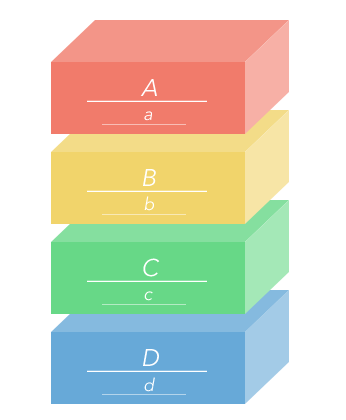

## Q:   --->*        What is the IP Suite for Layer B in the TCP/IP  Model         

##    A:        
##   --------->       Transport          

------
------

## Q:   --->*        This IP Suite (TCP/IP Model) layer supports connectivity between clients and server         

## A:   --------->      Transport Layer           

------
------

## Q:   --->*      What is the IP Suite for Layer A in the TCP/IP  Model           

##    A:        
##    --------->      Application           

------
------
## Q:   --->*      What is the IP Suite for Layer C in the TCP/IP  Model           

##    A:        
##  --------->      Internet           

------
------

## Q:   --->*         What is the IP Suite for Layer D in the TCP/IP  Model        

##    A:        
## ------------------------>     Link            

------
------
## Q:   --->*       List the two needs for computer-to-computer communications provided by TCP          

## 1:   --------->           Reliable Data Transfer      
## 2:   --------->         Persistent and Consistent Connections        

------
------

## Q:   --->*         TCP stands for what        

## A:   --------->        Transmission Control Protocol         

------
------
## Q:   --->*          IP supports this feature of the internet       

## A:   --------->        end-to-end connections without a central system         

------
------

## Q:   --->*       Is IP's packet-switching concerned about packet ordering or lost packets          

## A:   --------->        No - TCP is responsible for ensuring the correct packet order, and for acknowledging the receipt of packets (to gracefully handle lost packets)         

