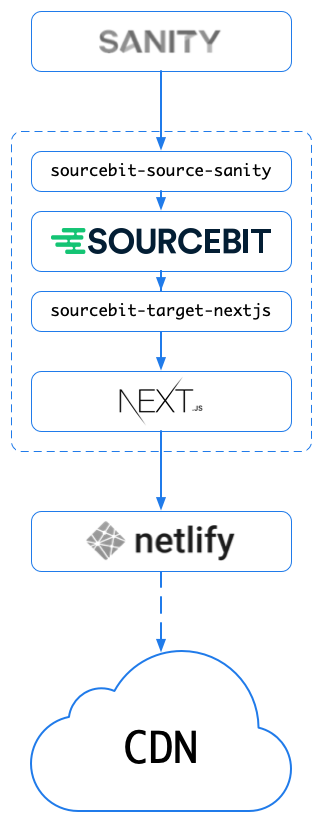

# ✨ Azimuth Nextjs Sanity Theme ✨

This Stackbit's "Azimuth" theme built with [Next.js](https://nextjs.org/) and powered by [Sanity](https://www.sanity.io).

Click the button below to create a new website from this theme using Stackbit:

<p align="center">
  <a href="https://app.stackbit.com/create?theme=https://github.com/stackbit-themes/azimuth-nextjs-sanity&utm_source=theme-readme&utm_medium=referral&utm_campaign=stackbit_themes"></a>
</p>

[Live Site demo](https://azimuth-nextjs-sanity.netlify.com/)


The theme can be used to create a static website that is hosted by a serverless
deployment platform such as [Netlify](https://www.netlify.com). The contents of
the website are stored in [Sanity.io](https://www.sanity.io/), a Headless CMS.

When deploying the website, [Sourcebit](https://github.com/stackbithq/sourcebit)
fetches the site's contents from Sanity and provides it to Next.js. Once Next.js
finishes generating the static website, [Netlify](https://www.netlify.com) pushes
the static files to its CDN.

<p align="center">
  
</p>

[Sourcebit](https://github.com/stackbithq/sourcebit) and its plugins, specifically
[`sourcebit-source-sanity`](https://github.com/stackbithq/sourcebit-source-sanity)
and [`sourcebit-target-next`](https://github.com/stackbithq/sourcebit-target-next),
are used to fetch website contents from Sanity, normalize it, and provide it to
Next.js pages. It also sets up live updates in development mode allowing to
update the content in CMS and instantly see them in the browser.

The Next.js [SSG support](https://nextjs.org/blog/next-9-3#next-gen-static-site-generation-ssg-support)
has been leveraged to support client side rendering when navigating the internal
links of the site.

## Quick Start 🏎

[Create a site](https://app.stackbit.com/create?theme=https://github.com/stackbit-themes/azimuth-nextjs-sanity&utm_source=theme-readme&utm_medium=referral&utm_campaign=stackbit_themes) from this theme using Stackbit.

Stackbit will execute following steps for you

- Create a new GitHub repository with the contents of this repository.
- Create a new [Sanity](https://www.sanity.io) project.
- Deploy the [Sanity Studio](https://www.sanity.io/studio).
- Create [Netlify](https://www.netlify.com) site connected to the GitHub repo
- Deploy the Netlify site.
- Create a Stackbit project that will allow you edit your website via on-page
  visual editing experience.

Additionally, Stackbit will connect all services together:

- Create a "commit" webhook in GitHub that will trigger Netlify deployment as
  soon as new commit is pushed to GitHub.
- Create a "publish" webhook in Sanity that will trigger Netlify deployment as
  soon as content is published in Sanity.

## Editing Content 📝

Once Stackbit creates a site, you can start editing the content using the free
on-page editing experience provided by the [Stackbit Studio](https://stackbit.com?utm_source=project-readme&utm_medium=referral&utm_campaign=user_themes).

[](https://stackbit.link/project-readme-lead-video)

Here's a few resources to get you started:

- 📺 &nbsp; [Editing Content](https://stackbit.link/project-readme-editing-video)
- 📺 &nbsp; [Adding, Reordering and Deleting Items](https://stackbit.link/project-readme-adding-video)
- 📺 &nbsp; [Collaboration](https://stackbit.link/project-readme-collaboration-video)
- 📺 &nbsp; [Publishing](https://stackbit.link/project-readme-publishing-video)
- 📚 &nbsp; [Stackbit Documentation](https://stackbit.link/project-readme-documentation)

If you need a hand, make sure to check the [Stackbit support page](https://stackbit.link/project-readme-support).

## Develop Locally 🛠

1.  [Create a site](https://app.stackbit.com/create?theme=https://github.com/stackbit-themes/azimuth-nextjs-sanity&utm_source=theme-readme&utm_medium=referral&utm_campaign=stackbit_themes) from this theme using Stackbit.

1.  Once finished, you will be redirected to Stackbit Studio where you will be
    able to edit the content using the free on-page editing experience, and
    publish new versions of your site.

1.  To further develop your site, clone the generated repository.

1.  Install dependencies

    run npm install

1.  Optionally, run Sanity Studio locally by installing sanity-cli, and then installing and running the studio from the `/studio` directory. You may be required to login with the Sanity CLI.

        npm install -g @sanity/cli
        cd studio
        sanity login
        sanity install
        sanity start

1.  Set the following environment variables locally.

    - `SANITY_PROJECT_ID` - Sanity project ID (you can copy it from the `api.projectId` key in [studio/sanity.json](studio/sanity.json))
    - `SANITY_DATASET` - Sanity dataset name (optional, default is `production`)
    - `SANITY_TOKEN` - Sanity read-write token (you can copy it from the "environment" section in your Netlify site https://app.netlify.com/sites/<netlify-site-name>/settings/deploys#environment)

1.  Start the Gatsby local development server (run from project root):

        npm run dev

1.  Navigate to [http://localhost:3000](http://localhost:3000) to see the site.
    You can now edit the site contents in the local Sanity Studio, and the
    browser will live-update your changes. 🎉

## Contributing 🙏

To contribute to this theme please follow the following steps:

1. Clone this repository locally

   ```shell
   git clone https://github.com/stackbit-themes/azimuth-nextjs-sanity.git
   ```

1. Install dependencies

   ```shell
   npm install
   ```

1. Install Sanity CLI

   ```shell
   npm install -g @sanity/cli
   ```

1. Login into Sanity

   ```shell
   sanity login
   ```

1. Create an empty Sanity project, and a dataset by running the following command:

   ```shell
   node sanity-export/create-project.js
   ```

   This will create an empty Sanity project and a "production" dataset.
   The output will include the project ID, you will need it in next steps:

   ```
   > creating a project...
   > created a project, projectId: dgaiu42f
   > creating a dataset...
   > created a dataset
   ```

1. Replace the `<project_id>` in the next command with the value of the
   `projectId` from the previous step and run it to import the initial
   theme contents from `sanity-export/export.tar.gz` to the "production"
   dataset:

   ```shell
   node sanity-export/import.js <project_id>
   ```

1. Replace the `SANITY_PROJECT_ID` in [studio/sanity.json](studio/sanity.json)
   with `projectId`

1. Install and start local Sanity Studio

   ```shell
   cd studio
   sanity install
   sanity start
   ```

   Sanity studio is now available at http://localhost:3333

1. Define following environment variables to allow Sourcebit to fetch the content
   from Sanity when developing or building the site locally. You will need to create
   a "read-write" token in your Sanity project settings page
   (https://manage.sanity.io/projects/__PROJECT_ID__/settings/api)

   ```shell
   export SANITY_PROJECT_ID=<project_id>
   export SANITY_DATASET=production
   export SANITY_TOKEN=<read_write_token>
   ```

1. Lastly, run the development server (from project folder):

   ```shell
   npm run dev
   ```

   Navigate to [http://localhost:3000](http://localhost:3000) to see the site.
   You can now edit the site contents in the local Sanity Studio, and the
   browser will live-update your changes.

1. Once you finish updating the code and contents, export the contents
   back to the `sanity-export/export.tar.gz` file by running:

   ```shell
   node sanity-export/export.js <project_id>
   ```

1. Set back the `"projectId": "SANITY_PROJECT_ID"` in [studio/sanity.json](studio/sanity.json)

1. Commit, push and submit a pull-request 🎉

## Building for production 🏗

To build a static site for production, run the following command

    npm run build

The exported site will be written to `out` folder. The contents of this folder
can be deployed by serverless deployment platform such as [Netlify](https://www.netlify.com).

## Learn More 📚

To learn more about Stackbit, take a look at the following resources:

- [Stackbit Documentation](https://www.stackbit.com/docs/)
- Configure your theme using [stackbit.yaml](https://www.stackbit.com/docs/stackbit-yaml/)

To learn more about Next.js, take a look at the following resources:

- [Next.js Documentation](https://nextjs.org/docs) - learn about Next.js features and API.
- [Learn Next.js](https://nextjs.org/learn) - an interactive Next.js tutorial.

To learn more about Sanity, take a look at the following resources:

- [Sanity Docs](https://www.sanity.io/docs)
- [Sanity Reference](https://www.sanity.io/docs/reference)

To learn more about Netlify, take a look at the following resources:

- [Netlify Docs](https://docs.netlify.com/)
