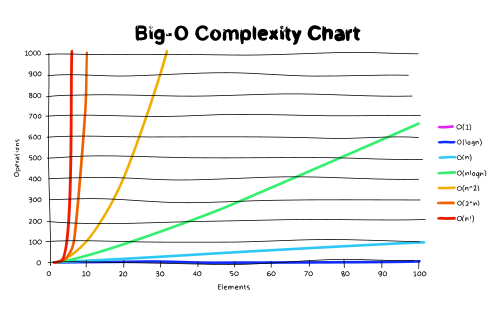

# Big-O Notation

  

Classes of functions that are commonly encountered when analyzing the running time of an algorithm.

| Notation       | Name               | Example                                                          |
| -------------- | ------------------ | ---------------------------------------------------------------- |
| **O(1)**       | **constant**       | running a statement, value look-up on an array, object, variable |
| O(log log n)   | double logarithmic |                                                                  |
| **O(log n)**   | **logarithmic**    | loop that cuts the problem in half every iteration               |
| O((log n)^c)   | polylogarithmic    |                                                                  |
| O(n^c)         | fractional power   |                                                                  |
| **O(n)**       | **linear**         | looping through the values of an array                           |
| O(n log\* n)   | n log-star n       |                                                                  |
| **O(n log n)** | **quasilinear**    | recursion with binary split (merge sort), heap sort              |
| **O(n^2)**     | **quadratic**      | double nested loops, bubble sort, selection sort, insertion sort |
| O(n^c)         | polynomial         |                                                                  |
| O(c^n)         | exponential        | TSP (dynamic programming)                                        |
| O(n!)          | factorial          | TSP (brute force)                                                |
