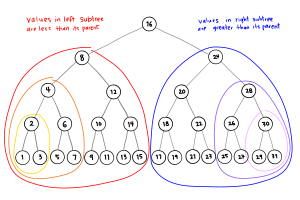

# Binary Search Tree

**Binary search trees** are binary trees that keep their nodes in sorted order, so that lookup and other operations can use _binary search_.

## Constraints

- A child has only _one_ parent and the root node has _no_ parent.
- Each node can have a max of 2 children.
- Each node's _left_ subtree is **less than** its parent's value.
- Each node's _right_ subtree is **greater than** its parent's value.

  

[← go back to trees](../)
