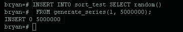

Creating sample data


  --The SQL SELECT RANDOM() function... returns  random row
Generate a Series in Postgres
generate_series([start], [stop], [{optional}step/interval]);
Generate a series of numbers in postgres by using the generate_series function.

The function requires either 2 or 3 inputs. The first input, [start], is the starting point for generating your series. [stop] is the value that the series will stop at. The series will stop once the values pass the [stop] value. The third value determines how much the series will increment for each step the default it 1 for number series

For example:

SELECT * FROM generate_series(1,10);
Will output the rows: 1,2,3,4,5,6,7,8,9,10




EXPLAIN ANALYZE is a profiling tool for your queries that will show you where MySQL spends time on your query and why. It will plan the query, instrument it and execute it while counting rows and measuring time spent at various points in the execution plan. When execution finishes, EXPLAIN ANALYZE will print the plan and the measurements instead of the query result.

This new feature is built on top of the regular EXPLAIN query plan inspection tool, and can be seen as an extension of the EXPLAIN FORMAT=TREE that was added earlier in MySQL 8.0. In addition to the query plan and estimated costs, which a normal EXPLAIN will print, EXPLAIN ANALYZE also prints the actual costs of individual iterators in the execution plan.

EXPLAIN -- show the execution plan of a statement


This command displays the execution plan that the PostgreSQL planner generates for the supplied statement. The execution plan shows how the table(s) referenced by the statement will be scanned — by plain sequential scan, index scan, etc. — and if multiple tables are referenced, what join algorithms will be used to bring together the required rows from each input table.

The most critical part of the display is the estimated statement execution cost, which is the planner's guess at how long it will take to run the statement (measured in units of disk page fetches). Actually two numbers are shown: the start-up time before the first row can be returned, and the total time to return all the rows. For most queries the total time is what matters, but in contexts such as a subquery in EXISTS, the planner will choose the smallest start-up time instead of the smallest total time (since the executor will stop after getting one row, anyway). Also, if you limit the number of rows to return with a LIMIT clause, the planner makes an appropriate interpolation between the endpoint costs to estimate which plan is really the cheapest.

The ANALYZE option causes the statement to be actually executed, not only planned. The total elapsed time expended within each plan node (in milliseconds) and total number of rows it actually returned are added to the display. This is useful for seeing whether the planner's estimates are close to reality.


### Important: Keep in mind that the statement is actually executed when the ANALYZE option is used. Although EXPLAIN will discard any output that a SELECT would return, other side effects of the statement will happen as usual. If you wish to use EXPLAIN ANALYZE on an INSERT, UPDATE, DELETE, CREATE TABLE AS, or EXECUTE statement without letting the command affect your data, use this approach:

## Parameters
### ANALYZE
Carry out the command and show the actual run times. This parameter defaults to FALSE.

### VERBOSE
Display additional information regarding the plan. Specifically, include the output column list for each node in the plan tree, schema-qualify table and function names, always label variables in expressions with their range table alias, and always print the name of each trigger for which statistics are displayed. This parameter defaults to FALSE.

### COSTS
Include information on the estimated startup and total cost of each plan node, as well as the estimated number of rows and the estimated width of each row. This parameter defaults to TRUE.

### BUFFERS
Include information on buffer usage. Specifically, include the number of shared blocks hits, reads, and writes, the number of local blocks hits, reads, and writes, and the number of temp blocks reads and writes. Shared blocks, local blocks, and temp blocks contain tables and indexes, temporary tables and temporary indexes, and disk blocks used in sort and materialized plans, respectively. The number of blocks shown for an upper-level node includes those used by all its child nodes. In text format, only non-zero values are printed. This parameter may only be used with the ANALYZE parameter. It defaults to FALSE.

### FORMAT
Specify the output format, which can be TEXT, XML, JSON, or YAML. Non-text output contains the same information as the text output format, but is easier for programs to parse. This parameter defaults to TEXT.

### boolean
Specifies whether the selected option should be turned on or off. You can write TRUE, ON, or 1 to enable the option, and FALSE, OFF, or 0 to disable it. The boolean value can also be omitted, in which case TRUE is assumed.

### statement
Any SELECT, INSERT, UPDATE, DELETE, VALUES, EXECUTE, DECLARE, or CREATE TABLE AS statement, whose execution plan you wish to see.


```sql
EXPLAIN [ ( option [, ...] ) ] statement
EXPLAIN [ ANALYZE ] [ VERBOSE ] statement

where option can be one of:

    ANALYZE [ boolean ]
    VERBOSE [ boolean ]
    COSTS [ boolean ]
    BUFFERS [ boolean ]
    FORMAT { TEXT | XML | JSON | YAML }
    ```
```


work_mem tells the server that up to 4 MB can be used per operation (per sort, grouping operation, etc.). If you sort too much data, PostgreSQL has to move the excessive amount of data to disk, which is of course slow.


### EXAMPLES FROM DOCUMENTATION:

To show the plan for a simple query on a table with a single integer column and 10000 rows:
```sql
EXPLAIN SELECT * FROM foo;
```
```

                       QUERY PLAN
---------------------------------------------------------
 Seq Scan on foo  (cost=0.00..155.00 rows=10000 width=4)
(1 row)
Here is the same query, with JSON formatting:

EXPLAIN (FORMAT JSON) SELECT * FROM foo;
           QUERY PLAN           
--------------------------------
 [                             +
   {                           +
     "Plan": {                 +
       "Node Type": "Seq Scan",+
       "Relation Name": "foo", +
       "Alias": "foo",         +
       "Startup Cost": 0.00,   +
       "Total Cost": 155.00,   +
       "Plan Rows": 10000,     +
       "Plan Width": 4         +
     }                         +
   }                           +
 ]
(1 row)
```
If there is an index and we use a query with an indexable WHERE condition, EXPLAIN might show a different plan:
```sql
EXPLAIN SELECT * FROM foo WHERE i = 4;
```
```
                         QUERY PLAN
--------------------------------------------------------------
 Index Scan using fi on foo  (cost=0.00..5.98 rows=1 width=4)
   Index Cond: (i = 4)
(2 rows)
```


"top-N heapsort" is used if you only want a couple of sorted rows. For example: The highest 10 values, the lowest 10 values and so on. "top-N heapsort" is pretty efficient and returns the desired data in almost no time:


=
