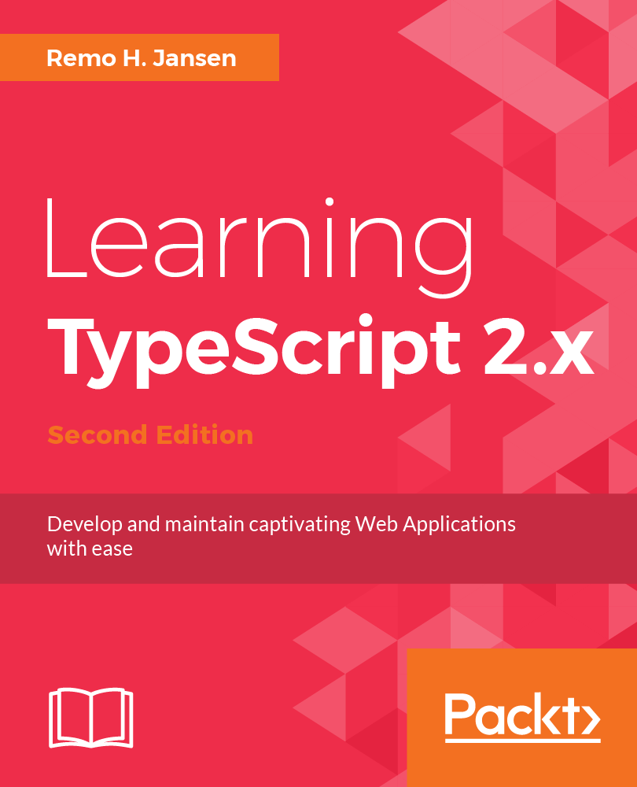
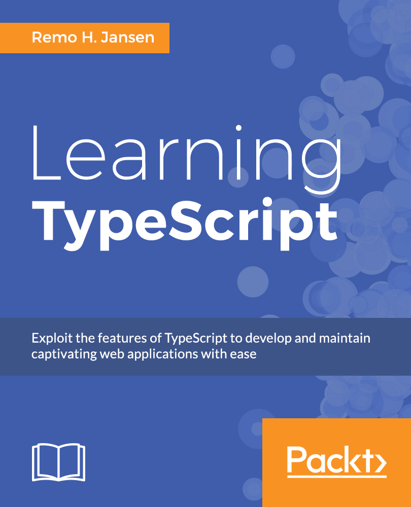

# Learning TypeScript (2nd Edition)

Source code of the book Learning TypeScript (http://www.learningtypescript.com/) written by [Remo H. Jansen](https://github.com/remojansen) and published by [Packt Publishing](https://www.packtpub.com/).


## Content

---

> **Note:** Not all source code files are free of compilation errors. Some of the examples throw compilation errors to demostrate how the TypeScript language services can detect them.

---

> **Note:** The source code contains internal modules (AKA `namespace`), which are used to isolate each demo from the others. As it is explained in the book contents, in a real-world TypeScript application, it is recommended to avoid the usage of internal modules.
---

### PART I: TypeScript fundamentals

- [Chapter 01: Introducing TypeScript](/chapters/chapter_01)

- [Chapter 02: Working with types](/chapters/chapter_02)

- [Chapter 03: Working with functions](/chapters/chapter_03)

- [Chapter 04: Object-oriented programming with TypeScript](/chapters/chapter_04)

- [Chapter 05: Working with dependencies](/chapters/chapter_05)

- [Chapter 06: Understanding the runtime](/chapters/chapter_06)

- [Chapter 07: Functional programming with TypeScript](/chapters/chapter_07)

- [Chapter 08: Working with decorators](/chapters/chapter_08)

### PART II: TypeScript tools and frameworks

- [Chapter 09: Automating your development workflow](/chapters/chapter_09)

- [Chapter 10: Node.js development with TypeScript](/chapters/chapter_10)

- [Chapter 11: React development with TypeScript](/chapters/chapter_11)

- [Chapter 12: Angular development with TypeScript](/chapters/chapter_12)

- [Chapter 13: Application performance](/chapters/chapter_13)

- [Chapter 14: Application testing](/chapters/chapter_14)

- [Chapter 15: Working with the language services](/chapters/chapter_15)

## Editions

### Second edition (ISBN 9781788391474)



- [Amazon :uk:](https://www.amazon.co.uk/Learning-TypeScript-2-x-Remo-Jansen-ebook/dp/B078PQ6MF4/)
- [Amazon :us:](https://www.amazon.com/Learning-TypeScript-2-x-Remo-Jansen-ebook/dp/B078PQ6MF4/)
- [Packt Publishing](https://www.packtpub.com/application-development/learning-typescript-2x-second-edition)
- [Rakuten Kobo](https://www.kobo.com/ie/en/ebook/learning-typescript-2-x-second-edition)

### First edition (ISBN 9781783985548)



- [Amazon :uk:](https://www.amazon.co.uk/Learning-TypeScript-Remo-H-Jansen/dp/1783985542)
- [Amazon :us:](https://www.amazon.com/Learning-TypeScript-Remo-H-Jansen/dp/1783985542)
- [Amazon :cn:](https://www.amazon.cn/dp/B01M2CAFTB)

## How can I run the examples?

Please refer to chapter 9 in the book to learn how to install Node.js, npm, TypeScript, ts-node, and Git. 

Make sure that you have TypeScript v2.8.1 and ts-node v6.0.1:

```
ts-node -v
```

Once you have everything installed you need to clone the code samples repository from GitHub using the command line interface of your OS:

```
git clone https://github.com/remojansen/LearningTypeScript.git
```

- We can run the examples using `ts-node` from the root folder (`LearningTypeScript`).

- Run `npm install` to install dependencies.

- Some of this files don't have outputs and nothing will be displayed in the console while other  files have outputs and some of them should throw and error. When an error is expected it is usually indicated by a comment (e.g., `// Error`). 

- Some code samples also require you to change the `tsconfig.json` to enable or disable some compilation flags. This is usually indicated by comments, if not comments are available, it means that the default configuration should work.

- The `test` directory under the root directory can be ignored because it is used to test the examples in this book.

### Chapter 01

```
ts-node chapters/chapter_01/01_type_inference.ts
ts-node chapters/chapter_01/02_variables.ts
ts-node chapters/chapter_01/03_tuples.ts
ts-node chapters/chapter_01/04_scope.ts
ts-node chapters/chapter_01/05_spread_operator.ts
ts-node chapters/chapter_01/06_flow_controls.ts
ts-node chapters/chapter_01/07_functions.ts
ts-node chapters/chapter_01/08_classes.ts
ts-node chapters/chapter_01/09_interfaces.ts
ts-node chapters/chapter_01/10_modules.ts
ts-node chapters/chapter_01/11_geometry.ts
```

### Chapter 02

```
ts-node chapters/chapter_02/01_type_inference.ts
ts-node chapters/chapter_02/02_type_annotations.ts
ts-node chapters/chapter_02/03_structural_type_system.ts
ts-node chapters/chapter_02/04_union_types.ts
ts-node chapters/chapter_02/05_type_aliases.ts
ts-node chapters/chapter_02/06_intersection_types.ts
ts-node chapters/chapter_02/07_nullable_types.ts
ts-node chapters/chapter_02/08_non_nullable_types.ts
ts-node chapters/chapter_02/09_typeof_operator.ts
ts-node chapters/chapter_02/10_type_guards.ts
ts-node chapters/chapter_02/11_custom_type_guards.ts
ts-node chapters/chapter_02/12_control_flow_analysis.ts
ts-node chapters/chapter_02/13_literal_types.ts
ts-node chapters/chapter_02/14_discriminated_unions.ts
ts-node chapters/chapter_02/15_never_type.ts
ts-node chapters/chapter_02/16_enumerations.ts
ts-node chapters/chapter_02/17_object_literals.ts
ts-node chapters/chapter_02/18_weak_types.ts
ts-node chapters/chapter_02/19_keyof_operator.ts
ts-node chapters/chapter_02/20_index_signature.ts
ts-node chapters/chapter_02/21_local_types.ts
ts-node chapters/chapter_02/22_type_casting.ts
ts-node chapters/chapter_02/23_generic_types.ts
ts-node chapters/chapter_02/24_generic_constraints.ts
ts-node chapters/chapter_02/25_mapped_types.ts
ts-node chapters/chapter_02/26_lookup_types.ts
ts-node chapters/chapter_02/27_mapped_type_modifiers.ts
ts-node chapters/chapter_02/28_conditional_types.ts
ts-node chapters/chapter_02/29_polymorphic_this_type.ts
```

### Chapter 03

```
ts-node chapters/chapter_03/01_function_declaration.ts
ts-node chapters/chapter_03/02_function_types.ts
ts-node chapters/chapter_03/03_trailing_comas.ts
ts-node chapters/chapter_03/04_optional_parameters.ts
ts-node chapters/chapter_03/05_default_parameters.ts
ts-node chapters/chapter_03/06_rest_parameters.ts
ts-node chapters/chapter_03/07_function_overloading.ts
ts-node chapters/chapter_03/08_specialized_overloading.ts
ts-node chapters/chapter_03/09_function_scope.ts
ts-node chapters/chapter_03/10_iife.ts
ts-node chapters/chapter_03/11_tag_templates.ts
ts-node chapters/chapter_03/12_arrow_functions.ts
ts-node chapters/chapter_03/13_callbak_hell.ts
ts-node chapters/chapter_03/14_promises.ts
ts-node chapters/chapter_03/15_covariant_arguments.ts
ts-node chapters/chapter_03/16_generators.ts
ts-node chapters/chapter_03/17_async_await.ts
ts-node chapters/chapter_03/18_async_generators.ts
ts-node chapters/chapter_03/19_async_iterators.ts
ts-node chapters/chapter_03/20_delegate_generators.ts
```

### Chapter 04

```
ts-node chapters/chapter_04/01_classes.ts
ts-node chapters/chapter_04/02_Inheritance.ts
ts-node chapters/chapter_04/03_access_modifiers.ts
ts-node chapters/chapter_04/04_parameter_properties.ts
ts-node chapters/chapter_04/05_class_expressions.ts
ts-node chapters/chapter_04/06_static_members.ts
ts-node chapters/chapter_04/07_optional_properties.ts
ts-node chapters/chapter_04/08_readonly_properties.ts
ts-node chapters/chapter_04/09_method_overriding.ts
ts-node chapters/chapter_04/10_generic_classes.ts
ts-node chapters/chapter_04/11_generic_constraints.ts
ts-node chapters/chapter_04/12_mixins.ts
ts-node chapters/chapter_04/13_iterables.ts
ts-node chapters/chapter_04/14_abstract_classes.ts
ts-node chapters/chapter_04/15_interfaces.ts
ts-node chapters/chapter_04/16_srp.ts
ts-node chapters/chapter_04/17_encapsulation.ts
ts-node chapters/chapter_04/18_ocp.ts
ts-node chapters/chapter_04/19_polymorphism.ts
ts-node chapters/chapter_04/20_isp.ts
ts-node chapters/chapter_04/21_lsp.ts
ts-node chapters/chapter_04/22_dip.ts
```

### Chapter 05

```
ts-node chapters/chapter_05/01_namespaces.ts
ts-node chapters/chapter_05/02_nested_namespaces.ts
```

The example about multi-file namespaces requires both files to be passed to ts-node:

```
ts-node chapters/chapter_05/02_nested_namespaces.ts chapters/chapter_05/03_multifile_namespace.ts

```

```
ts-node chapters/chapter_05/04_periods.ts
ts-node chapters/chapter_05/05_e6_modules_export.ts
ts-node chapters/chapter_05/06_es6_module_import.ts
ts-node chapters/chapter_05/07_legacy_modules_export.ts
ts-node chapters/chapter_05/08_legacy_modules_import.ts
ts-node chapters/chapter_05/09_inversion_vs_injection.ts
ts-node chapters/chapter_05/10_ioc_containers.ts
```

### Chapter 06

```
ts-node chapters/chapter_06/01_stack.ts
ts-node chapters/chapter_06/02_function_calls.ts
ts-node chapters/chapter_06/03_bind.ts
ts-node chapters/chapter_06/04_prototypes.ts
ts-node chapters/chapter_06/05_prototype_chain.ts
ts-node chapters/chapter_06/06_closures.ts
```

### Chapter 07

```
ts-node chapters/chapter_07/01_pure_functions.ts
ts-node chapters/chapter_07/02_lambdas.ts
ts-node chapters/chapter_07/03_function_types.ts
ts-node chapters/chapter_07/04_higher_order_function.ts
ts-node chapters/chapter_07/05_composition.ts
ts-node chapters/chapter_07/06_partial_application.ts
ts-node chapters/chapter_07/07_currying.ts
ts-node chapters/chapter_07/08_pipes.ts
ts-node chapters/chapter_07/09_pointfree_style.ts
ts-node chapters/chapter_07/10_recursion.ts
ts-node chapters/chapter_07/13_immutable.ts
ts-node chapters/chapter_07/14_ramda.ts
```

Examples `11_functors.ts` and `12_monads.ts` should be executed in a web browser. This means that `ts-node` will not work. You can compile the code using the [TypeScript playground](https://www.typescriptlang.org/play/index.html) and then execute the output JS code using in the JavaScript console of your web browser.

### Chapter 08

```
ts-node chapters/chapter_08/01_class_decorator.ts
ts-node chapters/chapter_08/02_method_decorator.ts
ts-node chapters/chapter_08/03_property_decorator.ts
ts-node chapters/chapter_08/04_parameter_decorator.ts
ts-node chapters/chapter_08/05_decorator_options.ts
ts-node chapters/chapter_08/06_reflect_metadata.ts
ts-node chapters/chapter_08/07_decorator_factory.ts
```

### Chapter 09

Please refer to the instructions at [`/chapters/chapter_09/readme.md`](/chapters/chapter_09/readme.md).

### Chapter 10

Please refer to the instructions at [`/chapters/chapter_10/readme.md`](/chapters/chapter_10/readme.md).

### Chapter 11

Please refer to the instructions at [`/chapters/chapter_11/readme.md`](/chapters/chapter_11/readme.md).

### Chapter 12

Please refer to the instructions at [`/chapters/chapter_12/readme.md`](/chapters/chapter_12/readme.md).

### Chapter 13

```
ts-node chapters/chapter_13/01_exception.ts
ts-node chapters/chapter_13/02_try_catch.ts
```

### Chapter 14

```
ts-node chapters/chapter_14/01_assertions/application.ts
ts-node chapters/chapter_14/01_assertions/assertions.ts
```

Please refer to the instructions at [`/chapters/chapter_14/02_testing/readme.md`](/chapters/chapter_14/02_testing/readme.md).


### Chapter 15

```
cd chapters/chapter_15
npm install
ts-node 01_ast_raw.ts
ts-node 02_ast_navigation.ts
ts-node 03_ast_diagnostics.ts
ts-node 04_ast_classes.ts
ts-node 05_ast_modules.ts
ts-node 06_language_services.ts
ts-node 07_uml_demo.ts
```
