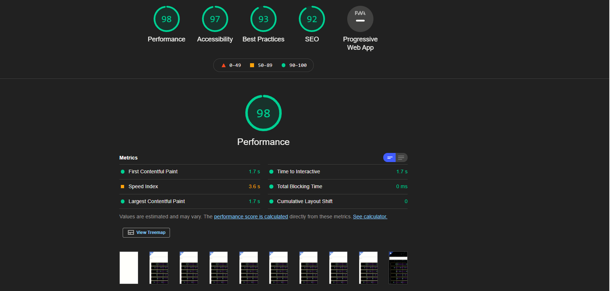

# My Quick Links Website:

---


# [Pages](https://bgoonz.github.io/Links-Shortcut-Site/) ... [Netlify](https://links4242.netlify.app/) ... [Vercel](http://links-shortcut-site.vercel.app/)

---




---


# Code:

```html

<!DOCTYPE html>
<html lang="en">

<head>
  <meta charset="UTF-8">
  <meta http-equiv="X-UA-Compatible" content="IE=edge">
  <meta name="viewport" content="width=device-width, initial-scale=1.0">
  <title>My Links</title>
  <link rel="stylesheet" href="./style.css">
  <link href='https://fonts.googleapis.com/css?family=Lato:300,400,700' rel='stylesheet' type='text/css'>
  <link rel="stylesheet" href="./style.css">
  <style>
  </style>
  <!-- Optional theme -->
  <link rel="stylesheet" href="https://maxcdn.bootstrapcdn.com/bootstrap/3.3.7/css/bootstrap-theme.min.css"
    integrity="sha384-rHyoN1iRsVXV4nD0JutlnGaslCJuC7uwjduW9SVrLvRYooPp2bWYgmgJQIXwl/Sp" crossorigin="anonymous">
  <!-- Latest compiled and minified JavaScript -->
  <script src="https://maxcdn.bootstrapcdn.com/bootstrap/3.3.7/js/bootstrap.min.js"
    integrity="sha384-Tc5IQib027qvyjSMfHjOMaLkfuWVxZxUPnCJA7l2mCWNIpG9mGCD8wGNIcPD7Txa" crossorigin="anonymous">
  </script>
  <script>
    function mySearchFunction() {
      // Declare variables
      let input, filter, ol, li, item, i, txtValue;
      // User Input
      input = document.getElementById("myInput");
      // Filter, makes search not case sensitive
      filter = input.value.toUpperCase();
      // Grabs the parent element by id
      ol = document.getElementById("stateList");
      // Individual item on list
      li = ol.getElementsByTagName("li");
      // Treats lists items like an array, where each item can be accessed through      it's index
      for (i = 0; i < li.length; i++) {
        item = li[i];
        // Iterate over each list item to see if the value of the input, ignoring         case, matches the inner text or inner html of the item.
        txtValue = item.textContent || item.innerText;
        if (txtValue.toUpperCase().indexOf(filter) > -1) {
          // Displays list items that are a match, and nothing if no match
          li[i].style.display = "";
        } else {
          li[i].style.display = "none";
        }
      }
    }
  </script>
</head>

<body>
  <br>
  <center>
    <br>
    <br>
    <br>
    <br>
    <br>
    <br>
    <input type="text" id="myInput" onkeyup="mySearchFunction()" style="height: 80px;font-size: larger;" maxlength="100"
      size="100" placeholder="Search">
    <br>
    <br>
    <br>
    <br>
    <br>
  </center>
  <a href="https://github.com/bgoonz/Links-Shortcut-Site" class="github-corner" aria-label="View source on Github"><svg
      width="80" height="80" viewbox="0 0 250 250"
      style="z-index: 100000; fill:#194ccdaf; color:#fff; position: fixed; top: 20px; border: 0; left: 20px; transform: scale(-1.5, 1.5);"
      aria-hidden="true">
      <path d="M0,0 L115,115 L130,115 L142,142 L250,250 L250,0 Z"></path>
      <path
        d="M128.3,109.0 C113.8,99.7 119.0,89.6 119.0,89.6 C122.0,82.7 120.5,78.6 120.5,78.6 C119.2,72.0 123.4,76.3 123.4,76.3 C127.3,80.9 125.5,87.3 125.5,87.3 C122.9,97.6 130.6,101.9 134.4,103.2"
        fill="currentColor" style="transform-origin: 130px 106px;" class="octo-arm"></path>
      <path
        d="M115.0,115.0 C114.9,115.1 118.7,116.5 119.8,115.4 L133.7,101.6 C136.9,99.2 139.9,98.4 142.2,98.6 C133.8,88.0 127.5,74.4 143.8,58.0 C148.5,53.4 154.0,51.2 159.7,51.0 C160.3,49.4 163.2,43.6 171.4,40.1 C171.4,40.1 176.1,42.5 178.8,56.2 C183.1,58.6 187.2,61.8 190.9,65.4 C194.5,69.0 197.7,73.2 200.1,77.6 C213.8,80.2 216.3,84.9 216.3,84.9 C212.7,93.1 206.9,96.0 205.4,96.6 C205.1,102.4 203.0,107.8 198.3,112.5 C181.9,128.9 168.3,122.5 157.7,114.1 C157.9,116.9 156.7,120.9 152.7,124.9 L141.0,136.5 C139.8,137.7 141.6,141.9 141.8,141.8 Z"
        fill="currentColor" class="octo-body"></path>
    </svg></a>
  <ol id="stateList">
    <li>
      <a
        href="https://colab.research.google.com/github/googlecolab/colabtools/blob/master/notebooks/colab-github-demo.ipynb#scrollTo=wKJ4bd5rt1wy">✅Using
        Google Codelab with GitHub</a>
    </li>
    <li>
      <a href="https://gist.github.com/bgoonz/b07979f7a4a1c87f68e66e888dd2bbb2">✅ To-Read(at some point)</a>
    </li>
    <li>
      <a href="https://web-dev-hub.com/">✅Wordpress Blog</a>
    </li>
    <li>
      <a href="https://apply.lambdaschool.com/courses/web/">✅ Lambda Prep</a>
    </li>
    <li>
      <a href="https://www.notion.so/Personal-Home-dba2672f6cfc451380a85953ad3e78d4">✅Notation</a>
    </li>
    <li>
      <a href="https://app.netlify.com/">✅Netlify</a>
    </li>
    <li>
      <a href="https://wordpress.com/view/web-dev-hub.com/">✅Word Press</a>
    </li>
    <li>
      <a href="https://regexr.com/">✅ Regexer</a>
    </li>
    <li>
      <a href="https://www.youtube.com/channel/UC9-rYyUMsnEBK8G8fCyrXXA">✅My Youtube Channel</a>
    </li>
    <li>
      <a href="https://web-dev-hub.com/">✅My WordPress Blog</a>
    </li>
    <li>
      <a href="https://modest-booth-4e17df.netlify.app/directory.html">✅Medium-Self-Hosted</a>
    </li>
    <li>
      <a href="https://www.facebook.com/bryan.guner/">✅Facebook</a>
    </li>
    <li>
      <a href="https://gist.github.com/bgoonz/a7e833436166d4ebb4905b078f5a352a">✅List of Technologies I want to
        learn</a>
    </li>
    <li>
      <a href="https://gitlab.com/">✅Gitlab</a>
    </li>
    <li>
      <a href="https://lambdaschoolsso.okta.com/app/UserHome">✅Lambda (OKTA)</a>
    </li>
    <li>
      <a
        href="https://nickguner.atlassian.net/wiki/spaces/DEV/pages/1345388545/Python+Problems?atlOrigin=eyJpIjoiNzUwYjkxY2RiOTgxNGU1YjlmMjk0ZmM4ZmI1ZGNhNDEiLCJwIjoiYyJ9">✅Confluence
        DevOps</a>
    </li>
    <li>
      <a href="https://www.facebook.com/bryan.guner/">✅FACEBOOK</a>
    </li>
    <li>
      <a href="https://mail.zoho.com/zm/#mail/folder/inbox">✅Lambda-Email</a>
    </li>
    <li>
      <a href="https://amp.dev/">✅AMP Websites</a>
    </li>
    <li>
      <a style="font-weigt:800;" href="https://gist.github.com/bgoonz/659a9b81ac45453bedc0a1a36275b580">✅WEBSITES OF
        MY OWN CREATION</a>
    </li>
    <li>
      <a href="https://pedantic-wing-adbf82.netlify.app/">✅Excel2HTML Demo Site</a>
    </li>
    <li>
      <a href="https://trusting-dijkstra-4d3b17.netlify.app/">✅Data Structures Learning Site</a>
    </li>
    <li>
      <a href="https://web-dev-resource-hub.netlify.app/">✅Web-Dev-Hub-Original</a>
    </li>
    <li>
      <a href="https://app.slack.com/client/T4JUEB3ME/D01T2J8AP7X/thread/C01TBRN4ZD2-1617501657.011500">✅Slack</a>
    </li>
    <li>
      <a href="https://app.sli.do/event/xcj7bjgp">✅Slido</a>
    </li>
    <li>
      <a href="https://gistlog.co/bgoonz/9355c1d01508cf993d264d58ad2584f0">✅My Stared Repos</a>
    </li>
    <li>
      <a href="https://lambdaschool.instructure.com/">✅Lambda Canvas</a>
    </li>
    <li>
      <a href="https://lambda-prep.netlify.app/">✅Lambda-Resource-Site</a>
    </li>
    <li>
      <a href="https://elements.envato.com/">✅Cool CSS Elements</a>
    </li>
    <li>
      <a href="https://cssgrid.io/">✅CSS Grid</a>
    </li>
    <li>
      <a href="https://www6.waybackmachinedownloader.com/website-downloader-online/#">✅Website-Downloader</a>
    </li>
    <li>
      <a href="https://mail.zoho.com/zm/#mail/folder/inbox/p/1618574775270100001">✅lambda-email</a>
    </li>
    <li>
      <a href="https://edabit.com/">✅Edabit</a>
    </li>
    <li>
      <a href="https://www.codewars.com/">✅CodeWars</a>
    </li>
    <li>
      <a href="https://github.com/sindresorhus">✅Awesome Git User</a>
    </li>
    <li>
      <a href="https://github.com/substack">✅Awesome Git User #2</a>
    </li>
    <li>
      <a href="https://mail.zoho.com/zm/#mail/folder/inbox/p/1618574775270100001">✅lambda-email</a>
    </li>
    <li>
      <a
        href="https://www.gatsbyjs.com/dashboard/f9296337-b3bc-4dfc-8a42-2af2b6425579/sites/33754b43-7691-43a6-aee3-235fa761d911/settings/hosting">✅Gatsby
        Cloud</a>
    </li>
    <li>
      <a href="https://app.contentful.com/spaces/8bi3kosknnn4/home">✅Contentfol Space</a>
    </li>
    <li>
      <a href="https://app.stackbit.com/studio/609b2d7c71a5dd0016f36326">✅STACKBIT</a>
    </li>
    <li>
      <a href="https://githtmlpreview.netlify.app/">✅Git Html Previewer</a>
    </li>
    <li>
      <a href="https://openchakra.app/">✅React Gui Builder</a>
    </li>
    <li>
      <a href="https://medium.com/me/stories/public">✅My Medium Stories</a>
    </li>
    <li>
      <a href="https://console.aws.amazon.com/console/home?region=us-east-1">✅AWS Console</a>
    </li>
    <li>
      <a href="https://console.aws.amazon.com/cloud9/ide/1387ff00f7a34f7796fcdd9122e11530">✅AWS Cloud 9</a>
    </li>
    <li>
      <a href="https://console.firebase.google.com/">✅Google Firebase Console</a>
    </li>
    <li>
      <a href="https://cloud.hasura.io/project/fe29e76b-000b-4c0d-ae12-55b46454f8d3/console">✅Hasura graphQL Cloud</a>
    </li>
    <li>
      <a
        href="https://cloud.hasura.io/project/fe29e76b-000b-4c0d-ae12-55b46454f8d3/console/data/default/schema/public/tables/files/browse">✅Herasha
        cloud heroku psql database</a>
    </li>
    <li>
      <a href="https://www.sanity.io/manage/personal/project/ke5fae8i">✅Sanity</a>
    </li>
    <li>
      <a href="https://kguner-fractions-website.netlify.app/">✅Visualizing Fractions</a>
    </li>
    <li>
      <a href="https://app.fakejson.com/member">✅Fake Json Api Backend</a>
    </li>
    <li>
      <a href="https://developers.google.com/blogger/docs/3.0/performance?hl=en&authuser=0">✅Blogger Docs</a>
    </li>
    <li>
      <a href="https://draft.blogger.com/">✅Blogger Console</a>
    </li>
    <li>
      <a href="https://gist.github.com/bgoonz/c8d651c0b2921f312b316f97073417a7">✅Link Dump Fil</a>
    </li>
    <li>
      <a href="https://knexjs.org/">✅Knexjs</a>
    </li>
    <li>
      <a href="https://newsapi.org/">✅NEWSApi</a>
    </li>
    <li>
      <a href="https://www.tnd.dev/">✅Jamstack Tools</a>
    </li>
    <li>
      <a href="https://octokit.github.io/">✅https://octokit.github.io/</a>
    </li>
    <li>
      <a href="https://www.gatsbyjs.com/starters/?d=gatsby">✅Gatsby Templates</a>
    </li>
    <li>
      <a href="https://revealjs.com/installation/#basic-setup">✅html slides</a>
    </li>
    <li>
      <a href="https://gist.github.com/bgoonz/ad5c9944f383f1ed07239b672d87c69c">✅Bookmarks</a>
    </li>
    <li>
      <a href="https://bgoonz42.blogspot.com/">✅Blogger2</a>
    </li>
    <li>
      <a href="https://unruffled-curran-b8a076.netlify.app/my-websites.html">✅my websites</a>
    </li>
    <li>
      <a href="https://purifycss.online/">✅Remove Unused CSS</a>
    </li>
    <li>
      <a href="https://cloudinary.com/console/c-d3e7c369000a1db1ee19b4e7f9e3ab/getting-started">✅ Cloudinary</a>
    </li>
    <li>
      <a href="https://app.codesignal.com/">✅Code Signal</a>
    </li>
    <li>
      <a href="https://mail.zoho.com/zm/#mail/folder/inbox">✅Lambda Email</a>
    </li>
    <li>
      <a href="https://templates.netlify.com/">✅Netlify JAMSTACK templates</a>
    </li>
    <li>
      <a href="https://spaces.w3schools.com/space/explore42">✅W3 Spaces</a>
    </li>
    <li>
      <a href="https://gist.github.com/bgoonz/730fd7c7fa1f7fd3404f2553da99db1f">✅All My Repos</a>
    </li>
    <li>
      <a href="https://bgoonz-blog.netlify.app/">✅Main Blog 2.0</a>
    </li>
    <li>
      <a href="https://golden-lobe-519.notion.site/Data-Structures-c3fe3debbe494b929ed2f20070b631f8">✅Notion Data
        Structures</a>
    </li>
    <li>
      <a href="https://bootcamp42.gitbook.io/python/">✅Python Gitbook </a>
    </li>
    <!-- <li>
<a href="">✅</a>
</li>
<li>
<a href="">✅</a>
</li>
<li>
<a href="">✅</a>
</li>
<li>
<a href="">✅</a>
</li>
<li>
<a href="">✅</a>
</li>
<li>
<a href="">✅</a>
</li>
<li>
<a href="">✅</a>
</li>
<li>
<a href="">✅</a>
</li>
<li>
<a href="">✅</a>
</li>
<li>
<a href="">✅</a>
</li>
<li>
<a href="">✅</a>
</li>
<li>
<a href="">✅</a>
</li>
<li>
<a href="">✅</a>
</li>
<li>
<a href="">✅</a>
</li>
<li>
<a href="">✅</a>
</li>
<li>
<a href="">✅</a>
</li>
<li>
<a href="">✅</a>
</li>
<li>
<a href="">✅</a>
</li>
<li>
<a href="">✅</a>
</li>
<li>
<a href="">✅</a>
</li>
<li>
<a href="">✅</a>
</li>
<li>
<a href="">✅</a>
</li>
<li>
<a href="">✅</a>
</li>
<li>
<a href="">✅</a>
</li>
<li>
<a href="">✅</a>
</li>
<li>
<a href="">✅</a>
</li>
<li>
<a href="">✅</a>
</li>
<li>
<a href="">✅</a>
</li>
<li>
<a href="">✅</a>
</li>
<li>
<a href="">✅</a>
</li>
<li>
<a href="">✅</a>
</li>
<li>
<a href="">✅</a>
</li>
<li>
<a href="">✅</a>
</li>
<li>
<a href="">✅</a>
</li>
<li>
<a href="">✅</a>
</li>
<li>
<a href="">✅</a>
</li>
<li>
<a href="">✅</a>
</li>
<li>
<a href="">✅</a>
</li> -->
  </ol>
  <br>
  <br>
  <br>
  <br>
  <br>
  <br>
  <br>
  <br>
  <br>
  <br>
  <br>
  <br>
  </div>
  <script>
    //reverse list
    let list = document.getElementById("stateList");
    let i = list.childNodes.length;
    while (i--)
      list.appendChild(list.childNodes[i]);

    function reverse_lists() {
      let olists = document.getElementsByTagName('ol');
      for (let i = 0; i < olists.length; i++) {
        if (!olists[i].className.match(/\breversed\b/)) continue;
        let items = olists[i].getElementsByTagName('li');
        for (let j = 0; j < items.length; j++) {
          items[j].setAttribute("value", items.length - j);
        }
      }
    }
    reverse_lists();
  </script>
</body>

</html>


```
---
