# Triggered Guitar Effects Platform

Senior Project II


## Demos:

### Pure Data Distortion Patch: 

[pd-gain](https://youtu.be/krRVGoK9NcA)

### Simple Implementation:

[simple](https://youtu.be/B8tMbRETRcg)

### Full Implementation Demo:

[full](https://youtu.be/88YMQaFMp5M)


Team Members:

Bryan Guner

Haley Scott

Ralph Quinto

Primary Advisor: Dr. Ambrose Adegbege

May, 2018

Acknowledgements                                                        

The team would like to thank Dr. Ambrose Adegbege for his input and enthusiasm towards tackling our design challenges. We would also like thank Dr. Larry Pearlstein for his guidance and suggestion of Dynamic Time Warping. In addition, our team thanks Mihir Beg for his consultation on MIDI transcription and suggestion of Pure Data.

        

* * * * *

Abstract

In live performance, guitar effect pedals are a versatile yet limiting asset. They require presence of mind on the part of the performer, and restrict the performer to the area of the stage in which the pedal board is located. These constraints limit the performance quality and stage presence by splitting the performer’s focus. This project proposes an automatic solution to the restrictions that guitar effect pedals present. The performer will record the primary performances into the proposed software, which will analyze and store the sequential frequencies. The performer will then utilize the software during a subsequent live performance, to trigger effects when preceding frequencies of the live performance are recognized against the first performance. This platform is realized through the use of Pure Data, a GUI (Graphical User Interface) for audio manipulation applications. Our team has designed an application that implements dynamic time warping (DTW) in order to compare the first performances against the live performance. The system compares MIDI data using the dynamic time warping distance threshold, opposed to the Euclidean distance threshold, making it a robust approach to mitigating live performance error.

Keywords: Pure Data, Dynamic Time Warping

* * * * *

Contents

Abstract……………………………………………………………………………….……….....…..2

Introduction…………………………………………………………...…………….………….….…5

Specifications………………………………………………………………………..….…..…...…...7

1.0        Chapter 1: Background……………………………………………………..…….….…..…8  

        1.1 How the Electric Guitar Works……………………………….…………...…..…....….8

        1.2 How the Pedal Board Works………....………………………………...……..........…..8

        1.3 Guitar Signal Analysis…………………………………………………….…........…...9

        1.4 Why Transcription Might Not Be Important……………………………..….......…...10

2.0        Chapter 2: The Counting Method…………………………………………….……..……12

        2.1 Concept………..…………………………………………………………….…..……12

                2.1.1 Primary Recording……………………………………………….....…….12

                2.1.2 Primary Analysis…………………………………………………..…..….13

                2.1.3 Live Performance…………………………………………………..…......13

                2.1.4 Live Analysis………………………………………………………....…...13

                2.1.5 Method Expansion…………………………………………………….…..14

        2.2 Pure Data Effects…………………………...…………………………………........…14

                2.2.1 Digital Effect Design in Pure Data…………………………………….….14

                2.2.2 Delay Effect in Pure Data…………………………….………....………...15

                2.2.3 Fuzz Effect in Pure Data……………………………………………….….15

                2.2.4 Reverb Effect in Pure Data…………………………...…………...……....16

                2.2.5 Spectral Delay Effect in Pure Data…………………………………….….17

3.0        Chapter 3: Dynamic Time Warping Method………………………………………………19

        3.1. Dynamic Time Warping………………………………………………………………19

        3.2 Why Dynamic Time Warping is a good choice for effects triggering………………...20

4.0        Chapter 4: Pure Data and Method Implementation……………………………………….22

        4.1 Introduction…………………………………………………………………..….…….22

=        4.2 First Approach……………………………………………………………………...….22

        4.3 Python Implementation………………………………………………………….….….23

        4.4 Pure Data Design……………………..……………………………….…………………..23

        4.5 DTW Implementation of Java………………………………………….………….…....…26

        4.6 DTW in Pure Data………………………..…………………………….…………........….29

5.0        Chapter 5: Testing and Validation Execution……………………………….….....…..……….33

        5.1 Methods of Functionality Testing……………………….…..…………….….…..………..33

        5.2 Methods of Specification Testing…………...……………………………………….…….35

        5.3 Realistic Constraints Testing………………………….…………………………….……..36

6.0        Chapter 6: Conclusion………………………………………………………….………..…….37

        6.1 Core Intent…………………………………………………………………….…..…...…..37

        6.2 Results Achieved……………………………………………………………….………….37

        6.3 Expectations and Modifications…………………………………………………….......…38

Appendices:

Appendix A: Project Overview

Appendix B: Project Management

Nomenclature

Primary performances: Guitar signal data recorded at home or in studio, before the live performance

Introduction

A musician’s desire to deliver inspired live performances would derive great utility from automatic effect triggering. This concept will allow users to focus on their performance rather than the management of their sound effects.  The value of the automatic triggering arises not only in convenience, but also in economic expense.  Guitar effect pedals are far more costly than digital effects, as there are significantly less points of failure in digital effects.  This idea serves to minimize distractions and cost to the performer, while maximizing the experience of live performance for the audience. This task will be achieved through the methods of dynamic time warping, and frequency counting.

Dynamic time warping provides a stronger solution for the issue of performance error. This algorithm uses a comparison method to find the most optimal correlation between live performance and pre-recorded performance. Here, the performer would record four primary performances. The dynamic time warping algorithm is applied using the first performance against each subsequent performance, producing a sum of distances between these three sets of recordings. This sum is then padded with a tolerance, and used to compare with the sum of distances between the fifth (live) performance and the first primary performance. This method is applied to smaller sections of the performance, providing the knowledge of when to trigger the desired effect. The implementation of this algorithm proves to be highly tolerant to error, but fairly complex.

The alternate approach is the implementation of a frequency counting algorithm. Here, the user will only record one primary performance. This performance will be used to create a sequence of frequencies, with a given tolerance. The number of changes in frequency are counted and stored. The frequencies from the live performance are then verified against the pre-recorded frequencies. The number of changes in frequency are stored and checked against the pre-recorded sum of changes. Once the separate sums from each performance are equal, the effect will be triggered. This method proves to be extremely straightforward, yet offers few solutions to the problem of live performance error.

Throughout this report, our team presents the methods instated in our current project, as well as the next steps in the design and modification process. A more in-depth description of the two aforementioned methods is given, including both the pros and cons of each.

 

Specifications

The project was designed to make integration as seamless as possible with current guitar setups. Minimizing the delay between the performance and effect triggering is crucial so that musicians are not thrown off by the offset. Based on the research that our team has completed, the threshold of our system was set to have a maximum trigger latency of 1 second. Anything longer would be too disruptive to the performance. Another crucial specification is having a sampling rate twice as large as the fundamental frequencies of the guitar. For electric guitars, frequencies range from 80 Hz to nearly 400Hz. The software utilized in this project has a default sampling rate of 44,100 Hz, which is more than enough to satisfy the Nyquist criteria. In addition, having many guitar effects offers great versatility to a performance. The group has set a goal to implement three different guitar effects along with the completion of our system.

1.0        Chapter 1: Background

1.1 How The Electric Guitar Works

An electric guitar is a stringed instrument that uses a device called a pickup to electrify and subsequently amplify the guitar signal.  The majority of guitar pickups are permanent magnets wrapped with a coil of insulated wire.  This means the pickup in most cases is a passive element that generates a voltage via electromagnetic induction. Most pickups have greater sensitivity to higher frequency notes. This is because with higher frequency comes higher string velocity, which is in proportion with the output of the pickup. An engineer who is not musically inclined can think of the pickup as a transducer functioning as an inductor.

1.2 How The Pedal Board Works

A pedal board is usually comprised of a power source and a mechanical housing for what are called ‘stomp boxes’. Also known as effect pedals, stompboxes are activated by the guitarist manually during a performance and proceed to alter the content of the guitar signal in some form. Some may be as simple as an EQ sweep that produce the famous ‘wah’ tone popularized by artists such as Jimi Hendrix and Slash, while other effects like delays and harmonizers are more complex and contain multiple internal stages of effect processing. A guitarist’s pedal board usually houses anywhere from three to twenty effects pedals, and can contain tens of thousands of dollars worth of gear.  Conventionally, the guitar is run through the effects pedals and then into an amplifier, however higher quality amplifiers may provide an effects loop that allows for different configurations of pre and post effect amplification. While this method is effective enough to be the go to setup for practically all gigging guitarists, there are some fundamental limitations to this configuration. The pedal board is usually power hungry, expensive, and stationary.

1.3 Guitar Signal Analysis

In order to accurately trigger effects based on an audio signal, one must accurately catalog the content of said signal. There are many approaches used in the analysis of guitar signals, but in order to make sense of them, first one must understand what is is they are measuring. A musical signal can be broken into different musical feature representations. To simplify, one can assume there are only four features contained in any signal. The guitar signal will contain dynamic features, that is, the volume of different notes and sections of the music in relation to the others.  It will also contain pitch information, which reveals the frequency or the notes being played at any given time. Further, one may examine the timbre, which relates to the variation from ideal integer multiples of the fundamental frequency that the harmonics of the note occupy, as well as the energy contained within them. Finally, one may record the tempo or speed that the performance and subsections of it were played at. There are countless analysis techniques for each musical feature and various schemes to combine and compare them. Below, we will describe a few of the more robust analyses, however, note that our current approach uses a Pure Data object named ‘Fiddle’ that roughly approximates the guitar signal into MIDI data which only records pitch and tempo.  In terms of dynamics, one may take the mean squared amplitude of segments of a sound file. Alternatively, one may try to remove the issue of variable note amplitude entirely by classifying chords in order to mask out the notes hypothesized to be in a given sound segment  by  a chord template bit mask.  In terms of pitch, there are nearly countless algorithms because this is the most important feature to accurately transcribe music.  Almost all of these approaches fall into either time domain analysis (which are usually some variation of autocorrelation) or frequency domain analysis (which is often performed on the results of a FFT (Fast Fourier Transform)). Some notable variations are SNAC Autocorrelation, (utilized by the Pd object ‘helmholtz’) or Chroma-vector or pitch class profile transcription (bit mask approximations of the performance based on predefined FFT spectrum content of various chords) or Cepstrum (which is the magnitude spectrum of the log of the magnitude spectrum of a window of the audio signal which can be used to determine the frequency of it’s peaks). Timbre has analysis techniques similar to Spectral Centroid, however, it does not matter much in the context of transcription because the only information it may extrapolate is what instrument the piece was played on. In terms of tempo, the most promising approach to accurate transcription is the separation of the signal into transient and steady state sections.The transient sections would then signify note onset and therefore yield tempo. This separation would be performed by looking at the variance of phase information extrapolated from the frequency bins of the signals wavelet transformation in relation to the previous few bins. While the approaches here are only a small fraction of all material on the subject, it turns out that effect triggering does not require accurate transcription of the audio file but rather consistent recording and comparison from one performance to another.

1.4 Why Transcription Might Not Be That Important

Preliminary research on this project focused on accurate transcription techniques that could be used to create a profile for each song that was so accurate that subsequent performances could be compared within certain tolerances on a nearly note-for-note basis. Eventually, it became apparent that this methodology was fraught with pitfalls. The most obvious is that these analysis techniques are complex and computationally expensive. The next challenge was that even if the features could be accurately extrapolated, how could they be combined in real time for a comparison?  It became apparent that most techniques did not account for large differences in tempo between performances or even moments of silence in the guitar signal. While solutions for the integration of some of these techniques were available or even obvious, it appeared that there would be many challenges to overcome. Further, even if accurate transcription were achievable, would the comparison from one performance to another be reliable with the introduction of human error? Taking into account all of the following hurdles, the most economic approach would be to focus on the comparison of two recordings rather than deciphering the information contained within them.  This mentality on effect triggering has proven to be not only immeasurably more efficient, but also more robust.  The efficiency is gained through the simplistic spectral analysis employed, and the obsolescence of combining different analyses. The strength of this approach is gained in the fact that focusing on a comparison technique allows for much more variance in the timing of the performances of a given song. Further, if transcription-centric effect triggering was at the forefront of consideration, a comparison technique would still be necessary, and so focusing on comparison first allows for redesign and reconsideration later on. The only consideration this methodology is hinging upon is that less precise transcription techniques are consistently misrepresenting the information in the audio signal the same way every time.

2.0        Chapter 2: The Counting Method

2.1 Concept

The initial material researched by each team member contributed greatly to the original concepts of the design plan. The team studied various topics that relate to this project, including speech processing techniques, gesture recognition techniques, and audio transcription techniques. This material allowed our team to define the design requirements and functionalities of our proposed system. The concept involves a pre-recorded performance, which is to be compared to the live performance. Through the user interface, the performer will mark the first ‘on’ trigger point, and subsequently the first ‘off’ trigger point for the effect. With the knowledge of which part of the song the performer is playing, the device will be able to trigger effects automatically during the live performance.

2.1.1 Primary Recording

 In order to compare a live performance, the device would need to be able to accurately count and threshold a pre-recorded performance. Our team proceeded by developing an algorithm to accurately and precisely map the pre-recorded performance. After completing research on windowing and frequency bins, we agreed that a straightforward approach would be applied. The guitar signal would enter the computer as a bit stream, and would be analyzed using a windowed Fast Fourier Transform (FFT). This data describes the song in a sequential frequency representation. Essentially, this information defines the song in terms of the notes being played, as each note represents a unique frequency.

2.1.2 Primary Analysis

In order to make sense of this recorded performance map, our team conceived the idea of an algorithm to recognize the change in frequencies, and record them. The system would only register a change in frequency should the change exceed the instated tolerance. The system would record the first value that exceeds this tolerance, subsequently producing a list of notes in the order they are played. The user would manually select the first ‘on’ trigger point by entering the numeric value of how many notes preceed the trigger point. This system would trigger an effect if and only if the number of the specified note entered by the user is equal to the number of notes recognized in the live performance.

2.1.3 Live Recording

The live performance presents an interesting obstacle for this implementation. Not only do the exact number of notes need to be monitored, but also the accuracy of the notes. Here, the performer would play the same song that was pre-recorded. The notes would again enter into the computer as a bit steam, and would be analyzed in a similar manner as the primary recording. Here, the frequencies are  sequentially recorded every time a change greater than the previous note’s tolerance occurs.

2.1.4 Primary and Live Comparison

The analysis of the live performance involves the comparison of the two recordings. If the initial live performance frequency matches the initial recorded frequency within the given tolerance, a 1, or ‘bang’ will be recorded. This pattern continues, marking a 1 or ‘bang’ every time a frequency outputs a match. These 1’s recorded from the live performance are compared to the sum of the number of frequencies before the trigger point marked by the user. When these two numbers are equal, the effect will trigger.

2.1.5 Method Expansion

This process can be expanded to account for the ‘off’ trigger points, as well as multiple effects throughout the song. The same concept would be used to mark different points in the primary recording, instead of simply the initial ‘on’ trigger. The main drawback of this method is  the lack of tolerance to error. This problem could be addressed with a simple solution, one would first need to modify the Pd patch to have subpatches for all 12 tempered scale notes instead of just one of them. If one note is missed, but the next three are correct, the system will fill in a 1 or ‘bang’ in place of the missed note.

2.2 Pure Data Effects

Pure Data (Pd) is the software platform our team utilized to design a simplified counting method described in section 2.1. Pd is a visual programming language and environment for creating interactive computer and multimedia works. Its most promising attributes are its visual simplicity and its abilities to process audio in real time.

2.2.1 Digital Effect Design in Pure Data

The visual interface provided by pure data makes the creation of digital effects relatively simple. Basic effects can be designed solely through the use of object blocks. Object blocks can contain various controls, such as ADC, DAC, read signal, write signal, or even simple numeric inputs. Using these controls, our team created three different digital effects.

2.2.2 Delay Effect in Pure Data

Our team designed a guitar delay effect to play back the delayed signal into the recording. This effect creates the sound of a repeating, decaying echo. First, the guitar signal enters an ADC object, and continues to a delay write block which allocates memory for a delay line and writes the guitar signal into it. The signal is then attenuated by a factor of .6 in order to create the delayed sound. Next, the signal is read from the delay line using a delay read block. Finally, the delayed guitar signal passes through a DAC object, which allows for the production of the audio output.

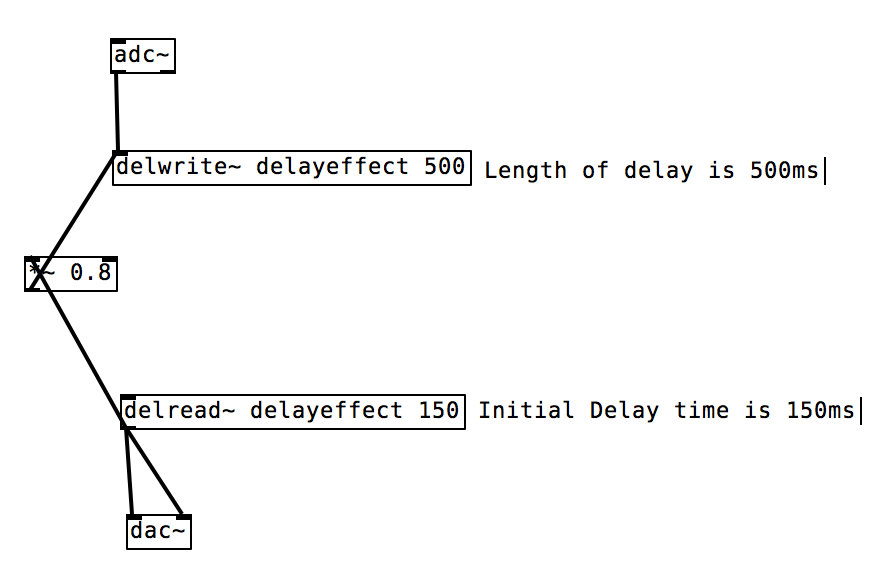

Figure 1: Delay Effect Pd

2.2.3 Fuzz Effect in Pure Data

Our team designed a guitar fuzz effect to implement a distortion effect on the guitar signal. This effect creates the sound of a more processed or artificial guitar. Here, the guitar signal is passed through an ADC object, and continues on to a gain to be multiplied by a factor of 40. Next, the signal is passed through a clip object, which restricts the signal to lie between two limits, -0.5 and .05. The signal is finally converted back to an analog signal through the DAC object.

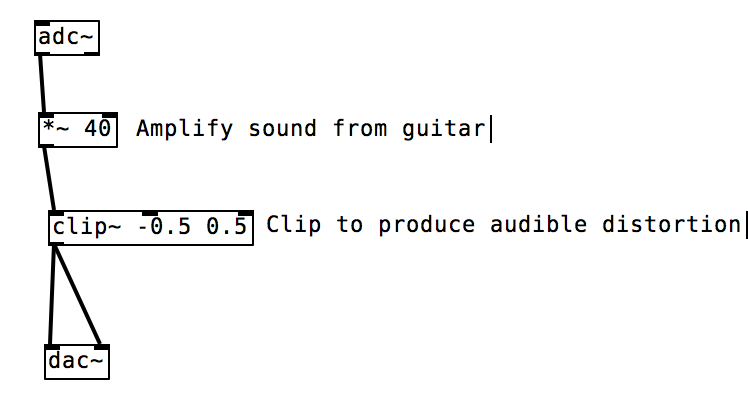

Figure 2: Fuzz Effect Pd

2.2.4 Reverb Effect in Pure Data

Our team designed a reverb guitar effect, which mirrors a large number of reflections of the signal to build up and then decay. The guitar signal is first sent through an ADC object, and subsequently sent to a ‘freeverb\~’ block which uses the Schroeder and Moorer model for reverb. The guitar signal is finally sent to both outputs of the DAC object, which allows for the production of the reverberated sound. There are many controls associated with the reverb that allow users to manipulate the sound of the effect. The ‘roomsize’ block allows the user to slide from a range of 0 to 1, creating a smaller or larger simulated room size. The ‘damping’ block slides from 0 to 1, affecting the dampness of the objects within the simulated room. The ‘wet to dry’ slider controls the amount of reverb applied to the dry, or untouched signal. The freeze toggle allows the user to grab the real time tail of the reverb and apply the sound continuously. The bypass toggle allows the user to turn the effect off, and pass through a completely dry guitar signal. These toggles serve as a convenient aid throughout the testing process.

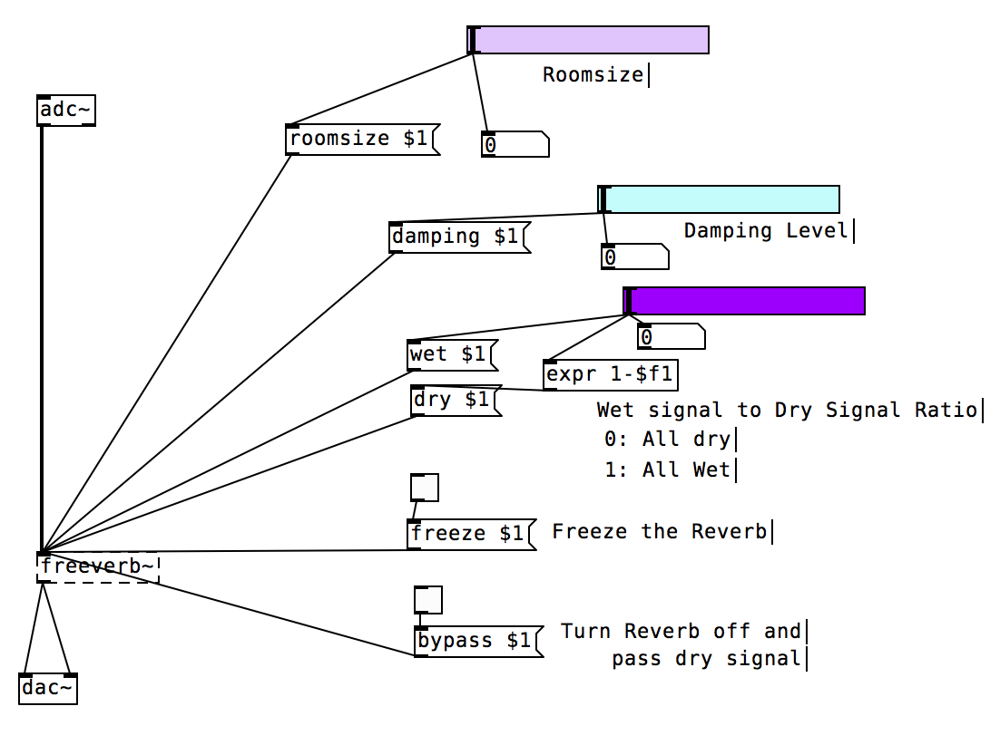

Figure 3: Reverb Effect Pd

2.2.5 Spectral Delay Effect in Pure Data

Our team designed a spectral delay effect to scatter the original guitar sound, allowing one to hear all the partials (harmonics) ringing at different times. This effect creates the sound of a repeated, echoed guitar signal. In this patch, the fft of the incoming guitar signal is calculated and used to cut the sound into very thin frequency bands. A different, user controlled delay is then applied to each of these bands before resynthesis. If the length of the delay lines vary greatly from one frequency band to another, the ringing effect of each harmonic becomes more apparent. Here, the guitar signal is passed through an ADC object, and continues on to a Pd block containing user controlled sliders. Each slider allows the user to specify the amount of delay, feedback, and gain instated. The user is also able to control the cutoff of the low pass filter applied, as well as how wet or dry the signal should be. Next, the signal is passed through an equal power crossfade object, which allows the overall volume to be maintained through the crossfade. The signal is finally converted back to an analog signal through the DAC object.

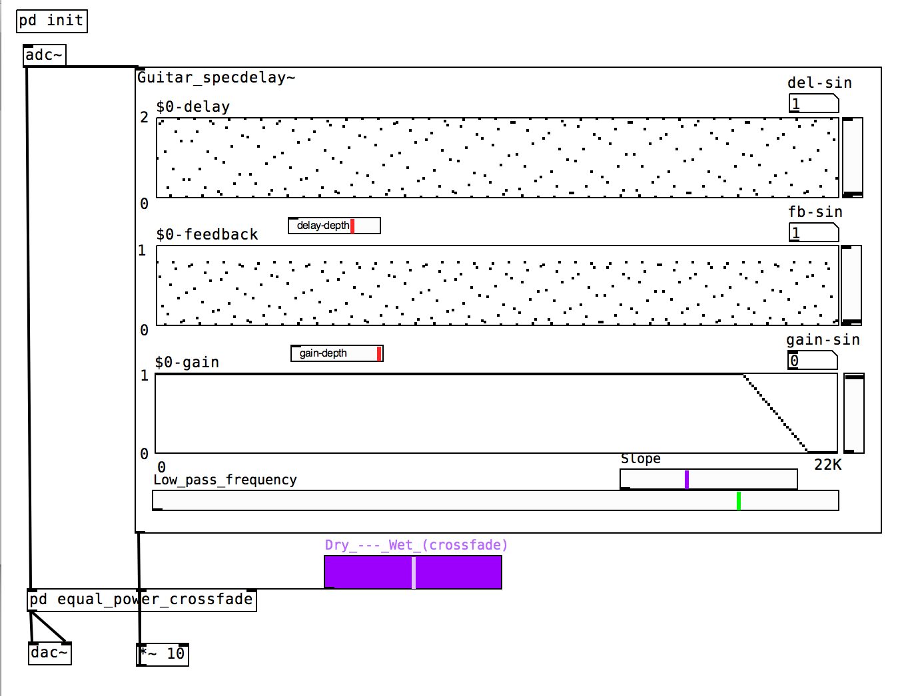

Figure 4: Spectral Delay Effect Pd

3.0        Chapter 3: Dynamic Time Warping 

3.1 Dynamic Time Warping (DTW)
        Dynamic Time Warping is an algorithm for the measurement of similarity between two temporal sequences, which may vary in speed. The algorithm calculates an optimal match between two given sequences in the form of a distance that is the sum of localized cost functions. The process can be thought of conceptually as arranging the two sequences on the sides of a grid. Each cell within the grid will be filled in with a distance measure comparing the corresponding elements of the two sequences.  This measure can be just subtraction of one sequence from another, but more often each cell is computed by more symmetric measures like the square of the difference.  In order to find the best path through the grid, we search for a path that minimizes the total distance between them.  The procedure for finding an overall distance measure  is to find all the possible routes through the grid and calculate the total distance for each.  Note that because we are looking for a minimum length path, each routes total distance is the minimum of the sum of distances between individual elements on the path divided by the sum of the warping function.  Most instances of the DTW algorithm share common optimizations. The most obvious is known as the monotonic condition, which simply stated is the rule that the path will not turn back on itself and therefore the indexes of the matrix must either remain the same or increase during each subsequent iteration. Further, examining the literal definition of a path, the elements selected must to some degree border each other, and so the indexes may only increase by 1 from each element of the path to the next. Another commonality in DTW algorithms is the boundary condition, which requires that the path must begin at the intersection of each sequence’s respective first elements and end on the intersection of each sequence’s respective last elements. Some other optimizations are common but not integral, for example, the adjustment window condition postulates optimizations to keep the path from wandering too far from a diagonal through the grid, which while sometimes a critical flaw, usually results in huge computational efficiency gains. Another such optimization is a slope constraint which ensures that particularly long sequences aren’t matched with short sequences, but this can result in inaccuracies if one of the signals was particularly dilated or contracted in time.  Since this technique has been at the forefront of comparing temporal signals since the 1980s, the list of variations on the classic algorithm is extensive.
3.2 Why Dynamic Time Warping is a Good Choice for Effect Triggering
        In the more simplistic counting approach employed, the guitarist is required to replicate the performance both faithfully in time and in accuracy. Small inaccuracies in either metric could easily cause the triggering scheme to miscount out of our predetermined range. DTW is a suitable alternative because it is relatively insensitive to time-scale contraction or dilation in either the database or query signals. Further, even if the performer makes numerous mistakes in the performance, as long as the section is the closest match to the database sequence the program will consider it a match. This robust algorithm can be proven time in and time out by any speech dictation software where the tolerance for difference between the two signals is astounding. Moreover, when considering different musical feature measures, the methods of comparison differ depending on the musical feature with some necessitating convoluted applications such as neural networks. Even more demanding is the need to combine different features in a useful way. Dynamic Time Warping works as an accurate comparison between features so long as they are structured in time (even if the information they convey is in frequency). In addition, because the features considered for a DTW algorithm are set in time, if one were to choose to track multiple features concurrently, (no longer necessary in the context of DTW) it would likely be simple to correlate detected matches between different features by a simple timing threshold. Following this train of thought, one could set the effects platform to trigger on or shortly after the occurrence of the secondary detection, allowing the system to virtually guarantee the absence of preemptive triggering. As if these arguments were not persuasive enough, another benefit of DTW is that if the system were to require multiple ‘database’ performances, then section specific DTW-distance thresholds could be set for each part of a song as to ensure accuracy for multiple trigger events or different effects triggered on different instances of specific recurring parts of a song. Most importantly, because of the extensive resources already invested into the DTW algorithm, there is a wealth of optimization options and configurations that enable computationally efficient approaches to be selected based on the needs of a specific application.

4.0        Chapter 4 Implementation

4.1 Introduction
        When designing the system for the project, the group learned that there were many different methods to approach the problem. Hardware, software platforms, and analysis methods were components that had to be carefully chosen to meet the full demands of the system. When designing the structure for the project, the group went through many approaches before settling on the final architecture. The various criterion that needed to be met entailed challenges such as mobility, robustness, speed, and usability.
4.2 First Approach
        The first approach consisted of using a physical component that would offset and amplify the guitar signal, an external ADC, and a raspberry pi. The physical component was required because the signal of an electric guitar fell within the millivolt range, and the external ADC operated with a minimum of 1 volt. Signals coming to the electric guitar would be fed through the component and then onto the ADC. The raspberry pi would then read the discretized signal through a python program. When the system detects a trigger event, it would output a signal through the built in DAC and trigger a physical guitar pedal. This approach was dismissed due to the unnecessary use of a microcontroller and physical effect pedals. To perform signal analysis, it is important to use a CPU with a fast enough processing speed. Although the raspberry pi has one of the fastest processing speeds on the market, it still falls short to the speed a laptop can provide.

4.3 Python Implementation
        For the next approach of the system, a laptop and a quarter-inch to USB adapter was to be used in lieu of the raspberry pi and external components. Python, due to the large number of available libraries, was chosen for this implementation. Numpy, Scipy, and Matplotlib, are mathematical libraries that allow Python to perform MATLAB like operations. To test the speed at which Python performed analysis on a live signal, a test module was created to read in input from a microphone. Using the aforementioned data science libraries, various audio analysis techniques were performed on the signal. The incoming signals were first stored in arrays of size 4096 samples. The data was then converted from bytes to integers so that operations could be performed on the signal. To visualize the operations, we plotted the live signal, the real time Fast Fourier transform, and the zero crossings on the same window. While running the program, the group noticed many issues, the first being the latency between the plots. This was to be expected due to the sequential nature of Python. Another pitfall to this approach was the low resolution of the signal. An approach to amend this issue was to increase the sample size. However, once the sample size was increased, there was an increased drop in the frames per second of the plot. All in all, while python was able to perform analysis on the signal, the team did not view this system to be an adequate approach.
4.4 Pure Data Design
        Pure Data (pd) is an open source visual programming language designed for audio and music manipulations. It was first released in the mid 1990’s by Miller Puckette with simple audio manipulation objects. Since then, many iterations of the program have released along with dozens of complex modules contributed by open source users. With its modular design, users can create their own pure data objects or ‘externals’ with the programming language of their choice.  Pure Data was chosen as the platform to build the system on because of the simple visualization of data flow, processing capabilities, as well as the large library of pure data objects.

A block diagram of the group’s first implementation can be seen on Figure 5 below. The approach for the basic system was to read signals coming from the quarter inch to USB adapter using the ADC object of Pd. It was decided that digital effects would be used in lieu of a physical guitar pedal as the costs were above the project budget. A low pass filter is applied to the signal because the fundamental frequencies of an electric guitar do not extend beyond 400 Hz. The signal is then fed through the ‘fiddle’ object. Fiddle converts the pitch of the audio signal to MIDI. This is a useful feature as it allows the ease use of mathematical operations. Using comparator operators, the system can count the instances of a specific note and trigger an effect once it reaches a predefined threshold. In testing the program, ‘Mary Had a Little Lamb’ was tested as it does not contain any complex chords. The MIDI value of 76 was verified with comparators. A counter was built and attached to count the number of times the comparators returned a true statement. Once the count had reached a value of 12, the delay effect was triggered. This was accomplished by using the ‘moses’ object. ‘Moses’ acts like an ‘if else’ statement. If the incoming value is below the threshold, it sends a trigger to the left, or dry output. When the value is greater than or equal to the threshold, it sends a trigger to the right, or effect output. In the design, when the value is below the threshold, the input goes straight to the DAC. When the trigger conditions are met, the signal is first fed through the delay effect before the signal is passed through the DAC. Upon testing our system with ‘Mary Had a Little Lamb’, we were able to successfully trigger the guitar effect. 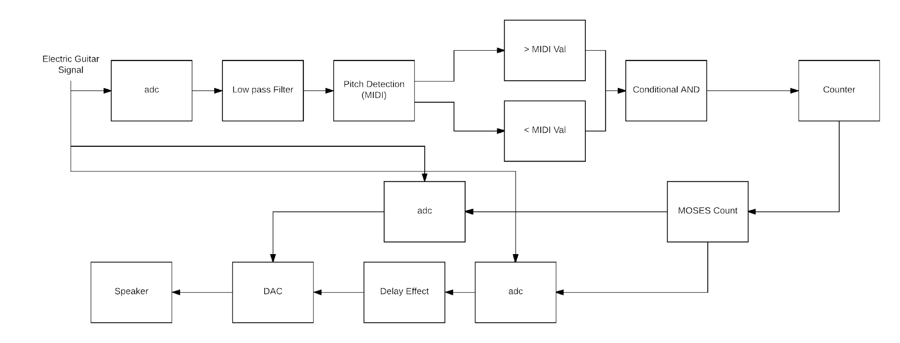

Figure 6: Block Diagram of Basic Trigger PD Patch

        After evaluating the test results, the group noticed several issues with the implementation. The first of which was that the system was sensitive to performance speed and articulation. When the the user articulated a note for too long, the ‘counter’ block would continue to count up even though the note was played only once. This lead to inconsistencies in count accuracy. In testing our system, the group found that the system would trigger at the correct timing 60% of the time. One of the goals of this project was that the system should handle up to 10 note onsets per second. Currently, the system is capable of handling up to 10 notes albeit there are inconsistencies due to sensitivity issues. To resolve this issue, the group plans on narrowing the range of MIDI values to check for. Another issue with this implementation is that similar songs may trigger an effect configured for a specific song. For example, if the program is configured for ‘Mary Had a Little Lamb’, playing ‘London Bridge is Falling Down’ may trigger the system. This is due to the fact that ‘London Bridge is Falling Down’ contains many of the same notes as ‘Mary Had a Little Lamb’. One final issue is that this system is geared towards handling 1 note at a time as opposed to chords. The reason for this is that the fiddle object looks at the highest peak when looking at the FFT of the signal. When fiddle reads in a chord, it finds the highest peak of the signal in the frequency domain and uses that point to convert to MIDI. The group decided to resolve these issues with the implementation of Dynamic Time Warping.

4.5 Dynamic Time Warping Implementation

        In order to gain a better understanding of Dynamic Time Warping, the group created its own implementation of DTW based on a source found in the research phase. The way the proposed system works is that the system takes in the points of stored signal and places them on the leftmost column. The points of the incoming signal being compared to are then placed on the bottom most row. A matrix is then generated based on the symmetrical distance of the 2 signals. The symmetrical distance is the difference squared of the points of the two signals. An example can be seen in Figure 6 below.

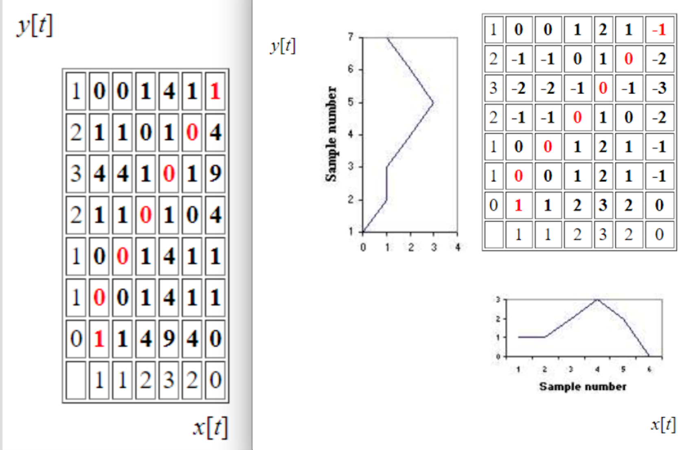

Figure 7: Dynamic Time Warping

For each cell, the cost of arriving at the cell from the bottom, left, and bottom-left is calculated. On the point (2,2) of Figure 7 below, it costs 2 units to arrive from the bottom cell because the bottom cell’s lowest value plus the current cell value is 2. It costs 1 to arrive from the left because 2 + 0 = 2. It costs 1 to arrive from the bottom left because 1 + (½)\*0 = 1. After calculating the costs for each cell, the least cost path can be determined. To find the least cost path, one must make three assumptions. The first is that the path always begins at point (1,1) and end at the upper right most cell. Secondly, it is assumed that the least cost path should lie along the diagonal of the matrix, so diagonal movement should be favored over lateral movement. The group handled this in the implementation by reducing the cost of diagonal movement by 50%. Finally, the third assumption is that because time moves forward, one should never move backwards to find the least cost path. Calculating the least cost path involves starting at the upper right most cell and working backwards to the starting cell. The path chosen should be the cell with the lowest cost of arrival.

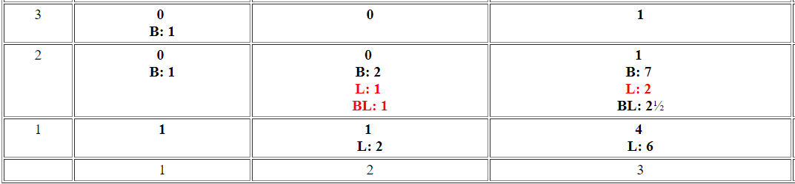

Figure 8: Cost Arrival Per Cell

The java implementation of this approach and the corresponding code can be seen in the appendix below. Figure 8 below displays the two example test cases that were processed into the system and tested.

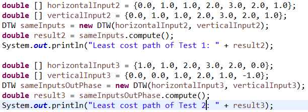

Figure 9: Signals Tested for DTW Implementation

The first scenario tested involved two identical signals being compared against each other. Since the points being checked are exactly the same, a least cost path of zero can be expected. The second test scenario involved two different signals of the same length. This test case should result in a non-zero value. Manually calculating the least cost path of this test case, the group determined a least cost path value of 5. After running the program, the system printed the results shown in Figure 9 below.

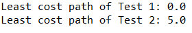

Figure 10: Java Implementation Results

Comparing the actual results with the expected, it can be seen that the group was successful in the implementation of dynamic time warping.

4.6 DTW in Pure Data

Since Pure Data does not have a dynamic time warping pure data object, the group had to create its own. The tools needed to accomplish this task was CodeBlocks (IDE) and the pure data source code. C was the programming language of choice as it was the industry standard. The basis algorithm for the system would consist of a ‘learning’ phase and a ‘live’ phase. In the ‘learning’ phase, the user would feed sub signals of a song and the system would calculate the dynamic time warping least cost path between the first sub signal against all other sub signals. In the ‘live’ phase, the system would listen to an incoming signal, fiddle midi data, and perform dynamic time warping on the live against one of the recorded signals. Figure 10 below displays the pd patch created in order to record and store sub signals.

        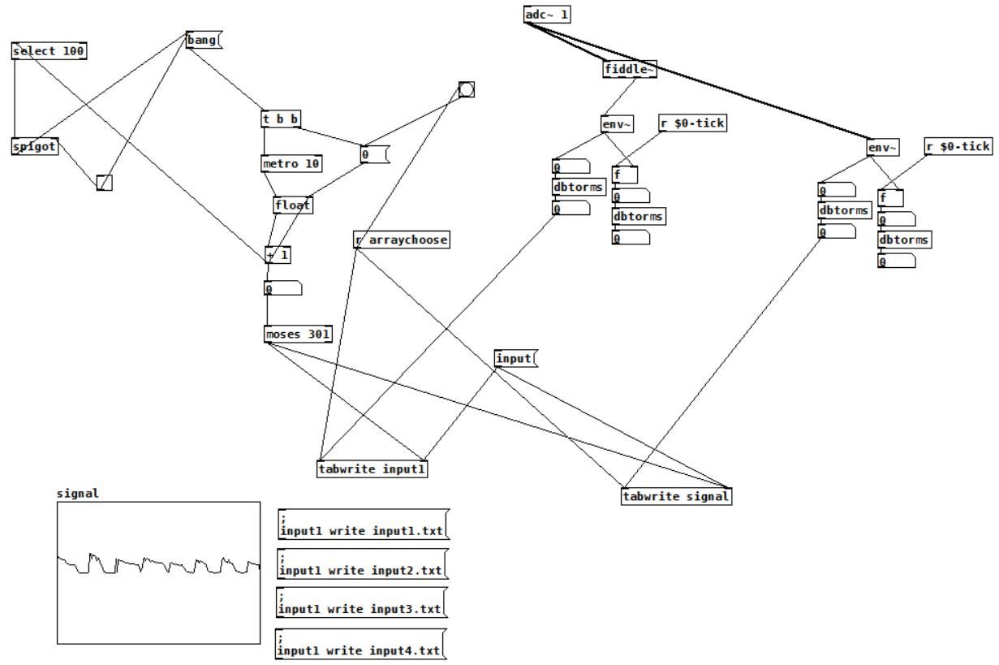

Figure 11: PD Patch to Save Sub Signal Recordings

The first step was to include the pd header file into our CodeBlocks project file. A ‘struct’ was generated as it served as the object instance of our external. We defined three inlets, A bang and 2 float inlets. The bang inlet’s purpose was to calculate the least cost path of the signal in the recording phase. The first float inlet’s purpose is to receive the incoming signal from the adc object. Pure Data has a sample rate of 44,100Hz and the fiddle object produces a midi value based on the most recent 1024 samples. Effectively, our object should be able to read in a value every 22ms. The second float inlet’s purpose is to receive the float value that defines delay triggering time. An outlet was also defined so that it would send out a bang when a match between the signal works.

                The first phase of our system is the ‘learning’ phase. When the bang inlet is pressed, the system reads in 4 recorded signal data files from the path of the project. Input 1 was defined as the reference signal, meaning it is the input that will be used to compare all other signals. The system was set so that it could handle data of size 300 samples. Calculating the dynamic time warping least cost path, follows a similar approach as to the group’s java implementation. The only main difference is that it cannot compare signals of different sizes. Once the least cost path has been calculated 3 times between input 1 and the other recorded signals, the average least cost path is calculated. This will serve as the threshold to compare the incoming signal to.

                During the ‘live’ phase of the system, the incoming signal is read through the first float inlet. When an input is detected, the incoming float value, is stored in a temp array. The system then checks if the array is filled with values. If it is not filled, the system changes the index and waits for another float input value. If it is filled, the system performs dynamic time warping against the signal stored in the temp array and input 1. Should the least cost path be equal or less to the average least cost path, the system outputs a bang signaling a match. That would then in turn trigger the guitar effect. If the lcp value is not less than or equal to the avg lcp value, then the system waits for another input. When the input is received, the temp array shifts all of its value so that its oldest value is removed and new value is stored. The new temp array is then once again compared against the stored signal. This process repeats until a match is detected or if the user exits the program.

                The completed pure data object can be seen in Figure 12 below. In order to test the system, the group created a pure data patch that would activate the reverb effect when a signal match was detected. Figure 13 below displays the actual patch used for testing. The group found that the system would trigger very precisely when individual notes. To verify that the group met the original specification of less than 1 second latency, a timer was added to the program to record and print the time (seconds) it took to perform dynamic time warping. It was observed that the actual calculation only took 1 - 2 milliseconds. When chords were used to test the system, the triggering produced very inconsistent results. In order to alleviate this issue, the threshold was changed so that the effect would be played if the calculated least cost path was less than or within plus five percent of the original threshold. Through these testings, the group was able to fine tune the object until results met the groups satisfaction.

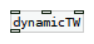

Figure 12: Generated Dynamic Time Warping PD Object

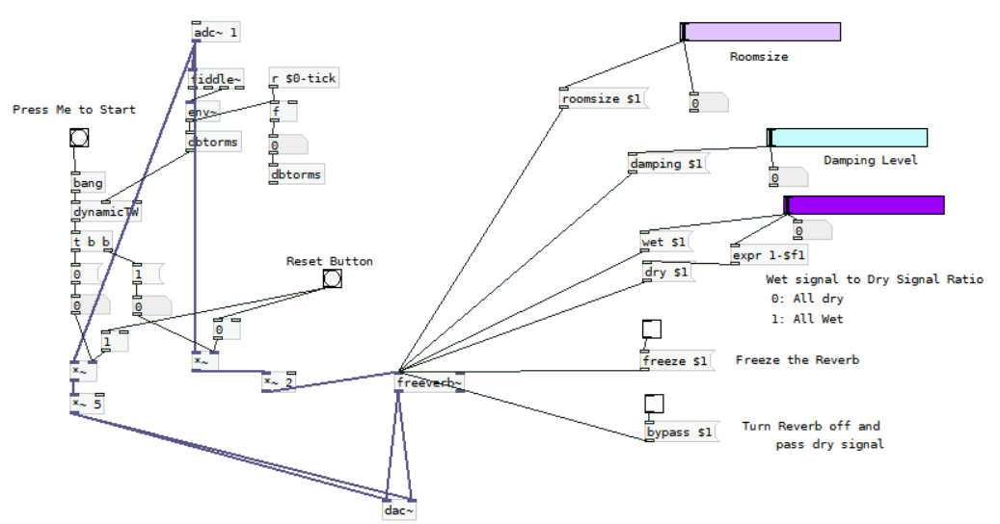

Figure 12: PD Patch to test ‘dynamicTW’ object

5.0        Chapter 5: Testing and Validation Execution

5.1 Methods of Functionality Testing

When the group first started working on this project, the team laid out project goals to accomplish by the end of the second semester of senior year. The team wanted to develop a software platform to analyze a sequence of note when instructed. The system should trigger on a designated instance that occurs multiple times throughout a song. Latency should also be minimized to 1 sec as to not disrupt the performer. In addition, the system must process sequences up to 10 note onsets per second.

        In order to validate that the group was successful in creating a software platform that would analyze a sequence of notes and trigger guitar effects when instructed, the developed a variety of tests. The plan was to feed in different types of guitar subsequences. These include sequences of single notes and sequences of chords. The tests would be deemed successful if the system is able to trigger guitar effect after the sequence instance is played.

        The group also needed to test if the system could trigger on a designated instance rather than just at the first instance. The plan to test this  was to use a subsequence that would be played multiple time throughout a song. Verifying the latency between signal detection and triggering was trivial. The group used the C library “time.h” in order to record the system clock time just before the dynamic time warping function is called and once again after the triggering occurs. Taking the difference between the two recordings would result in the total latency of signal detection and latency. Determining if the system is able to handle 10 note onset per second was also simple. The group would take the sample rate of pd, which was 44,100, and divide it by the number of samples fiddle takes in.

        The first sequence tested was a riff, which is essentially a sequence consisting of single notes. The sequence was from Superstition by Stevie Wonder. First the team recorded four sequences of the riff, and the average dtw least cost path is then calculated between the first recorded signal and the other three signals. The average dtw least cost path is then set as the threshold of the system. The ‘dynamicTW’ object then listened to the incoming guitar signal. Once enough data had been received, the system began calculating the least cost path of the incoming signal againsts signal one of the recorded signals. Bryan, the performer for this test, played the specified riff. It was apparent that the system triggered the guitar effect just as the riff sequence had finished being played. This proved successful functionality of our system for sequences with one note occuring at a time.

The next sequence tested contained chords. The same process as the riff was used in order to validate the system. On the first playthrough of the sequence, the system was not able to detect the chord sequence. Observing the console output of the system, it was noted that the calculated dtw least cost path value of the live sequence came very close to within ten percent of  the threshold set by system. The group tried once again to test the chord sequence, but on this test instance Bryan, played at a slightly slower rate and the system was able to detect the chord sequence. It was observed that the system is more sensitive to chords and the performer needs to play more consistently and be in line with the performance of the recorded sequences.This sensitivity to the performer’s attack on the guitar strings can be mitigated by a more consistent performance by the performer.

5.2 Methods of Specification Testing

To validate if the system could handle triggering effect at a designated instance, the group chose to use the song Superstition because it contained sequences that occured frequently. Repeating the process of testing as the chord and riff sequence, the group found that the system was not able to trigger on the designated instance. The system was only able to detect the sequence at the first instance, rather than at the designated instance. The reason for this was because the system was not built to handle this feature. The group, for the majority of the semester, was heavily involved in getting the detection of the sequence to function. Once the group accomplished this task, the team attempted to incorporate this feature into the project but ultimately due to time constraints, the feature was not incorporated.

As previously mentioned, determining the latency was trivial with the use of the “time.h” library. To reiterate, the group recorded the system clock right before the dynamic time warping function was called and once again after the triggering of the effect occurred. The difference between the two signals, should result in the latency of signal detection and triggering. The latency was outputted to console and it was observed that the latency was between .001 to .002 seconds which was far below the project specification. To verify the 10 note onset per second specification, we utilized the pure data sampling frequency and divided it by the number of samples required by fiddle, which was 1024. This results in a value of approximately 43-44 notes played per second.

5.3 Realistic Constraints Testing

        In order for the system to be marketable, none of the effects we create can be allowed to amplify a signal to amplitudes that might be hazardous to the amplification circuitry. It is for this reason that for example, in our Fuzz effect, the bounds of the clip are very tight. Another constraint is the volume of the output, which is desired to be between 20 dB and 65 dB however this is a constraint on the amplification rather than the triggering platform. Further, our system requires a computer running a windows operating system, limiting the situations in which it can be utilized. Another constraint is the system’s current inability to interface with analog guitar pedals in the current state of development. This platform is constrained by the trigger latency of 2ms and the minimum note onset separation which is 43 notes per second, both of which are well within the workable range that our team established at the onset of this project. These constraints are based on the assumption of a computer with more than ample processing speed which may become a constraint if a user computer does not have adequate processing power. Finally, the system is constrained by a tradeoff between query sequence length and computational speed, all of the parameters provided above are based on the assumption of three second long trigger sequences and windows of 300 feature samples of the live input shifted by one feature sample per iteration.

6.0        Chapter 6: Conclusion

6.1 Core Intent

This project serves to automate the process of guitar effect triggering. In order to simplify tasks for the performer, our device records the effect trigger points, and executes the procedure with no manual interjection. The design streamlines the duties of the performer, and creates a more interactive experience for any potential audience. Our team’s current model successfully achieves the task of automatic ‘on’  triggering. The methodology involves the DTW process defined in Chapter 3.3.

6.2 Results Achieved

This semester, the team generated tangible results such as a functional prototype of the final design, as well as the creation of pure data digital effects. Before settling on the final architecture, there were several architectures that were tested. The initial approach of the system called for the use of the Raspberry Pi and an external guitar pedal. This approach was quickly dismissed as the processing speed of the raspberry pi was insufficient. Furthermore, the physical guitar pedals that contained the required interface were beyond the project budget. Realizing these drawbacks, the team replaced the raspberry pi with a laptop, and opted to use digital effects over physical effects. This iteration called for the use of Python and several external libraries. Python is capable of handling various digital signal processing techniques, but the data resolution is insufficient. The current iteration of the system called for the use Pure Data in lieu of Python. A complex prototype of the system was generated and tested. Single notes can be read using the fiddle object of Pure Data. Using various comparators, the team was able to set a trigger to activate an effect if all  conditions were met. The song ‘Superstition’ by Stevie Wonder was tested for the current implementation of the system. Calculating three DTW distances, finding the average of the three, and padding this average with a tolerance gave the ability to reliably match the live performance to the primary performance.Through the testing and project demonstration phases, it is shown that the implementation is fully functional.

6.3 Possible Modifications (changed from expectations and modifications)

The obstacle of developing a software platform that digitizes the guitar signal, analyzes a sequence of notes played in time and triggers guitar effects as intended has been overcome. It is important to note, however, that the current platform is programmed to trigger at the first instance of a calculated match.

Due to the prohibitive cost of effects pedals, Pure Data serves as a cost effective alternative to preprogram a sequence of effects to a pre-recorded guitar signal without the use of a stomp box. Future implementations could involve a physical guitar pedal effect, where the effects are integrated seamlessly into the system. This addition could include the ability to control the volume level of different performers in relation both to each other and the current section of a song.

The most promising approach to the aforementioned pitfalls is a technique known as subsequence dynamic time warping. For the purposes of signal comparison between performances, the sequences to be compared may have a significant difference in length. Instead of aligning these sequences globally, it is imperative to find a subsequence within the longer sequence that matches the shorter sequence. For example, assuming that the longer sequence represents a database to be searched and the shorter sequence an incoming performance, our objective is to identify the subsequence within the database that is most similar to the incoming signal.  Influenced by the work of [21] (Muller, M), an algorithm for match detection can be reverse engineered from the subsequence list generator. It is presented below in a combination of mathematical notation and algorithmic pseudocode.

Let X = (x1,x2,...,xN) and Y = (y1,y2,...,yM) be midi sequences from the Pure Data Fiddle object, where M\>\>N(this means that Y is the database sequence).Next, a local cost function ‘c’  is assigned to each element of the DTW grid. At this point the algorithm must find a subsequence Y(a∗ : b∗) := (ya∗,ya∗+1,...,yb∗) that minimizes the DTWdistance to our incoming signal over all possible subsequences of the recorded feature sequence.

Algorithmically speaking that is:

(a\* ,b\* ):= argmin (DTW (X,Y(a:b) )       

The indices a∗ and b∗ in addition to the least cost alignment possible between the incoming signal and the subsection Y (a∗ : b∗) of the stored performance can be computed by a modification of the standard DTW algorithm.

 In order to select a path of least resistance ‘p∗’, naturally one would have to calculate every conceivable path through the grid. Unfortunately this requires computational complexity that grows exponentially in bounds N and M. This process can be optimized to an O(NM) complexity computation. In a broad sense, the concept is to penalize paths between the database and the query that match the query to indices near the beginning or end of the database as to avoid a one to one match between signals.

Algorithm: (Accumulated cost matrix and DTW-distance)

Instantiate sequences:  X(1:n) = (x1,...xn) and Y (1:m) = (y1,...ym)

Set

D(n,m) = DTW(X(1:n),Y (1:m))

D(n, m) is a N × M matrix ‘D’ called the accumulated cost matrix . A tuple (n, m) representing a matrix entry of the cost matrix ‘C’ or of ‘D’ will be referred to as a cell.

D satisfies the following:

D(n,1) =Σ (from k=1 to n) c(xk,y0) " n ∈ [1 : N]  

D(1,m) = c(x0,ym) "m ∈ [1 : M]

D(n,m) =  argmin{D(n−1,m−1),D(n−1,m),D(n,m−1)}+c(xn,ym) " n ∈ [2 : N] and m ∈ [2 : N]

One can also define an extended accumulated cost matrix:

Setting:

D(n,0) = ∞ "  n ∈ [0 : N]

D(0,m) := 0 "  m ∈ [0 : M].

The index b∗ can be determined from ‘D’  :

b∗ =argmin {D(N,b)}

To determine the starting index of the subsequence a∗ and the optimal warping path between the stored and incoming signals.

Input: Accumulated cost matrix D.

Output: Optimal warping path p∗.

The optimal path p∗ = (p1, . . . , pL) is computed in reverse order of the indices starting with pL = (N,b∗).

Suppose pl = (n, m) has been computed. In case (n, m) = (1, 1), one must have l to 1 and we are finished.

Else:

pl−1 =

"n = 1 : ( 1 , m − 1 )

"m=1 :(n−1,1)

else: argmin{D(n − 1, m − 1), D(n − 1, m), D(n, m − 1)}

a∗ is the maximal index such that pl = (a∗,1)

All elements of the stored sequence ‘Y’ left of ya∗ and right of yb∗ are excluded from consideration and do not incur additional costs.

The optimal warping path between X and Y (a∗ : b∗) is given by (pl,...,pL)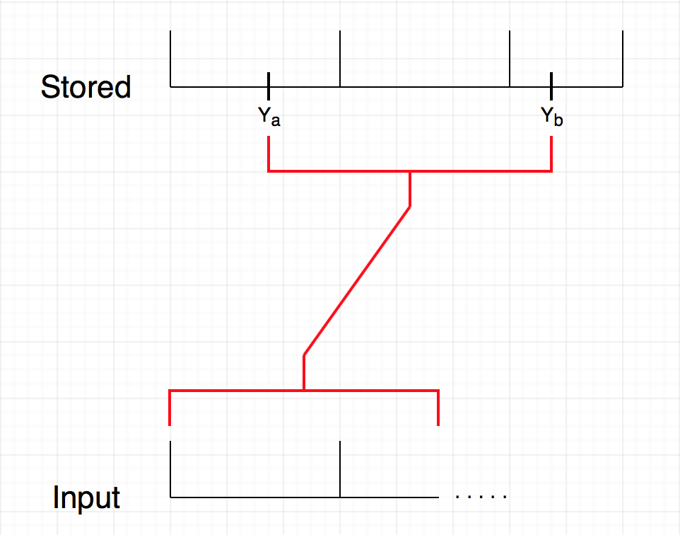

Figure 5: Database Subsequence Match against Incoming Sequence

‘D’ can be used to generate a list of subsequences of incoming signal that match the recorded trigger point.

Create distance function :

∆ : [1 : M] → Real                        ∆(b) = D(N,b)

∆ assigns to each index b the minimal DTW distance ‘∆(b)’ attainable between the stored sequence and the subsequence of the incoming signal that ends on index b.

 "b ∈ [1 : M], the DTW-minimizing ‘a’ ∈ [1 : M] can be computed  starting with pL = (N,b).

 If ∆(b) is small  \$b ∈ [1 : M] and if a ∈ [1 : M] denotes the corresponding DTW-minimizing index, then the subsequence Y (a:b) matches the incoming section

Input: incoming signal X = (x1,...,xN), database sequence = (y1,...,yM),

 cost threshold: ‘τ’

 Output: Ranked list of matches between incoming signal and subsections of database that have a match to the input below the threshold τ

Algorithm: (Match list tracker)

1.)Ranked list must initially be empty

2.)Calculate D  

3.)Calculate distance function ∆  using ∆(b) for each subsequence of the database ‘Y’

4.)Select minimum b∗  of∆.  

5.)If ∆(b∗) \> τ then a match has been detected.

6.)Calculate corresponding  match-subsequence index a∗ ∈ [1 : M]

7.)add subsequence Y (a∗ : b∗ ) to ranked list

8.)Set ∆(b) = ∞  "b within a suitable neighborhood of b∗  

9.)Continue by calculating the next minimizing index until input ends.

The rule ∆(b) = ∞  is intended to exclude an a region bounded by the nearest local maximums to b∗ from computation. This prevents a match list that contains many subsequences that differ by only a slight shift.

This approach is a feasible solution because rather than scanning the song for a trigger sequence it would create a database for every user defined section of a song. This would allow the system to track the live status of the performance in real time rather than waiting for the right input to gauge where in the performance the guitarist is. Because of the sectionally specific subsequence length matching, this approach would also yield more accurate matches as the section of music being analized would not be based on hardcoded window lengths.  Most importantly this technique is built entirely on the framework of the algorithm we implemented and therefore would only require expansion of the code as opposed to a full out overhaul of the system.

Potential modifications to this platform include but are not limited to any control action as the result of the reading in of an audio sequence. For example, one could use the audio signal of virtually any instrument to control stage lighting, or advance a musical score for a symphony. It is also possible to design a physical hardware kill switch that temporarily suspends the program, allowing the musician to improvise and then jump back into the song without throwing off the system. If time permits, this system could even be expanded to include hardware effect pedals that are integrated seamlessly into the system or to control the volume level of different performers in relation both to each other and the current section of a song.

        

List of References:

[1] Rouse, M. (2005, April). What is MIDI (Musical Instrument Digital Interface)? - Definition from WhatIs.com. Retrieved December 10, 2017, from http://whatis.techtarget.com/definition/MIDI-Musical-Instrument-Digital-Interface

[2] Fast Fourier Transform Tutorial. Retrieved December 10, 2017, from http://w.astro.berkeley.edu/\~jrg/ngst/fft/fft.html

[3] Roos, D. (2008, March 18). How MIDI Works. Retrieved December 10, 2017, from [http://entertainment.howstuffworks.com/midi1.htm](https://www.google.com/url?q=http://entertainment.howstuffworks.com/midi1.htm&sa=D&source=editors&ust=1617010020086000&usg=AOvVaw2NET7nVCNuC2S_S8undgMG)

[4] Benjamin Bengfort, Computer and Data Scientist Follow. (2014, July 18). Beginners Guide to Non-Negative Matrix Factorization. Retrieved December 10, 2017, from [https://www.slideshare.net/BenjaminBengfort/non-negative-matrix-factorization](https://www.google.com/url?q=https://www.slideshare.net/BenjaminBengfort/non-negative-matrix-factorization&sa=D&source=editors&ust=1617010020086000&usg=AOvVaw144CTpYl5iz1eQ_uHwHaRs)

[5]  A. Stark and M. Plumbley. Real-time chord recognition for live performance. In Proceedings of International Computer Music Conference, volume 8, pages 585–593. Citeseer, 2009

[6] Nasser Kehtarnavaz. (2008 May). Digital Signal Processing System Design. LabVIEW Based Hybrid Programming.

[7] A. Ozerov and C. Fevotte. Multichannel nonnegative matrix factorization in convolutive mixtures for audio source separation. Audio, Speech, and Language Processing, IEEE Transactions on, 18(3):550–563, 2010

[8] P. McLeod and G. Wyvill. A smarter way to find pitch. In Proceedings of International Computer Music Conference, ICMC, 2005.

[9] P. McLeod. Fast, accurate pitch detection tools for music analysis. PhD thesis, PhD thesis, University of Otago. Department of Computer Science, 2009.

[10] E. Larson and R. Maddox. Real-time time-domain pitch tracking using wavelets. Proceedings of the University of Illinois at Urbana Champaign Research Experience for Undergraduates Program, 2005.

[11] E. Larson and R. Maddox. Real-time time-domain pitch tracking using wavelets. Proceedings of the University of Illinois at Urbana Champaign Research Experience for Undergraduates Program, 2005.

[12] M. Brooks. Developing visualization software for musicians. 2010.

[13] A. Dessein, A. Cont, and G. Lemaitre. Real-time polyphonic music transcription with non-negative matrix factorization and beta-divergence. In Proc. 11th International Society for Music Information Retrieval Conference (IS- MIR2010), page 2, 2010.

[14] C. Duxbury, M. Davies, and M. Sandler. Separation of transient information in musical audio using multiresolution analysis techniques. In Proceedings of the COST G-6 Conference on Digital Audio Effects (DAFX-01), Limerick, Ireland, 2001.

[15] An Interactive Guide To The Fourier Transform. (n.d.). Retrieved December 10, 2017

[16] The Scientist and Engineer's Guide toDigital Signal ProcessingBy Steven W. Smith, Ph.D. (n.d.). Retrieved December 10, 2017

[17]  Kazuki Yazawa, Katsutoshi Itoyama, Hiroshi G. Okuno, "Automatic transcription of guitar tablature from audio signals in accordance with player's proficiency", Acoustics Speech and Signal Processing (ICASSP) 2014 IEEE International Conference on, pp. 3122-3126, 2014.

[18] Introduction to Wavelet Signal Processing (Advanced Signal Processing Toolkit). (n.d.). Retrieved December 10, 2017

[19] Rioul, Olivier & Vetterli, Martin. (1991). Wavelets and signal processing. Signal Processing Magazine, IEEE. 8. 14 - 38. 10.1109/79.91217.

[20] K. (n.d.). [helmholtz\~] finds the pitch. Retrieved December 10, 2017

[21] Muller, M. (1970, January 01). Dynamic Time Warping (DTW). Retrieved December 10, 2017, from https://link.springer.com/referenceworkentry/10.1007%2F978-0-387-73003-5\_768

[22] Cq2midi – Polyphonic MIDI notes from audio for Pure Data. (n.d.). Retrieved December 11, 2017, from https://grrrr.org/research/software/cq2midi/

[23] Chordetector\_pd. (n.d.). Retrieved December 11, 2017, from https://patchstorage.com/chordetector\_pd/

[24] K. (n.d.). [Pd\~] graphical dsp programming. Retrieved December 10, 2017, from http://www.katjaas.nl/puredata/puredata.html

[25] C. (n.d.). Retrieved December 10, 2017, from [http://www.phon.ox.ac.uk/jcoleman/old\_SLP/Lecture\_5/DTW\_explanation.html](https://www.google.com/url?q=http://www.phon.ox.ac.uk/jcoleman/old_SLP/Lecture_5/DTW_explanation.html&sa=D&source=editors&ust=1617010020089000&usg=AOvVaw2VWFdNG9vu2S5M6Pshcleu)

Appendices:

Appendix A: Project Overview

Team Members:


        Ralph Quinto is a Senior studying Computer Engineering at The College of New Jersey. He is the software engineer of the group and is tasked to research for possible programming platforms. In addition he is responsible for reading electric guitar signals, creating the signal analysis patches in pure data, and triggering digital guitar effects. Post graduation, Ralph plans on entering the industry as a software engineer and eventually obtaining his master's in Cybersecurity. Ralph’s hobbies includes competing in basketball, cooking, and playing video games.


Haley Scott is a senior studying Electrical Engineering at The College of New Jersey. She is the architectural manager of this design project, handling tasks such as the research of system methods, the design and creation of digital effects, as well as project and organizational management. She will also ensure the successful integration of all project components. Upon graduation, Haley plans on entering the water and wastewater industry, and furthering her education after gaining experience in the electrical design sector of the field. In her free time, Haley enjoys playing the piano, spending time with family and friends, and playing golf.


Bryan Guner is a senior studying Electrical Engineering at The College of New Jersey. He is team leader as well as being tasked with developing a protocol for digital signal processing of the guitar signal in order to create a time-sequential record of the frequency content of the guitar signal, and a comparison between pre recorded songs and live performances. Upon graduation Bryan intends to work in industry hopefully in addition to pursuing a masters degree. Hobbies include but are not limited to: guitar, music, hockey, physics, philosophy, art, and spending time with good friends.

Engineering Standards:

        IEEE STD 730-2014 (Revision of IEEE STD 730-2002) - IEEE Standard for Software Quality Assurance Processes

-   Software utilized will meet quality requirements according to the IEEE 730-2014 Standard for Software Quality Assurance Processes

Realistic Constraints:

<table>
<col width="50%" />
<col width="50%" />
<tbody>
<tr class="odd">
<td align="left"><p>Design Requirement</p></td>
<td align="left"><p>Realistic Constraints</p></td>
</tr>
<tr class="even">
<td align="left"><p>Sound output must be loud enough to hear, between 0dB to 65 dB</p></td>
<td align="left"><p>Speakers will not produce sound over 85dB to eliminate chances of permanent hearing damage</p></td>
</tr>
<tr class="odd">
<td align="left"><p>Guitar must be connected to computer throughout recording phase and live performance phase</p></td>
<td align="left"><p>Cord must only be detached in an idle phase, not during recording or live performance</p></td>
</tr>
<tr class="even">
<td align="left"><p>Minimum note onset separation</p></td>
<td align="left"><p>Sampling rate 44.1KHz</p></td>
</tr>
<tr class="odd">
<td align="left"><p>Trigger latency</p></td>
<td align="left"><p>Processor speed, O(NM) computation, length of segment</p></td>
</tr>
</tbody>
</table>

Modern Engineering Tools:

-   Pure Data
-   Java
-   C
-   CodeBlocks
-   Excel

 

Appendix B: Project Management

Gantt Chart:

        

Time Budget

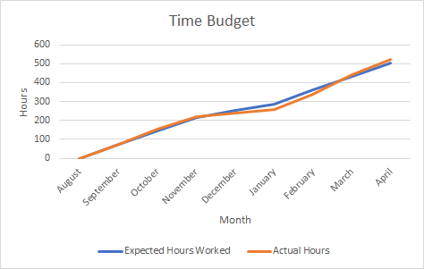

List of Contacts:

-   Ambrose Adegbege

-   (609) 771-2863
-   Adegebega@tcnj.edu

Material List:

-   Electric Guitar
-   ¼” to USB adapter
-   Computer
-   PureData

 Financial Budget

-   ¼” to USB adapter (\$10)
-   Senior Project Poster (\$82)


Project Meeting Minutes:

Meeting 1
Date:        August 30, 2017
Time:        30 Minutes
Present:        Bryan, Haley, Ralph, Dr. Adegbege
Absent:        None
Discussion Items:
•        Possible solutions for project
•        Organizational management for semester
•        Design ideas and concepts
Meeting 2
Date:        September 6, 2017
Time:        60 Minutes
Present:        Bryan, Haley, Ralph, Dr. Adegbege        
Absent:        None
Discussion Items:
•        Initial design review ideas
•        Design review 1
•        Project solutions (Logic, GarageBand, MIDI)
Meeting 3
Date:        September 11, 2017
Time:        30 Minutes
Present:        Bryan, Haley, Ralph, Dr. Adegbege
Absent:        None
Discussion Items:
•        Design review
•        Scheduling
•        Possible candidate platforms
Meeting 4
Date:        September 27, 2017
Time:        30 minutes
Present:        Bryan, Haley, Ralph
Absent:        Dr. Adegbege
Discussion Items:
•        Action items
•        Reviewed individual research
Meeting 5
Date:        October 4, 2017
Time:        60 Minutes
Present:        Bryan, Haley, Ralph, Dr. Adegbege
Absent:        None        
Discussion Items:
•        System architecture
•        Adaptive threshold concept
•        Neural network implementation
•        Low pass filter implementation
•        Python implementation
Meeting 6
Date:        October 11, 2017
Time:        60 Minutes
Present:        Bryan, Haley, Ralph, Dr. Adegbege        
Absent:        None
Discussion Items:
•        Feature identification
•        Rhythm (transient)
•        Pitch (steady state)
•        Applying our concepts to other projects (automatic scoring)
Meeting 7
Date:        October 18, 2017
Time:        30 Minutes
Present:        Bryan, Ralph, Dr. Adegbege        
Absent:        Haley        
Discussion Items:
•        Fuzzy logic
•        Dynamic Time warping
•        Implementation ideas
Meeting 8
Date:        November 1, 2017
Time:        30 Minutes
Present:        Bryan, Haley, Ralph, Dr. Adegbege
Absent:        None
Discussion Items:
•        Adaptive filtering
•        Dynamic Time warping
•        Low pass filtering
•        Pure Data
•        User interface
Meeting 9
Date:        November 8, 2017
Time:        30 Minutes
Present:        Bryan, Haley, Dr. Adegbege
Absent:        Ralph
Discussion Items:
•        LabVIEW
•        Guitar tuner
•        Binary search algorithm in matching sequences
•        Website/Wordpress
Meeting 10
Date:        November 15, 2017
Time:        60 Minutes
Present:        Bryan, Haley, Dr. Adegbege
Absent:        Ralph
Discussion Items:
•        Baseline functionality
•        Demonstrations and testing
•        Contents of final report
•        Importance of abstract
Meeting 11
Date:        November 29, 2017
Time:        30 Minutes
Present:        Bryan, Haley, Ralph, Dr. Adegbege
Absent:        None        
Discussion Items:
•        Realistic constraints
•        Final design review
•        Final report
•        Video demonstration ideas        

Meeting 12
Date: January 31, 2018
Time: 60 Minutes
Present: Bryan, Haley, Ralph, Dr. Adegbege
Absent: None
Discussion Items:
•        Semester plans and schedules
•        Progress with external for Pd
•        PDR presentation
•        Modify DTW        

Meeting 13
Date: February 5, 2018
Time: 30 Minutes
Present: Bryan, Haley, Ralph
Absent: None
Discussion Items:
•        Review PDR
•        Convert pseudocode into C
•        Design more complex effect
•        Research externals

Meeting 14
Date: February 7, 2018
Time: 30 Minutes
Present: Haley, Ralph, Dr. Adegbege
Absent: Bryan
Discussion Items:
•        Progress on effect
•        WAV file research
•        TCF preparation
•        Demonstration preparation                

Meeting 15
Date: February 14, 2018
Time: 60 Minutes
Present: Haley, Bryan, Ralph, Dr. Adegbege
Absent:
Discussion Items:
•        Reimbursement for cable
•        Roadblocks with input format
•        Progress on effect
•        Realistic constraint discussion

Meeting 16
Date: February 26, 2018
Time: 60 Minutes
Present: Haley, Ralph
Absent: Bryan
Discussion Items:
•        Code manipulation completed
•        Discussion of testing phase
•        Test procedure
•        Reimbursement not yet delivered

Meeting 17
Date: February 28, 2018
Time: 120 Minutes
Present: Bryan, Haley, Ralph, Dr. Adegbege
Absent: None
Discussion Items:
•        Progress with basic GUI
•        Testing and implementation
•        Effect progress
•        External progress

Meeting 18
Date: March 3, 2018
Time: 60 Minutes
Present: Bryan, Haley, Ralph
Absent: None
Discussion Items:
•        Poster Layout
•        Poster Content
•        Draft report
•        Modify DTW code

Meeting 19
Date: March 27, 2018
Time: 60 Minutes
Present: Bryan, Haley, Ralph, Dr. Adegbege
Absent: None
Discussion Items:
•        Testing of software
•        Celebration preparation
•        Presentation preparation
•        Reimbursement for poster

Meeting 20
Date: April 3, 2018
Time: 120 Minutes
Present: Bryan, Haley, Ralph
Absent: None
Discussion Items:
•        Software testing
•        Latency testing
•        Triggering testing and adjustments
•        Schedule planning and updates

Meeting 21
Date: April 11, 2018
Time: 60 Minutes
Present: Bryan, Haley, Ralph
Absent: None
Discussion Items:
•        Software testing
•        Software adjustments
•        Scheduling for time and budget
•        Reimbursement (1) received         

Meeting 22
Date: April 15, 2018
Time: 60 Minutes
Present: Haley, Ralph
Absent: Bryan
Discussion Items:
•        Guitar testing with simple sequence
•        Software adjustments
•        Plans for draft, final presentation
•        Planned next meeting with Dr. Adegbege

Meeting 23
Date: April 17, 2018
Time: 60 Minutes
Present: Bryan, Haley, Ralph
Absent: None
Discussion Items:
•        Software testing
•        Software adjustments
•        Testing data recorded
•        Testing with different time windows

Meeting 24
Date: April 24, 2018
Time: 60 Minutes
Present: Haley, Ralph
Absent: Bryan
Discussion Items:
•        Final report
•        Packaging of project
•        Demonstration feasibility
•        Reimbursement         

Meeting 1
Date:        April 29, 2018
Time:        120 Minutes
Present:        Bryan, Haley, Ralph
Absent:        None
Discussion Items:
•        Finalization of presentation
•        Organizational management for semester
•        Rehearsal of final presentation                                

        

Supporting Figures: Ralph


Figure 1: Fuzz Effect Pd


Figure 2: Delay Effect Pd


Figure 3: Reverb Effect Pd


Figure 4: Spectral Delay Effect Pd

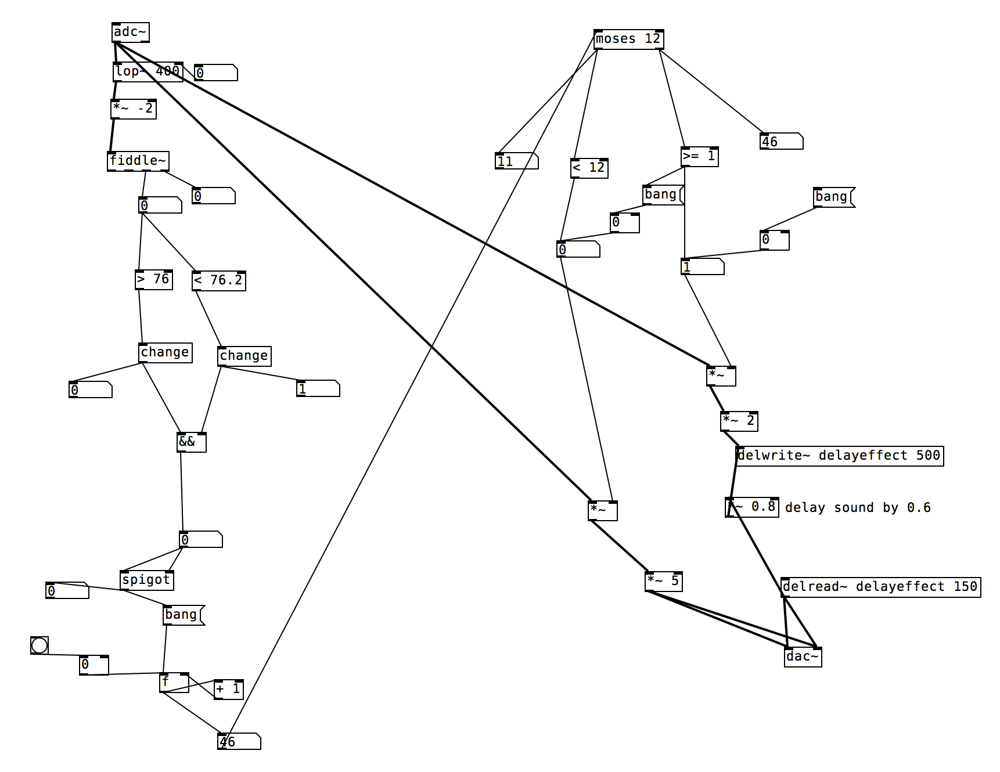

Figure 5: Pd Module


Figure 6: Simplified Pd Block Diagram


Figure 7: DTW Pd Object

Java Code of Dynamic Time Warping:


```java
public class DTW {

    private double[] horizontalInput;

    private double[] verticalInput;

   

    public DTW(double[] horizontalInput, double[] verticalInput) {

        this.horizontalInput = horizontalInput;

        this.verticalInput = verticalInput;

    }

   

    /\*

        Finds the minimum cost path to reach current value

    \*/

    private static double min(MatrixTriplet matrixTriplet) {

        return Math.min(Math.min(matrixTriplet.left, matrixTriplet.bottom),

                matrixTriplet.bottomLeft);

    }

    /\*

        This finds the squared difference of the matrix points

        Generates a 2D array and returns the symmetrical distance measure

    \*/

    private double[][] buildDistanceMatrix(){

        int rows = verticalInput.length;

        int cols = horizontalInput.length;

       

        double[][] matrix = new double[rows + 1][cols + 1];

       

        for(int i = 1; i \< matrix[0].length; ++i) {

            matrix[0][i] = horizontalInput[i-1];

        }

       

        for(int i = 1; i \< matrix.length; ++i) {

            matrix[i][0] = verticalInput[i-1];

        }

       

        for(int row = 1; row \<= rows; ++row) {

            for(int col = 1; col \<= cols; ++col) {

                matrix[row][col] = (int)Math.pow(matrix[0][col]-matrix[row][0], 2);

            }

        }

       

        return matrix;

    }

         /\*

        Finds the left and bottom initial cost values. Initialization phase

         \*/

    private static MatrixTriplet[][] buildTripleMatrixWithLeftAndBottomValues(double[][]distanceMatrix){

        int rows = distanceMatrix.length;

        int cols = distanceMatrix[0].length;

       

        MatrixTriplet[][] leftAndBottomMatrix = new MatrixTriplet[rows][cols];

       

        for(int row = 0; row \< rows; ++row) {

            for(int col = 0; col \< cols; ++col) {

                leftAndBottomMatrix[row][col] = new  MatrixTriplet(distanceMatrix[row][col]);

            }

        }

       

        leftAndBottomMatrix[1][1].left = distanceMatrix[1][1];

       

        for(int col = 2; col\<cols; ++col) {

            leftAndBottomMatrix[1][col].left = leftAndBottomMatrix[1][col-1].left

                    + distanceMatrix[1][col];

            leftAndBottomMatrix[1][col].bottom = leftAndBottomMatrix[1][col].left;

        }

       

        leftAndBottomMatrix[1][1].bottom = distanceMatrix[1][1];

       

        for(int row = 2; row\<rows; ++row) {

            leftAndBottomMatrix[row][1].bottom = leftAndBottomMatrix[row-1][1].bottom

                    + distanceMatrix[row][1];

            leftAndBottomMatrix[row][1].left = leftAndBottomMatrix[row][1].bottom;

        }

        return leftAndBottomMatrix;

    }

   

         /\*

        Finds the left/bottom/bottomleft cost values

         \*/

    private static MatrixTriplet[][] buildFinalMatrix(MatrixTriplet[][] leftAndBottomMatrix){

        int rows = leftAndBottomMatrix.length;

        int cols = leftAndBottomMatrix.length;

       

        MatrixTriplet[][] finalMatrix = new MatrixTriplet[rows][cols];

       

        for(int row = 0; row \< rows; ++row) {

            for(int col = 0; col\<cols; ++col) {

                finalMatrix[row][col] = new

                        MatrixTriplet(leftAndBottomMatrix[row][col].initial,

                                leftAndBottomMatrix[row][col].left,

                                leftAndBottomMatrix[row][col].bottom,

                                leftAndBottomMatrix[row][col].bottomLeft);

            }

        }

        for(int row = 2; row \< rows; ++row) {

            for(int col = 2; col \< cols; ++col) {

                finalMatrix[row][col].left = min(finalMatrix[row][col -1])

                        + finalMatrix[row][col].initial;

                finalMatrix[row][col].bottom = min(finalMatrix[row-1][col])

                        + finalMatrix[row][col].initial;

                finalMatrix[row][col].bottomLeft = min(finalMatrix[row - 1][col - 1])

                        + finalMatrix[row][col].initial;

            }

        }

        return finalMatrix;

    }

   

    private double compute() {

        double[][] distanceMatrix = buildDistanceMatrix();

        MatrixTriplet[][] leftAndBottomValuesTripletMatrix =

                buildTripleMatrixWithLeftAndBottomValues(distanceMatrix);

        MatrixTriplet[][] finalMatrix = buildFinalMatrix(leftAndBottomValuesTripletMatrix);

        return min(finalMatrix[verticalInput.length][horizontalInput.length]);

    }

   

    private static class MatrixTriplet{

        double initial = Double.POSITIVE\_INFINITY;

        double left = Double.POSITIVE\_INFINITY;

        double bottom = Double.POSITIVE\_INFINITY;

        double bottomLeft = Double.POSITIVE\_INFINITY;

       

        MatrixTriplet(double initial, double left, double bottom, double bottomLeft){

            this.initial = initial;

            this.left = left;

            this.bottom = bottom;

            this.bottomLeft = bottomLeft;

        }

       

        MatrixTriplet(double initial){

            this.initial = initial;

        }

    }

   

    public static void main(String[] args) {

//      double [] horizontalInput1 = {1.0, 1.0, 2.0, 3.0, 2.0, 0.0};

//      double [] verticalInput1 = {0.0, 1.0, 1.0, 2.0, 3.0, 2.0, 1.0};

//      DTW similarInputs = new DTW(horizontalInput1, verticalInput1);

//      double result = similarInputs.compute();

       

        double [] horizontalInput2 = {0.0, 1.0, 1.0, 2.0, 3.0, 2.0, 1.0};

        double [] verticalInput2 = {0.0, 1.0, 1.0, 2.0, 3.0, 2.0, 1.0};

        DTW sameInputs = new DTW(horizontalInput2, verticalInput2);

        double result2 = sameInputs.compute();

        System.out.println("Least cost path of Test 1: " + result2);

       

        double [] horizontalInput3 = {1.0, 1.0, 2.0, 3.0, 2.0, 0.0};

        double [] verticalInput3 = {0.0, 0.0, 1.0, 2.0, 1.0, -1.0};

        DTW sameInputsOutPhase = new DTW(horizontalInput3, verticalInput3);

        double result3 = sameInputsOutPhase.compute();

        System.out.println("Least cost path of Test 2: " + result3);

       

//      double [] horizontalInput4 = {1.0, 2.0, 3.0, 4.0, 2.0, 1.0};

//      double [] verticalInput4 = {5.0, 0.0, 1.0, 4.0, 2.0, 0.0, 3.0};

//      DTW differentInputs = new DTW(horizontalInput4, verticalInput4);

//      double result4 = differentInputs.compute();

//      System.out.println("Least cost path of Test 4: " + result4);

    }

}

Dynamic Time Warping PD Object C code:

\#include "m\_pd.h"

\#include \<math.h\>

\#include \<stdio.h\>

\#include \<stdlib.h\>

\#include \<stdio.h\>

\#include \<time.h\>

\#include \<windows.h\>

\#define SIZE\_ARRAY 300

\#define TEST\_SIZE 300

static t\_class \*dynamicTW\_class; //handle for the class

float recording\_array[SIZE\_ARRAY] = {0};

int arr\_position = SIZE\_ARRAY - 1;

float saveValue = 0.0;

int triggerGlobal = 0;

float delayTime = 0.0;

/\* struct to hold cost of arrival from left, bottom, and diagonal \*/

typedef struct \_leftbottom{

    float left;

    float bottom;

    float diag;

}leftBD; //typedef name

typedef struct \_dynamicTW{

    t\_object x\_obj;

    int flag; //differentiates if how result of lcp is stored

    int match; //if 0 signal does not match else matches

    float testArray[TEST\_SIZE];

    float storedSignalOne[SIZE\_ARRAY];

    float storedSignalTwo[SIZE\_ARRAY];

    t\_inlet \*in\_mod\_A, \*in\_mod\_B;

    t\_outlet \*out\_A;

    float signal[SIZE\_ARRAY];

    float lcpValue;

    float compareValue;

    float initMatrix[SIZE\_ARRAY][SIZE\_ARRAY];

    leftBD costValues[SIZE\_ARRAY-1][SIZE\_ARRAY-1];

}t\_dynamicTW; //typedef name

void checkStorage(t\_dynamicTW \*x){ //check if values being stored correctly

    int i;

    post("in check storage");

    for(i = 0; i \< TEST\_SIZE; i++){

        post("Signal 1: %f", x-\>storedSignalOne[i]);

        post("Signal 2: %f", x-\>storedSignalTwo[i]);

    }

}

void signalMatch(t\_dynamicTW \*x){

    float tenup = saveValue + (.05\*saveValue);

    float zeroValue = 0.00;

    FILE \*fp1;

    FILE \*fp2;

    FILE \*fp3;

    int j;

    if(x-\>compareValue \<= tenup && x-\>compareValue \>= zeroValue){

        Sleep(delayTime \* 1000);  //how long to delay bang in seconds;

        outlet\_bang(x-\>out\_A);

        x-\>match = 1;

        /\* add code to trigger effect \*/

        post("Incoming Signal Matches Stored Signal. compareValue is %f and lcpValue is %f", x-\>compareValue, saveValue);

        post("delay time: %f", delayTime);

        fp1 = fopen("C:\\\\Users\\\\Raki\\\\Documents\\\\GitHub\\\\dynamicTW\\\\TB\\\\save1.txt", "w");

        fp2 = fopen("C:\\\\Users\\\\Raki\\\\Documents\\\\GitHub\\\\dynamicTW\\\\TB\\\\save2.txt", "w");

        fp3 = fopen("C:\\\\Users\\\\Raki\\\\Documents\\\\GitHub\\\\dynamicTW\\\\TB\\\\save3.txt", "w");

        post("saving");

        for(j = 0; j\<SIZE\_ARRAY; j++){

            fprintf(fp1, "%f\\n", x-\>storedSignalOne[j]);

            fprintf(fp2, "%f\\n", x-\>storedSignalTwo[j]);

            fprintf(fp3, "%f\\n", x-\>initMatrix[0][j]);

        }

        post("finish saving");

        fclose(fp1);

        fclose(fp2);

        fclose(fp3);

    }

    else{

        x-\>match = 0;

        post("Signal NO Match. compareVal is %f while lcpVal is %f\\n", x-\>compareValue, saveValue);

    }

}

float findMin(t\_dynamicTW \*x, int row, int column){

    float temp, min;

    float checkLeft = x-\>costValues[row][column].left;

    float checkBottom = x-\>costValues[row][column].bottom;

    float checkDiagonal = x-\>costValues[row][column].diag;

    temp = (checkLeft \< checkBottom) ? checkLeft : checkBottom;

    min = (checkDiagonal \< temp) ? checkDiagonal : temp;

    return min;

}

void reverseArray(t\_dynamicTW \*x){

    int i, j;

    i = SIZE\_ARRAY - 1;

    j = 0;

    while(i \> j){

        float temp = x-\>storedSignalTwo[i];

        x-\>storedSignalTwo[i] = x-\>storedSignalTwo[j];

        x-\>storedSignalTwo[j] = temp;

        i--;

        j++;

    }

}

void fileReader1(t\_dynamicTW \*x, char \*path){

    //char const\* const fileName = "C:\\\\Users\\\\Raki\\\\Documents\\\\GitHub\\\\dynamicTW\\\\TB\\\\input.txt" ;/\* should check that argc \> 1 \*/

    FILE\* file = fopen(path, "r"); /\* should check the result \*/

    char line[256];

    int i = 0;

    while (fgets(line, sizeof(line), file)) {

        //post("file1: value at line %d is %s", i, line);

        x-\>storedSignalOne[i] = atof(line); // !!!!!!!!!!!!!!!!!!!!! REMOVE 1000

        i++;

    }

    fclose(file);

}

void fileReader2(t\_dynamicTW \*x, char \*path){

    //char const\* const fileName = "C:\\\\Users\\\\Raki\\\\Documents\\\\GitHub\\\\dynamicTW\\\\TB\\\\input.txt" ;/\* should check that argc \> 1 \*/

    FILE\* file = fopen(path, "r"); /\* should check the result \*/

    char line[256];

    int i = 0;

    while (fgets(line, sizeof(line), file)) {

        //post("file2: value at line %d is %s", i, line);

        x-\>storedSignalTwo[i] = atof(line); // !!!!!!!!!!!!!!!!!!!!!!!!!!! REMOVE 1000

        i++;

    }

    fclose(file);

}

void replaceSignal2(t\_dynamicTW \*x){

    int i;

    for(i = 0; i \< SIZE\_ARRAY; i++){

        x-\>storedSignalTwo[i] = x-\>signal[i];

    }

}

/\*

 1. Create a 2d array for our matrix

 2. fill in the left column and bottom row with our 2 signals

 3. Populate the rest of the matrix

 4. calculate least cost path

\*/

void leastCostPath(t\_dynamicTW \*x){

    float temp, min;

    float result = 0;

    int i = SIZE\_ARRAY - 2;

    int j = SIZE\_ARRAY - 2;

//    post("starting point value left is %f", x-\>costValues[i][j].left);

//    post("starting point value bottom is %f", x-\>costValues[i][j].bottom);

//    post("starting point value diag is %f", x-\>costValues[i][j].diag);

    while(i \>= 0 && j \>= 0){

        float checkLeft = x-\>costValues[i][j].left;

        float checkBottom = x-\>costValues[i][j].bottom;

        float checkDiagonal = x-\>costValues[i][j].diag;

        temp = (checkLeft \< checkBottom) ? checkLeft : checkBottom;

        min = (checkDiagonal \< temp) ? checkDiagonal : temp;

        result += min;

        /\* Changes cell location after finding min \*/

        if(min == checkDiagonal){

            if (i-1 \< 0 && j-1 \< 0){

                break;

            }

            else if (i-1 \< 0){

                j--;

            }

            else if (j-1 \< 0){

                i--;

            }

            else{

                i--;

                j--;

            }

        }

        else if (min == checkLeft){

            if(j-1 \< 0){

                break;

            }

            else{

                j--;

            }

        }

        else{

            if(i-1 \< 0){

                break;

            }

            else{

                i--;

            }

        }

    }

    if(x-\>flag == 0){

        saveValue += result;

        post("storing to saveValue: current saveValue is %f", saveValue);

    }

    else if (x-\>flag == 1){

        x-\>compareValue = result;

        post("compareValue: least cost path is %f", x-\>compareValue);

    }

}

void dtw\_genMatrix(t\_dynamicTW \*x){

    int i;

    for(i = 0; i\<SIZE\_ARRAY; i++){

        x-\>initMatrix[i][0] = x-\>storedSignalOne[i]; //populate the first column with signal 1 data points

        x-\>initMatrix[0][i] = x-\>storedSignalTwo[i]; //populate the last row with signal 2 data points

    }

    /\* Calculates the Symmetrical distance for each matrix cell \*/

    int z, y;

    for(z = 1; z\< SIZE\_ARRAY; z++){

        for(y = 1; y\<SIZE\_ARRAY; y++){

            float difference = x-\>storedSignalOne[z] - x-\>storedSignalTwo[y];

            x-\>initMatrix[z][y] = (float)pow(difference, 2); //finding the symmetrical distance

        }

    }

    //initializing the costValues matrix

    int ci, cj;

    for(ci = 0; ci\<SIZE\_ARRAY-1; ci++){

        for(cj = 0; cj\<SIZE\_ARRAY-1; cj++){

            x-\>costValues[ci][cj].left = 0;

            x-\>costValues[ci][cj].bottom = 0;

            x-\>costValues[ci][cj].diag = 0;

        }

    }

    /\* Calculates the cost of arrival from left, bottom, and diagonal \*/

    int q, r;

    for(q = 0; q\< SIZE\_ARRAY-1; q++){

        for(r = 0; r\<SIZE\_ARRAY-1; r++){

            //no left, bottom, or diagonal values //========READ ME!!!!!==============change to init matrix + 1?

            if (q == 0 && r ==0){

                x-\>costValues[q][r].left = x-\>initMatrix[q+1][r+1];

                x-\>costValues[q][r].bottom = x-\>initMatrix[q+1][r+1];

                x-\>costValues[q][r].diag = x-\>initMatrix[q+1][r+1];

            }

            //if row is bottom there cant be any bottom values or diagonal so set left values only

            else if (q == 0){

                if (r == 0){ //======READ | change to init matrix  + 1 again

                    x-\>costValues[q][r].left = x-\>initMatrix[q+1][r+1]; //no possible left values

                }

                else{

                    x-\>costValues[q][r].left = x-\>initMatrix[q+1][r+1] + findMin(x,q,(r-1)); //=========change to cost of current cell init matrix + min of cost values of left cell

                }

                x-\>costValues[q][r].bottom = 1000 \* 1000;

                x-\>costValues[q][r].diag = 1000 \* 1000;

            }

            //if column is left there cant be any left values or diagonal so set bottom values only

            else if (r == 0){

                if (q == 0){

                    x-\>costValues[q][r].bottom = x-\>initMatrix[q+1][r+1]; //======READ | change to init matrix  + 1 again

                }

                else{

                    x-\>costValues[q][r].bottom = x-\>initMatrix[q+1][r+1] + findMin(x,(q-1),r);//=========change to cost of current cell init matrix + min of cost values of left cell

                }

                x-\>costValues[q][r].left = 1000 \* 1000;

                x-\>costValues[q][r].diag = 1000 \* 1000;

            }

            //must have left, bottom, and diagonal values

            else{

                x-\>costValues[q][r].left = x-\>initMatrix[q+1][r+1] + findMin(x,q,(r-1)); //do current initMatrix value + min

                x-\>costValues[q][r].bottom = x-\>initMatrix[q+1][r+1] + findMin(x,(q-1),r);

                x-\>costValues[q][r].diag = (.5\*x-\>initMatrix[q+1][r+1]) + findMin(x,(q-1),(r-1));//diagonal movement needs to be favored

            }

        }

    }

//    int qq, rr;

//    for(qq = 0; qq\<SIZE\_ARRAY-1; qq++){

//        for(rr= 0; rr\<SIZE\_ARRAY-1; rr++){

//            post("index q:%d and r:%d", qq, rr);

//            post("left: %f", x-\>costValues[qq][rr].left);

//            post("bottom: %f", x-\>costValues[qq][rr].bottom);

//            post("bottomLeft: %f\\n", x-\>costValues[qq][rr].diag);

//        }

//    }

    leastCostPath(x); //finds least cost path

}

/\* Function for when a bang is received

 \* - Calculates the least cost path between input 1 and againts the other 3 signals

 \* - It is then averaged together and changes the flag value \*/

void dtw\_onBangMsg(t\_dynamicTW \*x){

    x-\>match = 0;

    x-\>flag = 0; //makes so that lcp value gets stored in lcpValue

    saveValue = 0.0;

    arr\_position = SIZE\_ARRAY - 1;

    fileReader1(x, "C:\\\\Users\\\\Raki\\\\Documents\\\\GitHub\\\\dynamicTW\\\\TB\\\\input1.txt"); // read signal 1

    fileReader2(x, "C:\\\\Users\\\\Raki\\\\Documents\\\\GitHub\\\\dynamicTW\\\\TB\\\\input2.txt"); // read signal 2

    dtw\_genMatrix(x); //perform DTW

    fileReader2(x, "C:\\\\Users\\\\Raki\\\\Documents\\\\GitHub\\\\dynamicTW\\\\TB\\\\input3.txt");

    dtw\_genMatrix(x);

    fileReader2(x, "C:\\\\Users\\\\Raki\\\\Documents\\\\GitHub\\\\dynamicTW\\\\TB\\\\input4.txt");

    dtw\_genMatrix(x);

    saveValue = saveValue / 3;

    post("saveValue: Least Cost Path is %f", saveValue);

    triggerGlobal = 1;

}

void dtw\_free(t\_dynamicTW \*x){

    inlet\_free(x-\>in\_mod\_A);

    inlet\_free(x-\>in\_mod\_B);

    outlet\_free(x-\>out\_A);

}

void dtw\_onSet\_A(t\_dynamicTW \*x, t\_floatarg f){  /\*function that gets called when an input is received \*/

    clock\_t t;

    if(triggerGlobal == 0){

        /\*do nothing\*/

    }

    //Sleep(2);

    post("Number A: %f sending to array. Arr\_position is %d",f, arr\_position);

    post("Delay Time: %f", delayTime);

    if(x-\>match == 1){

        post("Match has been detected. Freezing Program!");

    }

    else if(x-\>match == 0){

        if (arr\_position \>= 0){ //checks if array is filled. If not then store incoming value to next index

            x-\>signal[arr\_position] = f;

            arr\_position--;

        }

        else{                                 //If array is filled shift all values by 1 index and store at beginning of array

            t = clock();

            int i;

            x-\>flag = 1; //makes it so that LCP result is stored in compared Value;

            for (i = SIZE\_ARRAY - 1; i \> 0; i--){

                x-\>signal[i]=x-\>signal[i-1];

            }

            x-\>signal[0] = f;

            replaceSignal2(x); //replaces the value in signal 2

            reverseArray(x);

            dtw\_genMatrix(x); //performs dtw

            t = clock() - t;

            double time\_taken = ((double)t)/CLOCKS\_PER\_SEC; // in seconds

            post("DTW took %f seconds to execute", time\_taken);

            signalMatch(x); //checks is the signal is correct if it is trigger effect

//            if(time\_taken == .002){

//                Sleep(8);

//            }

//            else if (time\_taken == .001){

//                Sleep(9);

//            }

        }

    }

}

void dtw\_onSet\_B(t\_dynamicTW \*x, t\_floatarg f){

    delayTime = f;

}

//initializer for the class

void \*dynamicTW\_new(t\_floatarg f1, t\_floatarg f2){ //parenth contains creation arg. temp stuff will replaced with arrays

    t\_dynamicTW \*x = (t\_dynamicTW \*)pd\_new(dynamicTW\_class); //initialize struct of type dtw

    x-\>in\_mod\_A = inlet\_new(&x-\>x\_obj, &x-\>x\_obj.ob\_pd, &s\_float, gensym("ratio\_A"));

    x-\>in\_mod\_B = inlet\_new(&x-\>x\_obj, &x-\>x\_obj.ob\_pd, &s\_float, gensym("ratio\_B"));

    x-\>out\_A = outlet\_new(&x-\>x\_obj, &s\_bang);

    return (void \*)x;

}

//function to set up the class and call initializer

void dynamicTW\_setup(void){

    /\*class\_new(t\_symbol \*name, t\_newmethod newmethod,

    t\_method freemethod, size\_t size, int flags, t\_atomtype arg1, ...); \*/

    dynamicTW\_class = class\_new(gensym("dynamicTW"), //defines the symbol in puredata

                          (t\_newmethod)dynamicTW\_new, //inializing method

                          (t\_method)dtw\_free,

                          sizeof(t\_dynamicTW),

                          CLASS\_DEFAULT,//makes the box

                          A\_DEFFLOAT,

                          A\_DEFFLOAT,

                          0);

    class\_addbang(dynamicTW\_class, (t\_method)dtw\_onBangMsg);

    class\_addmethod(dynamicTW\_class,

                    (t\_method)dtw\_onSet\_A,

                    gensym("ratio\_A"),

                    A\_DEFFLOAT,

                    0);

    class\_addmethod(dynamicTW\_class,

                    (t\_method)dtw\_onSet\_B,

                    gensym("ratio\_B"),

                    A\_DEFFLOAT,

                    0);

}
```

#  Pure Data Header File:
```c

/\* Copyright (c) 1997-1999 Miller Puckette.
\* For information on usage and redistribution, and for a DISCLAIMER OF ALL
\* WARRANTIES, see the file, "LICENSE.txt," in this distribution.  \*/
\#ifndef \_\_m\_pd\_h\_
\#if defined(\_LANGUAGE\_C\_PLUS\_PLUS) || defined(\_\_cplusplus)
extern "C" {
\#endif
\#define PD\_MAJOR\_VERSION 0
\#define PD\_MINOR\_VERSION 48
\#define PD\_BUGFIX\_VERSION 1
\#define PD\_TEST\_VERSION ""
extern int pd\_compatibilitylevel;   /\* e.g., 43 for pd 0.43 compatibility \*/
/\* old name for "MSW" flag -- we have to take it for the sake of many old
"nmakefiles" for externs, which will define NT and not MSW \*/
\#if defined(NT) && !defined(MSW)
\#define MSW
\#endif
/\* These pragmas are only used for MSVC, not MinGW or Cygwin \<hans@at.or.at\> \*/
\#ifdef \_MSC\_VER
/\* \#pragma warning( disable : 4091 ) \*/
\#pragma warning( disable : 4305 )  /\* uncast const double to float \*/
\#pragma warning( disable : 4244 )  /\* uncast float/int conversion etc. \*/
\#pragma warning( disable : 4101 )  /\* unused automatic variables \*/
\#endif /\* \_MSC\_VER \*/
    /\* the external storage class is "extern" in UNIX; in MSW it's ugly. \*/
\#ifdef \_WIN32
\#ifdef PD\_INTERNAL
\#define EXTERN \_\_declspec(dllexport) extern
\#else
\#define EXTERN \_\_declspec(dllimport) extern
\#endif /\* PD\_INTERNAL \*/
\#else
\#define EXTERN extern
\#endif /\* \_WIN32 \*/
    /\* On most c compilers, you can just say "struct foo;" to declare a
    structure whose elements are defined elsewhere.  On MSVC, when compiling
    C (but not C++) code, you have to say "extern struct foo;".  So we make
    a stupid macro: \*/
\#if defined(\_MSC\_VER) && !defined(\_LANGUAGE\_C\_PLUS\_PLUS) \\
    && !defined(\_\_cplusplus)
\#define EXTERN\_STRUCT extern struct
\#else
\#define EXTERN\_STRUCT struct
\#endif
/\* Define some attributes, specific to the compiler \*/
\#if defined(\_\_GNUC\_\_)
\#define ATTRIBUTE\_FORMAT\_PRINTF(a, b) \_\_attribute\_\_ ((format (printf, a, b)))
\#else
\#define ATTRIBUTE\_FORMAT\_PRINTF(a, b)
\#endif
\#if !defined(\_SIZE\_T) && !defined(\_SIZE\_T\_)
\#include \<stddef.h\>     /\* just for size\_t -- how lame! \*/
\#endif
/\* Microsoft Visual Studio is not C99, it does not provide stdint.h \*/
\#ifdef \_MSC\_VER
typedef signed \_\_int8     int8\_t;
typedef signed \_\_int16    int16\_t;
typedef signed \_\_int32    int32\_t;
typedef signed \_\_int64    int64\_t;
typedef unsigned \_\_int8   uint8\_t;
typedef unsigned \_\_int16  uint16\_t;
typedef unsigned \_\_int32  uint32\_t;
typedef unsigned \_\_int64  uint64\_t;
\#else
\# include \<stdint.h\>
\#endif
/\* for FILE, needed by sys\_fopen() and sys\_fclose() only \*/
\#include \<stdio.h\>
\#define MAXPDSTRING 1000        /\* use this for anything you want \*/
\#define MAXPDARG 5              /\* max number of args we can typecheck today \*/
/\* signed and unsigned integer types the size of a pointer:  \*/
\#if !defined(PD\_LONGINTTYPE)
\#define PD\_LONGINTTYPE long
\#endif
\#if !defined(PD\_FLOATSIZE)
  /\* normally, our floats (t\_float, t\_sample,...) are 32bit \*/
\# define PD\_FLOATSIZE 32
\#endif
\#if PD\_FLOATSIZE == 32
\# define PD\_FLOATTYPE float
/\* an unsigned int of the same size as FLOATTYPE: \*/
\# define PD\_FLOATUINTTYPE unsigned int
\#elif PD\_FLOATSIZE == 64
\# define PD\_FLOATTYPE double
\# define PD\_FLOATUINTTYPE unsigned long
\#else
\# error invalid FLOATSIZE: must be 32 or 64
\#endif
typedef PD\_LONGINTTYPE t\_int;       /\* pointer-size integer \*/
typedef PD\_FLOATTYPE t\_float;       /\* a float type at most the same size \*/
typedef PD\_FLOATTYPE t\_floatarg;    /\* float type for function calls \*/
typedef struct \_symbol
{
    char \*s\_name;
    struct \_class \*\*s\_thing;
    struct \_symbol \*s\_next;
} t\_symbol;
EXTERN\_STRUCT \_array;
\#define t\_array struct \_array       /\* g\_canvas.h \*/
/\* pointers to glist and array elements go through a "stub" which sticks
around after the glist or array is freed.  The stub itself is deleted when
both the glist/array is gone and the refcount is zero, ensuring that no
gpointers are pointing here. \*/
\#define GP\_NONE 0       /\* the stub points nowhere (has been cut off) \*/
\#define GP\_GLIST 1      /\* the stub points to a glist element \*/
\#define GP\_ARRAY 2      /\* ... or array \*/
typedef struct \_gstub
{
    union
    {
        struct \_glist \*gs\_glist;    /\* glist we're in \*/
        struct \_array \*gs\_array;    /\* array we're in \*/
    } gs\_un;
    int gs\_which;                   /\* GP\_GLIST/GP\_ARRAY \*/
    int gs\_refcount;                /\* number of gpointers pointing here \*/
} t\_gstub;
typedef struct \_gpointer           /\* pointer to a gobj in a glist \*/
{
    union
    {
        struct \_scalar \*gp\_scalar;  /\* scalar we're in (if glist) \*/
        union word \*gp\_w;           /\* raw data (if array) \*/
    } gp\_un;
    int gp\_valid;                   /\* number which must match gpointee \*/
    t\_gstub \*gp\_stub;               /\* stub which points to glist/array \*/
} t\_gpointer;
typedef union word
{
    t\_float w\_float;
    t\_symbol \*w\_symbol;
    t\_gpointer \*w\_gpointer;
    t\_array \*w\_array;
    struct \_binbuf \*w\_binbuf;
    int w\_index;
} t\_word;
typedef enum
{
    A\_NULL,
    A\_FLOAT,
    A\_SYMBOL,
    A\_POINTER,
    A\_SEMI,
    A\_COMMA,
    A\_DEFFLOAT,
    A\_DEFSYM,
    A\_DOLLAR,
    A\_DOLLSYM,
    A\_GIMME,
    A\_CANT
}  t\_atomtype;
\#define A\_DEFSYMBOL A\_DEFSYM    /\* better name for this \*/
typedef struct \_atom
{
    t\_atomtype a\_type;
    union word a\_w;
} t\_atom;
EXTERN\_STRUCT \_class;
\#define t\_class struct \_class
EXTERN\_STRUCT \_outlet;
\#define t\_outlet struct \_outlet
EXTERN\_STRUCT \_inlet;
\#define t\_inlet struct \_inlet
EXTERN\_STRUCT \_binbuf;
\#define t\_binbuf struct \_binbuf
EXTERN\_STRUCT \_clock;
\#define t\_clock struct \_clock
EXTERN\_STRUCT \_outconnect;
\#define t\_outconnect struct \_outconnect
EXTERN\_STRUCT \_glist;
\#define t\_glist struct \_glist
\#define t\_canvas struct \_glist  /\* LATER lose this \*/
typedef t\_class \*t\_pd;      /\* pure datum: nothing but a class pointer \*/
typedef struct \_gobj        /\* a graphical object \*/
{
    t\_pd g\_pd;              /\* pure datum header (class) \*/
    struct \_gobj \*g\_next;   /\* next in list \*/
} t\_gobj;
typedef struct \_scalar      /\* a graphical object holding data \*/
{
    t\_gobj sc\_gobj;         /\* header for graphical object \*/
    t\_symbol \*sc\_template;  /\* template name (LATER replace with pointer) \*/
    t\_word sc\_vec[1];       /\* indeterminate-length array of words \*/
} t\_scalar;
typedef struct \_text        /\* patchable object - graphical, with text \*/
{
    t\_gobj te\_g;                /\* header for graphical object \*/
    t\_binbuf \*te\_binbuf;        /\* holder for the text \*/
    t\_outlet \*te\_outlet;        /\* linked list of outlets \*/
    t\_inlet \*te\_inlet;          /\* linked list of inlets \*/
    short te\_xpix;              /\* x&y location (within the toplevel) \*/
    short te\_ypix;
    short te\_width;             /\* requested width in chars, 0 if auto \*/
    unsigned int te\_type:2;     /\* from defs below \*/
} t\_text;
\#define T\_TEXT 0        /\* just a textual comment \*/
\#define T\_OBJECT 1      /\* a MAX style patchable object \*/
\#define T\_MESSAGE 2     /\* a MAX type message \*/
\#define T\_ATOM 3        /\* a cell to display a number or symbol \*/
\#define te\_pd te\_g.g\_pd
   /\* t\_object is synonym for t\_text (LATER unify them) \*/
typedef struct \_text t\_object;
\#define ob\_outlet te\_outlet
\#define ob\_inlet te\_inlet
\#define ob\_binbuf te\_binbuf
\#define ob\_pd te\_g.g\_pd
\#define ob\_g te\_g
typedef void (\*t\_method)(void);
typedef void \*(\*t\_newmethod)( void);
/\* in ARM 64 a varargs prototype generates a different function call sequence
from a fixed one, so in that special case we make a more restrictive
definition for t\_gotfn.  This will break some code in the "chaos" package
in Pd extended.  (that code will run incorrectly anyhow so why not catch it
at compile time anyhow.) \*/
\#if defined(\_\_APPLE\_\_) && defined(\_\_aarch64\_\_)
typedef void (\*t\_gotfn)(void \*x);
\#else
typedef void (\*t\_gotfn)(void \*x, ...);
\#endif
/\* ---------------- pre-defined objects and symbols --------------\*/
EXTERN t\_pd pd\_objectmaker;     /\* factory for creating "object" boxes \*/
EXTERN t\_pd pd\_canvasmaker;     /\* factory for creating canvases \*/
/\* --------- prototypes from the central message system ----------- \*/
EXTERN void pd\_typedmess(t\_pd \*x, t\_symbol \*s, int argc, t\_atom \*argv);
EXTERN void pd\_forwardmess(t\_pd \*x, int argc, t\_atom \*argv);
EXTERN t\_symbol \*gensym(const char \*s);
EXTERN t\_gotfn getfn(t\_pd \*x, t\_symbol \*s);
EXTERN t\_gotfn zgetfn(t\_pd \*x, t\_symbol \*s);
EXTERN void nullfn(void);
EXTERN void pd\_vmess(t\_pd \*x, t\_symbol \*s, char \*fmt, ...);
/\* the following macros are for sending non-type-checkable messages, i.e.,
using function lookup but circumventing type checking on arguments.  Only
use for internal messaging protected by A\_CANT so that the message can't
be generated at patch level. \*/
\#define mess0(x, s) ((\*getfn((x), (s)))((x)))
typedef void (\*t\_gotfn1)(void \*x, void \*arg1);
\#define mess1(x, s, a) ((\*(t\_gotfn1)getfn((x), (s)))((x), (a)))
typedef void (\*t\_gotfn2)(void \*x, void \*arg1, void \*arg2);
\#define mess2(x, s, a,b) ((\*(t\_gotfn2)getfn((x), (s)))((x), (a),(b)))
typedef void (\*t\_gotfn3)(void \*x, void \*arg1, void \*arg2, void \*arg3);
\#define mess3(x, s, a,b,c) ((\*(t\_gotfn3)getfn((x), (s)))((x), (a),(b),(c)))
typedef void (\*t\_gotfn4)(void \*x,
    void \*arg1, void \*arg2, void \*arg3, void \*arg4);
\#define mess4(x, s, a,b,c,d) \\
    ((\*(t\_gotfn4)getfn((x), (s)))((x), (a),(b),(c),(d)))
typedef void (\*t\_gotfn5)(void \*x,
    void \*arg1, void \*arg2, void \*arg3, void \*arg4, void \*arg5);
\#define mess5(x, s, a,b,c,d,e) \\
    ((\*(t\_gotfn5)getfn((x), (s)))((x), (a),(b),(c),(d),(e)))
EXTERN void obj\_list(t\_object \*x, t\_symbol \*s, int argc, t\_atom \*argv);
EXTERN t\_pd \*pd\_newest(void);
/\* --------------- memory management -------------------- \*/
EXTERN void \*getbytes(size\_t nbytes);
EXTERN void \*getzbytes(size\_t nbytes);
EXTERN void \*copybytes(void \*src, size\_t nbytes);
EXTERN void freebytes(void \*x, size\_t nbytes);
EXTERN void \*resizebytes(void \*x, size\_t oldsize, size\_t newsize);
/\* -------------------- atoms ----------------------------- \*/
\#define SETSEMI(atom) ((atom)-\>a\_type = A\_SEMI, (atom)-\>a\_w.w\_index = 0)
\#define SETCOMMA(atom) ((atom)-\>a\_type = A\_COMMA, (atom)-\>a\_w.w\_index = 0)
\#define SETPOINTER(atom, gp) ((atom)-\>a\_type = A\_POINTER, \\
    (atom)-\>a\_w.w\_gpointer = (gp))
\#define SETFLOAT(atom, f) ((atom)-\>a\_type = A\_FLOAT, (atom)-\>a\_w.w\_float = (f))
\#define SETSYMBOL(atom, s) ((atom)-\>a\_type = A\_SYMBOL, \\
    (atom)-\>a\_w.w\_symbol = (s))
\#define SETDOLLAR(atom, n) ((atom)-\>a\_type = A\_DOLLAR, \\
    (atom)-\>a\_w.w\_index = (n))
\#define SETDOLLSYM(atom, s) ((atom)-\>a\_type = A\_DOLLSYM, \\
    (atom)-\>a\_w.w\_symbol= (s))
EXTERN t\_float atom\_getfloat(t\_atom \*a);
EXTERN t\_int atom\_getint(t\_atom \*a);
EXTERN t\_symbol \*atom\_getsymbol(t\_atom \*a);
EXTERN t\_symbol \*atom\_gensym(t\_atom \*a);
EXTERN t\_float atom\_getfloatarg(int which, int argc, t\_atom \*argv);
EXTERN t\_int atom\_getintarg(int which, int argc, t\_atom \*argv);
EXTERN t\_symbol \*atom\_getsymbolarg(int which, int argc, t\_atom \*argv);
EXTERN void atom\_string(t\_atom \*a, char \*buf, unsigned int bufsize);
/\* ------------------  binbufs --------------- \*/
EXTERN t\_binbuf \*binbuf\_new(void);
EXTERN void binbuf\_free(t\_binbuf \*x);
EXTERN t\_binbuf \*binbuf\_duplicate(t\_binbuf \*y);
EXTERN void binbuf\_text(t\_binbuf \*x, const char \*text, size\_t size);
EXTERN void binbuf\_gettext(t\_binbuf \*x, char \*\*bufp, int \*lengthp);
EXTERN void binbuf\_clear(t\_binbuf \*x);
EXTERN void binbuf\_add(t\_binbuf \*x, int argc, t\_atom \*argv);
EXTERN void binbuf\_addv(t\_binbuf \*x, char \*fmt, ...);
EXTERN void binbuf\_addbinbuf(t\_binbuf \*x, t\_binbuf \*y);
EXTERN void binbuf\_addsemi(t\_binbuf \*x);
EXTERN void binbuf\_restore(t\_binbuf \*x, int argc, t\_atom \*argv);
EXTERN void binbuf\_print(t\_binbuf \*x);
EXTERN int binbuf\_getnatom(t\_binbuf \*x);
EXTERN t\_atom \*binbuf\_getvec(t\_binbuf \*x);
EXTERN int binbuf\_resize(t\_binbuf \*x, int newsize);
EXTERN void binbuf\_eval(t\_binbuf \*x, t\_pd \*target, int argc, t\_atom \*argv);
EXTERN int binbuf\_read(t\_binbuf \*b, char \*filename, char \*dirname,
    int crflag);
EXTERN int binbuf\_read\_via\_canvas(t\_binbuf \*b, char \*filename, t\_canvas \*canvas,
    int crflag);
EXTERN int binbuf\_read\_via\_path(t\_binbuf \*b, char \*filename, char \*dirname,
    int crflag);
EXTERN int binbuf\_write(t\_binbuf \*x, char \*filename, char \*dir,
    int crflag);
EXTERN void binbuf\_evalfile(t\_symbol \*name, t\_symbol \*dir);
EXTERN t\_symbol \*binbuf\_realizedollsym(t\_symbol \*s, int ac, t\_atom \*av,
    int tonew);
/\* ------------------  clocks --------------- \*/
EXTERN t\_clock \*clock\_new(void \*owner, t\_method fn);
EXTERN void clock\_set(t\_clock \*x, double systime);
EXTERN void clock\_delay(t\_clock \*x, double delaytime);
EXTERN void clock\_unset(t\_clock \*x);
EXTERN void clock\_setunit(t\_clock \*x, double timeunit, int sampflag);
EXTERN double clock\_getlogicaltime(void);
EXTERN double clock\_getsystime(void); /\* OBSOLETE; use clock\_getlogicaltime() \*/
EXTERN double clock\_gettimesince(double prevsystime);
EXTERN double clock\_gettimesincewithunits(double prevsystime,
    double units, int sampflag);
EXTERN double clock\_getsystimeafter(double delaytime);
EXTERN void clock\_free(t\_clock \*x);
/\* ----------------- pure data ---------------- \*/
EXTERN t\_pd \*pd\_new(t\_class \*cls);
EXTERN void pd\_free(t\_pd \*x);
EXTERN void pd\_bind(t\_pd \*x, t\_symbol \*s);
EXTERN void pd\_unbind(t\_pd \*x, t\_symbol \*s);
EXTERN t\_pd \*pd\_findbyclass(t\_symbol \*s, t\_class \*c);
EXTERN void pd\_pushsym(t\_pd \*x);
EXTERN void pd\_popsym(t\_pd \*x);
EXTERN t\_symbol \*pd\_getfilename(void);
EXTERN t\_symbol \*pd\_getdirname(void);
EXTERN void pd\_bang(t\_pd \*x);
EXTERN void pd\_pointer(t\_pd \*x, t\_gpointer \*gp);
EXTERN void pd\_float(t\_pd \*x, t\_float f);
EXTERN void pd\_symbol(t\_pd \*x, t\_symbol \*s);
EXTERN void pd\_list(t\_pd \*x, t\_symbol \*s, int argc, t\_atom \*argv);
EXTERN void pd\_anything(t\_pd \*x, t\_symbol \*s, int argc, t\_atom \*argv);
\#define pd\_class(x) (\*(x))
/\* ----------------- pointers ---------------- \*/
EXTERN void gpointer\_init(t\_gpointer \*gp);
EXTERN void gpointer\_copy(const t\_gpointer \*gpfrom, t\_gpointer \*gpto);
EXTERN void gpointer\_unset(t\_gpointer \*gp);
EXTERN int gpointer\_check(const t\_gpointer \*gp, int headok);
/\* ----------------- patchable "objects" -------------- \*/
EXTERN t\_inlet \*inlet\_new(t\_object \*owner, t\_pd \*dest, t\_symbol \*s1,
    t\_symbol \*s2);
EXTERN t\_inlet \*pointerinlet\_new(t\_object \*owner, t\_gpointer \*gp);
EXTERN t\_inlet \*floatinlet\_new(t\_object \*owner, t\_float \*fp);
EXTERN t\_inlet \*symbolinlet\_new(t\_object \*owner, t\_symbol \*\*sp);
EXTERN t\_inlet \*signalinlet\_new(t\_object \*owner, t\_float f);
EXTERN void inlet\_free(t\_inlet \*x);
EXTERN t\_outlet \*outlet\_new(t\_object \*owner, t\_symbol \*s);
EXTERN void outlet\_bang(t\_outlet \*x);
EXTERN void outlet\_pointer(t\_outlet \*x, t\_gpointer \*gp);
EXTERN void outlet\_float(t\_outlet \*x, t\_float f);
EXTERN void outlet\_symbol(t\_outlet \*x, t\_symbol \*s);
EXTERN void outlet\_list(t\_outlet \*x, t\_symbol \*s, int argc, t\_atom \*argv);
EXTERN void outlet\_anything(t\_outlet \*x, t\_symbol \*s, int argc, t\_atom \*argv);
EXTERN t\_symbol \*outlet\_getsymbol(t\_outlet \*x);
EXTERN void outlet\_free(t\_outlet \*x);
EXTERN t\_object \*pd\_checkobject(t\_pd \*x);
/\* -------------------- canvases -------------- \*/
EXTERN void glob\_setfilename(void \*dummy, t\_symbol \*name, t\_symbol \*dir);
EXTERN void canvas\_setargs(int argc, t\_atom \*argv);
EXTERN void canvas\_getargs(int \*argcp, t\_atom \*\*argvp);
EXTERN t\_symbol \*canvas\_getcurrentdir(void);
EXTERN t\_glist \*canvas\_getcurrent(void);
EXTERN void canvas\_makefilename(t\_glist \*c, char \*file,
    char \*result,int resultsize);
EXTERN t\_symbol \*canvas\_getdir(t\_glist \*x);
EXTERN char sys\_font[]; /\* default typeface set in s\_main.c \*/
EXTERN char sys\_fontweight[]; /\* default font weight set in s\_main.c \*/
EXTERN int sys\_hostfontsize(int fontsize, int zoom);
EXTERN int sys\_zoomfontwidth(int fontsize, int zoom, int worstcase);
EXTERN int sys\_zoomfontheight(int fontsize, int zoom, int worstcase);
EXTERN int sys\_fontwidth(int fontsize);
EXTERN int sys\_fontheight(int fontsize);
EXTERN void canvas\_dataproperties(t\_glist \*x, t\_scalar \*sc, t\_binbuf \*b);
EXTERN int canvas\_open(t\_canvas \*x, const char \*name, const char \*ext,
    char \*dirresult, char \*\*nameresult, unsigned int size, int bin);
/\* ---------------- widget behaviors ---------------------- \*/
EXTERN\_STRUCT \_widgetbehavior;
\#define t\_widgetbehavior struct \_widgetbehavior
EXTERN\_STRUCT \_parentwidgetbehavior;
\#define t\_parentwidgetbehavior struct \_parentwidgetbehavior
EXTERN const t\_parentwidgetbehavior \*pd\_getparentwidget(t\_pd \*x);
/\* -------------------- classes -------------- \*/
\#define CLASS\_DEFAULT 0         /\* flags for new classes below \*/
\#define CLASS\_PD 1
\#define CLASS\_GOBJ 2
\#define CLASS\_PATCHABLE 3
\#define CLASS\_NOINLET 8
\#define CLASS\_TYPEMASK 3
EXTERN t\_class \*class\_new(t\_symbol \*name, t\_newmethod newmethod,
    t\_method freemethod, size\_t size, int flags, t\_atomtype arg1, ...);
EXTERN void class\_addcreator(t\_newmethod newmethod, t\_symbol \*s,
    t\_atomtype type1, ...);
EXTERN void class\_addmethod(t\_class \*c, t\_method fn, t\_symbol \*sel,
    t\_atomtype arg1, ...);
EXTERN void class\_addbang(t\_class \*c, t\_method fn);
EXTERN void class\_addpointer(t\_class \*c, t\_method fn);
EXTERN void class\_doaddfloat(t\_class \*c, t\_method fn);
EXTERN void class\_addsymbol(t\_class \*c, t\_method fn);
EXTERN void class\_addlist(t\_class \*c, t\_method fn);
EXTERN void class\_addanything(t\_class \*c, t\_method fn);
EXTERN void class\_sethelpsymbol(t\_class \*c, t\_symbol \*s);
EXTERN void class\_setwidget(t\_class \*c, const t\_widgetbehavior \*w);
EXTERN void class\_setparentwidget(t\_class \*c, const t\_parentwidgetbehavior \*w);
EXTERN const t\_parentwidgetbehavior \*class\_parentwidget(t\_class \*c);
EXTERN char \*class\_getname(t\_class \*c);
EXTERN char \*class\_gethelpname(t\_class \*c);
EXTERN char \*class\_gethelpdir(t\_class \*c);
EXTERN void class\_setdrawcommand(t\_class \*c);
EXTERN int class\_isdrawcommand(t\_class \*c);
EXTERN void class\_domainsignalin(t\_class \*c, int onset);
EXTERN void class\_set\_extern\_dir(t\_symbol \*s);
\#define CLASS\_MAINSIGNALIN(c, type, field) \\
    class\_domainsignalin(c, (char \*)(&((type \*)0)-\>field) - (char \*)0)
         /\* prototype for functions to save Pd's to a binbuf \*/
typedef void (\*t\_savefn)(t\_gobj \*x, t\_binbuf \*b);
EXTERN void class\_setsavefn(t\_class \*c, t\_savefn f);
EXTERN t\_savefn class\_getsavefn(t\_class \*c);
EXTERN void obj\_saveformat(t\_object \*x, t\_binbuf \*bb); /\* add format to bb \*/
        /\* prototype for functions to open properties dialogs \*/
typedef void (\*t\_propertiesfn)(t\_gobj \*x, struct \_glist \*glist);
EXTERN void class\_setpropertiesfn(t\_class \*c, t\_propertiesfn f);
EXTERN t\_propertiesfn class\_getpropertiesfn(t\_class \*c);
\#ifndef PD\_CLASS\_DEF
\#define class\_addbang(x, y) class\_addbang((x), (t\_method)(y))
\#define class\_addpointer(x, y) class\_addpointer((x), (t\_method)(y))
\#define class\_addfloat(x, y) class\_doaddfloat((x), (t\_method)(y))
\#define class\_addsymbol(x, y) class\_addsymbol((x), (t\_method)(y))
\#define class\_addlist(x, y) class\_addlist((x), (t\_method)(y))
\#define class\_addanything(x, y) class\_addanything((x), (t\_method)(y))
\#endif
/\* ------------   printing --------------------------------- \*/
EXTERN void post(const char \*fmt, ...);
EXTERN void startpost(const char \*fmt, ...);
EXTERN void poststring(const char \*s);
EXTERN void postfloat(t\_floatarg f);
EXTERN void postatom(int argc, t\_atom \*argv);
EXTERN void endpost(void);
EXTERN void error(const char \*fmt, ...) ATTRIBUTE\_FORMAT\_PRINTF(1, 2);
EXTERN void verbose(int level, const char \*fmt, ...) ATTRIBUTE\_FORMAT\_PRINTF(2, 3);
EXTERN void bug(const char \*fmt, ...) ATTRIBUTE\_FORMAT\_PRINTF(1, 2);
EXTERN void pd\_error(void \*object, const char \*fmt, ...) ATTRIBUTE\_FORMAT\_PRINTF(2, 3);
EXTERN void logpost(const void \*object, const int level, const char \*fmt, ...)
    ATTRIBUTE\_FORMAT\_PRINTF(3, 4);
EXTERN void sys\_logerror(const char \*object, const char \*s);
EXTERN void sys\_unixerror(const char \*object);
EXTERN void sys\_ouch(void);
/\* ------------  system interface routines ------------------- \*/
EXTERN int sys\_isreadablefile(const char \*name);
EXTERN int sys\_isabsolutepath(const char \*dir);
EXTERN void sys\_bashfilename(const char \*from, char \*to);
EXTERN void sys\_unbashfilename(const char \*from, char \*to);
EXTERN int open\_via\_path(const char \*dir, const char \*name, const char \*ext,
    char \*dirresult, char \*\*nameresult, unsigned int size, int bin);
EXTERN int sched\_geteventno(void);
EXTERN double sys\_getrealtime(void);
EXTERN int (\*sys\_idlehook)(void);   /\* hook to add idle time computation \*/
/\* Win32's open()/fopen() do not handle UTF-8 filenames so we need
 \* these internal versions that handle UTF-8 filenames the same across
 \* all platforms.  They are recommended for use in external
 \* objectclasses as well so they work with Unicode filenames on Windows \*/
EXTERN int sys\_open(const char \*path, int oflag, ...);
EXTERN int sys\_close(int fd);
EXTERN FILE \*sys\_fopen(const char \*filename, const char \*mode);
EXTERN int sys\_fclose(FILE \*stream);
/\* ------------  threading ------------------- \*/
EXTERN void sys\_lock(void);
EXTERN void sys\_unlock(void);
EXTERN int sys\_trylock(void);
/\* --------------- signals ----------------------------------- \*/
typedef PD\_FLOATTYPE t\_sample;
typedef union \_sampleint\_union {
  t\_sample f;
  PD\_FLOATUINTTYPE i;
} t\_sampleint\_union;
\#define MAXLOGSIG 32
\#define MAXSIGSIZE (1 \<\< MAXLOGSIG)
typedef struct \_signal
{
    int s\_n;            /\* number of points in the array \*/
    t\_sample \*s\_vec;    /\* the array \*/
    t\_float s\_sr;         /\* sample rate \*/
    int s\_refcount;     /\* number of times used \*/
    int s\_isborrowed;   /\* whether we're going to borrow our array \*/
    struct \_signal \*s\_borrowedfrom;     /\* signal to borrow it from \*/
    struct \_signal \*s\_nextfree;         /\* next in freelist \*/
    struct \_signal \*s\_nextused;         /\* next in used list \*/
    int s\_vecsize;      /\* allocated size of array in points \*/
} t\_signal;
typedef t\_int \*(\*t\_perfroutine)(t\_int \*args);
EXTERN t\_int \*plus\_perform(t\_int \*args);
EXTERN t\_int \*zero\_perform(t\_int \*args);
EXTERN t\_int \*copy\_perform(t\_int \*args);
EXTERN void dsp\_add\_plus(t\_sample \*in1, t\_sample \*in2, t\_sample \*out, int n);
EXTERN void dsp\_add\_copy(t\_sample \*in, t\_sample \*out, int n);
EXTERN void dsp\_add\_scalarcopy(t\_float \*in, t\_sample \*out, int n);
EXTERN void dsp\_add\_zero(t\_sample \*out, int n);
EXTERN int sys\_getblksize(void);
EXTERN t\_float sys\_getsr(void);
EXTERN int sys\_get\_inchannels(void);
EXTERN int sys\_get\_outchannels(void);
EXTERN void dsp\_add(t\_perfroutine f, int n, ...);
EXTERN void dsp\_addv(t\_perfroutine f, int n, t\_int \*vec);
EXTERN void pd\_fft(t\_float \*buf, int npoints, int inverse);
EXTERN int ilog2(int n);
EXTERN void mayer\_fht(t\_sample \*fz, int n);
EXTERN void mayer\_fft(int n, t\_sample \*real, t\_sample \*imag);
EXTERN void mayer\_ifft(int n, t\_sample \*real, t\_sample \*imag);
EXTERN void mayer\_realfft(int n, t\_sample \*real);
EXTERN void mayer\_realifft(int n, t\_sample \*real);
EXTERN float \*cos\_table;
\#define LOGCOSTABSIZE 9
\#define COSTABSIZE (1\<\<LOGCOSTABSIZE)
EXTERN int canvas\_suspend\_dsp(void);
EXTERN void canvas\_resume\_dsp(int oldstate);
EXTERN void canvas\_update\_dsp(void);
EXTERN int canvas\_dspstate;
/\*   up/downsampling \*/
typedef struct \_resample
{
  int method;       /\* up/downsampling method ID \*/
  int downsample; /\* downsampling factor \*/
  int upsample;   /\* upsampling factor \*/
  t\_sample \*s\_vec;   /\* here we hold the resampled data \*/
  int      s\_n;
  t\_sample \*coeffs;  /\* coefficients for filtering... \*/
  int      coefsize;
  t\_sample \*buffer;  /\* buffer for filtering \*/
  int      bufsize;
} t\_resample;
EXTERN void resample\_init(t\_resample \*x);
EXTERN void resample\_free(t\_resample \*x);
EXTERN void resample\_dsp(t\_resample \*x, t\_sample \*in, int insize, t\_sample \*out, int outsize, int method);
EXTERN void resamplefrom\_dsp(t\_resample \*x, t\_sample \*in, int insize, int outsize, int method);
EXTERN void resampleto\_dsp(t\_resample \*x, t\_sample \*out, int insize, int outsize, int method);
/\* ----------------------- utility functions for signals -------------- \*/
EXTERN t\_float mtof(t\_float);
EXTERN t\_float ftom(t\_float);
EXTERN t\_float rmstodb(t\_float);
EXTERN t\_float powtodb(t\_float);
EXTERN t\_float dbtorms(t\_float);
EXTERN t\_float dbtopow(t\_float);
EXTERN t\_float q8\_sqrt(t\_float);
EXTERN t\_float q8\_rsqrt(t\_float);
\#ifndef N32
EXTERN t\_float qsqrt(t\_float);  /\* old names kept for extern compatibility \*/
EXTERN t\_float qrsqrt(t\_float);
\#endif
/\* --------------------- data --------------------------------- \*/
    /\* graphical arrays \*/
EXTERN\_STRUCT \_garray;
\#define t\_garray struct \_garray
EXTERN t\_class \*garray\_class;
EXTERN int garray\_getfloatarray(t\_garray \*x, int \*size, t\_float \*\*vec);
EXTERN int garray\_getfloatwords(t\_garray \*x, int \*size, t\_word \*\*vec);
EXTERN void garray\_redraw(t\_garray \*x);
EXTERN int garray\_npoints(t\_garray \*x);
EXTERN char \*garray\_vec(t\_garray \*x);
EXTERN void garray\_resize(t\_garray \*x, t\_floatarg f);  /\* avoid; use this: \*/
EXTERN void garray\_resize\_long(t\_garray \*x, long n);   /\* better version \*/
EXTERN void garray\_usedindsp(t\_garray \*x);
EXTERN void garray\_setsaveit(t\_garray \*x, int saveit);
EXTERN t\_glist \*garray\_getglist(t\_garray \*x);
EXTERN t\_array \*garray\_getarray(t\_garray \*x);
EXTERN t\_class \*scalar\_class;
EXTERN t\_float \*value\_get(t\_symbol \*s);
EXTERN void value\_release(t\_symbol \*s);
EXTERN int value\_getfloat(t\_symbol \*s, t\_float \*f);
EXTERN int value\_setfloat(t\_symbol \*s, t\_float f);
/\* ------- GUI interface - functions to send strings to TK --------- \*/
typedef void (\*t\_guicallbackfn)(t\_gobj \*client, t\_glist \*glist);
EXTERN void sys\_vgui(char \*fmt, ...);
EXTERN void sys\_gui(char \*s);
EXTERN void sys\_pretendguibytes(int n);
EXTERN void sys\_queuegui(void \*client, t\_glist \*glist, t\_guicallbackfn f);
EXTERN void sys\_unqueuegui(void \*client);
    /\* dialog window creation and destruction \*/
EXTERN void gfxstub\_new(t\_pd \*owner, void \*key, const char \*cmd);
EXTERN void gfxstub\_deleteforkey(void \*key);
extern t\_class \*glob\_pdobject;  /\* object to send "pd" messages \*/
/\*-------------  Max 0.26 compatibility --------------------\*/
/\* the following reflects the new way classes are laid out, with the class
   pointing to the messlist and not vice versa. Externs shouldn't feel it. \*/
typedef t\_class \*t\_externclass;
EXTERN void c\_extern(t\_externclass \*cls, t\_newmethod newroutine,
    t\_method freeroutine, t\_symbol \*name, size\_t size, int tiny, \\
    t\_atomtype arg1, ...);
EXTERN void c\_addmess(t\_method fn, t\_symbol \*sel, t\_atomtype arg1, ...);
\#define t\_getbytes getbytes
\#define t\_freebytes freebytes
\#define t\_resizebytes resizebytes
\#define typedmess pd\_typedmess
\#define vmess pd\_vmess
/\* A definition to help gui objects straddle 0.34-0.35 changes.  If this is
defined, there is a "te\_xpix" field in objects, not a "te\_xpos" as before: \*/
\#define PD\_USE\_TE\_XPIX
\#ifndef \_MSC\_VER /\* Microoft compiler can't handle "inline" function/macros \*/
\#if defined(\_\_i386\_\_) || defined(\_\_x86\_64\_\_) || defined(\_\_arm\_\_)
/\* a test for NANs and denormals.  Should only be necessary on i386. \*/
\#if PD\_FLOATSIZE == 32
typedef  union
{
    t\_float f;
    unsigned int ui;
}t\_bigorsmall32;
static inline int PD\_BADFLOAT(t\_float f)  /\* malformed float \*/
{
    t\_bigorsmall32 pun;
    pun.f = f;
    pun.ui &= 0x7f800000;
    return((pun.ui == 0) | (pun.ui == 0x7f800000));
}
static inline int PD\_BIGORSMALL(t\_float f)  /\* exponent outside (-64,64) \*/
{
    t\_bigorsmall32 pun;
    pun.f = f;
    return((pun.ui & 0x20000000) == ((pun.ui \>\> 1) & 0x20000000));
}
\#elif PD\_FLOATSIZE == 64
typedef  union
{
    t\_float f;
    unsigned int ui[2];
}t\_bigorsmall64;
static inline int PD\_BADFLOAT(t\_float f)  /\* malformed double \*/
{
    t\_bigorsmall64 pun;
    pun.f = f;
    pun.ui[1] &= 0x7ff00000;
    return((pun.ui[1] == 0) | (pun.ui[1] == 0x7ff00000));
}
static inline int PD\_BIGORSMALL(t\_float f)  /\* exponent outside (-512,512) \*/
{
    t\_bigorsmall64 pun;
    pun.f = f;
    return((pun.ui[1] & 0x20000000) == ((pun.ui[1] \>\> 1) & 0x20000000));
}
\#endif /\* PD\_FLOATSIZE \*/
\#else /\* not INTEL or ARM \*/
\#define PD\_BADFLOAT(f) 0
\#define PD\_BIGORSMALL(f) 0
\#endif
\#else   /\* \_MSC\_VER \*/
\#if PD\_FLOATSIZE == 32
\#define PD\_BADFLOAT(f) ((((\*(unsigned int\*)&(f))&0x7f800000)==0) || \\
    (((\*(unsigned int\*)&(f))&0x7f800000)==0x7f800000))
/\* more stringent test: anything not between 1e-19 and 1e19 in absolute val \*/
\#define PD\_BIGORSMALL(f) ((((\*(unsigned int\*)&(f))&0x60000000)==0) || \\
    (((\*(unsigned int\*)&(f))&0x60000000)==0x60000000))
\#else   /\* 64 bits... don't know what to do here \*/
\#define PD\_BADFLOAT(f) (!(((f) \>= 0) || ((f) \<= 0)))
\#define PD\_BIGORSMALL(f) ((f) \> 1e150 || (f) \<  -1e150 \\
    || (f) \> -1e-150 && (f) \< 1e-150 )
\#endif
\#endif /\* \_MSC\_VER \*/
    /\* get version number at run time \*/
EXTERN void sys\_getversion(int \*major, int \*minor, int \*bugfix);
EXTERN\_STRUCT \_instancemidi;
\#define t\_instancemidi struct \_instancemidi
EXTERN\_STRUCT \_instanceinter;
\#define t\_instanceinter struct \_instanceinter
EXTERN\_STRUCT \_instancecanvas;
\#define t\_instancecanvas struct \_instancecanvas
EXTERN\_STRUCT \_instanceugen;
\#define t\_instanceugen struct \_instanceugen
EXTERN\_STRUCT \_instancestuff;
\#define t\_instancestuff struct \_instancestuff
\#ifndef PDTHREADS
\#define PDTHREADS 1
\#endif
struct \_pdinstance
{
    double pd\_systime;          /\* global time in Pd ticks \*/
    t\_clock \*pd\_clock\_setlist;  /\* list of set clocks \*/
    t\_canvas \*pd\_canvaslist;    /\* list of all root canvases \*/
    int pd\_instanceno;          /\* ordinal number of this instance \*/
    t\_symbol \*\*pd\_symhash;      /\* symbol table hash table \*/
    t\_instancemidi \*pd\_midi;    /\* private stuff for x\_midi.c \*/
    t\_instanceinter \*pd\_inter;  /\* private stuff for s\_inter.c \*/
    t\_instanceugen \*pd\_ugen;    /\* private stuff for d\_ugen.c \*/
    t\_instancecanvas \*pd\_gui;   /\* semi-private stuff in g\_canvas.h \*/
    t\_instancestuff \*pd\_stuff;  /\* semi-private stuff in s\_stuff.h \*/
    t\_pd \*pd\_newest;            /\* most recently created object \*/
\#ifdef PDINSTANCE
    t\_symbol  pd\_s\_pointer;
    t\_symbol  pd\_s\_float;
    t\_symbol  pd\_s\_symbol;
    t\_symbol  pd\_s\_bang;
    t\_symbol  pd\_s\_list;
    t\_symbol  pd\_s\_anything;
    t\_symbol  pd\_s\_signal;
    t\_symbol  pd\_s\_\_N;
    t\_symbol  pd\_s\_\_X;
    t\_symbol  pd\_s\_x;
    t\_symbol  pd\_s\_y;
    t\_symbol  pd\_s\_;
\#endif
\#if PDTHREADS
    int pd\_islocked;
\#endif
};
\#define t\_pdinstance struct \_pdinstance
EXTERN t\_pdinstance pd\_maininstance;
/\* m\_pd.c \*/
\#ifdef PDINSTANCE
EXTERN t\_pdinstance \*pdinstance\_new( void);
EXTERN void pd\_setinstance(t\_pdinstance \*x);
EXTERN void pdinstance\_free(t\_pdinstance \*x);
\#endif /\* PDINSTANCE \*/
\#if defined(PDTHREADS) && defined(PDINSTANCE)
\#define PERTHREAD \_\_thread
\#else
\#define PERTHREAD
\#endif
\#ifdef PDINSTANCE
EXTERN PERTHREAD t\_pdinstance \*pd\_this;
EXTERN t\_pdinstance \*\*pd\_instances;
EXTERN int pd\_ninstances;
\#else
\#define pd\_this (&pd\_maininstance)
\#endif /\* PDINSTANCE \*/
\#ifdef PDINSTANCE
\#define s\_pointer   (pd\_this-\>pd\_s\_pointer)
\#define s\_float     (pd\_this-\>pd\_s\_float)
\#define s\_symbol    (pd\_this-\>pd\_s\_symbol)
\#define s\_bang      (pd\_this-\>pd\_s\_bang)
\#define s\_list      (pd\_this-\>pd\_s\_list)
\#define s\_anything  (pd\_this-\>pd\_s\_anything)
\#define s\_signal    (pd\_this-\>pd\_s\_signal)
\#define s\_\_N        (pd\_this-\>pd\_s\_\_N)
\#define s\_\_X        (pd\_this-\>pd\_s\_\_X)
\#define s\_x         (pd\_this-\>pd\_s\_x)
\#define s\_y         (pd\_this-\>pd\_s\_y)
\#define s\_          (pd\_this-\>pd\_s\_)
\#else
EXTERN t\_symbol s\_pointer, s\_float, s\_symbol, s\_bang, s\_list, s\_anything,
  s\_signal, s\_\_N, s\_\_X, s\_x, s\_y, s\_;
\#endif
EXTERN t\_canvas \*pd\_getcanvaslist(void);
EXTERN int pd\_getdspstate(void);
\#if defined(\_LANGUAGE\_C\_PLUS\_PLUS) || defined(\_\_cplusplus)
}
\#endif
\#define \_\_m\_pd\_h\_
\#endif /\* \_\_m\_pd\_h\_ \*/


```
