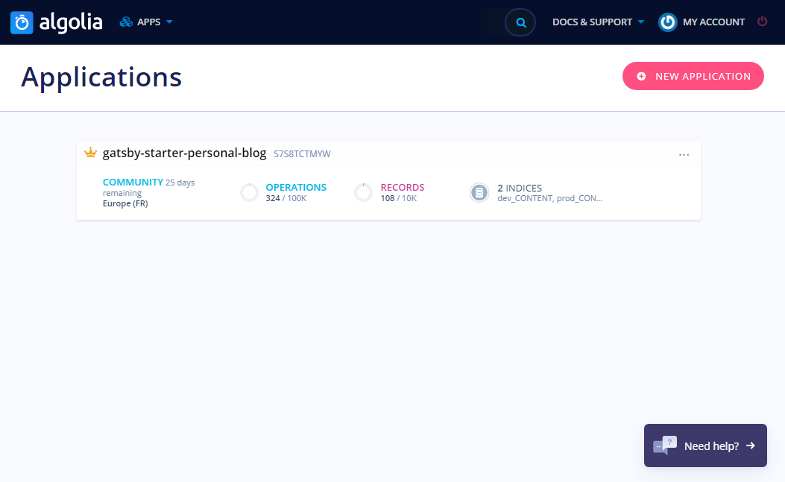
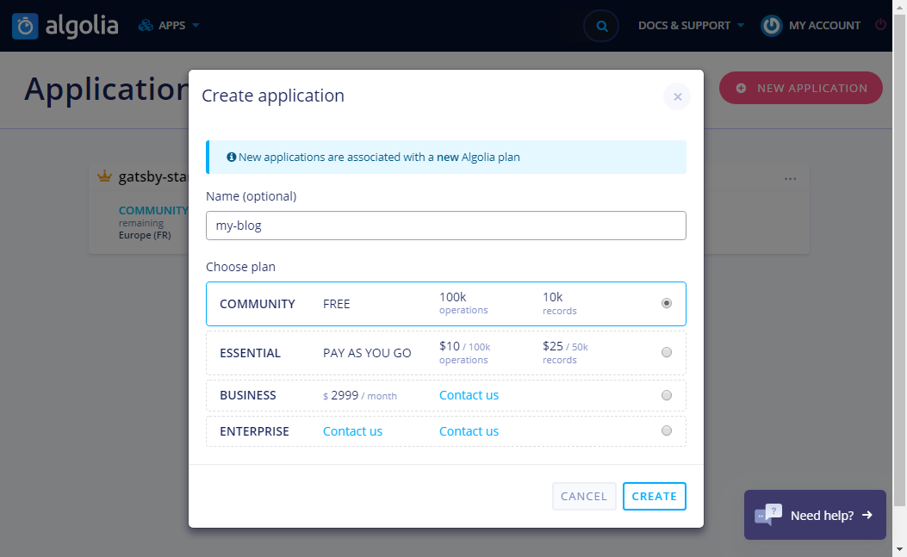
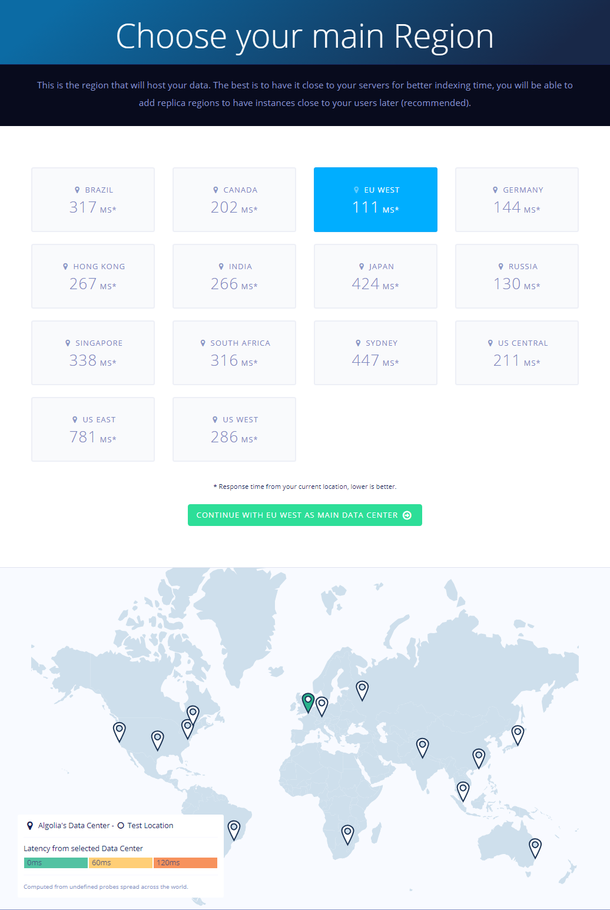
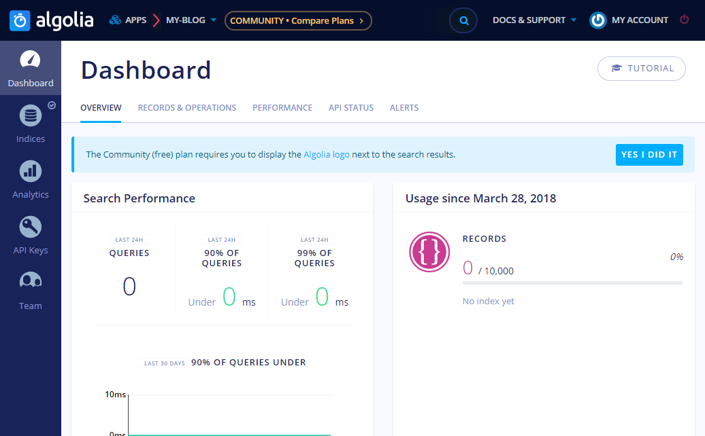
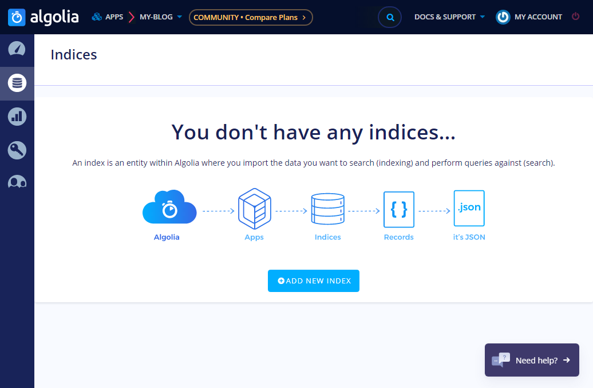
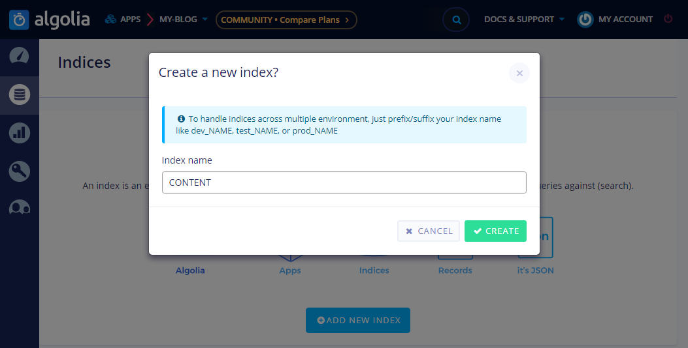
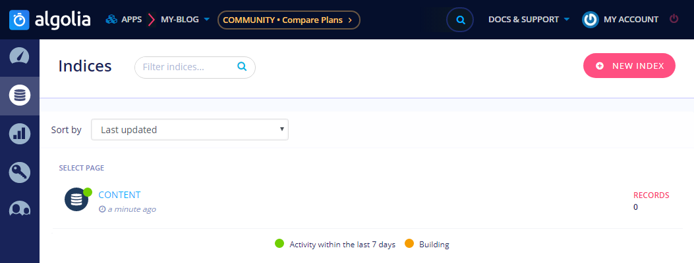
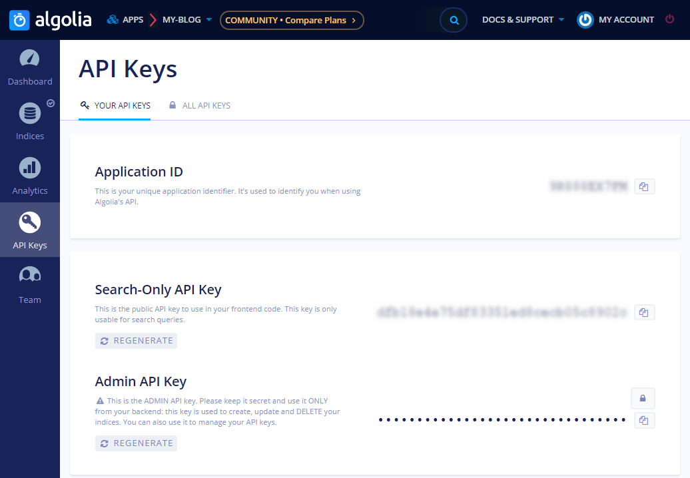

As I wrote in the [Starter Instalation](/install-blog-starter/) post the starter needs access data to your [Algolia](https://www.algolia.com/) account.

If you do not have an Algolia account yet you have to [sign up](https://www.algolia.com/users/sign_up) now.

If you already have an account go and open the [Apps](https://www.algolia.com/manage/applications) page and click the **NEW APPLICATION** button.

Set the name of the new app and choose plan for it.

Then choose a region.

Your app is ready to use.

Now it's time to create an index. Open Indices section. And click the **ADD NEW INDEX** button.

Set a name for the index.

That's it. You've set everything what you need to setup the starter's searching feature.

The final step. Open **Api Keys** section.

And copy **Application ID**, **Search-Only API Key** and **Admin API Key** and put them together with the **Index's name** into the `.env` file described in the [Starter Instalation](/install-personal-blog-starter/) post.

More info about the searching feature in the following post. Stay tuned. If you have any question use the Comment form below.
