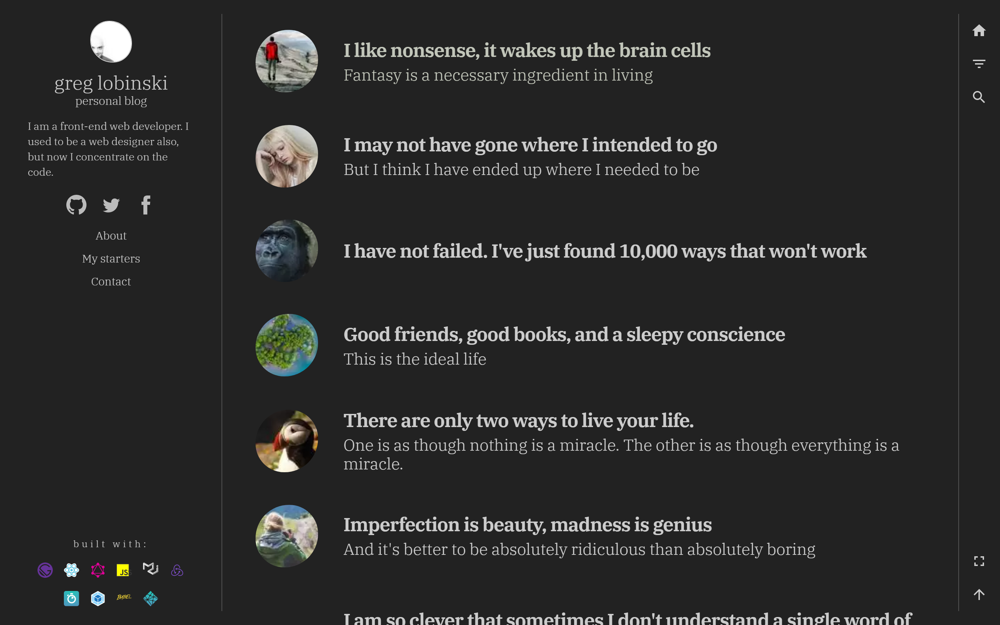

The [starter](https://github.com/greglobinski/gatsby-starter-personal-blog) uses a theme object so base customization is pretty easy.

Find the `theme.js` file.

```
root
  ├── src
  │   ├── styles
  │   │   ├── colors.js
  │   │   ├── globals.js
  │   │   └── theme.js
```

## Theme

The theme object has ten properties:

* base
* info
* navigator
* main
* footer
* bars
* mediaQueryTresholds
* palette
* typography

The last two override the [default](https://material-ui-next.com/customization/default-theme/) [MaterialUI](https://material-ui-next.com/) theme.

The first six properties have a similar inner structure: `colors`, `sizes` and `fonts`. That helps you localize the property to customize.

```javascript
import { createMuiTheme } from "material-ui/styles";
import Color from "color";
import colors from "./colors";

const theme = createMuiTheme({
  base: {
    colors: {
      background: colors.background,
      text: colors.dark,
      link: colors.accent,
      linkHover: Color(colors.accent)
        .lighten(0.1)
        .string(),
      accent: colors.accent,
      lines: colors.superLightGray
    },
    sizes: {
      linesMargin: "20px"
    },
    fonts: {
      unstyledFamily: `Arial`,
      styledFamily: "Open Sans",
      styledFonts: "300,400,600"
    }
  },
  info: {
    colors: {
      text: colors.gray,
      background: colors.background,
      socialIcons: colors.lightGray,
      socialIconsHover: colors.accent,
      menuLink: colors.gray,
      menuLinkHover: colors.accent
    },
    sizes: {
      width: 320,
      headerHeight: 170
    },
    fonts: {
      boxTitleSize: 1.3,
      boxTitleSizeM: 1.5,
      boxTitleSizeL: 1.7
    }
  },
  navigator: {
    colors: {
      background: colors.background,
      postsListItemLink: colors.gray,
      postsListItemLinkHover: colors.accent,
      postsHeader: colors.gray
    },
    sizes: {
      closedHeight: 80,
      postsListItemH1Font: 1.3,
      postsListItemH2Font: 1.1,
      fontIncraseForM: 1.15,
      fontIncraseForL: 1.3
    }
  },
  main: {
    colors: {
      background: colors.background,
      title: colors.gray,
      subTitle: colors.gray,
      meta: colors.gray,
      content: colors.dark,
      footer: colors.gray,
      contentHeading: colors.gray,
      blockquoteFrame: colors.lightGray,
      link: colors.accent,
      linkHover: colors.dark,
      fbCommentsColorscheme: "light"
    },
    sizes: {
      articleMaxWidth: "50em"
    },
    fonts: {
      title: {
        size: 1.9,
        sizeM: 2.5,
        sizeL: 2.7,
        weight: 600,
        lineHeight: 1.1
      },
      subTitle: {
        size: 1.5,
        sizeM: 1.8,
        sizeL: 1.95,
        weight: 300,
        lineHeight: 1.1
      },
      meta: {
        size: 0.9,
        weight: 600
      },
      content: {
        size: 1.0,
        sizeM: 1.15,
        sizeL: 1.1,
        lineHeight: 1.6
      },
      contentHeading: {
        h2Size: 1.5,
        h3Size: 1.3,
        weight: 600,
        lineHeight: 1.3
      },
      footer: {
        size: 1,
        lineHeight: 1.4
      }
    }
  },
  footer: {
    colors: {
      text: Color(colors.gray)
        .lighten(0.5)
        .string(),
      link: colors.accent,
      linkHover: Color(colors.accent)
        .lighten(0.2)
        .string()
    },
    fonts: {
      footnote: {
        size: 0.8,
        lineHeight: 1.4
      }
    }
  },
  bars: {
    colors: {
      background: colors.background,
      icon: colors.gray,
      text: colors.gray
    },
    sizes: {
      actionsBar: 60,
      infoBar: 60
    }
  },
  mediaQueryTresholds: {
    M: 600,
    L: 1024
  },
  palette: {
    primary: {
      main: colors.accent
    },
    action: {
      hover: "rgba(0, 0, 0, 0.01)"
    }
  },
  typography: {
    fontFamily: `Arial, sans-serif`,
    fontSize: 16
  }
});

export default theme;
```

## Colors

The values of color properties are set indirectly. There is a supplementary color palette object inside the `colors.js` file which contains all colors used in the starter.

```javascript
module.exports = {
  background: "#ffffff",
  white: "#ffffff",
  accent: "#709425",
  bright: "#ffffff",
  dark: "#333333",
  gray: "#555555",
  lightGray: "#bbbbbb",
  superLightGray: "#dedede"
};
```

The colors palette object is imported to the theme as `colors` variable.

```javascript
import colors from "./colors";
```

Thanks to the two level theme setup we gain convenience and flexibility. We can easily change values which are shared by many different properties of the theme. For example, the `colors.background` value is used as a background color for all layout sections, so you can change background color of all section by changing only one value. However, if you would like to change a background color for one section only you can do it.

Localy set background color.

```javascript
main: {
  colors: {
    background: "#dddddd" // colors.background,
```

It's not mandatory to use two level theme setup. You can set all theme variables directly as I did in the code above. But using two level pattern gives you convenience and fexibility.

## Color

The starter uses [color](https://github.com/Qix-/color) library to build variants of the palette colors. Rather than setting two separate colors for the link states manually, we use the `Color`'s methods to create the second color based on the first one automaticaly.

```javascript
base: {
  colors: {
    link: colors.accent,
    linkHover: Color(colors.accent)
      .lighten(0.1)
      .string()
  },
```

## Custome theme

There are two ways to change the default starter theme.

You can edit the `colors.js` and `theme.js` files or you can create the new ones.

```
root
  ├── src
  │   ├── styles
  │   │   ├── new-colors.js
  │   │   ├── new-theme.js
  │   │   ├── colors.js
  │   │   ├── globals.js
  │   │   └── theme.js
```

`new-colors.js` with a customized colors palette.

```javascript
module.exports = {
  background: "#222222",
  white: "#ffffff",
  accent: "#709425",
  bright: "#cccccc",
  dark: "#333333",
  gray: "#555555",
  lightGray: "#bbbbbb",
  superLightGray: "#dedede"
};
```

`new-theme.js` with a customized theme.

```javascript
import { createMuiTheme } from "material-ui/styles";
import Color from "color";
import colors from "./new-colors";

const theme = createMuiTheme({
  base: {
    colors: {
      background: colors.background,
      text: colors.bright,
      link: colors.accent,
      linkHover: Color(colors.accent)
        .lighten(0.1)
        .string(),
      accent: colors.accent,
      lines: colors.gray
    },
    sizes: {
      linesMargin: "20px"
    },
    fonts: {
      unstyledFamily: `Arial`,
      styledFamily: "IBM Plex Serif",
      styledFonts: "300,400,600"
    }
  },
  info: {
    colors: {
      text: colors.bright,
      background: colors.background,
      socialIcons: colors.lightGray,
      socialIconsHover: colors.accent,
      menuLink: colors.bright,
      menuLinkHover: colors.accent
    },
    sizes: {
      width: 320,
      headerHeight: 170
    },
    fonts: {
      boxTitleSize: 1.3,
      boxTitleSizeM: 1.5,
      boxTitleSizeL: 1.7
    }
  },
  navigator: {
    colors: {
      background: colors.background,
      postsListItemLink: colors.bright,
      postsListItemLinkHover: colors.accent,
      postsHeader: colors.bright
    },
    sizes: {
      closedHeight: 80,
      postsListItemH1Font: 1.3,
      postsListItemH2Font: 1.1,
      fontIncraseForM: 1.15,
      fontIncraseForL: 1.3
    }
  },
  main: {
    colors: {
      background: colors.background,
      title: colors.bright,
      subTitle: colors.bright,
      meta: colors.bright,
      content: colors.bright,
      footer: colors.bright,
      contentHeading: colors.bright,
      blockquoteFrame: colors.dark,
      link: colors.accent,
      linkHover: colors.dark,
      fbCommentsColorscheme: "dark"
    },
    sizes: {
      articleMaxWidth: "50em"
    },
    fonts: {
      title: {
        size: 1.9,
        sizeM: 2.5,
        sizeL: 2.7,
        weight: 600,
        lineHeight: 1.1
      },
      subTitle: {
        size: 1.5,
        sizeM: 1.8,
        sizeL: 1.95,
        weight: 300,
        lineHeight: 1.1
      },
      meta: {
        size: 0.9,
        weight: 600
      },
      content: {
        size: 1.0,
        sizeM: 1.15,
        sizeL: 1.1,
        lineHeight: 1.6
      },
      contentHeading: {
        h2Size: 1.5,
        h3Size: 1.3,
        weight: 600,
        lineHeight: 1.3
      },
      footer: {
        size: 1,
        lineHeight: 1.4
      }
    }
  },
  footer: {
    colors: {
      text: Color(colors.gray)
        .lighten(0.5)
        .string(),
      link: colors.accent,
      linkHover: Color(colors.accent)
        .lighten(0.2)
        .string()
    },
    fonts: {
      footnote: {
        size: 0.8,
        lineHeight: 1.4
      }
    }
  },
  bars: {
    colors: {
      background: colors.background,
      icon: colors.bright,
      text: colors.bright
    },
    sizes: {
      actionsBar: 60,
      infoBar: 60
    }
  },
  mediaQueryTresholds: {
    M: 600,
    L: 1024
  },
  palette: {
    primary: {
      main: "#709425"
    },
    action: {
      hover: "rgba(0, 0, 0, 0.01)"
    }
  },
  typography: {
    fontFamily: `Arial, sans-serif`,
    fontSize: 16
  }
});

export default theme;
```

And then you have to update `import` statement of the theme object in three files.

`/src/layouts/index.js`

```javascript
import theme from "../styles/new-theme"; // import theme from "../styles/theme";
```

`/src/styles/globals.js`

```javascript
import theme from "./new-theme"; //import theme from "./theme";
```

and `/gatsby-ssr.js`

```javascript
import theme from "./src/styles/new-theme"; // import theme from "./src/styles/theme";
```

After these changes your blog should look like below.



That's all for now. In the following posts we will work on more advanced customizations. If there is anything you would like me to write about please leave a comment or [tweet me](https://twitter.com/greglobinski).
