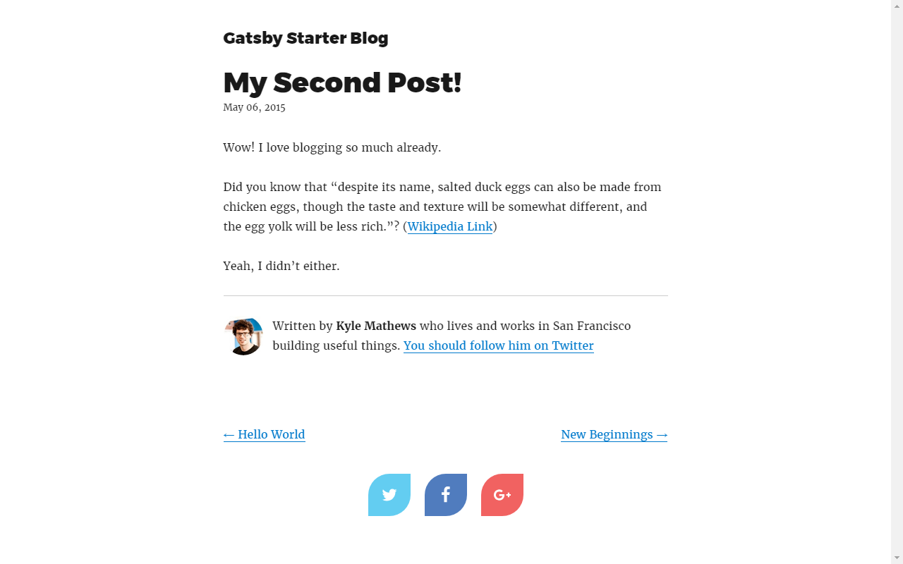

In the [first](../custom-social-share-buttons-gatsby-1) part of the series you added social sharing buttons to the Home page of your GatsbyJS blog. In this episode you will add them to every post page.

This time instead of adding our code directly to the starter's code we create `CustomShareBlock` component.

## Create a share block component

Create a new file inside the `scr/components` folder and name it `CustomShareBlock.js`.

Write an 'empty' functional React component...

```javascript
import PropTypes from "prop-types";
import React from "react";

const CustomReactShare = props => {
  return <div>buttons</div>;
};

CustomReactShare.PropTypes = {};

export default CustomReactShare;
```

... and copy & place into it all code we added to the `src/pages/index.js` file at the first part of the tutorial.

For shortness we limit the number of networks to three.

```javascript
import { css } from "emotion";
import PropTypes from "prop-types";
import React from "react";

import FaTwitter from "react-icons/lib/fa/twitter";
import FaFacebook from "react-icons/lib/fa/facebook";
import FaGooglePlus from "react-icons/lib/fa/google-plus";

import { ShareButtonRectangle, ShareBlockStandard } from "react-custom-share";

const CustomReactShare = props => {
  const customStyles = css`
    border-radius: 50% 0 50% 0;
    margin: 0 10px;
    flex-basis: 60px;
    height: 60px;
    flex-grow: 0;
  `;

  const shareBlockProps = {
    url: "https://mywebsite.com/page-to-share/",
    button: ShareButtonRectangle,
    buttons: [
      { network: "Twitter", icon: FaTwitter },
      { network: "Facebook", icon: FaFacebook },
      { network: "GooglePlus", icon: FaGooglePlus }
    ],
    text: `Give it a try - mywebsite.com `,
    longtext: `Take a look at this super website I have just found.`,
    buttonClassName: customStyles
  };

  return <ShareBlockStandard {...shareBlockProps} />;
};

CustomReactShare.PropTypes = {};

export default CustomReactShare;
```

For the Home page all values of the `shareBlockProps`'s properties where static. Now, because the component will be used for every post page we have to refactor the code.

Set rules for the component's props.

```javascript
CustomReactShare.propTypes = {
  url: PropTypes.string,
  title: PropTypes.string,
  excerpt: PropTypes.string
};

CustomReactShare.defaultProps = {
  url: "https://mywebsite.com/page-to-share/",
  title: "Default value of title",
  excerpt: "Default value of excerpt"
};
```

Destructure props object to local variables.

```javascript
const { url, title, excerpt } = props;
```

And update the `shareBlockProps` object.

```javascript
const shareBlockProps = {
  url: url, // « dynamic value
  text: title, // « dynamic value
  longtext: excerpt // « dynamic values
  /* other properties stay unchanged */
};
```

Tha's it. The component is ready.

```javascript
import { css } from "emotion";
import PropTypes from "prop-types";
import React from "react";

import FaTwitter from "react-icons/lib/fa/twitter";
import FaFacebook from "react-icons/lib/fa/facebook";
import FaGooglePlus from "react-icons/lib/fa/google-plus";

import { ShareButtonRectangle, ShareBlockStandard } from "react-custom-share";

const CustomReactShare = props => {
  const { url, title, excerpt } = props;

  const customStyles = css`
    border-radius: 50% 0 50% 0;
    margin: 0 10px;
    flex-basis: 60px;
    height: 60px;
    flex-grow: 0;
  `;

  const shareBlockProps = {
    url: url,
    button: ShareButtonRectangle,
    buttons: [
      { network: "Twitter", icon: FaTwitter },
      { network: "Facebook", icon: FaFacebook },
      { network: "GooglePlus", icon: FaGooglePlus }
    ],
    text: title,
    longtext: excerpt,
    buttonCustomClassName: customStyles
  };

  return <ShareBlockStandard {...shareBlockProps} />;
};

CustomReactShare.PropTypes = {
  url: PropTypes.string,
  title: PropTypes.string,
  excerpt: PropTypes.string
};

CustomReactShare.defaultProps = {
  url: "https://mywebsite.com/page-to-share/",
  title: "Default value of title",
  excerpt: "Default value of excerpt"
};

export default CustomReactShare;
```

## Post template

Now we have to add created component to the starter's post template.

Open the `src/templates/blog-post.js` file and add an import statement of the newly created component.

```javascript
import CustomReactShare from "../components/CustomReactShare";
```

Add the component to the end of the renders's `return` statement.

```javascript
<CustomReactShare title={post.frontmatter.title} excerpt={excerpt} url={url} />
```

Update `graphql` query by adding the `siteUrl` and `excerpt` fields to it.

```javascript
export const pageQuery = graphql`
  query BlogPostBySlug($slug: String!) {
    site {
      siteMetadata {
        title
        author
        siteUrl
      }
    }
    markdownRemark(fields: { slug: { eq: $slug } }) {
      id
      html
      excerpt
      frontmatter {
        title
        date(formatString: "MMMM DD, YYYY")
      }
    }
  }
`;
```

Finally, declare the `excerpt` and `url` local variables.

```javascript
const excerpt = get(this.props, "data.excerpt");
const url = `${get(this.props, "data.site.siteMetadata.siteUrl")}${get(
  this.props,
  "pathContext.slug"
)}`;
```

Take a look at one of the starter's blog page. You should see the share block at the bottom of the page.



It's done.

If you do not see the expected result compare your code with the [integrations/gatsby/](https://github.com/greglobinski/react-custom-share/tree/master/integrations/gatsby) folder of the `react-custom-share` library on Github.

We are at halfway point of the series. In the next episode you will learn how to create the button from scratch.

### This post is a part of a series

* [Add custom social sharing buttons to a GatsbyJS blog's home page](../custom-social-share-buttons-gatsby-1)
* Add custom social sharing buttons to GatsbyJS blog's posts
* Coming soon...
