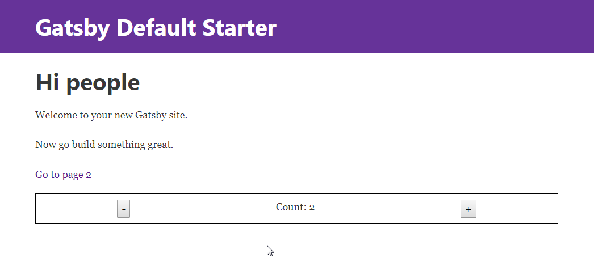

First of all, you have to know that I am a big fan of [GatsbyJS](https://www.gatsbyjs.org/). I have been using it for a couple of months already. I have created some [starters](https://github.com/greglobinski?utf8=%E2%9C%93&tab=repositories&q=gatsby-starter&type=&language=) for it, some of them are quite recognized.

For those of you who does not know what GatsbyJS is yet, it is a static site generator for React.

If you already know what it is, you probably also know that the major upgrade is coming. The GatsbyJS **version 2** is on the go.

Because of that, a couple days ago I decided to familiarize myself with the upcoming changes.

One thing came to light.

## Layout component

In the **version 1** there are `Layout` type components. If you have only one such a component in your application, then it works as a root component of the whole app, all pages are rendered as `children` of it.

The component is an ideal place to store a central state of the application.

Regretably with the new architecture of the **version 2** it does not work. Now `Layouts` are ordinary components. In v2 they are placed inside `Page` components not outside them. You can't store the central app state there, because every time you switch to a new page the Layout component is mounted.

The problem is already [noticed](https://github.com/gatsbyjs/gatsby/issues/6127) and I believe that soon there will be workaround for it.

## State container

But till that I needed a new container for the state of my app. I could use [react-redux](https://github.com/reduxjs/react-redux), GatsbyJS [works](https://github.com/gatsbyjs/gatsby/tree/master/examples/using-redux) nicely with it. But I decided to look for something new.

After all, I was just playing with the new GatsbyJS, it was a good ocasion to explore the new land even further.

This way I came across [Unstated](https://github.com/jamiebuilds/unstated).

## Unstated

Unstated is a state container created by [@jamiebuilds](https://twitter.com/jamiebuilds).

[Ken Wheeler](https://twitter.com/ken_wheeler) said about the library:

> "When people say you don't need Redux most of the time, they actually mean you do need Unstated. It's like setState on fucking horse steroids"

## GatsbyJS and Unstated together

Let's write some code.

**Note**. Whenever I use `yarn`, you can use `npm` with corresponding commands, if you prefer.

I assume that you already have a **Gatsby CLI** installed globaly, so you are able to create a GatsbyJS website with the `gatsby new` command. If not, read [this](https://next.gatsbyjs.org/tutorial/part-one/) first.

```
gatsby new gatsby-unstated-example https://github.com/gatsbyjs/gatsby-starter-default.git#v2
```

Notice the `#v2` flag at the end of the repo url. It means we want to install the starter build on the `v2` branch of the repo. And that means we will work with the GatsbyJS v2 which, you should remember that, is still in **beta**.

Move into the newly created folder.

```
cd gatsby-unstated-example
```

Install `unstated`.

```
yarn add unstated
```

### Container

First we have to build a container for our state. Create a file `CounterContainer.js` inside the `src/state/` folder. With code like below.

```javascript
import { Container } from "unstated";

class CounterContainer extends Container {
  state = {
    count: 0
  };

  increment() {
    this.setState({ count: this.state.count + 1 });
  }

  decrement() {
    this.setState({ count: this.state.count - 1 });
  }
}

export default CounterContainer;
```

What is it similar to? It looks like a regular React class component, doesn't it? But it's not.

> Behind the scenes our Containers are also event emitters that our app can subscribe to for updates. When you call setState it triggers components to re-render, be careful not to mutate this.state directly or your components won't re-render.

More about that in the [documentation](https://github.com/jamiebuilds/unstated).

### Provider

To use unstated's **provider** in a GatsbyJS site you need to hook into two Gatsby's extension points.

One is `replaceRenderer` which runs during Gatsby's server rendering process.

Edit `gatsby-ssr.js`.

```javascript
import React from "react";
import { Provider } from "unstated";
import { renderToString } from "react-dom/server";

export const replaceRenderer = ({ bodyComponent, replaceBodyHTMLString }) => {
  const ConnectedBody = () => <Provider>{bodyComponent}</Provider>;
  replaceBodyHTMLString(renderToString(<ConnectedBody />));
};
```

The second one is `replaceRouterComponent` which is a part of Gatsby's browser APIs. Edit `gatsby-browser.js`.

```javascript
import React from "react";
import { Router } from "react-router-dom";
import { Provider } from "unstated";

export const replaceRouterComponent = ({ history }) => {
  const ConnectedRouterWrapper = ({ children }) => (
    <Provider>
      <Router history={history}>{children}</Router>
    </Provider>
  );

  return ConnectedRouterWrapper;
};
```

### Subscribe

The last step is to subscribe to the state.

Open `src/components/layout.js` file and add two import statements to it.

```javascript
import { Subscribe } from "unstated";
import CounterContainer from "../state/CounterContainer";
```

And a little interface to manage and observe the current value of the state.

```javascript
<Subscribe to={[CounterContainer]}>
  {counter => (
    <div>
      <button onClick={() => counter.decrement()}>-</button>
      <span> Count: {counter.state.count}</span>
      <button onClick={() => counter.increment()}>+</button>
    </div>
  )}
</Subscribe>
```

You should see something like this.



The value of **Count:** should stay unchanged when you switch between pages.

That's it. You have now a **GatsbyJS** app with a central state managed by **Unstated**.
