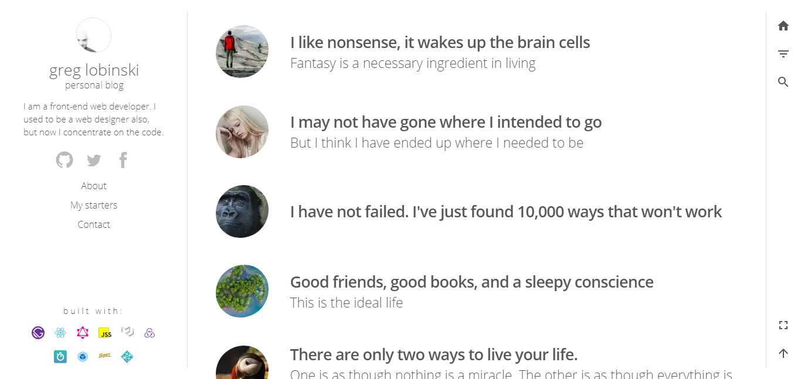

## Feedback

<blockquote class="twitter-tweet" data-conversation="none"  data-lang="en">
this looks incredibly good!
&mdash; shawn swyx wang 🇸🇬 (@swyx) <a href="https://twitter.com/swyx/status/972978980046491648?ref_src=twsrc%5Etfw">March 11, 2018</a></blockquote>

<blockquote class="twitter-tweet" data-conversation="none" data-lang="en">
Looks awesome. My nerdeveloper sense is tingling.
&mdash; Alessandro Burato (@ale_burato) <a href="https://twitter.com/ale_burato/status/971530603769270272?ref_src=twsrc%5Etfw">March 7, 2018</a></blockquote>

<blockquote class="twitter-tweet" data-conversation="none" data-lang="en">
That‘s really awesome! I love it, Thank you!
&mdash; Bon John (@BonJohn11) <a href="https://twitter.com/BonJohn11/status/971299371789750273?ref_src=twsrc%5Etfw">March 7, 2018</a></blockquote>

<blockquote class="twitter-tweet" data-conversation="none" data-lang="en">
Excellent! .. I was looking for such template from long time :)
&mdash; Muhammad Umair (@imumare) <a href="https://twitter.com/imumare/status/971284086789693441?ref_src=twsrc%5Etfw">March 7, 2018</a></blockquote>

