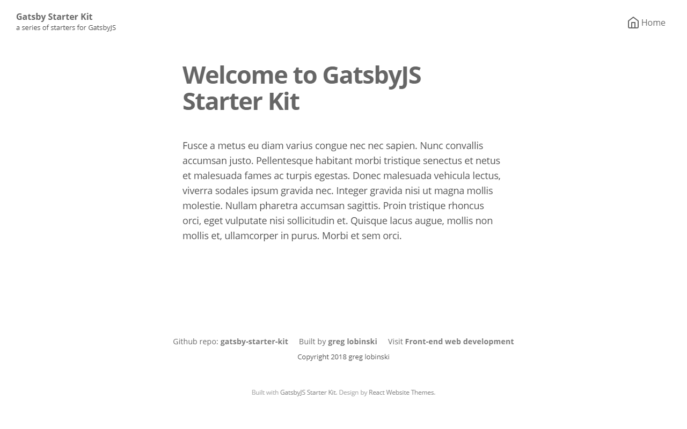

The **Themed** starter is the one where the real fun starts. :sparkles: :tada:

The local React components are displaced by the **outer library's components** which could be styled with built-in or custom **themes**.



<a class="demoLink"  target="_blank" href="https://gatsby-starter-kit-themed.netlify.com">Live demo</a>

## Features

- A bunch of ready to use **themeable** React components.
- Default **theme** applied to all components.
- Markdown **parts** files for editing content without touching Components' code.
- Central **config** object.
- Easy editable **menu**.
- Feather **icons**.
- **Seo** component for managing meta tags.
- Google **Analytics** support.
- Auto generated **sitemap**.

## Gatsby plugins

- gatsby-source-filesystem
- gatsby-transformer-remark
- gatsby-plugin-resolve-src
- gatsby-plugin-catch-links
- gatsby-plugin-sitemap
- gatsby-plugin-google-analytics
- gatsby-plugin-react-helmet
- gatsby-plugin-emotion

## Add-ons

- @react-website-themes/default
- emotion
- react-emotion
- emotion-server
- facepaint
- react-feather
- react-helmet

## Folder structure

```
root
  └── src
      ├── content
      │   ├── meta
      │   │   ├── config.js
      │   │   └── menu.js
      │   └── parts
      │       ├── copyright.md
      │       ├── footerLinks.md
      │       ├── notFound.md
      │       └── welcome.md
      └── pages
          ├── 404.js
          └── index.js
```

Have you noticed that the components disappeared? :astonished: More about that soon in a separate **Guides** section. Follow [me](https://twitter.com/greglobinski) to be informed about the updates.

## Installation

**Default usage**

```shell
gatsby new [NEW_DIRECTORY_FOR_YOUR_SITE] https://github.com/greglobinski/gatsby-starter-kit.git#themed-with-content
...
cd [NEW_DIRECTORY_FOR_YOUR_SITE]
...
gatsby develop
```

**Advanced usage**

Fork the [repository](https://github.com/greglobinski/gatsby-starter-kit).

```shell
git clone https://github.com/[your-github-name]/gatsby-starter-kit.git [NEW_DIRECTORY_FOR_YOUR_SITE]
...
cd [NEW_DIRECTORY_FOR_YOUR_SITE]
...
git checkout --track origin/themed-with-content
...
git checkout -b my-themed
...
yarn install
...
gatsby develop
```
