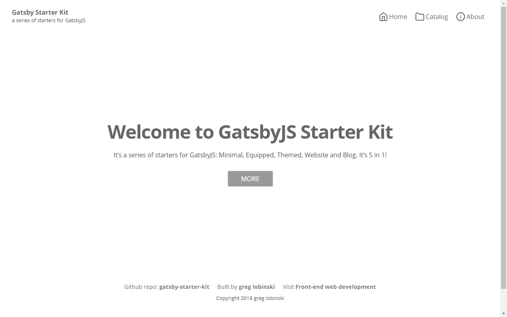

The **Website** starter is built upon the [Themed](../themed-starter) but lets you create pages with **Markdown** files. You do not have to create a **React** page component.



<a class="demoLink"   target="_blank" href="https://gatsby-starter-kit-website.netlify.com">Live demo</a>

## Features

- A bunch of ready to use **themeable** React components.
- Default **theme** applied to all components.
- Markdown **pages** files for easily creating new web pages.
- **Categories** for markdown pages.
- Markdown **parts** files for editing content without touching Components' code.
- Central **config** object.
- Easy editable **menu**.
- Feather **icons**.
- **Seo** component for managing meta tags.
- Google **Analytics** support.
- Auto generated **sitemap**.

## Gatsby plugins

- gatsby-plugin-emotion
- gatsby-plugin-catch-links
- gatsby-plugin-google-analytics
- gatsby-plugin-react-helmet
- gatsby-plugin-resolve-src
- gatsby-plugin-sitemap
- gatsby-remark-emojis
- gatsby-remark-copy-linked-file
- gatsby-remark-images
- gatsby-remark-prismjs
- gatsby-remark-responsive-iframe
- gatsby-remark-smartypants
- gatsby-source-filesystem
- gatsby-transformer-remark

## Add-ons

- @react-website-themes/default
- emotion
- emotion-server
- facepaint
- react-emotion
- react-feather
- react-helmet

## Folder structure

```
root
  └── src
      ├── content
      │   ├── meta
      │   │   ├── config.js
      │   │   └── menu.js
      │   ├── pages
      │   │   ├── catalog
      │   │   │   └── index.md
      │   │   └── about
      │   │       └── index.md
      │   └── parts
      │       ├── copyright.md
      │       ├── footerLinks.md
      │       ├── notFound.md
      │       └── welcome.md
      ├── pages
      │   ├── 404.js
      │   └── index.js
      └── templates
          └── PageTemplate.js
```

## Installation

**Default usage**

```shell
gatsby new [NEW_DIRECTORY_FOR_YOUR_SITE] https://github.com/greglobinski/gatsby-starter-kit.git#website-with-content
...
cd [NEW_DIRECTORY_FOR_YOUR_SITE]
...
gatsby develop
```

**Advanced usage**

Fork the [repository](https://github.com/greglobinski/gatsby-starter-kit).

```shell
git clone https://github.com/[your-github-name]/gatsby-starter-kit.git [NEW_DIRECTORY_FOR_YOUR_SITE]
...
cd [NEW_DIRECTORY_FOR_YOUR_SITE]
...
git checkout --track origin/website-with-content
...
git checkout -b my-website
...
yarn install
...
gatsby develop
```
