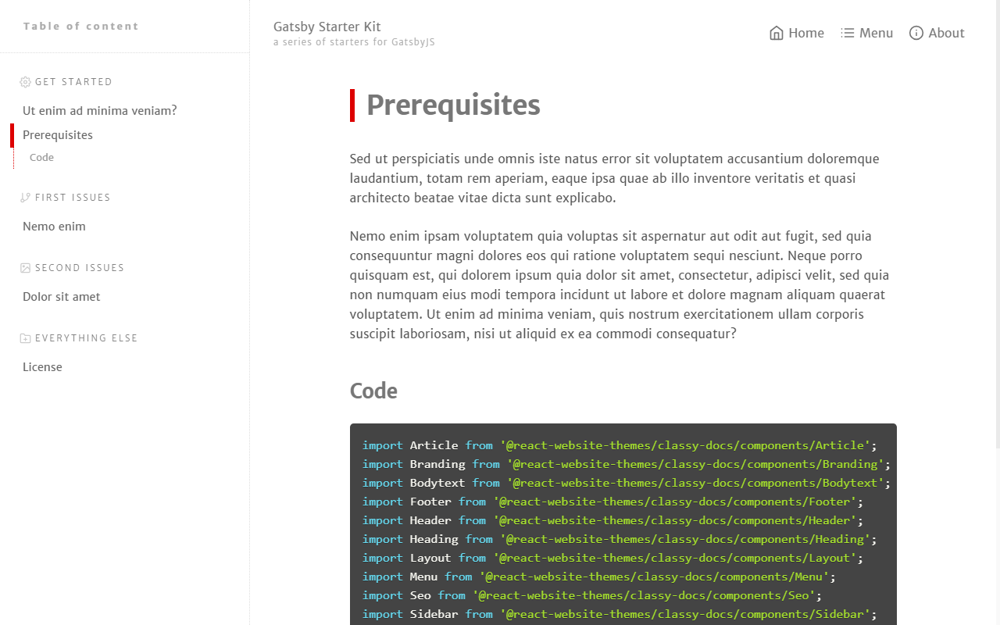

The **Classy Docs** starter is the first **themed** starter at _\*\*Gatsby Starter Kit_. It's built upon the [Website](../website-starter) starter plus some add-ons.

Have you noticed already? The Gatsby Starter Kit documentation, the website you are looking at now, is built with it. :star:



<a class="demoLink"  target="_blank" href="https://gatsby-starter-kit-classy-docs.netlify.com">Live demo</a>

## Features

- A bunch of ready to use **themeable** React components.
- The **Classy Docs** theme from [@react-website-themes](https://github.com/greglobinski/react-website-themes) applied to all components.
- Docs pages automatically created from markdown **docs** files.
- Automaticaly created **Sidebar** navigation.
- Web pages automatically created from markdown **pages** files.
- **Categories** for markdown **docs** and **pages**.
- Markdown **parts** files let you edit content inside
  React components without touching the code.
- Central **config** object.
- Easy editable **menu**.
- Feather **icons**.
- **Seo** component for managing meta tags.
- Google **Analytics** support.
- Auto generated **sitemap**.

## Gatsby plugins

- gatsby-plugin-catch-links
- gatsby-plugin-emotion
- gatsby-plugin-google-analytics
- gatsby-plugin-sharp
- gatsby-plugin-sitemap
- gatsby-plugin-react-helmet
- gatsby-plugin-resolve-src
- gatsby-remark-autolink-headers
- gatsby-remark-copy-linked-files
- gatsby-remark-emojis
- gatsby-remark-external-links
- gatsby-remark-images
- gatsby-remark-prismjs
- gatsby-remark-responsive-iframe
- gatsby-remark-smartypants
- gatsby-transformer-remark
- gatsby-source-filesystem

## Add-ons

- @react-website-themes/classy-docs
- emotion
- emotion-server
- facepaint
- react-emotion
- react-feather
- react-helmet

## Folder structure

```
root
  └── src
      ├── content
      │   ├── docs
      │   │   ├── 2.1___ut-enim-ad-minima
      │   │   │   └── index.md
      |   |
      |   |   ...
      |   |
      │   │   └── 5.3___licence
      │   │       └── index.md
      │   ├── images
      │   │   └── logo.png
      │   ├── meta
      │   │   ├── categories.js
      │   │   ├── config.js
      │   │   └── menu.js
      │   ├── pages
      │   │   ├── catalog
      │   │   │   └── index.md
      │   │   └── about
      │   │       └── index.md
      │   └── parts
      │       ├── author.md
      │       ├── copyright.md
      │       ├── footerLinks.md
      │       ├── hero.md
      │       ├── notFound.md
      │       └── welcome.md
      ├── pages
      │   ├── 404.js
      │   ├── content.js
      │   └── index.js
      └── templates
          └── PageTemplate.js
```

## Installation

**Default usage**

```shell
gatsby new [NEW_DIRECTORY_FOR_YOUR_SITE] https://github.com/greglobinski/gatsby-starter-kit.git#classy-docs-with-content
...
cd [NEW_DIRECTORY_FOR_YOUR_SITE]
...
gatsby develop
```

**Advanced usage**

Fork the [repository](https://github.com/greglobinski/gatsby-starter-kit).

```shell
git clone https://github.com/[your-github-name]/gatsby-starter-kit.git [NEW_DIRECTORY_FOR_YOUR_SITE]
...
cd [NEW_DIRECTORY_FOR_YOUR_SITE]
...
git checkout --track origin/classy-docs-with-content
...
git checkout -b my-classy-docs
...
yarn install
...
gatsby develop
```
