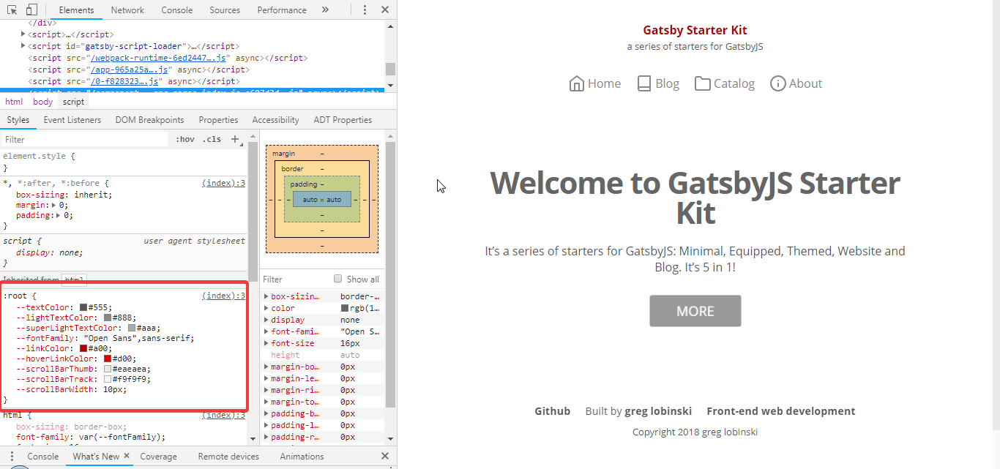

If you did not, read [this](/website-themes) first.

You should know already the **Kit**'s starters use ready-to-use **themes** delivered by **@react-website-themes**. The themes in turn use [emotion](https://github.com/emotion-js/emotion), a superb css-in-js library.

## CSS variables

Let's investigate what happens when the [Blog](/blog-starter) starter imports 'variables'.

```javascript
import '@react-website-themes/default/styles/variables';
```

Below is the code of the [file](https://github.com/greglobinski/react-website-themes/blob/master/packages/default/src/styles/variables.js)

```javascript
import 'typeface-open-sans';
import { injectGlobal } from 'emotion';

const variables = injectGlobal`
  :root {
    --textColor: #555;
    --lightTextColor: #888;
    --superLightTextColor: #aaa;
    --fontFamily: "Open Sans", sans-serif;
    --linkColor: #a00;
    --hoverLinkColor: #d00;
    --scrollBarThumb: #eaeaea;
    --scrollBarTrack: #f9f9f9;
    --scrollBarWidth: 10px;
  }
`;

export default variables;
```

First, we import **Open Sans** typeface.

Second, we use the `emotion`'s `injectGlobal` method to add some CSS variables to the `root` element.



### Customization

You can although do not import the `variable` file and create your own local one or override just some of the variables. You can also add new ones.

```javascript
import { injectGlobal } from 'emotion';

/* ... */

import '@react-website-themes/default/styles/variables';

/* ... */

/* ovveride/add new variables*/
injectGlobal`
  :root {
    --textColor: orange; 
    --actionColor: #555;
  }
`;
```

## Global styles

Global styles works exactly the same way as the described above **variables**. They are separated to an another file only for flexibility.

```javascript
import '@react-website-themes/default/styles/global';
```

Below is the code of the [file](https://github.com/greglobinski/react-website-themes/blob/master/packages/default/src/styles/global.js)

```javascript
import { injectGlobal } from 'emotion';

const global = injectGlobal`
  html {
    box-sizing: border-box;
    font-family: var(--fontFamily);
    font-size: 16px;
    color: #666;
  }

  *,
  *:after,
  *:before {
    box-sizing: inherit;
    margin: 0;
    padding: 0;
  }

  p {
    color: var(--textColor);
  }

  h1 {
    font-size: 2.4em;
  }

  h2 {
    font-size: 1.8em;
  }

  ul {
    list-style-position: inside;
  }

  a {
    color: var(--linkColor);
    transition: .3s;
  }

  @media (hover: hover)  {
    a:hover {
      color: var(--hoverLinkColor);
    }
  }

  *::-webkit-scrollbar {
    width: var(--scrollBarWidth);
  }
  *::-webkit-scrollbar-track {
    background: var(--scrollBarTrack);
  }
  *::-webkit-scrollbar-thumb {
    background-color: var(--scrollBarThumb);
  }

`;

export default global;
```

Do you see the same `emotion`'s `injectGlobal` method? Nothing new here, right?

### Customization.

Like with **variables**, you can swap the whole file or override/add only some rules.

```javascript
import { injectGlobal } from 'emotion';

/* ... */

import '@react-website-themes/default/styles/global';

/* ... */

/* ovveride/add new variables*/
injectGlobal`
  h1 {
    font-size: 5em;
    font-weight: 300;
    color: pink;
  }

  h3 {
    font-size: 0.5em;
    color: blue;
  }
`;
```

## Components' styles

Take a look at the [Layout](https://github.com/greglobinski/react-website-themes/blob/master/packages/default/src/components/Layout.js) component.

```javascript
import PropTypes from 'prop-types';
import React from 'react';
import { cx } from 'emotion';

import style from '../styles/layout';

const Layout = props => {
  const { children, themeStyle = style, customStyle = '' } = props;

  return (
    <div className={cx(themeStyle, customStyle)}>
      <main>{children}</main>
    </div>
  );
};

Layout.propTypes = {
  children: PropTypes.node.isRequired,
  themeStyle: PropTypes.string,
  customStyle: PropTypes.string,
};

export default Layout;
```

Every component, except the Seo one, expect two optional **style** props:

- `themeStyle`
- `customStyle`

When the `themeStyle` prop is undefined, what is a suggested usage, the component assigns to it the built-in style.

If `customTheme` is undefined, the component assigns to it an empty string.

Both of the styles `themeStyle` and `customStyle` are merged into one by the `emotion`'s `cx` method.

### Customization

You can override the built-in styles by providing a `customStyle` prop for the component.

```javascript
import { css } from 'emotion';

/* ... */

const layoutCustomStyle = css`
  padding: 100px;
`;

const IndexPage = props => {
  /* ... */

  return <Layout customStyle={layoutCustomStyle}>...</Layout>;
};
```

That's all you need to know to effectively customize the look of the Kit's starters.

Follow me on [Twitter](https://twitter.com/greglobinski?lang=en) if you want to be informed about the new incoming guides.
