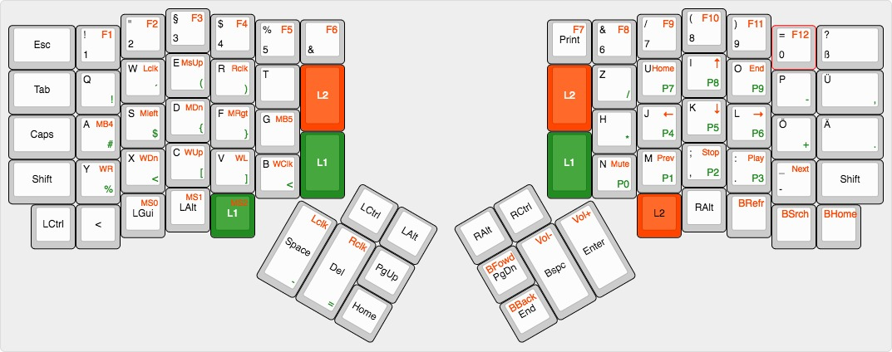

# Infinity Ergodox Keymap

This is my current Ergodox Keyboard Layout.

The layout uses the base German ISO layout with a some adaptions, since the ergodox lacks a few keys on the base layer.
Noticable is this especially for the umlauts `ä`,`ö` and `ü` and also the `ß` letter. Also the Ergodox lacks keys for the keys next to the umlauts and a key left of `Y` that is used for `<`. Luckily we can create layers.

# Layers

I went with the default 3 base layers for now which are `default`, `symbols` and `media`.



Default: Black

Symbols: Green

Media: Red

## Default

Pretty much the typical ISO German Layout except the thumb cluster obviously.
I felt like I press space mostly with left thumb, so I tried to keep it there for now.
Since I moved the umlauts to their typical position, the right most row on the right hand had to move
into the thumb cluster for the most part.

## Symbols
_ToDo: add symbol layer description_

## Media
_ToDo: add media layer description_

# Build the QMK firmware

Change `knochenmark` to your own keymap name.

```shell
$ make ergodox-infinity-knochenmark VISUALIZER_ENABLE=yes LCD_BACKLIGHT_ENABLE=yes LCD_ENABLE=yes MASTER=left
```

# Flash it

For the **left** half
```shell
$ sudo make ergodox-infinity-knochenmark-dfu-util
```
For the **right** half
```shell
$ sudo make ergodox-infinity-knochenmark-dfu-util MASTER=right
```

# ToDo's

- Gaming layer with WASD offset by 1 to the right and function keys on base layer
- Test the layout under Windows (might require a seperate Windows layer)
- Since the Arrow cluster was moved to a layer, 3 keys on bottom right corner are free now.
Maybe add Copy/Paste/Cut or Undo Macros there.
- Try LCtrl at Capslock position (Tap Caps/Hold Ctrl)
- Move the Mouse Acceleration Keys somewhere else, because they overlap the Gui, Alt & L1 Button
- ~~Add an image of they keyboard layout~~
- ~~Consider repositioning of Home/End keys~~

# Changelog

- Moved the Arrow-Cluster together with Home and End to another layer and closer to right hands home row. It felt uncomfortable always reaching down to the bottom right corner. Felt even worse when I went back to a normal keyboard. Let's see how the layer cluster works out.

# Useful Resources

[Ergodox Infinity LCD Screen Support with QMK](https://www.reddit.com/r/MechanicalKeyboards/comments/6576f8/psa_the_screens_on_the_infinity_ergodox_now_work/)

[Building the QMK Firmware Documentation](https://github.com/qmk/qmk_firmware/tree/master/keyboards/ergodox)

[QMK Keycodes](https://docs.qmk.fm/basic_keycodes.html)
