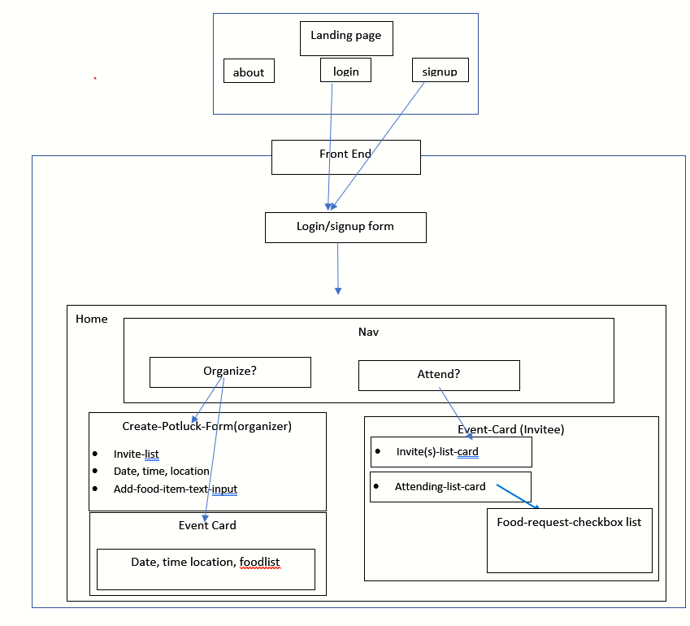

# Front End:

## Quick-links:

# Potluck Planner

## ☝️ **Pitch**

If you have ever tried to organize a potluck through text messages, online to-do lists or spreadsheets, you'll understand why this app is essential.

In the world of social gatherings and potlucks the "Potluck Planner" is king. This is your place for all things pot luck.

## ✅ **MVP**

1. As an `organizer` I can create an upcoming `potluck` and invite my friends to attend

2. As an `organizer` I can adjust `date`s, `time`s and `location`s of the potluck

3. As an `organizer` I can use the list feature in my app to add food `items` that we'd like to see at the potluck

4. As a `guest` to a potluck I want to be able to confirm that I'm going to the upcoming `event`

5. As a `guest` I'd like to be able to select which `item`s I'd like to be responsible for bringing

**NOTE: All of the user stories above should only require a single user type. Users can create "potlucks" and add other users to them.**

## 🏃‍♀️ **Stretch**

1. Add a reminders functionality that allows users to link up their upcoming `date`s to their Google calendar.

2. Ability to upload multiple `photos` from the potluck gathering, like a photo gallery for a past event.

---
---

# Backend:

# Potluck Planner API

Hosted Backend URL: https://potluck-planner1.herokuapp.com/

Endpoints that require an authorization token:

Headers:
| Key | Value |
| :-- | :-- |
| Authorization | AUTH_TOKEN |

## Authentication

| Method | Endpoint       | Requirements             |                    |
| ------ | -------------- | ------------------------ | ------------------ |
| POST   | /auth/register | name, username, password | Creates a new user |
| POST   | /auth/login    | username, password       | Logs in users      |

## Users

| Method | Endpoint       | Requirements                            |                           |
| ------ | -------------- | --------------------------------------- | ------------------------- |
| GET    | /api/users     |                                         | Returns all users         |
| GET    | /api/users/:id |                                         | Returns user object by id |
| PUT    | /api/users/:id | either name, username, password, or all | Updates the user by id    |
| DELETE | /api/users/:id |                                         | Deletes the user by id    |

## Events

| Method | Endpoint               | Requirements                                            |                                                                 |
| ------ | ---------------------- | ------------------------------------------------------- | --------------------------------------------------------------- |
| GET    | /api/events            |                                                         | Returns all events                                              |
| GET    | /api/events/users/:id  |                                                         | Returns all events related to user id, returns data of event id |
| GET    | /api/events/:id        |                                                         | Returns event by id                                             |
| GET    | /api/events/:id/food   |                                                         | Gets food for event id                                          |
| GET    | /api/events/:id/guests |                                                         | Gets all guests by event id                                     |
| POST   | /api/events            | title, location, month, day, year, start_time, end_time | Creates new event                                               |
| POST   | /api/events/:id/guests | userID (of the user being added)                        | Add guest to event by id                                        |
| PUT    | /api/events/:id        | title, location, month, day, year, start_time, end_time | Updates event by id                                             |
| DELETE | /api/events/:id        |                                                         | Deletes event by id                                             |

## Food

| Method | Endpoint             | Requirements                                                          |                                  |
| ------ | -------------------- | --------------------------------------------------------------------- | -------------------------------- |
| GET    | /api/food            |                                                                       | Returns all food items           |
| GET    | /api/events/:id/food |                                                                       | Returns all the food by event id |
| GET    | /api/food/:id        |                                                                       | Returns food object by id        |
| POST   | /api/food            | eventId, userID(of person bringing, optional), category, quantity, name (must be unique)  | Creates new food object          |
| PUT    | /api/food/:id        | eventId, userID(of person bringing, optional), category, quantity , name (must be unique) | Updates the food by id           |
| DELETE | /api/food/:id        |                                                                       | Deletes the food by id"          |
