# Learn PostgreSQL

- [Commands](./psql-cheatsheet.md)


> A lightweight documentation of PostgreSQL for beginners.

## Table of Contents

- [Preface](#preface)

  - [What is a Database?](#what-is-a-database-)
  - [What is SQL and Relational Database?](#what-is-sql-and-relational-database-)
  - [What is PostgreSQL?](#what-is-postgresql-)

  * [Getting Started](#getting-started)
    - [Setup & Install PostgreSQL](#setup---install-postgresql)
    - [PostgreSQL Roles and User Login](#postgresql-roles-and-user-login)
      - [Accessing with Switching Accounts](#accessing-with-switching-accounts)
      - [Accessing without Switching Accounts](#accessing-without-switching-accounts)
      - [How to check Roles in PostgreSQL](#how-to-check-roles-in-postgresql)
      - [Create roles in PostgreSQL](#create-roles-in-postgresql)
      - [Update and Delete a Role in PostgreSQL](#update-and-delete-a-role-in-postgresql)
      - [Create and Delete Roles from using shell commands (Without connecting `psql`)](#create-and-delete-roles-from-using-shell-commands--without-connecting--psql--)
    - [How to create database](#how-to-create-database)
    - [How to connect a database](#how-to-connect-a-database)
  * [The SQL Language](#the-sql-language)
    - [Creating a new table to a database](#creating-a-new-table-to-a-database)
    - [Deleting a table from a database](#deleting-a-table-from-a-database)
    - [Inserting Data Into The Table](#inserting-data-into-the-table)
    - [Querying data from the table](#querying-data-from-the-table)
    - [Deleting Data Into The Table](#deleting-data-into-the-table)
    - [Creating a Table With Constraints](#creating-a-table-with-constraints)
    - [Creating a table and Inserting Into that table from a SQL file](#creating-a-table-and-inserting-into-that-table-from-a-sql-file)
    - [Sort Data by Using 'Order BY'](#sort-data-by-using--order-by-)
    - [Uses of WHERE Clause, AND and OR in PostgreSQL](#uses-of-where-clause--and-and-or-in-postgresql)
    - [Using Comparison Operators in PostgreSQL](#using-comparison-operators-in-postgresql)
    - [Using LIMIT, OFFSET & FETCH keywords](#using-limit--offset---fetch-keywords)
    - [Using of `IN` Keyword](#using-of--in--keyword)
    - [Using of `BETWEEN` Keyword](#using-of--between--keyword)
    - [Using of `LIKE` and `ILIKE` operators](#using-of--like--and--ilike--operators)
    - [Using `GROUP BY` Keyword](#using--group-by--keyword)
    - [Using Arithmetic Operations](#using-arithmetic-operations)
  * [How to Handle NULL Values in PostgreSQL](#how-to-handle-null-values-in-postgresql)
    - [Uses of `COALESCE`](#uses-of--coalesce-)
    - [Uses of `NULLIF`](#uses-of--nullif-)
  * [Timestamps and Dates in PostgreSQL](#timestamps-and-dates-in-postgresql)
    - [Adding and Subtracting With Date](#adding-and-subtracting-with-date)
    - [Extracting Field From Date, Times in PostgreSQL](#extracting-field-from-date--times-in-postgresql)
    - [Using `AGE()` Function To Calculate Age](#using--age----function-to-calculate-age)
  * [Primary Key In PostgreSQL](#primary-key-in-postgresql)
    - [Understanding Primary Keys](#understanding-primary-keys)
    - [Adding Primary Key](#adding-primary-key)
    - [UNIQUE CONSTRAINTS](#unique-constraints)
    - [CHECK CONSTRAINTS](#check-constraints)
  * [Updating Records in PostgreSQL](#updating-records-in-postgresql)
  * [On Conflict Do Nothing](#on-conflict-do-nothing)
    - [ON CONFLICT DO UPDATE](#on-conflict-do-update)
  * [What Is A Relationship/Foreign Keys](#what-is-a-relationship-foreign-keys)
  * [Inner Join](#inner-join)
  * [Left Join](#left-join)
  * [Deleting Records with foreign keys](#deleting-records-with-foreign-keys)
  * [Exporting Query Results To CSV](#exporting-query-results-to-csv)
  * [UUID Data Type](#uuid-data-type)
  * [<u>**References**:</u>](#-u---references-----u-)


---


# Resources:

## Contents

- [Awesome Postgres](#awesome-postgres-)
    - [High-Availability](#high-availability)
    - [Backups](#backups)
    - [GUI](#gui)
    - [Distributions](#distributions)
    - [CLI](#cli)
    - [Server](#server)
    - [Monitoring](#monitoring)
    - [Extensions](#extensions)
    - [Optimization](#optimization)
    - [Utilities](#utilities)
    - [Language bindings](#language-bindings)
    - [PaaS (PostgreSQL as a Service)](#paas-postgresql-as-a-service)
    - [Docker images](#docker-images)
- [Resources](#resources)
    - [Tutorials](#tutorials)
    - [Blogs](#blogs)
    - [Articles](#articles)
    - [Documentation](#documentation)
    - [Newsletters](#newsletters)
    - [Videos](#videos)
    - [Community](#community)

### High-Availability
* [BDR](https://github.com/2ndQuadrant/bdr) - BiDirectional Replication - a multimaster replication system for PostgreSQL
* [Patroni](https://github.com/zalando/patroni) - Template for PostgreSQL HA with ZooKeeper or etcd.
* [Stolon](https://github.com/sorintlab/stolon) - PostgreSQL HA based on Consul or etcd, with Kubernetes integration.
* [pglookout](https://github.com/aiven/pglookout) - Replication monitoring and failover daemon.
* [repmgr](https://github.com/2ndQuadrant/repmgr) - Open-source tool suite to manage replication and failover in a cluster of PostgreSQL servers.
* [Slony-I](https://slony.info/) - "Master to multiple slaves" replication system with cascading and failover.
* [PAF](https://github.com/ClusterLabs/PAF) - PostgreSQL Automatic Failover: High-Availibility for Postgres, based on Pacemaker and Corosync.
* [SkyTools](https://github.com/pgq/skytools-legacy) - Replication tools, including PgQ, a queuing system, and Londiste, a replication system a bit simpler to manage than Slony.

### Backups
* [Barman](https://www.pgbarman.org/index.html) - Backup and Recovery Manager for PostgreSQL by 2ndQuadrant.
* [OmniPITR](https://github.com/omniti-labs/omnipitr) - Advanced WAL File Management Tools for PostgreSQL.
* [pg\_probackup](https://github.com/postgrespro/pg_probackup) – A fork of pg\_arman, improved by @PostgresPro, supports incremental backups, backups from replica, multithreaded backup and restore, and anonymous backup without archive command.
* [pgBackRest](https://pgbackrest.org/)  - Reliable PostgreSQL Backup & Restore.
* [pg\_back](https://github.com/orgrim/pg_back/) - pg\_back is a simple backup script
* [pghoard](https://github.com/aiven/pghoard) - Backup and restore tool for cloud object stores (AWS S3, Azure, Google Cloud, OpenStack Swift).
* [wal-e](https://github.com/wal-e/wal-e) - Simple Continuous Archiving for PostgreSQL to S3, Azure, or Swift by Heroku.
* [wal-g](https://github.com/wal-g/wal-g) - The successor of WAL-E rewritten in Go. Currently supports cloud object storage services by AWS (S3), Google Cloud (GCS), Azure, as well as OpenStack Swift, MinIO, and file system storages. Supports block-level incremental backups, offloading backup tasks to a standby server, provides parallelization and throttling options. In addition to Postgres, WAL-G can be used for MySQL and MongoDB databases.
* [pitrery](https://dalibo.github.io/pitrery/) - pitrery is a set of Bash scripts to manage Point In Time Recovery (PITR) backups for PostgreSQL.

### GUI
* [Adminer](https://www.adminer.org/) - Full-featured database management tool written in PHP.
* [Beekeeper Studio](https://www.beekeeperstudio.io) - Free and open source SQL client with a modern UI and great Postgres support. Cross platform.
* [DataGrip](https://www.jetbrains.com/datagrip/) - IDE with advanced tool sets and good cross-platform experience (Commercial Software).
* [Datazenit](https://datazenit.com/) - Web-based PostgreSQL GUI (Commercial Software).
* [DataRow](https://www.datarow.com/) - Cross-platform SQL Client for Amazon Redshift: Simple, Effortless, Extensible.
* [DBeaver](https://dbeaver.io/) - Universal Database Manager with excellent support for PostgreSQL.
* [dbglass](http://dbglass.web-pal.com) - Cross-platform desktop client for PostgreSQL, built with Electron.
* [Holistics](https://www.holistics.io/) - Online cross platform database management tool and SQL query reporting GUI with strong PostgreSQL support (Commercial Software).
* [JackDB](https://www.jackdb.com/) - Web-based SQL query interface (Commercial Software).
* [Metabase](https://www.metabase.com/) - Simple dashboards, charts and query tool for PostgreSQL.
* [Numeracy](https://numeracy.co/) - Fast SQL editor with charts and dashboards for PostgreSQL (Commercial Software).
* [OmniDB](https://omnidb.org/en/) - Open Source Collaborative Environment
For Database Management
* [pgAdmin](https://www.pgadmin.org/) - PostgreSQL Administration and Management GUI.
* [pgModeler](https://pgmodeler.io/) - pgModeler is an open-source PostgreSQL Database Modeler.
* [pgweb](https://github.com/sosedoff/pgweb) - Web-based PostgreSQL database browser written in Go.
* [phpPgAdmin](https://github.com/phppgadmin/phppgadmin) - The Premier Web Based Administration Tool for PostgreSQL.
* [Postbird](https://github.com/Paxa/postbird) - PostgreSQL Client for macOS.
* [PostgresCompare](https://www.postgrescompare.com) - Cross-platform database comparison and deployment tool (Commercial Software).
* [Postico](https://eggerapps.at/postico/) - Modern PostgreSQL Client for macOS (Commercial Software).
* [PSequel](http://www.psequel.com/) - Clean and simple interface to perform common PostgreSQL tasks quickly (Commercial Software).
* [SQL Tabs](http://www.sqltabs.com/) - Cross Platform Desktop Client for PostgreSQL written in JS.
* [SQLPro for Postgres](http://macpostgresclient.com/) - Simple, powerful PostgreSQL manager for macOS (Commercial Software).
* [temBoard](https://github.com/dalibo/temboard) - Web-based PostgreSQL GUI and monitoring.
* [TablePlus](https://tableplus.com/) - Native App which let you edit database and structure. High-end security ensured (Commercial Software).
* [Valentina Studio](https://www.valentina-db.com/en/valentina-studio-overview) - Cross-platform database administration tool (Free/Commercial)

### Distributions
* [Postgres.app](https://postgresapp.com/) - The Easiest Way to Get Started with PostgreSQL on macOS.
* [PostgreSql.Binaries.Lite](https://github.com/mihasic/PostgreSql.Binaries.Lite) - Minimum set of Windows binaries of the PostgreSQL database. Also made available through NuGet.

### CLI
* [pgcli](https://github.com/dbcli/pgcli) - Postgres CLI with autocompletion and syntax highlighting
* [pgsh](https://github.com/sastraxi/pgsh) - Branch your PostgreSQL Database like Git
* [psql](https://www.postgresql.org/docs/current/static/app-psql.html) - The built-in PostgreSQL CLI client
* [psql2csv](https://github.com/fphilipe/psql2csv) - Run a query in psql and output the result as CSV
* [nancy](https://gitlab.com/postgres-ai/nancy) - The Nancy CLI is a unified way to manage automated database experiments either in clouds or on-premise
* [schemaspy](https://github.com/schemaspy/schemaspy) - SchemaSpy is a JAVA JDBC-compliant tool for generating your database to HTML documentation, including Entity Relationship diagrams

### Server
* [Postgres-XL](https://www.postgres-xl.org/) - Scalable Open Source PostgreSQL-based Database Cluster.
* [AgensGraph](https://bitnine.net/) - Powerful graph database based on the PostgreSQL.
* [Greenplum Database](https://github.com/greenplum-db/gpdb) - Open source fork of PostgreSQL for large data volumes.

### Monitoring
* [check\_pgactivity](https://github.com/OPMDG/check_pgactivity) - check\_pgactivity is designed to monitor PostgreSQL clusters from Nagios. It offers many options to measure and monitor useful performance metrics.
* [Check\_postgres](https://github.com/bucardo/check_postgres) - Nagios check\_postgres plugin for checking status of PostgreSQL databases.
* [Instrumental](https://github.com/Instrumental/instrumentald) - Real-time performance monitoring, including [pre-made graphs](https://instrumentalapp.com/docs/instrumentald/postgresql#suggested-graphs) for ease of setup (Commercial Software)
* [libzbxpgsql](https://github.com/cavaliercoder/libzbxpgsql) - Comprehensive PostgreSQL monitoring module for Zabbix.
* [PMM](https://github.com/percona/pmm) - Percona Monitoring and Management (PMM) is a Free and Open Source platform for monitoring and managing PostgreSQL, MySQL, and MongoDB.
* [Pome](https://github.com/rach/pome) - Pome stands for PostgreSQL Metrics. Pome is a PostgreSQL Metrics Dashboard to keep track of the health of your database.
* [pgmetrics](https://pgmetrics.io/) - pgmetrics is an open-source, zero-dependency, single-binary tool that can collect a lot of information and statistics from a running PostgreSQL server and display it in easy-to-read text format or export it as JSON and CSV for scripting.
* [pg\_view](https://github.com/zalando/pg_view) - Open-source command-line tool that shows global system stats, per-partition information, memory stats and other information.
* [pgwatch2](https://github.com/cybertec-postgresql/pgwatch2) - Flexible and easy to get started PostgreSQL metrics monitor focusing on Grafana dashboards.
* [pgbench](https://www.postgresql.org/docs/devel/static/pgbench.html) - Run a benchmark test on PostgreSQL.
* [opm.io](http://opm.io) -  Open PostgreSQL Monitoring is a free software suite designed to help you manage your PostgreSQL servers. It can gather stats, display dashboards and send warnings when something goes wrong.
* [okmeter.io](https://okmeter.io/pg) - Commercial SaaS agent-based monitoring with a very detailed PostgreSQL plugin. It automatically gathers 100s of stats, displays dashboards on every aspect and sends alerts when something goes wrong (Commercial Software).

### Extensions
* [Citus](https://github.com/citusdata/citus) - Scalable PostgreSQL cluster for real-time workloads.
* [cstore\_fdw](https://github.com/citusdata/cstore_fdw) - Columnar store for analytics with PostgreSQL.
* [cyanaudit](https://pgxn.org/dist/cyanaudit/) - Cyan Audit provides in-database logging of all DML activity on a column-by-column basis.
* [pg_cron](https://github.com/citusdata/pg_cron) - Run periodic jobs in PostgreSQL.
* [pglogical](https://github.com/2ndQuadrant/pglogical) - Extension that provides logical streaming replication.
* [pg\_partman](https://github.com/pgpartman/pg_partman) - Partition management extension for PostgreSQL.
* [pg\_paxos](https://github.com/citusdata/pg_paxos/) - Basic implementation of Paxos and Paxos-based table replication for a cluster of PostgreSQL nodes.
* [pg\_shard](https://github.com/citusdata/pg_shard) - Extension to scale out real-time reads and writes.
* [PGStrom](https://wiki.postgresql.org/wiki/PGStrom) - Extension to offload CPU intensive workloads to GPU.
* [pgxn](https://pgxn.org/) PostgreSQL Extension Network - central distribution point for many open-source PostgreSQL extensions
* [PipelineDB](https://www.confluent.io/blog/pipelinedb-team-joins-confluent/) - A PostgreSQL extension that runs SQL queries continuously on streams, incrementally storing results in tables.
* [plpgsql\_check](https://github.com/okbob/plpgsql_check) - Extension that allows to check plpgsql source code.
* [PostGIS](http://postgis.net/) - Spatial and Geographic objects for PostgreSQL.
* [PG\_Themis](https://github.com/cossacklabs/pg_themis) - Postgres binding as extension for crypto library Themis, providing various security services on PgSQL's side.
* [zomboDB](https://github.com/zombodb/zombodb) - Extension that enables efficient full-text searching via the use of indexes backed by Elasticsearch.
* [pgMemento](https://github.com/pgMemento/pgMemento) - Provides an audit trail for your data inside a PostgreSQL database using triggers and server-side functions written in PL/pgSQL.
* [TimescaleDB](https://www.timescale.com/) - Open-source time-series database fully compatible with Postgres, distributed as extension
* [pgTAP](https://pgtap.org/) - Database testing framework for Postgres
* [HypoPG](https://github.com/HypoPG/hypopg) - HypoPG provides hypothetical/virtual indexes feature.
* [pgRouting](https://github.com/pgRouting/pgrouting) - pgRouting extends the PostGIS/PostgreSQL geospatial database to provide geospatial routing and other network analysis functionality.

### Optimization
* [pg_flame](https://github.com/mgartner/pg_flame) - A flamegraph generator for query plans.
* [PgHero](https://github.com/ankane/pghero) - PostgreSQL insights made easy.
* [pgMustard](https://www.pgmustard.com/) - A modern user interface
for `EXPLAIN`, that also provides performance tips (Commercial Software).
* [pgtune](https://github.com/gregs1104/pgtune/) - PostgreSQL configuration wizard.
* [pgtune](https://github.com/le0pard/pgtune) - Online version of PostgreSQL configuration wizard.
* [pgconfig.org](https://github.com/sebastianwebber/pgconfig) - PostgreSQL Online Configuration Tool (also based on pgtune).
* [PoWA](https://powa.readthedocs.io/en/latest/) - PostgreSQL Workload Analyzer gathers performance stats and provides real-time charts and graphs to help monitor and tune your PostgreSQL servers.
* [pg_web_stats](https://github.com/kirs/pg_web_stats) - Web UI to view pg_stat_statements.
* [TimescaleDB Tune](https://github.com/timescale/timescaledb-tune) - a program for tuning a TimescaleDB database to perform its best based on the host's resources such as memory and number of CPUs.

### Utilities
* [apgdiff](https://www.apgdiff.com/) - Compares two database dump files and creates output with DDL statements that can be used to update old database schema to new one.
* [ERAlchemy](https://github.com/Alexis-benoist/eralchemy) - ERAlchemy generates Entity Relation (ER) diagram from databases.
* [Hasura GraphQL Engine](https://github.com/hasura/graphql-engine) - Blazing fast, instant realtime GraphQL APIs on Postgres with fine grained access control, also trigger webhooks on database events.
* [ldap2pg](https://github.com/dalibo/ldap2pg) - Synchronize roles and privileges from YML and LDAP.
* [mysql-postgresql-converter](https://github.com/lanyrd/mysql-postgresql-converter) - Lanyrd's MySQL to PostgreSQL conversion script.
* [ora2pg](http://ora2pg.darold.net) - Perl module to export an Oracle database schema to a PostgreSQL compatible schema.
* [pg\_activity](https://github.com/dalibo/pg_activity) - top like application for PostgreSQL server activity monitoring.
* [pg-formatter](https://github.com/gajus/pg-formatter) - A PostgreSQL SQL syntax beautifier (Node.js).
* [pganalyze](https://pganalyze.com) - PostgreSQL Performance Monitoring (Commercial Software).
* [pgbadger](https://github.com/darold/pgbadger) - Fast PostgreSQL Log Analyzer.
* [PgBouncer](http://www.pgbouncer.org/) - Lightweight connection pooler for PostgreSQL.
* [pgCenter](https://github.com/lesovsky/pgcenter) - Provides convenient interface to various statistics, management task, reloading services, viewing log files and canceling or terminating database backends.
* [pg_chameleon](https://github.com/the4thdoctor/pg_chameleon) - Real time replica from MySQL to PostgreSQL with optional type override migration and migration capabilities.
* [pgclimb](https://github.com/lukasmartinelli/pgclimb) - Export data from PostgreSQL into different data formats.
* [pg_docs_bot](https://github.com/mchristofides/pg_docs_bot/) - Browser extension to redirect PostgreSQL docs links to the current version.
* [pgfutter](https://github.com/lukasmartinelli/pgfutter) - Import CSV and JSON into PostgreSQL the easy way.
* [PGInsight](http://pginsight.io/) - CLI tool to easily dig deep inside your PostgreSQL database.
* [pg_insights](https://github.com/lob/pg_insights) - Convenient SQL for monitoring Postgres database health.
* [pgloader](https://github.com/dimitri/pgloader) - Loads data into PostgreSQL using the COPY streaming protocol, and does so with separate threads for reading and writing data.
* [pgpool-II](https://www.pgpool.net/mediawiki/index.php/Main_Page) - Middleware that provides connection pooling, replication, load balancing and limiting exceeding connections.
* [pgsync](https://github.com/ankane/pgsync) - Tool to sync PostgreSQL data to your local machine.
* [PGXN client](https://github.com/pgxn/pgxnclient) - Command line tool to interact with the PostgreSQL Extension Network
* [postgresql-metrics](https://github.com/spotify/postgresql-metrics) - Tool that extracts and provides metrics for your PostgreSQL database.
* [PostgREST](https://github.com/PostgREST/postgrest) - Serves a fully RESTful API from any existing PostgreSQL database.
* [pREST](https://github.com/prest/prest) - Serve a RESTful API from any PostgreSQL database (Golang)
* [PostGraphile](https://github.com/graphile/postgraphile) - Instant GraphQL API or GraphQL schema for your PostgreSQL database
* [yoke](https://github.com/nanopack/yoke) - PostgreSQL high-availability cluster with auto-failover and automated cluster recovery.
* [pglistend](https://github.com/kabirbaidhya/pglistend) - A lightweight PostgresSQL `LISTEN`/`NOTIFY` daemon built on top of `node-postgres`.
* [ZSON](https://github.com/postgrespro/zson) - PostgreSQL extension for transparent JSONB compression
* [pg_bulkload](http://ossc-db.github.io/pg_bulkload/index.html) - It's a high speed data loading utility for PostgreSQL.
* [pg_migrate](https://github.com/jwdeitch/pg_migrate) - Manage PostgreSQL codebases and make VCS simple.
* [sqitch](https://github.com/sqitchers/sqitch) - Tool for managing versioned schema deployment
* [pgmigrate](https://github.com/yandex/pgmigrate) - CLI tool to evolve schema migrations, developed by Yandex.
* [pgcmp](https://github.com/cbbrowne/pgcmp) - Tool to compare database schemas, with capability to accept some persistent differences
* [pg-differ](https://github.com/multum/pg-differ) - Tool for easy initialization / updating of the structure of PostgreSQL tables, migration alternative (Node.js).
* [sqlcheck](https://github.com/jarulraj/sqlcheck) - Automatically detects common SQL anti-patterns. Such anti-patterns often slow down queries. Addressing them will, therefore, help accelerate queries.
* [postgres-checkup](https://gitlab.com/postgres-ai/postgres-checkup) - a new-generation diagnostics tool that allows users to collect deep analysis of the health of a Postgres database.
* [ScaffoldHub.io](https://scaffoldhub.io) - Generate fullstack PostgreSQL apps with Angular, Vue or React (Commercial Software). 

### Language bindings
* Common Lisp: [Postmodern](https://github.com/marijnh/Postmodern)
* Clojure: [clj-postgresql](https://github.com/remodoy/clj-postgresql)
* Elixir: [postgrex](https://github.com/elixir-ecto/postgrex)
* Go: [pq](https://github.com/lib/pq), [pgx](https://github.com/jackc/pgx)
* Haskell: [postgresql-simple](http://hackage.haskell.org/package/postgresql-simple)
* Java: [PostgreSQL JDBC Driver](https://jdbc.postgresql.org/)
* .Net/.Net Core: [Npgsql](https://github.com/npgsql/npgsql)
* Node: [node-postgres](https://github.com/brianc/node-postgres), [pg-promise](https://github.com/vitaly-t/pg-promise), [pogi](https://github.com/holdfenytolvaj/pogi), [slonik](https://github.com/gajus/slonik), [postgres](https://github.com/porsager/postgres)
* Perl: [DBD-Pg](https://metacpan.org/pod/distribution/DBD-Pg/Pg.pm)
* PHP: [Pomm](http://www.pomm-project.org), [pecl/pq](https://github.com/m6w6/ext-pq)
* Python: [psycopg2](https://pypi.org/project/psycopg2/), [asyncpg](https://pypi.org/project/asyncpg/)
* Ruby: [pg](https://github.com/ged/ruby-pg)
* Rust: [rust-postgresql](https://github.com/sfackler/rust-postgres)
* Lua: [luapgsql](https://github.com/arcapos/luapgsql)

### PaaS *(PostgreSQL as a Service)*
* [Aiven PostgreSQL](https://aiven.io/postgresql) - PostgreSQL as a service in AWS, Azure, DigitalOcean, Google Cloud and UpCloud; plans range from $19/month single node instances to large highly-available setups, free trial for two weeks.
* [Amazon RDS for PostgreSQL](https://aws.amazon.com/rds/postgresql/) - Amazon Relational Database Service (RDS) for PostgreSQL
* [Azure Database for PostgreSQL](https://azure.microsoft.com/en-us/services/postgresql/) - Azure Database for PostgreSQL provides fully managed, enterprise-ready community PostgreSQL database as a service. It provides builtin HA, elastic scaling and native integration with Azure ecosystem.
* [Citus Cloud](https://www.citusdata.com/product/cloud) - Production grade scaled out PostgreSQL as a service enabling real-time workloads and sharding your multi-tenant apps.
* [Compose](https://www.compose.com/databases/postgresql) - PostgreSQL as a service in AWS, Google Cloud Platform, and IBM Cloud; plans range from $17.5/month for 1GB storage and scale at $12/GB beyond that. Free trial for 30 days available.
* [Database Labs](https://www.databaselabs.io) - Get a production-ready cloud PostgreSQL server in minutes, from $20 a month Backups, monitoring, patches, and 24/7 tech support all included.
* [DigitalOcean Managed Databases](https://www.digitalocean.com/products/managed-databases/) - Fully managed PostgreSQL databases. No free plan. Starting at $15/mo. Daily backups with point-in-time recovery. Standby nodes with auto-failover.
* [ElephantSQL](https://www.elephantsql.com/) - Offers databases ranging from shared servers for smaller projects and proof of concepts, up to enterprise grade multi server setups. Has free plan for up to 5 DBs, 20 MB each.
* [Google Cloud SQL for PostgreSQL](https://cloud.google.com/sql/docs/postgres/) - Fully-managed database service that makes it easy to set up, maintain, manage, and administer your PostgreSQL relational databases on Google Cloud Platform.
* [Heroku Postgres](https://elements.heroku.com/addons/heroku-postgresql) - Plans from free to huge, operated by PostgreSQL experts. Does not require running your app on Heroku. Free plan includes 10,000 rows, 20 connections, up to two backups, and has PostGIS support.
* [Scaleway Managed Database](https://www.scaleway.com/en/database/) - Fully managed PostgreSQL databases with HA, scaling, and automated backups, hosted in the EU. Starting at €10 per month.

### Docker images
* [citusdata/citus](https://hub.docker.com/r/citusdata/citus/) - Citus official images with citus extensions. Based on the official Postgres container.
* [mdillon/postgis](https://hub.docker.com/r/mdillon/postgis/) - PostGIS 2.3 on Postgres 9. Based on the official Postgres container.
* [postgres](https://hub.docker.com/_/postgres/) -  Official postgres container (from Docker)

## Resources

### Tutorials
* [Backup and recover a PostgreSQL DB using wal-e](https://coderwall.com/p/cwe2_a/backup-and-recover-a-postgres-db-using-wal-e) - Tutorial about setting up continuous archiving in PostgreSQL using wal-e.
* [PG Casts](https://www.pgcasts.com) - Free weekly PostgreSQL screencasts by Hashrocket.
* [Postgres Guide](http://postgresguide.com/) - Guide designed as an aid for beginners and experienced users to find specific tips and explore tools available within PostgreSQL.
* [PostgreSQL Exercises](https://pgexercises.com/) - Site  to make it easy to learn PostgreSQL by doing exercises.
* [tutorialspoint PostgreSQL tutorial](http://www.tutorialspoint.com/postgresql/) - Very extensive collection of tutorials on PostgreSQL
* [postgresDBSamples](https://github.com/morenoh149/postgresDBSamples) - A collection of sample postgres schemas
* [PostgreSQL Primer for Busy People](https://zaiste.net/posts/postgresql-primer-for-busy-people/) - A collection of the most common commands used in PostgreSQL
* [pg-utils](https://github.com/dataegret/pg-utils) - Useful DBA tools by Data Egret

### Blogs
* [Planet PostgreSQL](https://planet.postgresql.org/) - Blog aggregation service for PostgreSQL.
* [Andrew Dunstan's PostgreSQL and Technical blog](http://adpgtech.blogspot.com/search/label/PostgreSQL/)
* [Bruce Momjian's PostgreSQL blog](https://momjian.us/main/blogs/pgblog.html)
* [Craig Kerstiens PostgreSQL posts](http://www.craigkerstiens.com/categories/postgres/) - Set of posts on PostgreSQL cool features, tips and tricks.
* [Database Soup](http://www.databasesoup.com/search/label/postgresql/) - Josh Berkus' blog.
* [Michael Paquier's blog](https://paquier.xyz/)
* [Robert Haas' blog](http://rhaas.blogspot.com/search/label/postgresql/)
* [select * from depesz;](https://www.depesz.com/tag/postgresql/) - Hubert Lubaczewski's blog.

### Articles

* [What PostgreSQL has over other open source SQL databases: Part I](https://www.compose.com/articles/what-postgresql-has-over-other-open-source-sql-databases/)
* [What PostgreSQL has over other open source SQL databases: Part II](https://www.compose.com/articles/what-postgresql-has-over-other-open-source-sql-databases-part-ii/)
* [the ultimate postgres vs mysql blog post](https://di.nmfay.com/postgres-vs-mysql)
* [Debugging PostgreSQL performance, the hard way](https://www.justwatch.com/blog/post/debugging-postgresql-performance-the-hard-way/)
* [Why use Postgres?](http://www.craigkerstiens.com/2017/04/30/why-postgres-five-years-later/)
* [Superfast CSV imports using PostgreSQL's COPY command](https://infinum.com/the-capsized-eight/superfast-csv-imports-using-postgresqls-copy)

### Documentation
* [Wiki](https://wiki.postgresql.org/wiki/Main_Page) - user documentation, how-tos, and tips 'n' tricks

### Newsletters

* [Postgres Weekly](https://postgresweekly.com/) - Weekly newsletter that contains articles, news, and repos relevant to PostgreSQL.

### Videos
* [Citus Data Youtube channel](https://www.youtube.com/channel/UC8jpoK1BqQhDh6HDGFnM_DA/videos) - Citus related videos
* [EnterpriseDB Youtube channel](https://www.youtube.com/channel/UCkIPoYyNr1OHgTo0KwE9HJw) -  EnterpriseDB related videos
* [Postgres Conference Youtube channel](https://www.youtube.com/channel/UCsJkVvxwoM7R9oRbzvUhbPQ/videos) - Conference videos
* [Scaling Postgres](https://www.scalingpostgres.com/) - Postgres video blog series by Creston Jamison

### Community
* [Mailing lists](https://www.postgresql.org/list/) - Official mailing lists for Postgres for support, outreach, and more. One of the primary channels of communication in the Postgres community.
* [Reddit](https://www.reddit.com/r/PostgreSQL/) - A reddit community for PostgreSQL users with over 12000 users
* [Slack](https://postgres-slack.herokuapp.com/) - Slack channel for Postgres with over 7000 users
* Telegram - Several groups for PostgreSQL in different langauges: [Russian](https://t.me/pgsql) >4200 people, [Brazilian Portuguese](https://t.me/postgresqlbr) >2300 people, [Indonesian](https://t.me/postgresql_id) ~1000 people, [English](https://t.me/postgreschat) >750 people
* [#postgresql on Freenode](https://webchat.freenode.net/#postgresql) - The most popular IRC channel about Postgres on Freenode with over 1000 users


---


#### What is a Database?

The **database** is an organized collection of structured data that is used to store, manipulate, and retrieve data.

#### What is SQL and Relational Database?

A **relational database** is a type of database that stores access to data points that are related to one another.

**SQL** (Structured Query Language) is a domain-specific language in programming that can manipulate a relational database.

#### What is PostgreSQL?

**PostgreSQL** also known as '**Postgres**' is an open-source, robust, high-performance object-relational database system that extends the SQL language with a lot of great features that safely store and scale the most complicated data workloads.

### Getting Started

#### Setup & Install PostgreSQL

Just follow this link [Linux downloads (Ubuntu)](https://www.postgresql.org/download/linux/ubuntu/) and copy the script then paste on your terminal to install on Ubuntu using the apt repository.

For other systems follow this official link [Downloads](https://www.postgresql.org/download/) to download and for the installation instructions.

#### PostgreSQL Roles and User Login

PostgreSQL role is a feature by PostgreSQL for handling authentication and authorization. It's a concept of managing permissions where more than one roles can be created and roles can be members of other roles, allowing them to take on the permission to manipulate changes.

##### Accessing with Switching Accounts

After installation by default PostgreSQL created an account called _postgres_ that is the default PostgreSQL Role. To log in this account, switch over to the _postgres_ type this command:

`$ sudo -i -u postgres`

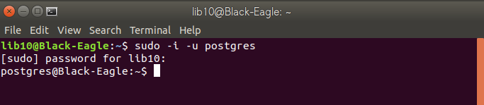

To access a Postgres prompt type:

`$ psql`

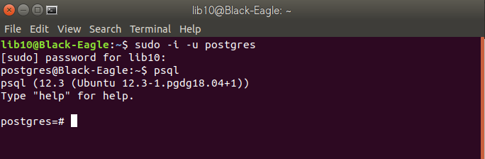

Now you will be logged in and able to start the interaction with the database.

To quit from Postgres prompt just type this command:

`postgres=# \q`

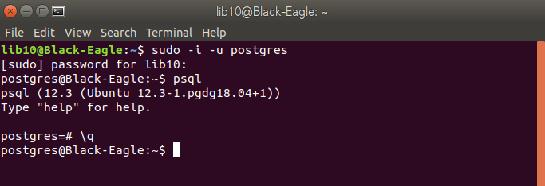

##### Accessing without Switching Accounts

Following is the command that will log into Postgres without the intermediary _bash_ shell in between. That means this will redirect to you on the `psql` command prompt:

`$ sudo -u postgres psql`

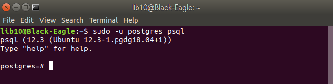

##### How to check Roles in PostgreSQL

To check the list of roles first type the following command:

`psql`

then type this:

`\du`

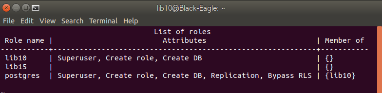

We will see the list of roles with their name, list of attributes, and member of which role.

##### Create roles in PostgreSQL

We noticed that by default there is a role named `postgres`. We can also create a new roll

from the Postgres prompt.

First, enter into the prompt by typing `psql` if you are not already in.

Then we can create a role simply typing this:

`CREATE ROLE new_roll_name;`


And we can add a password for the login session and add attributes that will define which types of access the role has been authorized to manipulate into the database. Then we can also add to the column 'member of' if the role is under any member.

Let's add a role where the user name is `SubAdmin`with authorized as `SUPERUSER`, `CREATEDB`attributes and `PASSWORD`is 'abcd':

`CREATE ROLE SubAdmin WITH SUPERUSER CREATEDB PASSWORD 'abcd'; `

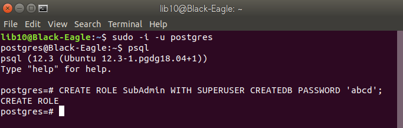

Type `\du` to see the newly created role.

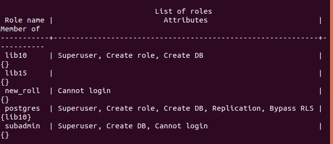

##### Update and Delete a Role in PostgreSQL

Suppose we need to add more attributes to our new role `lib10` and that means we need to update the role attributes change the password.

To update attributes to the new role and change it's password type the command:

`ALTER USER WITH SUPERUSER CREATEDB CREATEROLE LOGIN ENCRYPTED PASSWORD 'Newabcd';`

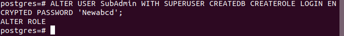

If we need to delete a role than simply type:

`DROP ROLE SubAdmin;`

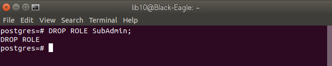

##### Create and Delete Roles from using shell commands (Without connecting `psql`)

To create a database role with non-superuser access from the shell just type and enter:

`createuser -PE RoleName`

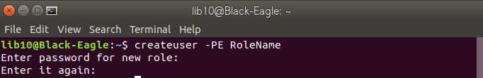

Where our `-P` flag prompts to set a password for the new role and the `-E`flag indicates to store the password as an MD5-encrypted string.

We can check the role created by connecting to `psql`and running `\du` command.

To Delete a database role from the shell just type:

`dropuser -i RoleName`


To create a superuser from the shell type:

`createuser -sPE SuperuserName`


#### How to create database

There are two ways to create a database.

To create a database from shell type:

`$ createdb databaseName1`

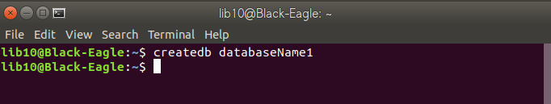

To create a database from `psql`type:

`CREATE DATABASE databaseName2;`

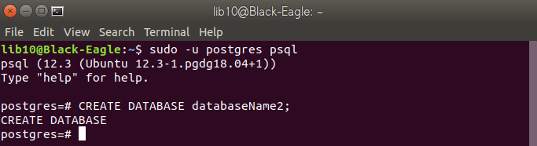

To see the list of databases and their details type from `psql`:

`\l`

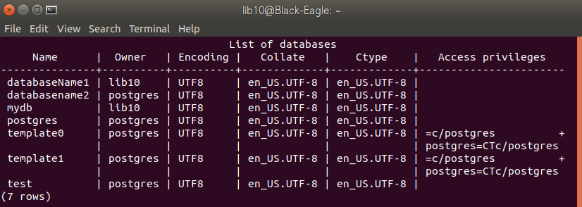

To delete a database from the shell type:

`$ dropdb databaseName1`


And to delete the database from the `psql` type this:

`DROP DATABASE databaseName2;`

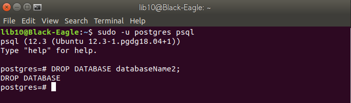

#### How to connect a database

To connect a database type from the shell:

`psql databasename;`


To switch from another database type:

`\c databasename2`

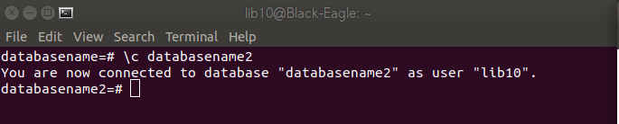

To get help for various SQL commands type:

`\h`

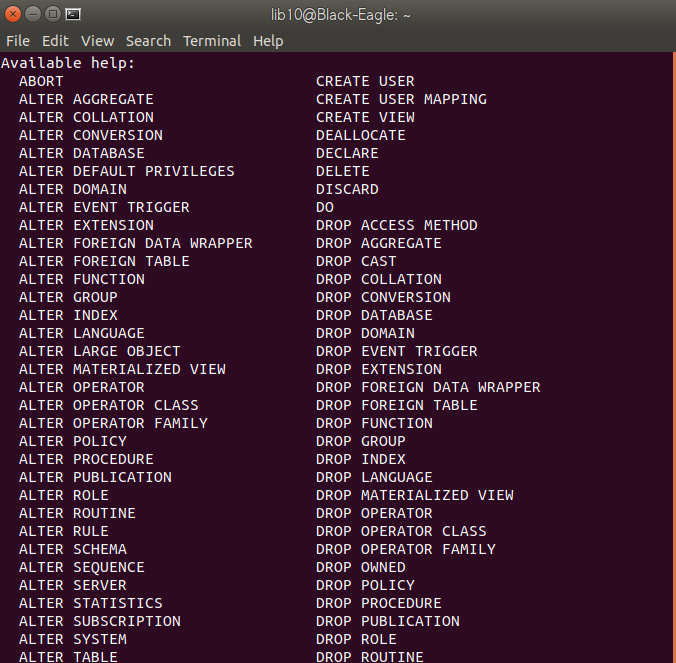

To quit from the database type:

`\q`

### The SQL Language

To store, retrieve, and manipulate database PostgreSQL uses the basic SQL language. Let's see some examples.

#### Creating a new table to a database

In SQL to create a table, we need to define the table name, column name, and their data types.

To create a table type copy this:

```sql
CREATE TABLE weather (
    city            varchar(80),
    temp_lo         int,           -- low temperature
    temp_hi         int,           -- high temperature
    prcp            real,          -- precipitation
    date            date
);
```

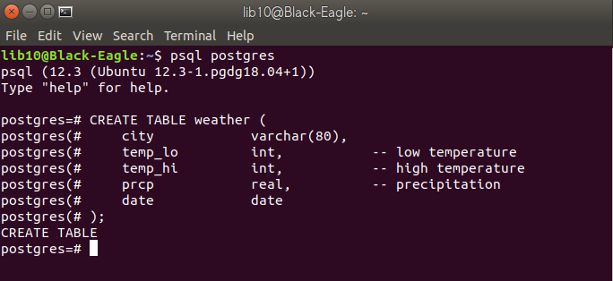

Here we can see a table named weather where 5 columns and their data types added. Here in the first column `city` is a column and `varchar` is its types with a range of 80 characters. We can add a comment to start with`--` and we can see three comments here.

Another example:

```sql
CREATE TABLE cities (
    name            varchar(80),
    location        point
);
```

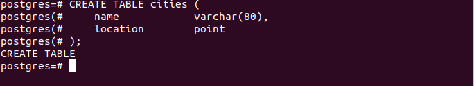

The `point` type is an example of a PostgreSQL specific data type.

#### Deleting a table from a database

To delete a database type this:

```sql
DROP TABLE tablename;
```

#### Inserting Data Into The Table

To add or insert data into a table type this example:

```sql
INSERT INTO weather VALUES ('San Francisco', 46, 50, 0.25, '1994-11-27');
```

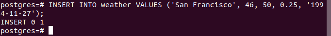

Here we can see the table name should be specified with its columns value.

Another example:

```sql
INSERT INTO cities VALUES ('San Francisco', '(-194.0, 53.0)');
```

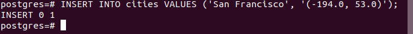

We saw a type PostgreSQL specific data type `point` above example shows that we the of `point` type should be defined as coordinate pairs.

An alternative way to insert data to avoid remembering the column name:

```sql
INSERT INTO weather (city, temp_lo, temp_hi, prcp, date)
    VALUES ('San Francisco', 43, 57, 0.0, '1994-11-29');
```


The column name can be listed in a different order.

```sql
INSERT INTO weather (date, city, temp_hi, temp_lo)
    VALUES ('1994-11-29', 'Hayward', 54, 37);
```

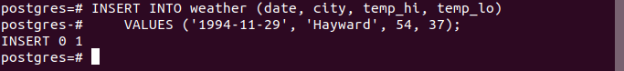

An additional feature and optimized way to insert a large number of data just type `COPY`command with the table name and its location where the database exists.

```sql
COPY weather FROM '/location/fileName.txt';
```

#### Querying data from the table

To retrieve data from a table type this:

```sql
SELECT * FROM weather;
```

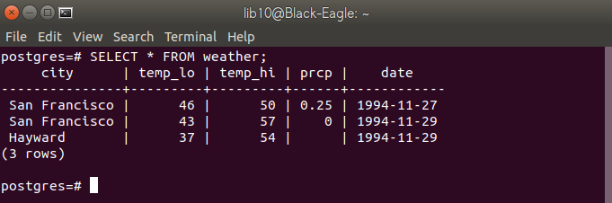

We can write expressions, not just simple column references, in the select list. For example, we can do:

```sql
SELECT city, (temp_hi+temp_lo)/2 AS temp_avg, date FROM weather;
```

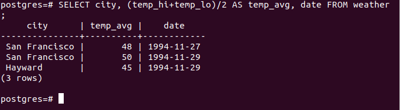

#### Deleting Data Into The Table

To delete a certain record we will use `DELETE` and `WHERE`. By using `WHERE` clause we are giving a certain condition which record to delete. We will discuss about `WHERE` more in upcoming topics.

Type this to delete the third row from the table `weather`:

`DELETE FROM weather WHERE temp_lo = 37;`


Now let's check the table by typing this:

`SELECT * FROM weather;`


#### Creating a Table With Constraints

We can specify some constraints to a table where the constraints need to be satisfied to insert data into the table.

Let's create a table with some constraints where all column has a constraint `NOT NULL` except `email`column. Type this:

```sql
CREATE TABLE person1 (
	id BIGSERIAL NOT NULL PRIMARY KEY,
	first_name VARCHAR(50) NOT NULL,
	last_name VARCHAR(50) NOT NULL,
	email VARCHAR(50),
	gender VARCHAR(5) NOT NULL,
	data_of_birth DATE NOT NULL
);
```

The constraint `NOT NULL` specifies that the column must have a data, it can not be left as blank.

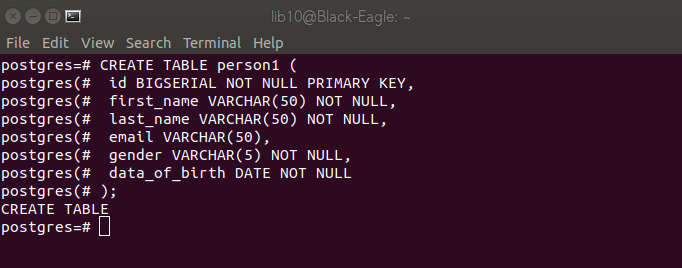

Let's check and see the description of the table by typing:

`\d person`


#### Creating a table and Inserting Into that table from a SQL file

Let's assume that we have a SQL file where we have a table named `person` and it's column values in a location named `/filelocation/person.sql`. Now, we need to run that file from PostgreSQL prompt, then type:

`\i /filelocation/person.sql`

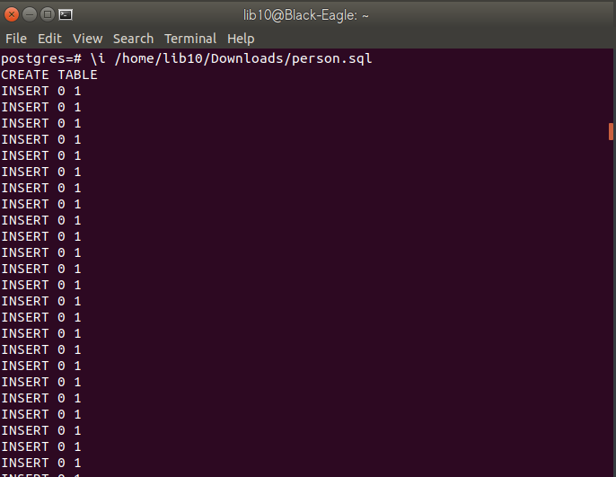

To retrieve all data from the table type:

```sql
SELECT * FROM person;
```

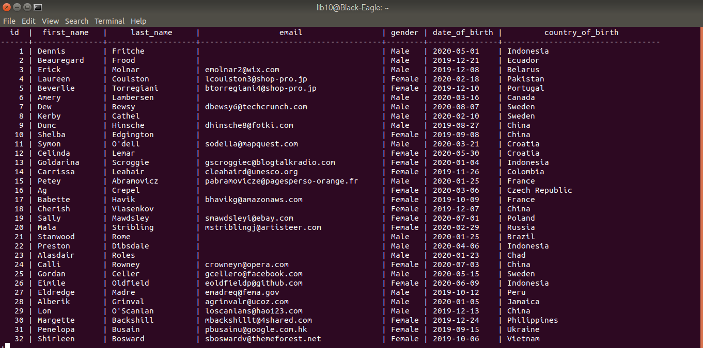

#### Sort Data by Using 'Order BY'

In SQL we can retrieve sorted data of a table by using `ORDER BY` command. Let's try to retrieve the sorted data by ascending order from our previous table by their country_of_birth. Type the following SQL Command.

```sql
SELECT * FROM person ORDER BY country_of_birth ASC;
```


Notice above the table where the `country_of_birth` is sorted by Ascending Order.

To sort the column by descending order type:

```sql
SELECT * FROM person ORDER BY country_of_birth DESC;
```

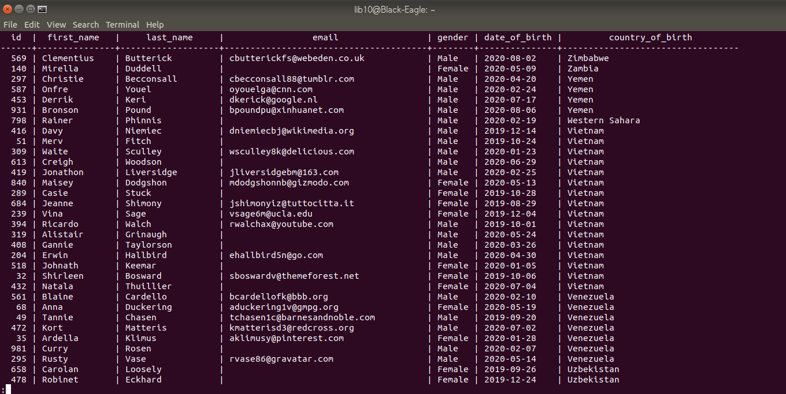

Now, notice above the table where the `country_of_birth` is sorted by Descending Order.

Like these, we can sort the table by the rest of the column names. (`id, first_name, last_name, email, date_of_birth`)

Now, Let's sort the table by multiple column names. Type this:

```sql
SELECT * FROM person ORDER BY first_name, email;
```

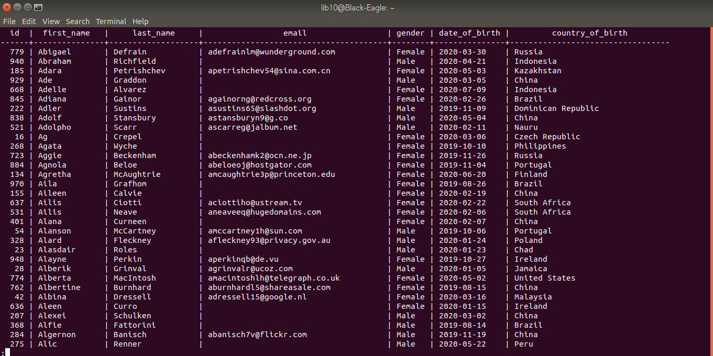

The output of the command is showing that `first_name` and `email` columns are sorted in Ascending Order.

Taking only one column and sort that column in Ascending Order type:

```sql
SELECT last_name FROM person ORDER BY last_name ASC;
```

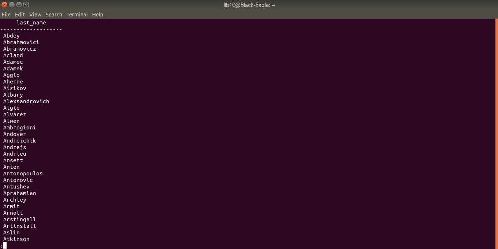

To retrieve unique data of a column we will use `DISTINCT` command.

Let's assume that we need to retrieve the unique `country_of_birth` which are appeared only once on the table `person` let's type:

```sql
SELECT DISTINCT first_name  FROM person ORDER BY first_name;
```

Following image is showing the output:

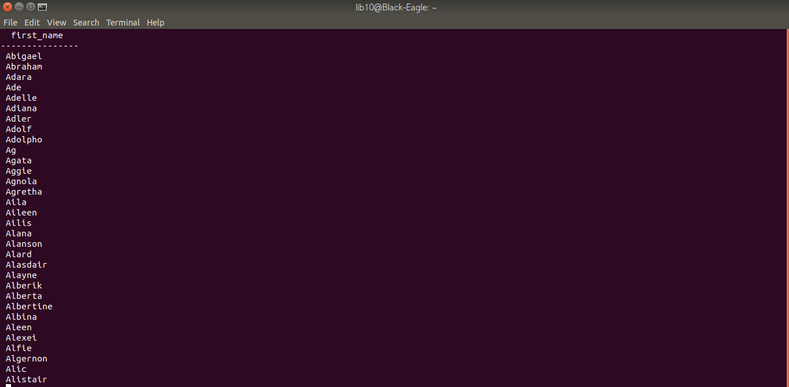

#### Uses of WHERE Clause, AND and OR in PostgreSQL

To retrieve data of a specific group such as `gender = Female` from the table `person` type this:

```sql
SELECT * FROM person WHERE gender = 'Female';
```

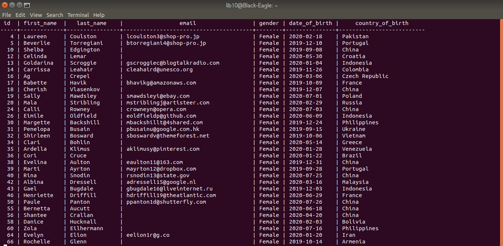

We can use multiple conditions in WHERE clause using `AND` conditional operator.

Let's retrieve data of male gender from country Poland, type:

```sql
SELECT * FROM person WHERE gender = 'Male' AND country_of_birth = 'Poland';
```

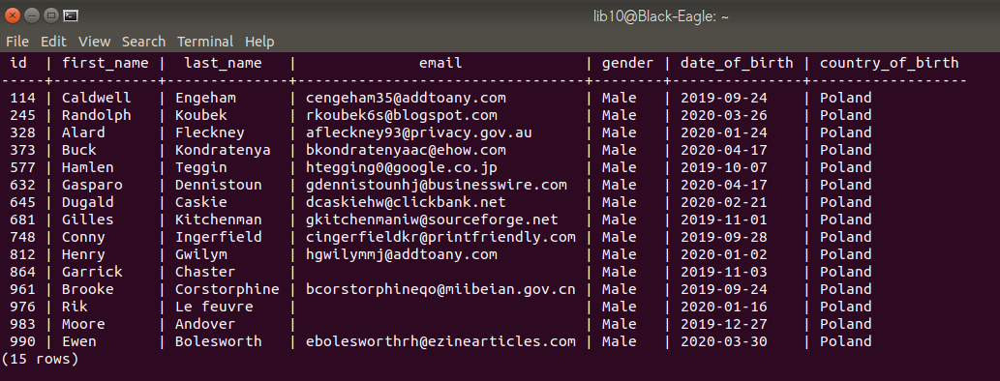

Now, we will use the OR condition to retrieve data from more than one country. For showing male gender from Poland and Bangladesh type this:

```sql
SELECT * FROM person WHERE gender = 'Male' AND country_of_birth = 'Poland' OR country_of_birth = 'Bangladesh';
```

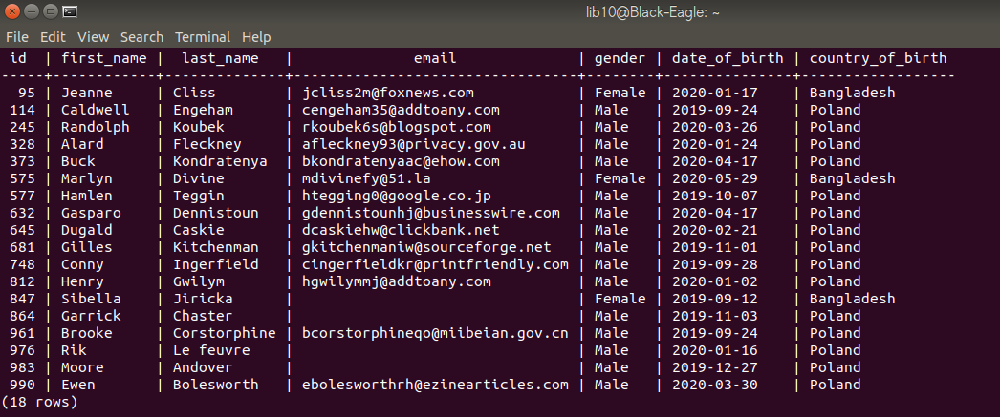

#### Using Comparison Operators in PostgreSQL

In SQL this is allowed to use some types of operations and they are:

- Arithmetic Operations
- Comparison Operations
- Bitwise Operations
- Logical Operations

Following are some comparison operations performing on `psql` :

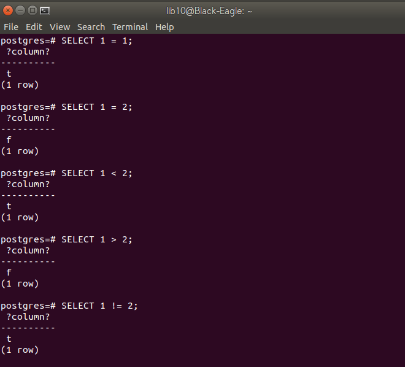

Here, t = true and, f = false.

We can also perform these operations on other data types. Let's see how to perform on string:

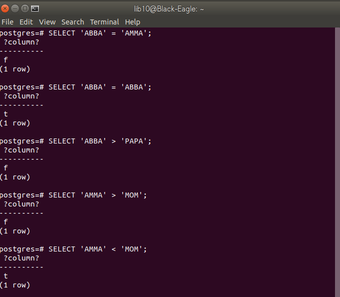

#### Using LIMIT, OFFSET & FETCH keywords

`LIMIT` is used to retrieve specific numbers of data from data. Let's assume that we want to see only the first 10 rows from the `person` table, then type this:

```sql
SELECT * FROM person LIMIT 10;
```

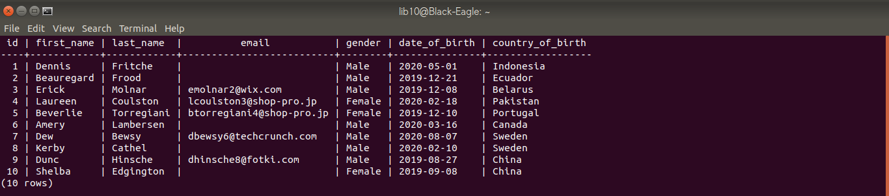

`OFFSET` keyword is used when we need to skip a certain amount of data and start from where want to see.

Let's assume that, we want to retrieve and show 10 rows of data skipping the first 5 rows from the table, then type this:

```sql
SELECT * FROM person OFFSET 5 LIMIT 10;
```

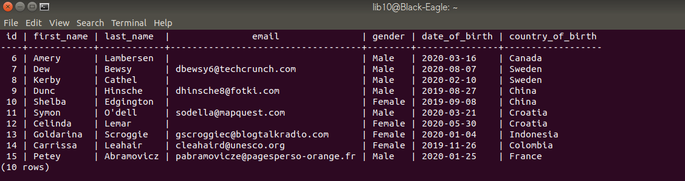

Here above image, you can see the `id` column started from `6` and showing only 10 rows till `id` is `15`.

`FETCH` keyword allows the same thing as `LIMIT` but `LIMIT` is not a standard SQL keyword where `FETCH` is an actual standard keyword in SQL.

Let's see an example, type this:

```sql
SELECT * FROM person OFFSET 5 FETCH FIRST 5 ROW ONLY;
```

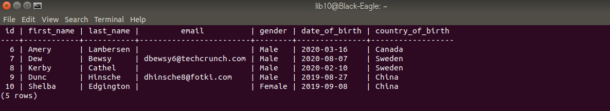

#### Using of `IN` Keyword

This keyword is used for showing specific data related to specific values.

Let's assume that we want to show data only from `country_of_birth` Poland, Brazil, France, then type this:

```sql
SELECT * FROM person WHERE country_of_birth IN ('Poland', 'Brazil', 'France');
```

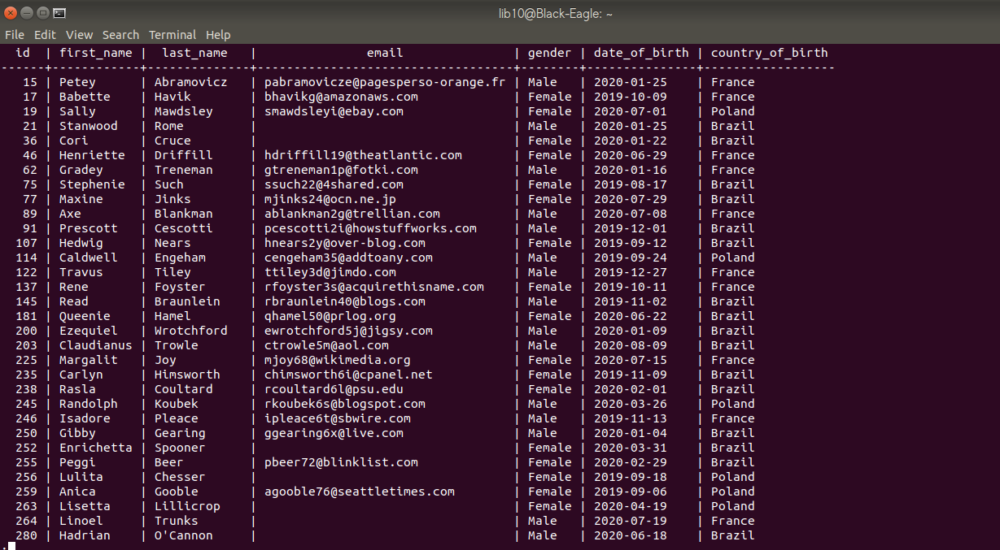

#### Using of `BETWEEN` Keyword

This keyword is used to select data from a range. To find persons in a specific range of `date_of_birth` type:

```sql
SELECT * FROM person WHERE date_of_birth BETWEEN DATE '2019-01-01' AND '2019-10-01';
```

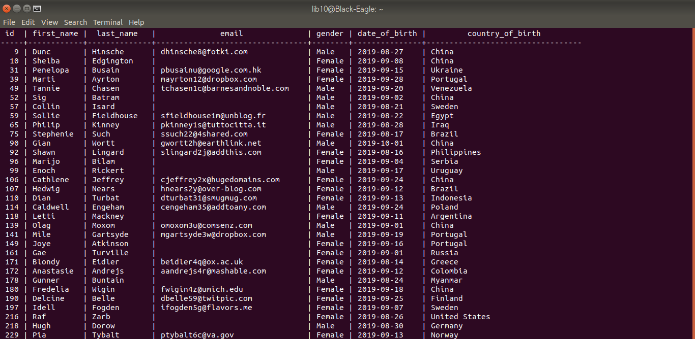

#### Using of `LIKE` and `ILIKE` operators

Let's retrieve data using `LIKE` of email addresses of `.org` the domain from `email`, type this:

```sql
SELECT * FROM person WHERE email LIKE '%.org';
```

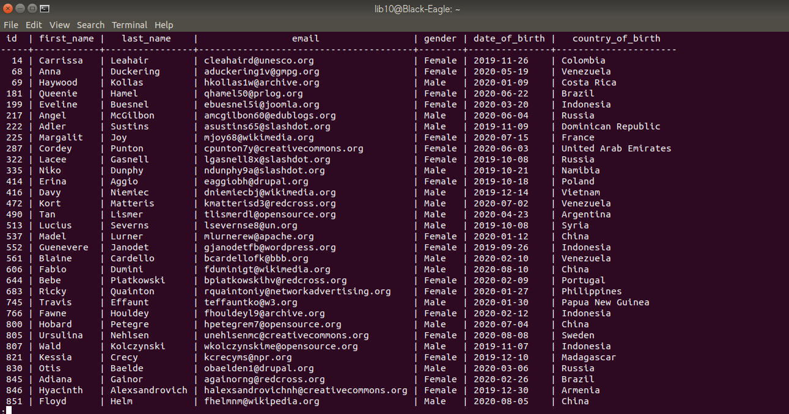

We can specify at least how many characters will appear before `.org`

For example, we want only those email addresses which have at least 17 characters long before`.org` then we need to add 17 numbers of '\_' (dash) before the `.org` domain by typing like this:

```sql
SELECT * FROM person WHERE email LIKE '%_________________.org';
```

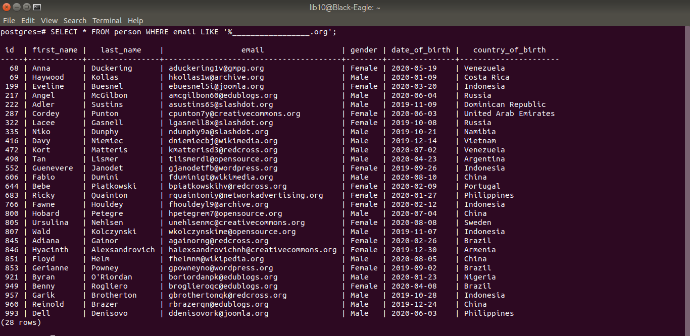

`ILIKE` is used to ignore the case sensitive issues. Such as, we will type same SQL command replacing `LIKE` with `ILIKE` exactly before we used where we will type `.org` as a capital case `.ORG` and it will show the exact same output.

```sql
SELECT * FROM person WHERE email ILIKE '%_________________.ORG';
```

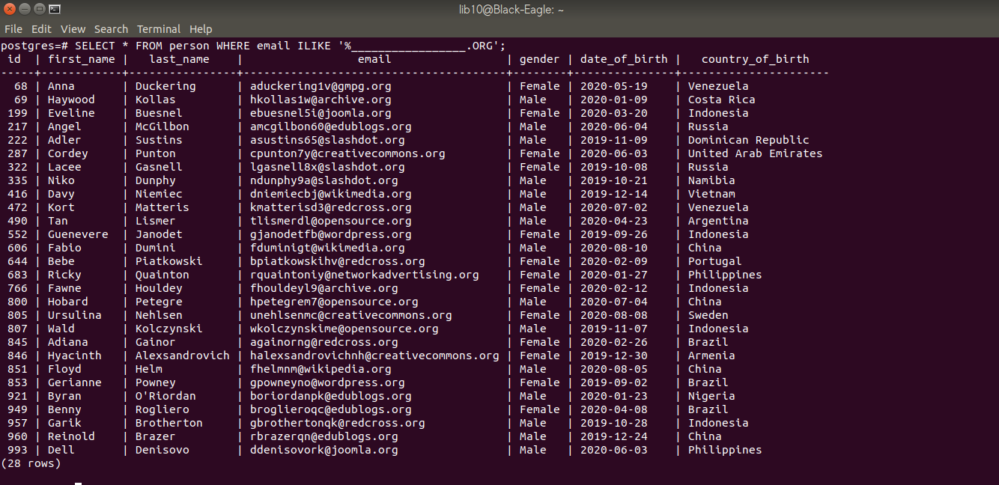

#### Using `GROUP BY` Keyword

This is used for grouping by the basis of columns of a table. Let's see an example.

Suppose, we need to calculate the statistics of how many people we have from each of the countries on the table. Then type this:

```sql
SELECT country_of_birth, COUNT(*) FROM person GROUP BY country_of_birth;
```

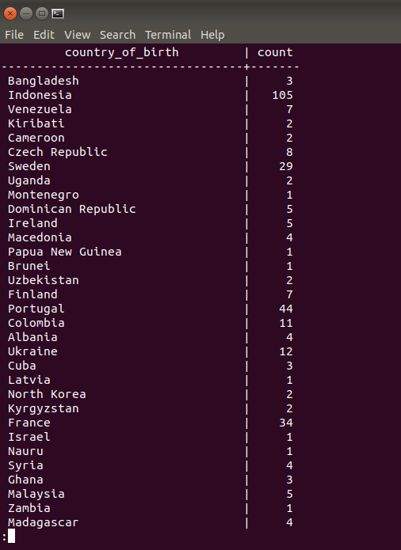

We can use `HAVING` keyword with `GRPOP BY` keyword to specify a condition.

Let's suppose that we want only those `country_of_birth` which have more than 5 persons on the table. Then type:

```sql
SELECT country_of_birth, COUNT(*) FROM person GROUP BY country_of_birth HAVING COUNT(*) > 5 ORDER BY country_of_birth;
```

 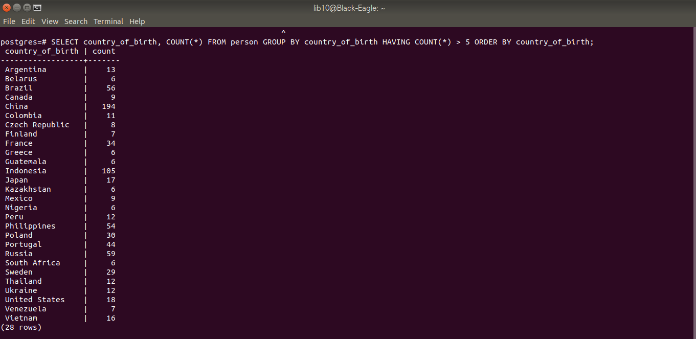

We used `COUNT()` in previous examples which were an Aggregate Function. This function is used for calculating the number of values of a column. There are more aggregate functions like SUM() - calculate the summation of the values of a column, AVG() - gives an average of the values of a column, MIN() - gives the minimum value of a column, MAX() - gives the maximum value of a column, etc.

Before using these Aggregate Functions we will create a table and insert into that table from another SQL file named car.sql:

`\i /filelocation/car.sql`

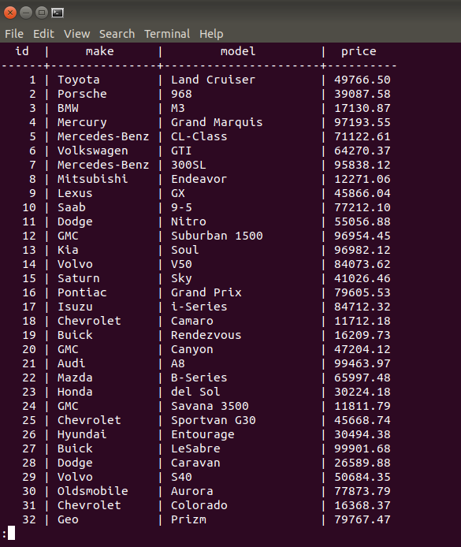

To get the maximum, minimum, average and sum value of `price` type:

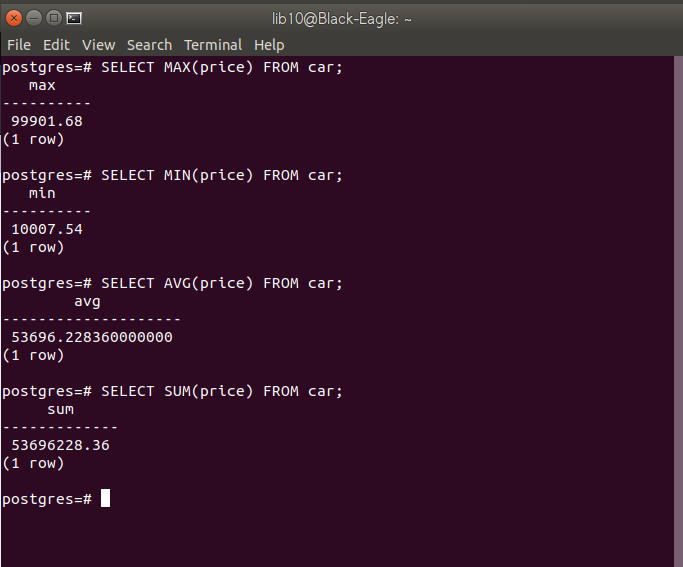

#### Using Arithmetic Operations

To perform arithmetic operations have a look following the image:

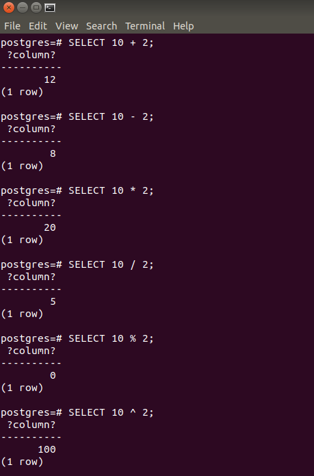

To perform 10% OFF into the price of the car, let's type a query:

```sql
SELECT id, make, model, price AS Original_Price, round(price * .10, 2) AS Ten_Percent, ROUND(price - (price) * .10) AS After_Discount FROM car;
```

Here, `ROUND()` is a function to make the required figure of a number. Then `AS` is an Alias that uses to set the column names.

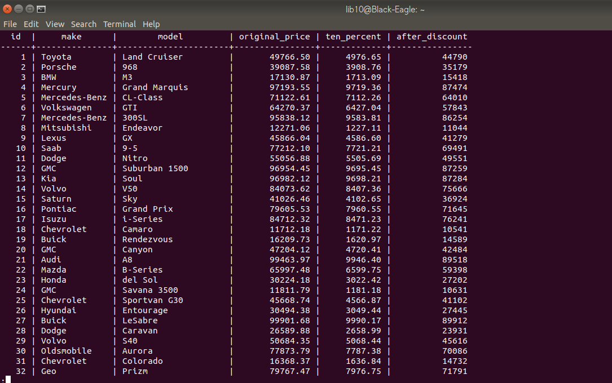

### How to Handle NULL Values in PostgreSQL

#### Uses of `COALESCE`

When a column has some NULL values and we want to set those values by a default value without leaving them totally blank, we can use `COALESCE` in PostgreSQL.

Let's see how it actually looks before and after using `COALESCE` when selecting data from a table.

Before using `COALESCE`:

```mssql
SELECT COALESCE(email) FROM person;
```

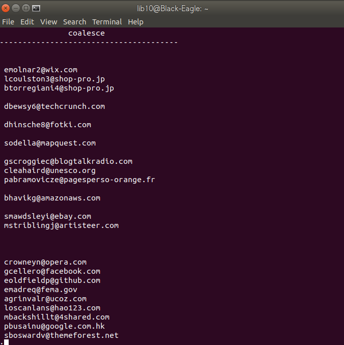

After using `COALESCE`

```sqlite
SELECT COALESCE(email, 'Email Not Provided.') FROM person;
```

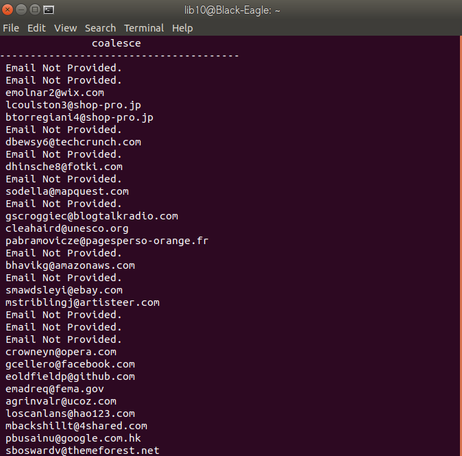

#### Uses of `NULLIF`

This is used to handle division by zero.

Have a look on the following screen shot:

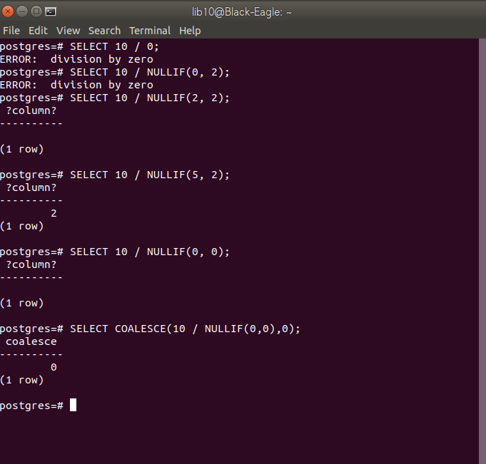

We know that in arithmetic a numeric value can not be divided by Zero. So as usual Postgres

raises error while we try to perform division operation by Zero. So in that case we use the `NULLIF` keyword where two parameters are used, the first one is considered to divide the given value only if the value is greater than or equal to the second value.

It doesn't show the result while both parameters are zero, meanwhile, we can use `COALESCE` to set a default value that will show a 'Zero'

### Timestamps and Dates in PostgreSQL

Let's see some date and times operations on terminal:

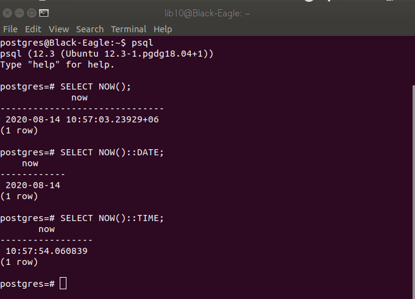

#### Adding and Subtracting With Date

We can add or subtract with dates in PostgreSQL using the `INTERVAL` keyword.

Let's try to subtract '1 YEAR', '10 YEAR', '10 MONTHS', '10 DAYS' from current dates. Type:

```sql
SELECT NOW() - INTERVAL '1 YEAR';
```

```sql
SELECT NOW() - INTERVAL '10 YEAR';
```

```sql
SELECT NOW() - INTERVAL '10 MONTHS';
```

```sql
SELECT NOW() - INTERVAL '10 DAY';
```


To add '1 YEAR', '10 YEAR', '10 MONTHS', '10 DAYS' from current dates. Type:

```sql
SELECT NOW() + INTERVAL '1 YEAR';
```

```sql
SELECT NOW() + INTERVAL '10 YEAR';
```

```sql
SELECT NOW() + INTERVAL '10 MONTHS';
```

```sql
SELECT NOW() + INTERVAL '10 DAY';
```


If we want to cast the only date and ignore the time, type:

```sql
SELECT (NOW() + INTERVAL '10 YEAR')::DATE;
```

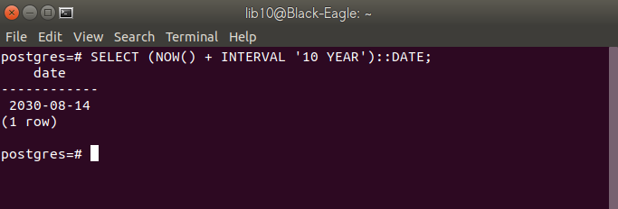

#### Extracting Field From Date, Times in PostgreSQL

We can extract single value such as Year, Month, Date, Minutes, etc. from dates and times by using `EXTRACT` keyword.

Let's walk through some example on terminal:

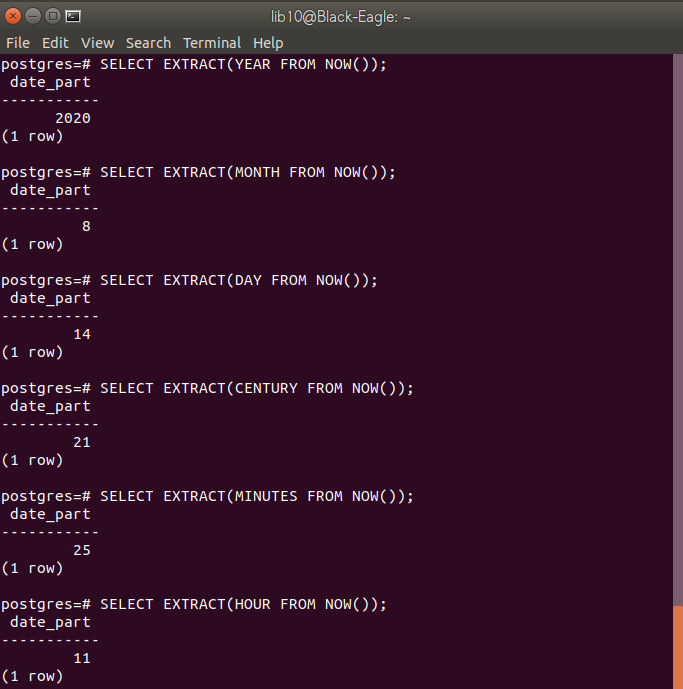

#### Using `AGE()` Function To Calculate Age

Let's calculate the age of all persons using `AGE()` function and `date_of_birth` column from our previous `person` table:

Type this:

```sql
SELECT first_name, last_name, gender,country_of_birth, AGE(NOW(), date_of_birth) AS age FROM person;
```

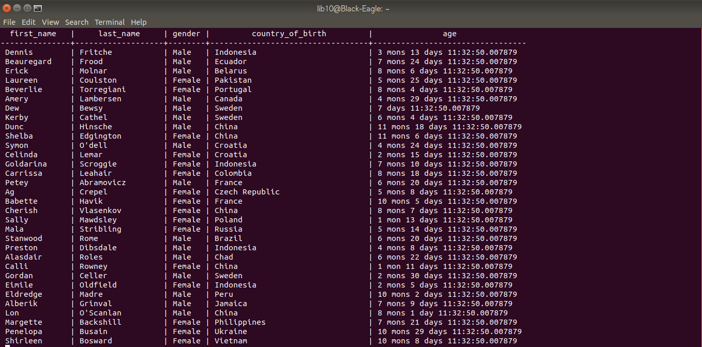

### Primary Key In PostgreSQL

We use the PRIMARY KEY to differ from the same values of a column or record. Such as, we can use a unique id to identify them as individuals where two person's first_name, last_name, and date_of_birth are the same in a table.

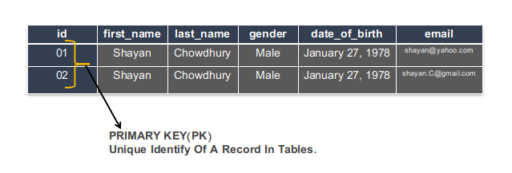

#### Understanding Primary Keys

If we notice in the description of the table `person` then we can see that the table has already a constraint name 'person_pkey' for column `id` which is the PRIMARY KEY of the table. Type:

`\d person`

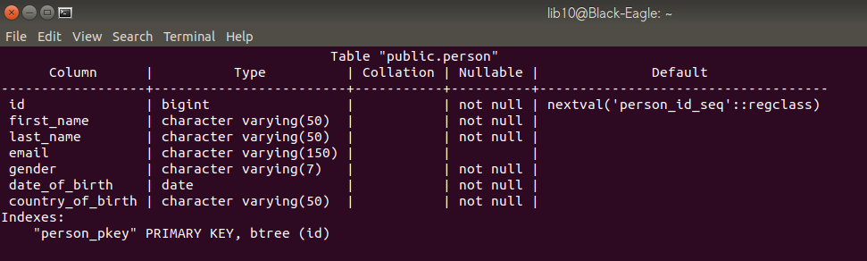

Now type the following query to see the first row of the table:

```sql
SELECT * FROM person LIMIT 1;
```

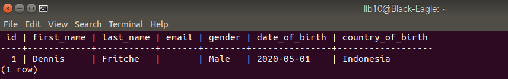

Now if we insert again the same record as row number 1 to the table Postgres will raise an error that will say.

`ERROR: duplicate key value violates unique constraint "person_pkey" DETAIL: Key (id)=(1) already exists.`

Let's try to insert same records into the table:

```sql
insert into person (id, first_name, last_name, email, gender, date_of_birth, country_of_birth) values (1, 'Dennis', 'Fritche', null, 'Male', '01-May-2020', 'Indonesia');
```

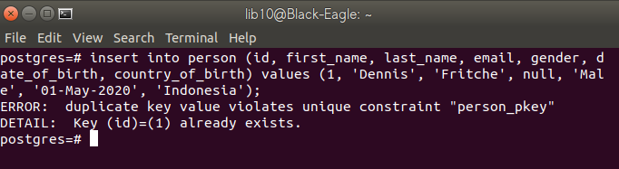

Now, let's Drop the CONSTRAINT from the table:

```sql
ALTER TABLE person DROP CONSTRAINT person_pkey;
ALTER TABLE
```

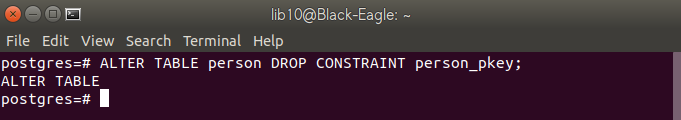

Notice at the below image where we can see the CONSTRAINT 'person_pkey' is dropped and there is no field that contains PRIMARY KEY.

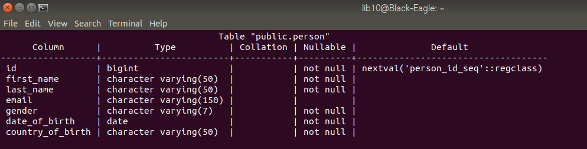

Now let's try to insert same records again, and this time the record will be inserted into the table:

```sql
insert into person (id, first_name, last_name, email, gender, date_of_birth, country_of_birth) values (1, 'Dennis', 'Fritche', null, 'Male', '01-May-2020', 'Indonesia');
```

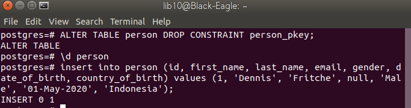

Type the following command to see the inserted record into the table:

```sql
SELECT * FROM person WHERE id = 1;
```

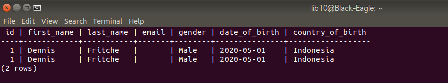

#### Adding Primary Key

In the previous topic, we dropped the CONSTRAINT from the `person` table and there is no PRIMARY KEY on the table `person`.

Now let's add PRIMARY KEY to that table by typing:

```sql
ALTER TABLE person ADD PRIMARY KEY(id);
```

And This will raise an error like this:

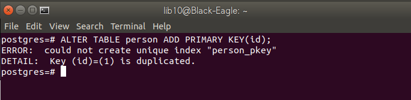

Because the field needs to be unique to set it PRIMARY KEY but there is already two exactly the same records which we inserted into the table.

So first let's remove the duplicate records by typing this:

```sql
DELETE FROM person WHERE id = 1;
```

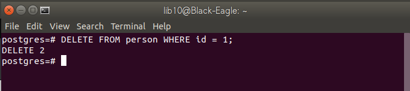

Now, Insert the deleted unique record into the table:

```sql
insert into person (id, first_name, last_name, email, gender, date_of_birth, country_of_birth) values (1, 'Dennis', 'Fritche', null, 'Male', '01-May-2020', 'Indonesia');
```

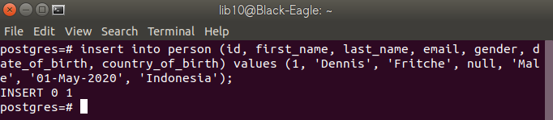

This time we can add the PRIMARY KEY into the table. Type this:

```sql
ALTER TABLE person ADD PRIMARY KEY(id);
```

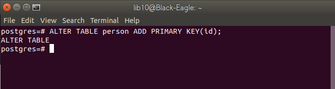

Let's check the CONSTRAINT of the table `person` by typing:

`\d person`

and we will notice the PRIMARY KEY is added.

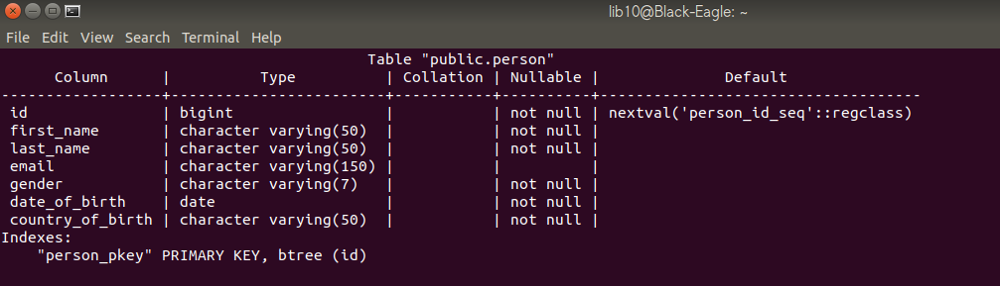

#### UNIQUE CONSTRAINTS

To set other fields or columns allowed for the only unique value that means there can not be any duplicate value in a column, we can use `UNIQUE` CONSTRAINT.

Let's make `email` column as `UNIQUE` constraint, type this:

```sql
ALTER TABLE person ADD CONSTRAINT unique_email_address UNIQUE (email);
```

To check if the CONSTRAINT is added let's type:

`\d person`

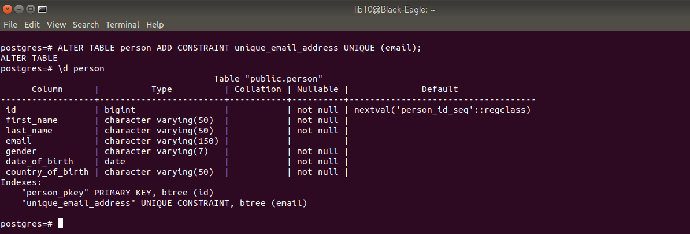

Now we can not insert the same `email` value into table `person` that email address already contains any row from the table.

#### CHECK CONSTRAINTS

Another CONSTRAINT is used that checks values from a certain condition. If want to we add this constraint to the `gender` column of the table `person` then type:

```sql
ALTER TABLE person ADD CONSTRAINT gender_constraint CHECK (gender = 'Female' OR gender = 'Male');
```

Here we set a CONSTRAINT that checks the inserted `gender` is whether `Male` or `Female`. That means we can not insert a record that contains any other string rather than 'Male' or 'Female',

Type `\d person` to check the CONSTRAINTS from the indexes:

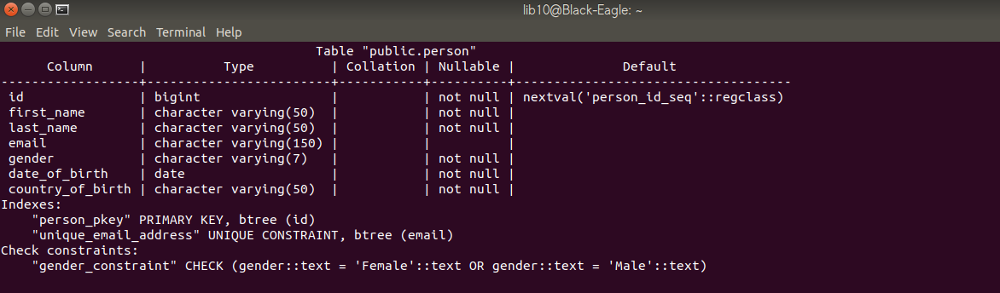

### Updating Records in PostgreSQL

`UPDATE` command SQL allows us to update a column or multiple columns using `WHERE` clause.

Let's update a row where id is 901 and we will replace the email address with a new mail address:

First let's see the id number 901 with `SELECT` command:

```sql
SELECT * FROM person WHERE id = 901;
```

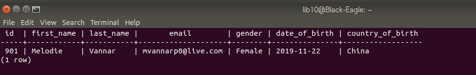

Then type the following command to update the mail address replacing by `newmail@gmail.com`.

```sql
UPDATE person SET email = 'newmail@gmail.com' WHERE id = 901;
```

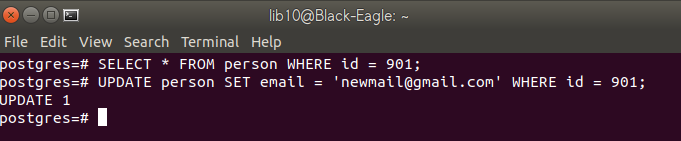

To show the Output:

```sql
SELECT * FROM person WHERE id = 901;
```

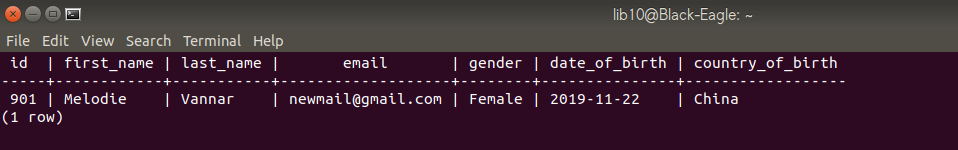

To update multiple column such as, we will update the first_name and last_name of id number 901. Let's Do it:

```sql
UPDATE person SET first_name = 'Scarlett', last_name = 'Johansson' WHERE id = 901;
```

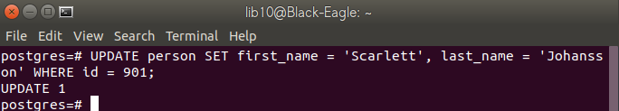

```sql
SELECT * FROM person WHERE id = 901;
```

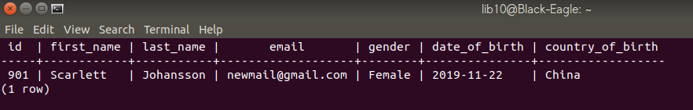

### On Conflict Do Nothing

To handle duplicate key error we can use ON CONFLICT command. Let's work through on terminal:

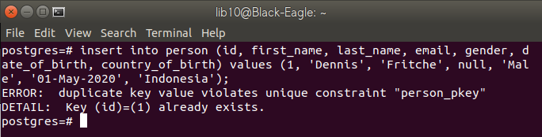

To ignore this error add at the end of the insert command before the semicolon end:

```sql
ON CONFLICT(id) DO NOTHING;
```

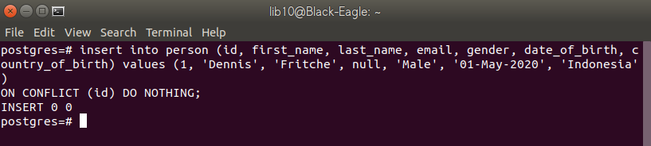

**_Note:_** It will only work for the Unique column, here id and email are containing unique values.

#### ON CONFLICT DO UPDATE

This keyword does similarly what our previous `UPDATE` command was used for. Let's try to update the country_of_birth column of `id` number 1 of the `person` table.

```sql
`SELECT * FROM person WHERE id = 1;`
```

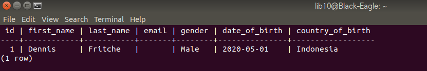

We are going to change the country_of_birth from 'Indonesia' to 'Finland':

```sql
insert into person (id, first_name, last_name, email, gender, date_of_birth, country_of_birth) values (1, 'Dennis', 'Fritche', null, 'Male', '01-May-2020', 'Indonesia')
ON CONFLICT (id) DO UPDATE SET country_of_birth = 'Finland';
```

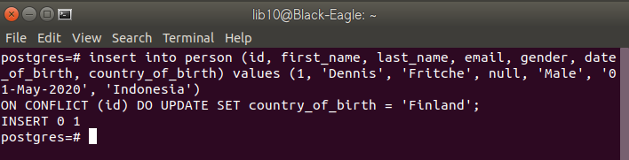

```sql
SELECT * FROM person WHERE id = 1;
```

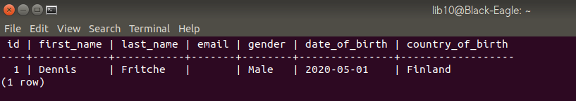

### What Is A Relationship/Foreign Keys

A foreign key refers to a column or a group of columns in a table that references the primary key of another table.

Let's see an example of creating two table names `customers` and `contacts`. In this example, the `customers` table is the parent table and the `contacts` table is the child table. [ i ]

Each customer has zero or many contacts and each contact belongs to zero or one customer.

```sql
CREATE TABLE customers(
   customer_id INT GENERATED ALWAYS AS IDENTITY,
   customer_name VARCHAR(255) NOT NULL,
   PRIMARY KEY(customer_id)
);

CREATE TABLE contacts(
   contact_id INT GENERATED ALWAYS AS IDENTITY,
   customer_id INT,
   contact_name VARCHAR(255) NOT NULL,
   phone VARCHAR(15),
   email VARCHAR(100),
   PRIMARY KEY(contact_id),
   CONSTRAINT fk_customer
      FOREIGN KEY(customer_id)
	  REFERENCES customers(customer_id)
);
```

The following foreign key constraint `fk_customer` in the `contacts` table defines the `customer_id` as the foreign key:

```sql
     CONSTRAINT fk_customer
   FOREIGN KEY(customer_id)
      REFERENCES customers(customer_id)
```

The following inserts data into the `customers` and `contacts` tables:

```sql
INSERT INTO customers(customer_name)
VALUES('BlueBird Inc'),
      ('Dolphin LLC');

INSERT INTO contacts(customer_id, contact_name, phone, email)
VALUES(1,'John Doe','(408)-111-1234','john.doe@bluebird.dev'),
      (1,'Jane Doe','(408)-111-1235','jane.doe@bluebird.dev'),
      (2,'David Wright','(408)-222-1234','david.wright@dolphin.dev');
```

The following statement deletes the customer id 1 from the `customers` table:

```sql
DELETE FROM customers
WHERE customer_id = 1;
```

Because of the `ON DELETE NO ACTION`, PostgreSQL issues a constraint violation because the referencing rows of the customer id 1 still exist in the `contacts` table:

```
     ERROR:  update or delete on table "customers" violates foreign key constraint "fk_customer" on table "contacts"
DETAIL:  Key (customer_id)=(1) is still referenced from table "contacts".
SQL state: 23503
```

Let's walk through on terminal:

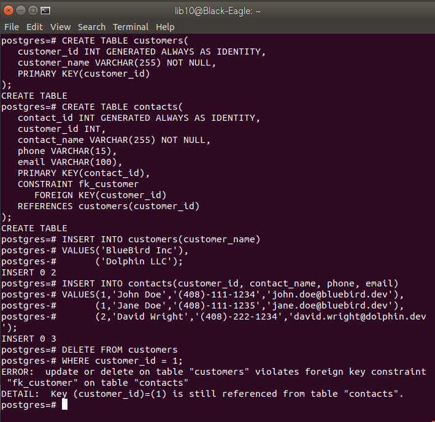

And let's check on our `contacts` table:

`\d contacts`

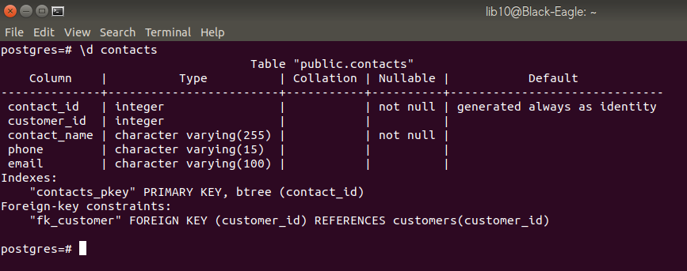

We can see that foreign-key constraints "fk_customer" were assigned successfully.

And now let's check the table data:

```sql
SELECT * FROM contacts;

SELECT * FROM customers;
```

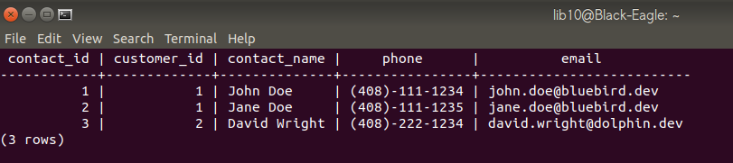

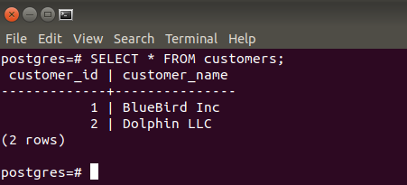

### Inner Join

`INNER JOIN` takes whats the common between two tables.

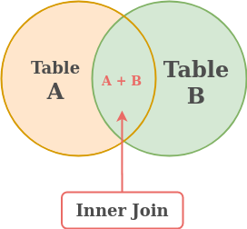

**Inner Join in PostgreSQL:**

To see INNER JOIN between two tables `contacts` and `customers type:`

```sql
SELECT * FROM contacts
JOIN customers ON contacts.customer_id = customers.customer_id;
```

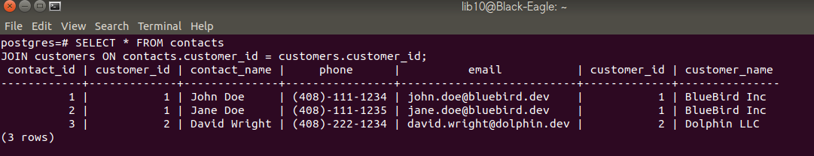

Note: A `JOIN` simply links two tables where the primary key and foreign key is found in both tables.

### Left Join

A Left Join between two tables `A` and `B` includes all rows of table `A` and as always the records from table `B` that has a corresponding relationship with table `A`.

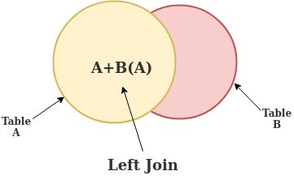

In case the Left Join includes those rows also where the foreign key wasn't assigned.

To show left join between `contacts` and `customer` table type:

```sql
SELECT * FROM contacts LEFT JOIN customers ON customers.customer_id = contacts.customer_id;
```

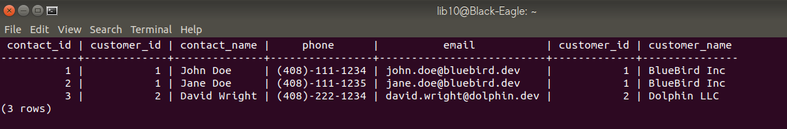

### Deleting Records with foreign keys

When we try to delete a record from `customers` table it will raise an error. Let's say we want to delete a record from `customers` table where customer_id = 2 and the error will raise something following like this:

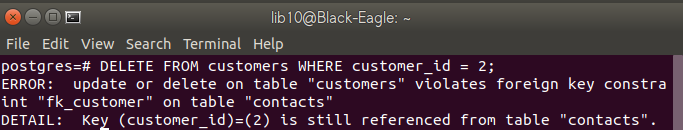

In that case, it means that first, we have to delete the record from the `contacts` table where the foreign key was assigned.

Let's delete the record from `contacts` table:

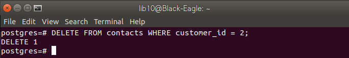

This is showing the record is deleted successfully.

And then now we can delete the record from the `customers` table too!

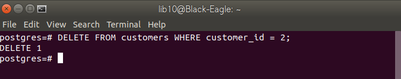

### Exporting Query Results To CSV

We can see the directory where our files are saving by typing:

`\!pwd`

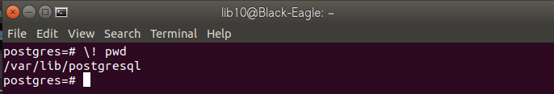

Now let's export the csv file `result.csv` from a table to that location:

`\copy ( SELECT * FROM contacts LEFT JOIN customers ON customers.customer_id = contacts.customer_id) TO '/var/lib/postgresql/results.csv' DELIMITER ',' CSV HEADER; `

Here is the location where result.csv is exported.

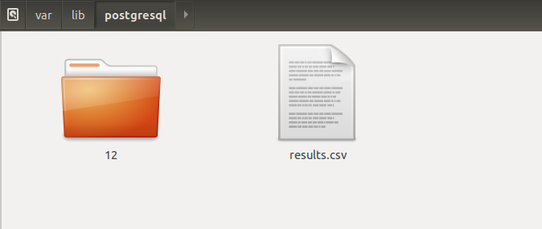

And here is the exported CSV file.

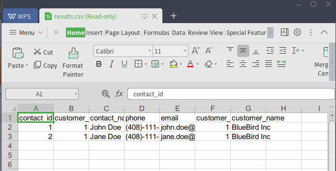

### UUID Data Type

This generates a universally unique identifier, which is a 128-bit number used to identify unique information. We can use UUID to set our primary key where we need unique sets of values.

To install or create UUID to our Postgres database we simply type:

`CREATE EXTENSION IF NOT EXISTS "uuid-ossp"; `

This is an extension or a function and to check all the other extensions just type:

`select * from pg_available_extensions;`

To see the installed functions:

`\df`

There will be several versions of UUID available. If we type the command `uuid_generate_v4` every time this will generate a unique key always.

To genrate the UUID key type:

```sql
SELECT uuid_generate_v4();
```

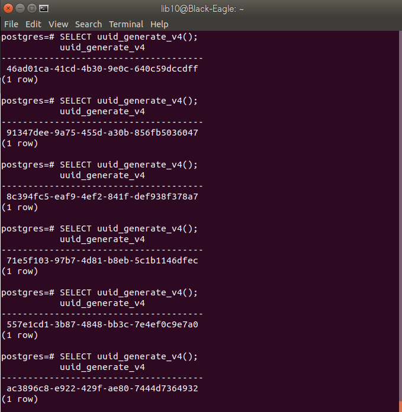
