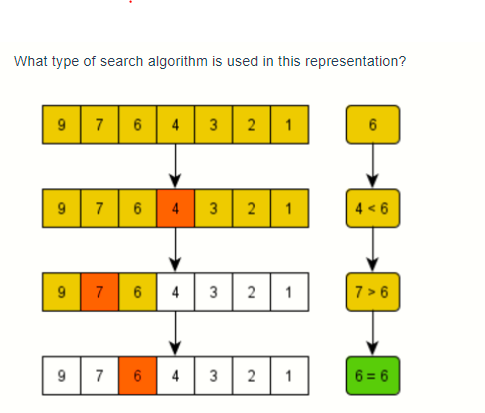
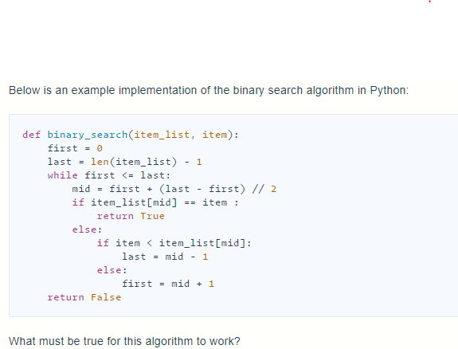

# D4- Module 04 - Searching and Recursion











## Objective 01 - Understand logarithms and recall the common cases where they come up in technical interviews

### Overview <a id="overview"></a>

#### What is a logarithm? <a id="what-is-a-logarithm"></a>

Logarithms are a way of looking differently at exponentials. I know that this is a bit of a vague definition, so let's look at an example:


What does the mathematical expression above _mean_? It's an abbreviation for the following expression:


What we are looking at above is two different ways to express an object that doubles in size with each iteration.

Another way to think about `2^5 = 32` is that `2` is the "growth rate" and `5` is the number of times you went through the growth \(doubling\). `32` is the final result.

Let's look at a few more expressions:


Now, to begin looking at logarithms, let's rewrite the exponential expressions above in logarithmic form.


Notice how we have essentially just moved around different pieces of the expression.

For our first expression,


`2` was the "growth rate", `5` was the "time" spent growing, and `32` was where we ended up. When we rewrite this logarithmically, we have


In this case, `2` still represents the "growth rate" and `32` still represents where we end up. The `5` also still represents the "time" spent growing.

So, the difference between when we would use a logarithm and when we use exponentiation depends on what factors we know ahead of time. If you know the growth rate and you know how long you are growing, you can use exponentiation \(`2^5`\) to figure out where you end up \(`32`\). However, if you know the growth rate and where you end up but do not know the time spent growing, you can use a logarithm \(`log_2 32`\) to figure that out.

Logarithms have an _inverse_ relationship with exponents, just like division and multiplication have an inverse relationship.

For example, if you know that you have one group of `5` items and you want to identify the total you would have if you had `4` of those groups instead of just one, you could express that with `5 * 4 = 20`. However, if you knew that you had a total of `20` items and you wanted to know how many groups of `5` you could make out your total, you could express that with `20 \ 5 = 4`.

### Follow Along <a id="follow-along"></a>

#### Why should I care? What does this have to do with programming and interview preparation? <a id="why-should-i-care-what-does-this-have-to-do-with-programming-and-interview-preparation"></a>

In computer science, you often ask questions like _"How many times must `n` be divided in half before we get to one?"_ or _"How many times will we halve this collection before the collection has only one item?"_ To answer these questions, **you can use logarithms!** Halving is like doubling, so we can say that `log_2 n` would give us the answer we're seeking.

You will see this come up when analyzing the time complexity of specific algorithms. Any algorithm that doubles or halves a number or collection on each iteration of a loop is likely to have `O(log n)` time complexity. You will see this come up specifically when we talk about binary search and its time complexity. You will also see this come up in specific sorting algorithms \(like merge sort\). In simple terms, merge sort divides a collection in half and then merges the sorted halves. The fact that the algorithm repeatedly _halves_ something is your clue that it includes a logarithm in its time complexity. One last place you're likely to see logarithms come up is with a perfect binary tree. One property of these binary trees is that the number of nodes _doubles_ at each level.

### Challenge <a id="challenge"></a>

1. Write a logarithmic expression that is identical to this exponential expression:

   

2. Write an exponential expression that is identical to this logarithmic expression:

   

3. What keywords should you look out for that might alert you that logarithms are involved?

### Additional Resources <a id="additional-resources"></a>

* [https://www.mathsisfun.com/algebra/logarithms.html \(Links to an external site.\)](https://www.mathsisfun.com/algebra/logarithms.html)
* [https://www.interviewcake.com/article/python3/logarithms](https://www.interviewcake.com/article/java/logarithms)


## Objective 02 - Write a linear search algorithm

### Overview <a id="overview"></a>

Imagine that I've chosen a random number from 1 to 20. Then, you must guess the number. One approach would be to start picking at 1 and increment your guess by 1 with each guess. If the computer randomly selected 20, then it would take you 20 guesses to get the correct answer. If the computer guessed 1, then you would have the right answer on your very first guess. On average, you will get the correct answer on the 10th or 11th guess.

If the collection we are searching through is random and unsorted, linear search is the most efficient way to search through it. Once we have a sorted list, then there are more efficient approaches to use.

### Follow Along <a id="follow-along"></a>

We want to write a simple program to conduct a linear search on a collection of data. Let's write a function that takes a list \(`arr`\) and an integer \(`target`\) as its input and returns the integer `idx` where the target is found. If the `target` does not exist in the `arr`, then the function should return `-1`.

```python
def linear_search(arr, target):
    # loop through each item in the input array
    for idx in range(len(arr)):
        # check if the item at the current index is equal to the target
        if arr[idx] == target:
            # return the current index as the match
            return idx
    # if we were able to loop through the entire array, the target is not present
    return -1
```

### Challenge <a id="challenge"></a>




### What Is Recursion?

The word **recursion** comes from the Latin word _recurrere_, meaning to run or hasten back, return, revert, or recur. Here are some online definitions of recursion:

* [**Dictionary.com**:](https://www.dictionary.com/browse/recursion) The act or process of returning or running back
* [**Wiktionary**:](https://en.wiktionary.org/wiki/recursion) The act of defining an object \(usually a function\) in terms of that object itself
* [**The Free Dictionary**:](https://www.thefreedictionary.com/recursion) A method of defining a sequence of objects, such as an expression, function, or set, where some number of initial objects are given and each successive object is defined in terms of the preceding objects

A **recursive** definition is one in which the defined term appears in the definition itself. Self-referential situations often crop up in real life, even if they aren’t immediately recognizable as such. For example, suppose you wanted to describe the set of people that make up your ancestors. You could describe them this way:[](https://files.realpython.com/media/jsturtz-ancestors.9f0adeb014ef.png)

Notice how the concept that is being defined, **ancestors**, shows up in its own definition. This is a recursive definition.

In programming, recursion has a very precise meaning. It refers to a coding technique in which a function calls itself.

### Why Use Recursion?

Most programming problems are solvable without recursion. So, strictly speaking, recursion usually isn’t necessary.

However, some situations particularly lend themselves to a **self-referential** definition—for example, the definition of ancestors shown above. If you were devising an algorithm to handle such a case programmatically, a recursive solution would likely be cleaner and more concise.

Traversal of [tree-like data structures](https://en.wikipedia.org/wiki/Tree_%28data_structure%29) is another good example. Because these are nested structures, they readily fit a recursive definition. A non-recursive algorithm to walk through a nested structure is likely to be somewhat clunky, while a recursive solution will be relatively elegant. An example of this appears later in this tutorial.

On the other hand, recursion isn’t for every situation. Here are some other factors to consider:

* For some problems, a recursive solution, though possible, will be awkward rather than elegant.
* Recursive implementations often consume more memory than non-recursive ones.
* In some cases, using recursion may result in slower execution time.

Typically, the readability of the code will be the biggest determining factor. But it depends on the circumstances. The examples presented below should help you get a feel for when you should choose recursion.

### Recursion in Python

When you call a function in Python, the interpreter creates a new [local namespace](https://realpython.com/python-namespaces-scope/) so that names defined within that function don’t [collide](https://en.wikipedia.org/wiki/Name_collision) with identical names defined elsewhere. One function can call another, and even if they both define objects with the same name, it all works out fine because those objects exist in separate **namespaces**.

The same holds true if multiple instances of the same function are running concurrently. For example, consider the following definition:

```python
def function():
    x = 10
    function()
```

When `function()` executes the first time, Python creates a namespace and assigns `x` the value `10` in that namespace. Then `function()` calls itself recursively. The second time `function()` runs, the interpreter creates a second namespace and assigns `10` to `x` there as well. These two instances of the name `x` are distinct from each another and can coexist without clashing because they are in separate namespaces.

Unfortunately, running `function()` as it stands produces a result that is less than inspiring, as the following [traceback](https://realpython.com/python-traceback/) shows:&gt;&gt;&gt;

```python
>>> function()
Traceback (most recent call last):
  File "<stdin>", line 1, in <module>
  File "<stdin>", line 3, in function
  File "<stdin>", line 3, in function
  File "<stdin>", line 3, in function
  [Previous line repeated 996 more times]
RecursionError: maximum recursion depth exceeded
```

As written, `function()` would in theory go on forever, calling itself over and over without any of the calls ever returning. In practice, of course, nothing is truly forever. Your computer only has so much memory, and it would run out eventually.

Python doesn’t allow that to happen. The interpreter limits the maximum number of times a function can call itself recursively, and when it reaches that limit, it raises a `RecursionError` [exception](https://realpython.com/python-exceptions/), as you see above.

**Technical note:** You can find out what Python’s recursion limit is with a function from the `sys` module called `getrecursionlimit()`:&gt;&gt;&gt;

```text
>>> from sys import getrecursionlimit
>>> getrecursionlimit()
1000
```

You can change it, too, with `setrecursionlimit()`:&gt;&gt;&gt;

```text
>>> from sys import setrecursionlimit
>>> setrecursionlimit(2000)
>>> getrecursionlimit()
2000
```

You can set it to be pretty large, but you can’t make it infinite.

There isn’t much use for a function to indiscriminately call itself recursively without end. It’s reminiscent of the instructions that you sometimes find on shampoo bottles: “Lather, rinse, repeat.” If you were to follow these instructions literally, you’d shampoo your hair forever!

This logical flaw has evidently occurred to some shampoo manufacturers, because some shampoo bottles instead say “Lather, rinse, repeat _as necessary_.” That provides a termination condition to the instructions. Presumably, you’ll eventually feel your hair is sufficiently clean to consider additional repetitions unnecessary. Shampooing can then stop.

Similarly, a function that calls itself recursively must have a plan to eventually stop. Recursive functions typically follow this pattern:

* There are one or more base cases that are directly solvable without the need for further recursion.
* Each recursive call moves the solution progressively closer to a base case.

You’re now ready to see how this works with some examples.

### Get Started: Count Down to Zero

The first example is a function called `countdown()`, which takes a positive number as an argument and prints the numbers from the specified argument down to zero:&gt;&gt;&gt;

```python
>>> def countdown(n):
...     print(n)
...     if n == 0:
...         return             # Terminate recursion
...     else:
...         countdown(n - 1)   # Recursive call
...

>>> countdown(5)
5
4
3
2
1
0
```

Notice how `countdown()` fits the paradigm for a recursive algorithm described above:

* The base case occurs when `n` is zero, at which point recursion stops.
* In the recursive call, the argument is one less than the current value of `n`, so each recursion moves closer to the base case.

**Note:** For simplicity, `countdown()` doesn’t check its argument for validity. If `n` is either a non-integer or negative, you’ll get a `RecursionError` exception because the base case is never reached.

The version of `countdown()` shown above clearly highlights the base case and the recursive call, but there’s a more concise way to express it:

```python
def countdown(n):
    print(n)
    if n > 0:
        countdown(n - 1)
```

Here’s one possible non-recursive implementation for comparison:&gt;&gt;&gt;

```python
>>> def countdown(n):
...     while n >= 0:
...         print(n)
...         n -= 1
...

>>> countdown(5)
5
4
3
2
1
0
```

This is a case where the non-recursive solution is at least as clear and intuitive as the recursive one, and probably more so.

### Calculate Factorial

The next example involves the mathematical concept of [factorial](https://en.wikipedia.org/wiki/Factorial). The factorial of a positive integer _n_, denoted as _n_!, is defined as follows:[](https://files.realpython.com/media/jsturtz-factorial-defn.b3cd3711a627.png)

In other words, _n_! is the product of all integers from 1 to _n_, inclusive.

Factorial so lends itself to recursive definition that programming texts nearly always include it as one of the first examples. You can express the definition of _n_! recursively like this:[](https://files.realpython.com/media/jsturtz-recursive-factorial-defn.32f2c2a3048a.png)

As with the example shown above, there are base cases that are solvable without recursion. The more complicated cases are **reductive**, meaning that they reduce to one of the base cases:

* The base cases \(_n_ = 0 or _n_ = 1\) are solvable without recursion.
* For values of _n_ greater than 1, _n_! is defined in terms of \(_n_ - 1\)!, so the recursive solution progressively approaches the base case.

For example, recursive computation of 4! looks like this:[](https://files.realpython.com/media/jsturtz-factorial-example.496c01139673.png)Recursive Calculation of 4!

The calculations of 4!, 3!, and 2! suspend until the algorithm reaches the base case where _n_ = 1. At that point, 1! is computable without further recursion, and the deferred calculations run to completion.

#### Define a Python Factorial Function

Here’s a recursive Python function to calculate factorial. Note how concise it is and how well it mirrors the definition shown above:&gt;&gt;&gt;

```python
>>> def factorial(n):
...     return 1 if n <= 1 else n * factorial(n - 1)
...

>>> factorial(4)
24
```

A little embellishment of this function with some [`print()`](https://realpython.com/python-print/) statements gives a clearer idea of the call and return sequence:&gt;&gt;&gt;

```python
>>> def factorial(n):
...     print(f"factorial() called with n = {n}")
...     return_value = 1 if n <= 1 else n * factorial(n -1)
...     print(f"-> factorial({n}) returns {return_value}")
...     return return_value
...

>>> factorial(4)
factorial() called with n = 4
factorial() called with n = 3
factorial() called with n = 2
factorial() called with n = 1
-> factorial(1) returns 1
-> factorial(2) returns 2
-> factorial(3) returns 6
-> factorial(4) returns 24
24
```

Notice how all the recursive calls _stack up_. The function gets called with `n` = `4`, `3`, `2`, and `1` in succession before any of the calls return. Finally, when `n` is `1`, the problem can be solved without any more recursion. Then each of the stacked-up recursive calls unwinds back out, returning `1`, `2`, `6`, and finally `24` from the outermost call.

Recursion isn’t necessary here. You could implement `factorial()` iteratively using a [`for`](https://realpython.com/python-for-loop/) loop:&gt;&gt;&gt;

```python
>>> def factorial(n):
...     return_value = 1
...     for i in range(2, n + 1):
...         return_value *= i
...     return return_value
...

>>> factorial(4)
24
```

You can also implement factorial using Python’s [`reduce()`](https://realpython.com/python-reduce-function/), which you can [import](https://realpython.com/python-import/) from the `functools` module:&gt;&gt;&gt;

```python
>>> from functools import reduce
>>> def factorial(n):
...     return reduce(lambda x, y: x * y, range(1, n + 1) or [1])
...

>>> factorial(4)
24
```

Again, this shows that if a problem is solvable with recursion, there will also likely be several viable non-recursive solutions as well. You’ll typically choose based on which one results in the most readable and intuitive code.

Another factor to take into consideration is execution speed. There can be significant performance differences between recursive and non-recursive solutions. In the next section, you’ll explore these differences a little further.

#### Speed Comparison of Factorial Implementations

To evaluate execution time, you can use a function called [`timeit()`](https://docs.python.org/3/library/timeit.html#timeit.timeit) from a module that is also called `timeit`. This function supports a number of different formats, but you’ll use the following format in this tutorial:

```text
timeit(<command>, setup=<setup_string>, number=<iterations>)
```

`timeit()` first executes the commands contained in the specified `<setup_string>`. Then it executes `<command>` the given number of `<iterations>` and reports the cumulative execution time in seconds:&gt;&gt;&gt;

```python
>>> from timeit import timeit

>>> timeit("print(string)", setup="string='foobar'", number=100)
foobar
foobar
foobar
   .
   . [100 repetitions]
   .
foobar
0.03347089999988384
```

Here, the `setup` parameter assigns `string` the value `'foobar'`. Then `timeit()` prints `string` one hundred times. The total execution time is just over 3/100 of a second.

The examples shown below use `timeit()` to compare the recursive, iterative, and `reduce()` implementations of factorial from above. In each case, `setup_string` contains a setup string that defines the relevant `factorial()` function. `timeit()` then executes `factorial(4)` a total of ten million times and reports the aggregate execution.

First, here’s the recursive version:&gt;&gt;&gt;

```python
>>> setup_string = """
... print("Recursive:")
... def factorial(n):
...     return 1 if n <= 1 else n * factorial(n - 1)
... """

>>> from timeit import timeit
>>> timeit("factorial(4)", setup=setup_string, number=10000000)
Recursive:
4.957105500000125
```

Next up is the iterative implementation:&gt;&gt;&gt;

```python
>>> setup_string = """
... print("Iterative:")
... def factorial(n):
...     return_value = 1
...     for i in range(2, n + 1):
...         return_value *= i
...     return return_value
... """

>>> from timeit import timeit
>>> timeit("factorial(4)", setup=setup_string, number=10000000)
Iterative:
3.733752099999947
```

Last, here’s the version that uses `reduce()`:&gt;&gt;&gt;

```python
>>> setup_string = """
... from functools import reduce
... print("reduce():")
... def factorial(n):
...     return reduce(lambda x, y: x * y, range(1, n + 1) or [1])
... """

>>> from timeit import timeit
>>> timeit("factorial(4)", setup=setup_string, number=10000000)
reduce():
8.101526299999932
```

In this case, the iterative implementation is the fastest, although the recursive solution isn’t far behind. The method using `reduce()` is the slowest. Your mileage will probably vary if you try these examples on your own machine. You certainly won’t get the same times, and you may not even get the same ranking.

Does it matter? There’s a difference of almost four seconds in execution time between the iterative implementation and the one that uses `reduce()`, but it took ten million calls to see it.

If you’ll be calling a function many times, you might need to take execution speed into account when choosing an implementation. On the other hand, if the function will run relatively infrequently, then the difference in execution times will probably be negligible. In that case, you’d be better off choosing the implementation that seems to express the solution to the problem most clearly.

For factorial, the timings recorded above suggest a recursive implementation is a reasonable choice.

Frankly, if you’re coding in Python, you don’t need to implement a factorial function at all. It’s already available in the standard [`math` module](https://realpython.com/python-math-module/):&gt;&gt;&gt;

```python
>>> from math import factorial
>>> factorial(4)
24
```

Perhaps it might interest you to know how this performs in the timing test:&gt;&gt;&gt;

```python
>>> setup_string = "from math import factorial"

>>> from timeit import timeit
>>> timeit("factorial(4)", setup=setup_string, number=10000000)
0.3724050999999946
```

Wow! `math.factorial()` performs better than the best of the other three implementations shown above by roughly a factor of 10.

**Technical note:** The fact that `math.factorial()` is so much speedier probably has nothing to do with whether it’s implemented recursively. More likely it’s because the function is implemented in [C](https://en.wikipedia.org/wiki/C_%28programming_language%29) rather than Python. For more reading on Python and C, see these resources:

* [Python Bindings: Calling C or C++ From Python](https://realpython.com/python-bindings-overview/)
* [Building a Python C Extension Module](https://realpython.com/build-python-c-extension-module/)
* [C for Python Programmers](https://realpython.com/c-for-python-programmers/)
* [Your Guide to the CPython Source Code](https://realpython.com/cpython-source-code-guide/)
* [_CPython Internals_ book](https://realpython.com/products/cpython-internals-book/)

A function implemented in C will virtually always be faster than a corresponding function implemented in pure Python.

### Traverse a Nested List

The next example involves visiting each item in a nested list structure. Consider the following Python [list](https://realpython.com/python-lists-tuples/#python-lists):

```python
names = [
    "Adam",
    [
        "Bob",
        [
            "Chet",
            "Cat",
        ],
        "Barb",
        "Bert"
    ],
    "Alex",
    [
        "Bea",
        "Bill"
    ],
    "Ann"
]
```

As the following diagram shows, `names` contains two sublists. The first of these sublists itself contains another sublist:[](https://files.realpython.com/media/jsturtz-nested-list.20eb8fe32366.png)

Suppose you wanted to count the number of **leaf elements** in this list—the lowest-level `str` objects—as though you’d flattened out the list. The leaf elements are `"Adam"`, `"Bob"`, `"Chet"`, `"Cat"`, `"Barb"`, `"Bert"`, `"Alex"`, `"Bea"`, `"Bill"`, and `"Ann"`, so the answer should be `10`.

Just calling `len()` on the list doesn’t give the correct answer:&gt;&gt;&gt;

```text
>>> len(names)
5
```

`len()` counts the objects at the top level of `names`, which are the three leaf elements `"Adam"`, `"Alex"`, and `"Ann"` and two sublists `["Bob", ["Chet", "Cat"], "Barb", "Bert"]` and `["Bea", "Bill"]`:&gt;&gt;&gt;

```text
>>> for index, item in enumerate(names):
...     print(index, item)
...
0 Adam
1 ['Bob', ['Chet', 'Cat'], 'Barb', 'Bert']
2 Alex
3 ['Bea', 'Bill']
4 Ann
```

What you need here is a function that traverses the entire list structure, sublists included. The algorithm goes something like this:

1. Walk through the list, examining each item in turn.
2. If you find a leaf element, then add it to the accumulated count.
3. If you encounter a sublist, then do the following:
   * Drop down into that sublist and similarly walk through it.
   * Once you’ve exhausted the sublist, go back up, add the elements from the sublist to the accumulated count, and resume the walk through the parent list where you left off.

Note the self-referential nature of this description: _Walk through the list_. If you encounter a sublist, then similarly _walk through that list_. This situation begs for recursion!

#### Traverse a Nested List Recursively

Recursion fits this problem very nicely. To solve it, you need to be able to determine whether a given list item is leaf item or not. For that, you can use the built-in Python function [`isinstance()`](https://docs.python.org/3/library/functions.html#isinstance).

In the case of the `names` list, if an item is an instance of type `list`, then it’s a sublist. Otherwise, it’s a leaf item:&gt;&gt;&gt;

```text
>>> names
['Adam', ['Bob', ['Chet', 'Cat'], 'Barb', 'Bert'], 'Alex', ['Bea', 'Bill'], 'Ann']

>>> names[0]
'Adam'
>>> isinstance(names[0], list)
False

>>> names[1]
['Bob', ['Chet', 'Cat'], 'Barb', 'Bert']
>>> isinstance(names[1], list)
True

>>> names[1][1]
['Chet', 'Cat']
>>> isinstance(names[1][1], list)
True

>>> names[1][1][0]
'Chet'
>>> isinstance(names[1][1][0], list)
False
```

Now you have the tools in place to implement a function that counts leaf elements in a list, accounting for sublists recursively:

```text
def count_leaf_items(item_list):
    """Recursively counts and returns the
       number of leaf items in a (potentially
       nested) list.
    """
    count = 0
    for item in item_list:
        if isinstance(item, list):
            count += count_leaf_items(item)
        else:
            count += 1

    return count
```

If you run `count_leaf_items()` on several lists, including the `names` list defined above, you get this:&gt;&gt;&gt;

```text
>>> count_leaf_items([1, 2, 3, 4])
4
>>> count_leaf_items([1, [2.1, 2.2], 3])
4
>>> count_leaf_items([])
0

>>> count_leaf_items(names)
10
>>> # Success!
```

As with the factorial example, adding some [`print()`](https://realpython.com/python-print/) statements helps to demonstrate the sequence of recursive calls and [return](https://realpython.com/python-return-statement/) values:

```python
 1def count_leaf_items(item_list):
 2    """Recursively counts and returns the
 3       number of leaf items in a (potentially
 4       nested) list.
 5    """
 6    print(f"List: {item_list}")
 7    count = 0
 8    for item in item_list:
 9        if isinstance(item, list):
10            print("Encountered sublist")
11            count += count_leaf_items(item)
12        else:
13            print(f"Counted leaf item \"{item}\"")
14            count += 1
15
16    print(f"-> Returning count {count}")
17    return count
```


## Homework



## Binary Search


### Which logarithmic expression is identical to the following exponential expression?

> 2^n = 64 log\_2\(64\)=n



## item\_list must be sorted from least to greatest.

For a given positive integer `n` determine if it can be represented as a sum of two [Fibonacci numbers](keyword://fibonacci-sequence) \(possibly equal\).

Example

* For `n = 1`, the output should be `fibonacciSimpleSum2(n) = true`.

  Explanation: `1 = 0 + 1 = F~0~ + F~1~`.

* For `n = 11`, the output should be `fibonacciSimpleSum2(n) = true`.

  Explanation: `11 = 3 + 8 = F~4~ + F~6~`.

* For `n = 60`, the output should be `fibonacciSimpleSum2(n) = true`.

  Explanation: `60 = 5 + 55 = F~5~ + F~10~`.

* For `n = 66`, the output should be `fibonacciSimpleSum2(n) = false`.

Input/Output

* \[execution time limit\] 4 seconds \(py3\)
* \[input\] integer n

  _Guaranteed constraints:_ `1 ≤ n ≤ 2 - 10^9^`.

* \[output\] boolean

  `true` if `n` can be represented as `F~i~ + F~j~`, `false` otherwise.

```python
def fibonacciSimpleSum2(n):
    # if 0 is less than n and n is less than 5 then we know we can return
    # true because n will be 1-4 which can be created with 2 fib numbers
    if 0 < n < 5:
        return True

    # first get fibonacci sequence up to n
    seq = [0, 1]
    # starting from 2 and ending at n
    for i in range(2, n):
        # add seq at i - 2 (0 to start) and seq at i - 1 (1 to start)
        fib = seq[i - 2] + seq[i - 1]
        # if n is greater than fib
        if n >= fib:
            # we can append fib to the sequence
            seq.append(fib)
            # if fib is greater than or equal to n we can stop
        else:
            break
    print(seq)

    # The check I googled
    # for i, number in enumerate(seq[:-1]):
    #     paired = n - number
    #     if paired in seq[i + 1:]:
    #         return True

    # check if any 2 of the numbers in seq add up to n
    # My check
    for i in range(len(seq) - 1):  # O(n^2)
        j = 0
        while (seq[i] + seq[j]) != n:
            if j == len(seq) - 1:
                break
            else:
                j += 1
        if seq[i] + seq[j] == n:
            return True

    return False


print(fibonacciSimpleSum2(5))
```

Given an integer array `nums` sorted in ascending order, and an integer `target`.

Suppose that `nums` is rotated at some pivot unknown to you beforehand \(i.e., \[1,2,3,4,5,6,7\] might become \[4,5,6,7,1,2,3\]\).

You should search for `target` in `nums` and if found return its index, otherwise return -1.

Example 1: Input: nums = \[6,7,1,2,3,4,5\], target = 1 Output: 2

Example 2: Input: nums = \[6,7,1,2,3,4,5\], target = 3 Output: 4

Example 3: Input: nums = \[1\], target = 2 Output: -1

Your solution should have better than O\(n\) time complexity over the number of items in the list. There is an O\(log n\) solution. There is also an O\(1\) solution.

Note:

1. `1 <= nums.length < 100`
2. `1 <= nums[i] <= 100`
3. All values of `nums` are unique.
4. Numbers from 1 up to the length of the list will be contained in the list.
5. \[execution time limit\] 4 seconds \(py3\)
6. \[input\] array.integer nums
7. \[input\] integer target
8. \[output\] integer

```python
def csSearchRotatedSortedArray(nums, target):
    min = 0
    max = len(nums) - 1

    while not max < min:
        guess = (max + min) // 2
        # print(f'min: {nums[min]} max: {nums[max]} guess:{nums[guess]} target:'
        #       f' {target}')
        # if the guess is the target we got it and return the guess
        if nums[guess] == target:
            # print('guessed the target')
            return guess
        # if min is less than or equal to the guess
        elif nums[min] <= nums[guess]:
            # print('min less than guess')
            # if min is less than or equal to the target and less than the guess
            if nums[min] <= target < nums[guess]:
                # print('min less than or equal to target and less than guess')
                # we can set max to the guess because nothing past the guess
                # can be the target
                max = guess
                # else we can set min to guess + 1 because nothing before it
                # can be the target
            else:
                # print('min is greater than target and greater than or equal '
                #       'to guess')
                min = guess + 1
        # else if min is greater than the guess
        else:
            print('min is greater than or equal to guess')
            # if max - 1 is greater than the target and greater than the guess
            if nums[max - 1] >= target > nums[guess]:
                # print('max - 1 greater than or equal to target and greater '
                #       'than guess')
                # we can set min to guess plus one because nothing before it
                # can be the target
                min = guess + 1
            else:
                # print('max -1 less than target and less than or equal to guess')
                # else we set max equal to guess because nothing after it can
                # be the target
                max = guess

    return -1C:\Lambda\CIRRICULUMN_NOTES\CS-python-notes_WEEKS\wk18\d4\homework\2021-09-09-14-03-46.png
```


