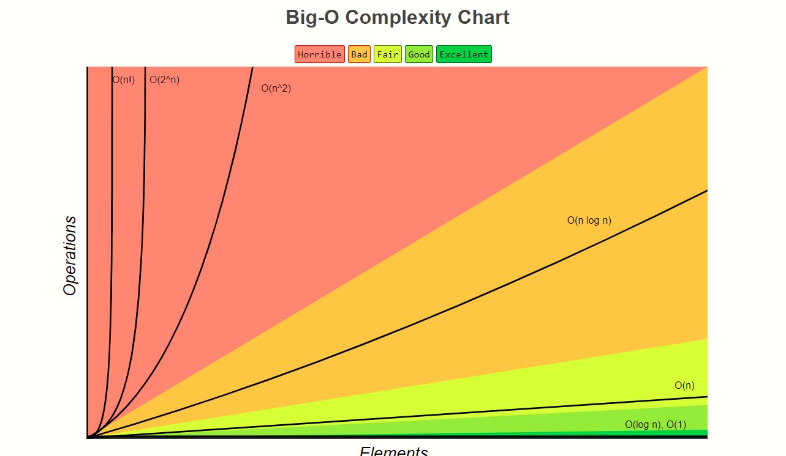

# D1-Module 01 - Python I






#### Windows <a id="windows"></a>

Windows machines usually do not ship with Python installed. Installing on Windows is pretty simple.

1. Download the latest Python 3 Installer from [python.org \(Links to an external site.\)](https://www.python.org/downloads/windows/) \(make sure you pay attention to 32-bit vs. 64-bit and select the right one for your machine\).
2. Run the installer and **make sure you check the box that says "Add Python 3.x to PATH" to ensure that you place the interpreter in your execution path.**

#### Linux <a id="linux"></a>

Most likely, your Linux distribution already has Python installed. However, it is likely to be Python 2 and not Python 3.

You can determine what version you have by opening a terminal and typing `python --version`. If the version shown is `Python 2.x.x`, then you want to install the latest version of Python 3.

The procedure for installing the latest version of Python depends on which distribution of Linux you are running.

Use [this article \(Links to an external site.\)](https://realpython.com/installing-python/#reader-comments) to find instructions specific to your Linux distribution.

#### macOS / Mac OS X <a id="macos--mac-os-x"></a>

Current versions of macOS include a version of Python 2, but you want to be using Python 3.

The best way to install Python 3 on macOS is to use the Homebrew package manager.

**Install Homebrew**

1. Go to [http://brew.sh/ \(Links to an external site.\)](http://brew.sh/) and select the Homebrew bootstrap code under "Install Homebrew" and copy the complete command to your clipboard.
2. Open a terminal window, paste the Homebrew bootstrap code, and hit "Enter."
3. It may take some time to install Homebrew, so you need to wait for that process to complete before moving on.

After Homebrew has finished its installation process, you then need to install Python.

**Install Python**

1. Open a terminal and run the following command `brew install python3`. This command will download and install the latest version of Python.
2. Ensure that everything was installed correctly by opening a terminal window and running the command `pip3`.
3. If you see help text from Python's "pip" package manager, you have a working Python installation.

#### Online Interpreters <a id="online-interpreters"></a>

Here are a few websites that give you online access to the Python interpreter:

* [Repl.it \(Links to an external site.\)](https://repl.it/)
* [Trinket \(Links to an external site.\)](https://trinket.io/)
* [Python Fiddle \(Links to an external site.\)](http://pythonfiddle.com/)
* [Python.org Online Console \(Links to an external site.\)](https://www.python.org/shell)
* [Python Anywhere](https://www.pythonanywhere.com/)


#### Search and Research <a id="search-and-research"></a>

Before you do anything else, search for a solution to your problem on your own. One thing you should start doing is keeping track of all your research when solving a problem. One easy way to do this is to have a browser window represent a specific search for a solution, and each open tab represents an attempt at solving it. Keeping track of your research is vital because it's helpful to provide examples of similar questions or similar problems and explain why those didn't answer your specific problem or question. It also helps the person answering your question avoid pointing you toward resources you've already explored, and lets them know that you've already put in the work.

#### Introduce the Problem <a id="introduce-the-problem"></a>

The first thing you do when you ask a question is to introduce the problem. The first paragraph of your written question should serve as an executive summary of the problem. All the following paragraphs should fill in the details of the problem.

An important thing to include in your problem introduction is a precise explanation of how you encountered the problem. Write about the difficulties that kept you from solving it. Describe what you already tried and include the results of the research you've done.

You should also provide as much detail about the context as possible. For instance, include the language version, the platform version, the operating system, the database type, specific IDE, and any web server information. You should also include your particular constraints. For example, you may not be allowed to use feature A or B that would provide an obvious solution. If you have an odd constraint, it may also help explain why you have that constraint.

#### Help Others Reproduce the Problem <a id="help-others-reproduce-the-problem"></a>

One thing to remember is that not all questions benefit from including code. However, if you include code, definitely do not just copy in your entire program! By having irrelevant details, you make your question much harder to answer and decrease the chances of someone helping you.

Here are some guidelines for when to include code in your question.

#### **Minimal** <a id="minimal"></a>

Include just enough code to allow others to reproduce your specific problem. One way to do this is to restart from scratch. Do not include snippets of your entire program. Instead, create a new program, but only add what's necessary to recreate the problem.

If you aren't exactly sure where the problem code is, one way to find it is by removing code chunks one at a time until the problem disappears — then add back the last part. This way, you can deduce that the last piece of code you added back is likely the source of your problem.

Be careful not to remove too much code, either. Keep your question brief, but maintain enough context for clarity.

#### Complete <a id="complete"></a>

Make sure you include all the portions of the code needed to reproduce the problem. It would be best if you assumed that the person who is answering your question would not write any code to reproduce your issue. Again, remember, do not use images of code—those trying to help you need direct access to the code you include in your question.

#### Reproducible <a id="reproducible"></a>

When you include your code, it's also important to tell the reader exactly what you expect the behavior to be. Be sure to show the reader the exact wording of the error message you encountered \(if there was one\). It's also crucial to double-check that your included example reproduces the problem.

One other thing you can do is create a live example on a site like sqlfiddle.com or jsbin.com. If you do, make sure you also include a copy of your code in your question. Not everyone will utilize the link to the live example.

And to reiterate, do not post images of any code, data, or error messages—reserve images for things like rendering bugs—things that are impossible to describe accurately with just text.

#### Proofread <a id="proofread"></a>

Don't send a question you haven't proofread. When you post your question, you should have already read and reread it, taking care to follow all the best practices and making sure your question makes sense. It would be best if you imagined that you're coming to your question fresh, with no other context but the question itself. You want to make your question as easy for someone to answer as possible. Remember, the reader is likely choosing between several questions they could answer. You want your question to stand out as something concise and approachable. Don't forget to double-check your spelling, grammar, and formatting. Keep it as straightforward as you can; you're not writing a novel.

#### Respond to Feedback <a id="respond-to-feedback"></a>

As feedback and responses to your question begin coming in, respond as quickly as possible. You'll likely receive clarifying questions, and your readers need that clarification to help you.

### Follow Along <a id="follow-along"></a>

Now let's look at an example of a question posted to Stack Overflow and analyze it to see if it follows the best practices outlined above.

[The question \(Links to an external site.\)](https://stackoverflow.com/questions/522563/accessing-the-index-in-for-loops):


The first thing to notice is that the post has a short but descriptive title that adequately summarizes the question.

> Accessing the index in 'for' loops?

Next, did the questioner provide any additional context or proof of the research they've done so far? It doesn't look like it. They could improve the question by including what they tried and the resources they explored.

The questioner did an excellent job of introducing the question and including code that shows what they are trying to do. In this case, they did not need to include experience vs. expected behavior; they just needed to have the expected behavior. By clearly stating what the desired result was, it helped the person answering to respond appropriately.

The code they included is a minimal and complete example, allowing someone to reproduce the problem quickly. The questioner left out irrelevant details and code that would've distracted from the primary question. They also included an example of what the desired output would be, which is helpful.

It appears the questioner proofread their question beforehand as it does not contain any glaring spelling, grammar, or formatting problems. However, we could critique this example for including a redundant sentence at the end. Instead of including that sentence, they might have rephrased the first sentence of the question to be more precise.

### Challenge <a id="challenge"></a>

1. Choose a real-world example from a recent problem/challenge. Use the guidelines and process outlined above to ask for help in your cohort-specific help channel.
2. Identify an unanswered question in your cohort-specific help channel. Do your best to provide a helpful response to that question.
3. Find an example of a **bad** question on Stack Overflow. Analyze the question using the guidelines above and write a short response explaining _why_ you believe it is a **bad** question.
4. Find an example of a **good** question on Stack Overflow. Analyze the question using the guidelines above and write a short response explaining _why_ you believe it is a **good** question.

### Additional Resources <a id="additional-resources"></a>

* [Stack Overflow: How Do I Ask a Good Question? \(Links to an external site.\)](https://stackoverflow.com/help/how-to-ask)
* [Writing the Perfect Question \(Links to an external site.\)](https://codeblog.jonskeet.uk/2010/08/29/writing-the-perfect-question/)
* [How to Ask Questions the Smart Way \(Links to an external site.\)](http://catb.org/esr/faqs/smart-questions.html)
* [How to Debug Small Programs \(Links to an external site.\)](https://ericlippert.com/2014/03/05/how-to-debug-small-programs/)


## Objective 04 - Use a print statement

### Overview <a id="overview"></a>

Learning to use the `print` function in Python is the perfect way to start writing Python code. When learning to write in any new programming language, one of the first things you want to do is get some _output_ from your program. The `print` function is how you output the value of an object to the screen. You will learn how to use the `print` function in Python.

### Follow Along <a id="follow-along"></a>

#### Using `print` with different objects <a id="using-print-with-different-objects"></a>

Let's start by executing the print function to print different types of objects in Python. There are numerous types of objects that you can print using the `print` function.

Using `print` with no arguments:

```python
>>> print()

>>>
```

Notice the empty line after calling the `print` function. The default `end` value when calling print is the newline character `\n`.

Using `print` with a string literal:

```python
>>> print("School is awesome!")
School is awesome!
>>>
```

Notice how calling `print` with the string literal printed the exact string we passed in onto the screen.

Using `print` with a variable:

```python
>>> slogan = "i love lamp"
>>> print(slogan)
i love lamp
>>>
```

Notice how calling `print` with the `slogan` variable prints the value assigned to the `slogan` variable.

Using `print` with an expression:

```python
>>> superlative = "wonderful"
>>> school = "Lambda School"
>>> print(school + " is " + superlative)
Lambda School is wonderful
>>>
```

Notice how the argument for the `print` function can be an expression. Once the expression is resolved to a string object, the `print` function can output it to the screen.

Using `print` with other object types:

```python
print(2020)
2020
>>> print(123.456)
123.456
>>> print(False)
False
>>> print(["Lambda", "School", 2, 0, 2, 0])
['Lambda', 'School', 2, 0, 2, 0]
>>> print(("Lambda", "School"))
('Lambda', 'School')
>>> print({"school": "Lambda School", "year": 2020})
{'school': 'Lambda School', 'year': 2020}
>>>
```

Any object passed as an argument into `print` will get converted into a string type before outputted to the screen.

You can see how the `print` function is easy to use and how it can handle any object type that you pass into it.

#### Passing multiple arguments into `print` <a id="passing-multiple-arguments-into-print"></a>

Now, let's look at how we can pass multiple arguments into the `print` function. Using `print` with multiple arguments gives you a flexible and easy way to output items to the screen.

We can pass multiple objects, all of the same or different types, into `print`.

```python
>>> print("Lambda School", 2020, True)
Lambda School 2020 True
>>>
```

Notice how each object we passed in was converted to a string and then output to the screen. Notice also that `print` used `" "` as the default separator value.

We can change the separator value by assigning a value to the keyword argument `sep`.

```python
>>> print("Lambda School", 2020, True, sep="!!!")
Lambda School!!!2020!!!True
>>> print("Lambda School", 2020, True, sep="\t")
Lambda School   2020    True
>>> print("Lambda School", 2020, True, sep="\n")
Lambda School
2020
True
>>> print("Lambda School", 2020, True, sep="")
Lambda School2020True
>>>
```

#### Specifying the `end` value with `print` <a id="specifying-the-end-value-with-print"></a>

You can also specify the `end` value by assigning a value to the `end` keyword argument when you call the `print` function. Being able to print a value to the screen but allow the user to stay on the same line is useful and necessary in some cases.

Here is how you can change the default `end` value \(which is `\n`\) when calling the `print` function.

```python
>>> print("Are you a Lambda School student?", end=" (Y or N)")
Are you a Lambda School student? (Y or N)>>>
```

Customizing the `end` value when calling the `print` function can be useful and necessary in some circumstances.

You have now learned the basics of using the `print` function in Python. You learned how to call the `print` function to print objects of different types. You now know how to use `print` with multiple positional arguments. In certain necessary situations, you also know how to change the default `end` value when calling the `print` function.

Now, get some practice using the `print` function by completing the challenge below.





## Objective 05 - Use white space to denote blocks

### Overview <a id="overview"></a>

Python is unique because indentation instead of some other character marks blocks of code. A block of code is a collection of statements that are grouped. The syntax for denoting blocks varies from language to language. For example, in C, blocks are delimited by curly braces \(`{` and `}`\). Understanding how Python uses whitespace and indentation to denote logical lines and code blocks is essential.

### Follow Along <a id="follow-along"></a>

#### Whitespace Characters <a id="whitespace-characters"></a>

Whitespace is any character represented by something that appears empty \(usually `\t` or `" "`\). The characters that Python considers to be whitespace can be seen by printing out the value of `string.whitespace` from the `string` library.

```text
>>> import string
>>> string.whitespace
' \t\n\r\x0b\x0c'
>>>
```

Notice the characters are `" "` \(space\), `\t` \(tab\), `\n` \(newline\), `\r` \(return\), `\x0b` \(unicode line tabulation\), and `\x0c` \(unicode form feed\).

You've seen the different types of whitespace characters that can appear, but you mainly need to concern yourself with `" "`, `\t`, and `\n`.

#### Logical Lines of Code <a id="logical-lines-of-code"></a>

Whitespace is used to denote the end of a logical line of code. In Python, a logical line of code's end \(a statement or a definition\) is marked by a `\n`.

```text
>>> first = "Lambda"
>>> second = "School"
>>> first + second
'LambdaSchool'
>>> first \
... + \
... second
'LambdaSchool'
>>>
```

Notice how the REPL evaluates the expression `first + second` when I return on line 3. Below that, I can write one logical line of code over multiple lines by ending each line with a `\` character. That `\` character lets the Python interpreter that even though there is a newline, you don't want it to treat it as the end of a logical line.

It's important to understand that Python assumes meaning in newline characters when trying to interpret your code.

#### Code Blocks <a id="code-blocks"></a>

Whitespace \(indentation\) can denote code blocks. Python gives meaning to the amount of whitespace \(indentation level\) that comes before a logical line of code.

```text
>>> if True:
... if True:
  File "<stdin>", line 2
    if True:
    ^
IndentationError: expected an indented block
>>>
```

This code raises an `Indentation Error` because the Python interpreter expects to find additional whitespace inside the `if` block.

```text
>>> if True:
...     if True:
...         print("it worked!")
...
it worked!
>>>
```

The Python interpreter can successfully run this code because consistent whitespace \(level of indentation\) is used.

```text
>>> if True:
...     if True:
...         print("it worked!")
  File "<stdin>", line 3
    print("it worked!")
                      ^
TabError: inconsistent use of tabs and spaces in indentation
```

Although you can't tell in the code snippet above, for the second `if` statement, I used a `\t` to indent. But, for the indentation on `print("it worked!"`, I used eight `" "` \(spaces\). The mismatch of tab usage and spaces raises an error when Python tries to interpret the code.

Consistent whitespace usage \(indentation\) is crucial to making sure that Python can interpret your code correctly.

In Python, whitespace has meaning; it denotes the end of logical lines and also code blocks. Whitespace is any character represented by something that appears empty, although the most common characters are `" "`, `\t`, and `\n`. The Python interpreter knows where the end of a logical line of code is because of the `\n`. The amount of whitespace \(level of indentation\) is used in Python to denote blocks of code. Understanding how the Python interpreter looks at whitespace is vital to writing valid Python code.





## \#6:

### Overview <a id="overview"></a>

Python is not a "statically typed" language, and every variable in Python is an object. You don't have to declare a variable's type.

### Follow Along <a id="follow-along"></a>

#### Numbers <a id="numbers"></a>

In Python, you can have integers and floating-point numbers.

You can define an integer like so:

```text
my_int = 3
```

You can also cast a floating-point number to be an integer like so:

```text
my_int = int(3.0)
```

To define a floating-point number, you can declare it literally or typecast it with the float constructor function:

```text
my_float = 3.0
my_float = float(3)
```

#### Strings <a id="strings"></a>

You can define strings with either single or double quotes:

```text
my_string = 'Lambda School'
my_string = "Lambda School"
```

It's common to use double quotes for strings so that you can include apostrophes without accidentally terminating the string.

```text
my_string = "I don't have to worry about apostrophes with my double-quotes."
```

Let's practice declaring variables to store an int, a float, and a string:

```text
my_int = 2
my_float = 5.0
my_str = "Lambda School"
```




### Overview <a id="overview"></a>

There are a few basic operators that you should be familiar with as you start writing Python code.

#### Arithmetic Operators <a id="arithmetic-operators"></a>

You can use the addition \(`+`\), subtraction \(`-`\), multiplication \(`*`\), and division \(`/`\) operators with numbers in Python.

```text
my_number = 2 + 2 * 8 / 5.0
print(my_number) # 5.2
```

There is also an operator called the modulo operator \(`%`\). This operator returns the remainder of integer division.

```text
my_remainder = 9 % 4
print(my_remainder) # 1
```

You can use two multiplication operators to make the exponentiation operator \(`**`\).

```text
two_squared = 2 ** 2
print(two_squared)    # 4
two_cubed = 2 ** 3
print(two_cubed)      # 8
```

#### Using operators with non-numbers <a id="using-operators-with-non-numbers"></a>

You can use the addition operator to concatenate strings and lists:

```text
string_one = "Hello,"
string_two = " World!"
combined = string_one + string_two
print(combined) # Hello, World!

lst_one = [1,2,3]
lst_two = [4,5,6]
big_lst = lst_one + lst_two
print(big_lst) # [1, 2, 3, 4, 5, 6]
```

You can also use the multiplication operator to create a new list or string that repeats the original sequence:

```text
my_string = "Bueller"
repeated = my_string * 3
print(repeated) # BuellerBuellerBueller

my_list = [1, 2, 3]
repeated_list = my_list * 3
print(repeated_list) # [1, 2, 3, 1, 2, 3, 1, 2, 3]
```

### Follow Along <a id="follow-along"></a>

Now, let's see if we can combine all of this information in a quick demo.

First, let's create two variables, `a` and `b`, where each variable stores an instance of the `object` class.

```text
a = object()
b = object()
```

Next, let's see if we can make two lists, one containing five instances of `a`, and the second with five instances of `b`.

```text
a_list = [a] * 5
b_list = [b] * 5
```

Then, let's combine `a_list` and `b_list` into a `combined` list.

```text
combined = a_list + b_list
```

If our code works as expected, `combined` should have a length of 10.

```text
print(len(combined)) # 10
```





### Overview <a id="overview"></a>

To format a string in Python, you use the `%` operator to format a set of stored variables in a tuple. You also include _argument specifiers_ in your string with special symbols like `%s` and `%d`.

For example, let's say you want to insert a `name` variable inside a string. You would do the following:

```text
name = "Austen"
formatted_string = "Hello, %s!" % name
print(formatted_string) # Hello, Austen!
```

If you have more than one argument specifier, you need to enclose your arguments in a tuple:

```text
name = "Austen"
year = 2020
print("Hey %s! It's the year %d." % (name, year))
# Hey Austen! It's the year 2020.
```

Any object that is not a string can also be formatted using the `%s` operator. The string which returns from the object's `repr` method will be used in the formatted string.

```text
my_list = [1,2,3]
print("my_list: %s" % my_list)
# my_list: [1, 2, 3]
```

A few of the common argument specifiers are:

* `%s` - String \(or any object with a string representation\)
* `%d` - Integers
* `%f` - Floating point numbers
* `%.<number of digits>f` - Floating point numbers with a fixed amount of digits to the dot's right.
* `%x/%X` - Integers in hexadecimal \(lowercase/uppercase\)

### Follow Along <a id="follow-along"></a>

Let's see if we can use all of this information to practice formatting a few strings.

Let's imagine that we have some data that we want to inject into a string.

```text
product_name = "bananas"
price = 1.23
product_id = 123456
```

We need to print a formatted string using argument specifiers and a tuple that contains our data:

```text
print("%s (id: %d) are currently $%.2f." % (product_name, product_id, price))
# bananas (id: 123456) are currently $1.23.
```





8

### Overview <a id="overview"></a>

You can think of a string as anything between quotes. Strings store a sequence of characters or bits of text.

There are lots of ways you can interact with strings in Python.

### Follow Along <a id="follow-along"></a>

The `len()` method prints out the number of characters in the string.

```text
my_string = "Hello, world!"
print(len(my_string)) # 12
```

The `index()` method prints out the index of the substring argument's first occurrence.

```text
my_string = "Hello, world!"
print(my_string.index("o"))   # 4
print(my_string.index(", w")) # 5
```

The `count()` method returns the number of occurrences of the substring argument.

```text
my_string = "Hello, world!"
print(my_string.count("o"))  # 2
print(my_string.count("ll")) # 1
```

To slice a string, you can use this syntax: `[start:stop:step]`. To reverse the string's order, you can set the step value to be `-1`.

```text
my_string = "Hello, world!"
print(my_string[3:7])   # lo,
print(my_string[3:7:2]) # l,
print(my_string[::-1])  # !dlrow ,olleH
```

You can convert a string to uppercase or lowercase with the `upper()` and `lower()` methods.

```text
my_string = "Hello, world!"
print(my_string.upper()) # HELLO, WORLD!
print(my_string.lower()) # hello, world!
```

You can determine if a string starts with or ends with a specific sequence with the `startswith()` and `endswith()` methods.

```text
my_string = "Hello, world!"
print(my_string.startswith("Hello")) # True
print(my_string.endswith("globe!"))  # False
```

The `split()` method allows you to split up a string into a list. The default separator is any whitespace. You can also specify the separator value with an argument if you want.

```text
my_string = "Hello, world!"
print(my_string.split())    # ['Hello,', 'world!']
print(my_string.split(",")) # ['Hello', ' world!']
print(my_string.split("l")) # ['He', '', 'o, wor', 'd!']
```




## Objective 09 - Perform basic string operations


### Overview <a id="overview"></a>

You can think of a string as anything between quotes. Strings store a sequence of characters or bits of text.

There are lots of ways you can interact with strings in Python.

### Follow Along <a id="follow-along"></a>

The `len()` method prints out the number of characters in the string.

```text
my_string = "Hello, world!"
print(len(my_string)) # 12
```

The `index()` method prints out the index of the substring argument's first occurrence.

```text
my_string = "Hello, world!"
print(my_string.index("o"))   # 4
print(my_string.index(", w")) # 5
```

The `count()` method returns the number of occurrences of the substring argument.

```text
my_string = "Hello, world!"
print(my_string.count("o"))  # 2
print(my_string.count("ll")) # 1
```

To slice a string, you can use this syntax: `[start:stop:step]`. To reverse the string's order, you can set the step value to be `-1`.

```text
my_string = "Hello, world!"
print(my_string[3:7])   # lo,
print(my_string[3:7:2]) # l,
print(my_string[::-1])  # !dlrow ,olleH
```

You can convert a string to uppercase or lowercase with the `upper()` and `lower()` methods.

```text
my_string = "Hello, world!"
print(my_string.upper()) # HELLO, WORLD!
print(my_string.lower()) # hello, world!
```

You can determine if a string starts with or ends with a specific sequence with the `startswith()` and `endswith()` methods.

```text
my_string = "Hello, world!"
print(my_string.startswith("Hello")) # True
print(my_string.endswith("globe!"))  # False
```

The `split()` method allows you to split up a string into a list. The default separator is any whitespace. You can also specify the separator value with an argument if you want.

```text
my_string = "Hello, world!"
print(my_string.split())    # ['Hello,', 'world!']
print(my_string.split(",")) # ['Hello', ' world!']
print(my_string.split("l")) # ['He', '', 'o, wor', 'd!']

```




### Overview <a id="overview"></a>

Python uses boolean values to evaluate conditions. An expression in any Boolean context will evaluate to a Boolean value and then control your program's flow. Python's boolean values are written as `True` and `False` \(make sure you capitalize the first character\).

### Follow Along <a id="follow-along"></a>

To compare the value of two expressions for equality, you use the `==` operator. You can also use `<` \(less than\), `>` \(greater than\), `<=` \(less than or equal\), `>=` \(greater than or equal\), and `!=` \(not equal\).

```python
x = 10
print(x == 10) # True
print(x == 5)  # False
print(x < 15)  # True
print(x > 15)  # False
print(x <= 10) # True
print(x >= 10) # True
print(x != 20) # True
```

You build up more complex boolean expressions by using the `and` and `or` operators.

```python
name = "Elon"
age = 49
if name == "Elon" and age == 49:
    print("You are a 49 year old person named Elon.")

if name == "Elon" or name == "Bill":
    print("Your name is either Elon or Bill.")
```

Any time you have an iterable object \(like a list\), you can check if a specific item exists inside that iterable by using the `in` operator.

```python
years = [2018, 2019, 2020, 2021]
year = 2020

if year in years:
    print("%s is in the years collection" % year)

# 2020 is in the years collection
```

We can use the `if`, `elif`, and the `else` keywords to define a series of code blocks that will execute conditionally.

```python
first_statement = False
second_statement = True

if first_statement:
    print("The first statement is true")
elif second_statement:
    print("The second statement is true")
else:
    print("Neither the first statement nor the second statement are true")
```

Any object that is considered "empty" evaluates to `False`. For example, `""`, `[]`, and `0` all evaluate to `False`.

If we want to determine if two objects are actually the same instance in memory, we use the `is` operator instead of the value comparison operator `==`.

```python
a = [1,2,3]
b = [1,2,3]

print(a == b) # True because a and b have the same value
print(a is b) # False because a and b reference two different list objects

x = [1,2,3]
y = x

print(x == y) # True because x and y have the same value
print(x is y) # True because x and y reference the same list object
```

There is also the `not` operator, which inverts the boolean that follows it:

```python
print(not False)    # True
print(not (1 == 1)) # False because 1 == 1 is True and then is inverted by not
```




### Overview <a id="overview"></a>

You can use two types of loops in Python, a `for` loop and a `while` loop. A `for` loop iterates over a given sequence \(iterator expression\). A `while` loop repeats as long as a boolean context evaluates to `True`.

The `break` statement terminates the loop containing it. Control of the program flows to the statement immediately after the body of the loop. If the `break` statement is inside a nested loop \(loop inside another loop\), the `break` statement will only terminate the innermost loop.

You can use the `continue` statement to skip the rest of the code inside a loop _for the current iteration only_. The loop does not terminate entirely but continues with the next iteration.

### Follow Along <a id="follow-along"></a>

Here is an example of a few different ways you can use a `range` as the iterable for a `for` loop.

```python
# Prints 0, 1, 2, 3, 4
for x in range(5):
    print(x):

# Prints 2, 3, 4, 5, 6
for x in range(2, 7):
    print(x)

# Prints 1, 3, 5, 7
for x in range(1, 8, 2):
    print(x)
```

This example shows the simple usage of a `while` loop to print the same values as the `for` loops above.

```python
# Prints 0, 1, 2, 3, 4
count = 0
while count < 5:
    print(count)
    count += 1

# Prints 2, 3, 4, 5, 6
count = 2
while count < 7:
    print(count)
    count += 1

# Prints 1, 3, 5, 7
count = 1
while count < 8:
    print(count)
      count += 2
```

You can use a `break` statement to exit a `for` loop or a `while` loop.

```python
# Prints 0, 1, 2, 3, 4
count = 0
while True:
    print(count)
    count += 1
    if count >= 5:
        break
```

You can also use a `continue` statement to skip the current block but not exit the loop entirely.

```text
# Prints 1, 3, 5, 7
for x in range(8):
    # if x is even, skip this block and do not print
    if x % 2 == 0:
        continue
    print(x)
```





## Objective 12 - Create user-defined functions and call them


To make our code more readable and DRY \(Don't Repeat Yourself\), we often want to encapsulate code inside a callable function.

To define a function in Python, we follow this syntax:

```python
def function_name(argument_1, argument_2, etc.):
    # function line 1
    # function line 2
    # etc.
```

### Follow Along <a id="follow-along"></a>

Let's define a greeting function that allows us to specify a name and a specific greeting.

```python
def greet(name, greeting):
    print("Hello, %s, %s" % (name, greeting))
```

Now, we can call our `greet` function and pass in the data that we want.

```python
greet("Austen", "I hope you are having an excellent day!")
# Hello, Austen, I hope you are having an excellent day!
```

If we want to define a function that returns a value to the caller, we use the `return` keyword.

```python
def double(x):
    return x * 2

eight = double(4)
print(eight)
# 8
```








### Overview <a id="overview"></a>

Python uses boolean values to evaluate conditions. An expression in any Boolean context will evaluate to a Boolean value and then control your program's flow. Python's boolean values are written as `True` and `False` \(make sure you capitalize the first character\).

### Follow Along <a id="follow-along"></a>

To compare the value of two expressions for equality, you use the `==` operator. You can also use `<` \(less than\), `>` \(greater than\), `<=` \(less than or equal\), `>=` \(greater than or equal\), and `!=` \(not equal\).

```python
x = 10
print(x == 10) # True
print(x == 5)  # False
print(x < 15)  # True
print(x > 15)  # False
print(x <= 10) # True
print(x >= 10) # True
print(x != 20) # True
```

You build up more complex boolean expressions by using the `and` and `or` operators.

```python
name = "Elon"
age = 49
if name == "Elon" and age == 49:
    print("You are a 49 year old person named Elon.")

if name == "Elon" or name == "Bill":
    print("Your name is either Elon or Bill.")
```

Any time you have an iterable object \(like a list\), you can check if a specific item exists inside that iterable by using the `in` operator.

```python
years = [2018, 2019, 2020, 2021]
year = 2020

if year in years:
    print("%s is in the years collection" % year)

# 2020 is in the years collection
```

We can use the `if`, `elif`, and the `else` keywords to define a series of code blocks that will execute conditionally.

```python
first_statement = False
second_statement = True

if first_statement:
    print("The first statement is true")
elif second_statement:
    print("The second statement is true")
else:
    print("Neither the first statement nor the second statement are true")
```

Any object that is considered "empty" evaluates to `False`. For example, `""`, `[]`, and `0` all evaluate to `False`.

If we want to determine if two objects are actually the same instance in memory, we use the `is` operator instead of the value comparison operator `==`.

```python
a = [1,2,3]
b = [1,2,3]

print(a == b) # True because a and b have the same value
print(a is b) # False because a and b reference two different list objects

x = [1,2,3]
y = x

print(x == y) # True because x and y have the same value
print(x is y) # True because x and y reference the same list object
```

There is also the `not` operator, which inverts the boolean that follows it:

```python
print(not False)    # True
print(not (1 == 1)) # False because 1 == 1 is True and then is inverted by not
```


