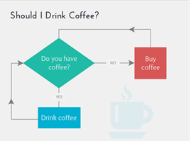

Top of Form

**How to approach JS coding problems?**

# 1. Understand and Analyze the Problem

Read the problem, start thinking about it and if possible write the things that are given and the things that you need to find out on a piece of paper.

- **Ask yourself:**

—Are you able to understand the question fully?
  — Would you be able to explain the question to a layman?
  — What and how many inputs are required?
  — What would be the output for those inputs
  — Can you separate out some modules or parts from the problem?
  — Do you have enough information? If not, try understanding the question again.

#
# 2. Go through the sample inputs and examples thoroughly:

Going through some sample inputs and coming up with more examples sure helps you a lot to understand the problem well, and moreover, it gives you a clear way to how many cases your code should handle, and what all can be the possible output or output range.

- **Here&#39;s what I would suggest,**

—Take very simple examples and find the output
  — Take more complex and bigger inputs to see what will be the output, how many use cases do we want

- **Then, &quot;Time to handle the edge cases&quot;**

—Try out the problem with no input, what should be the output now
  — Try out the problem with invalid input, what should be the output now

# 3. Break down the problem:

This step is really very helpful when the problem at hand is very big. In such cases, I recommend the following:

—Try to make a flow chart the problem
  — Divide the problem into different modules or sub-problems
  — Try to make independent functions for each sub-problem
  — Connect those sub-problems by calling them in the required order, or as necessary (Probably one function would be calling another)

#

# 4. Start solving/coding:

Now that you&#39;ve analyzed the problem it&#39;s time to actually write the code. If you can&#39;t solve the problem fully at once, try writing code for a simpler sub part, as you solve the problem, gradually you keep figuring out the problem in more detail, and you start getting new ideas.

**Just keep in mind 3 things, and you&#39;ll surely figure out the path**

— The point where you started
  — Where are you right now?
  — What is your destination?

# 5. Look Back and Learn More

Now, this is the most important part! Once you are done, look back whether the code can be improved, is there any other way to solve the given problem?

_Champions don&#39;t rest on their success!!_

**Here are some Considerations/ questions you should ask yourself:**

/\*

1.) Look at what you&#39;re given (func parameters) and what you&#39;re being asked for (return or print)...

    if return what type...

    if it is reference type what primatives or references does it contain?

    do we need to initialize empty variable at beginning of func? ...

    if problem says print...console.log(what are we printing?)

1.5) Look at the test cases provided!!!

     what are the arguments that correspond to each of the parameters in your function decleration and what is done to them to produce desired output?

2.) Is our code conditional ?

     (look for the key words if,either,both, in problem)

2.5) If it is conditional....

     how many possible test cases and what are they?...

3.) Do we need to (loop) itterate?

     (are we going to need to iterate through a string or array?)

     If we are looping is it through an entire string or object...

     up to a counter?

     if we are counting... what is start point? end point? increment?

     looping conditionally?

     &#39;!!!!Are we asked to do a repetative task ?!!!

4.) If we are looping...

do we need a variable to represent the current element?..(normally need this when itterat ing through a string or array)

    Are we just looping to print through a range of numbers (perhaps on a condition?)..Are we  looping to compare the largest smallest value or take a cumulative sum(initial value zero  bc 0+anything=anything) or product (initial value is 1 bc 1\* anything=anything)

5.) think about what needs to happen from input to output in the context of each array/string method you have learned...

    are there any tricks that will make it easier? i.e. make a copy of array using .slice().

instead of initializing an empty array up top.

    What parameters do our methods take(GO TO MDN DONT BE LAZY)?

    What do our methods return?

\*/

//Advice: take your first test case argument and !!!comment what happens to it on !!every!! line of your code!!!!!

//once your code seems to be working double check every single test case!!!!!!!!!!!!!

--keywords

--start with const and change to let if you need to reassign

# Summary of Steps

- Analyze and understand the problem
- Have a look at sample inputs and use cases
- Break down the problem into smaller subparts, or functions, or modules
- Start solving/coding
- Once you are done, look back whether the code can be improved, is there any other way to solve the given problem,
