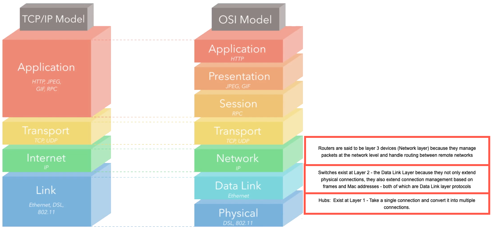

Week 8 Quiz

Start Quiz 8

Reset Quiz

---

#  1:

---

Name the layers in an OSI Network Model

---

#  2:

---

Name the layers in a TCP/IP Network Model

---

#  3:

---

In the OSI Network Model, briefly describe what protocol each layer
uses.

  Layer          Protocol and description
  -------------- ------------------------------------------------------------------------------------------------------------------------------------------------------------------------------------------------------------------------
  Application    HTTP is a common Application Layer protocol. Data transmitted on this layer will interact directly with applications.
  Presentation   JPEG, GIF are examples of protocols at this layer. This is where the data gets translated into a presentable format.
  Session        RPC (Remote Procedure Call): Includes protocols responsible for authentication and data continuity. May authroize a client with a server or re-establish a dropped connection.
  Transport      TCP/UDP: These processes focus on data integrity and connectivity
  Network        IP: Manages connections between remote networks, transferring packets across intermediary devices.
  Data Link      Ethernet : Deals with connections directly from one machine's network interface to another. Frames targeting different MAC addresses are transferred here. This layer is primarily used by machines in local networks.
  Physical       Wi-Fi (802.11) and DSL : Translate from raw electrical signals to bits and bytes of data.

---

#  4:

---

In the TCP/IP model, briefly describe the 4 layers

  Layer         Protocols and application
  ------------- ------------------------------------------------------------------------------------------------------------------------------------------------------------------------------------------------
  Application   HTTP, HTTPS, FTP, SMTP, etc. Includes protocols related to user user-facing data.
  Transport     TCP and UDP. Focuses on connectivity between clients and servers.
  Internet      IP. Where data is processed in packets, and where routing is handled with IP addresses. This layer focuses primarly on connecting separate networks together using the Internet Protocol (IP).
  Link          Ethernet. This layer is the lower-level communication, concerned with getting data from one local network resource to another.

---

#  5:

---

What are some use cases for TCP protocol?

Anytime data integrity is important:

1.  Websites
2.  File downloads
3.  streaming videos/audio : where watching videos or listening to
    podcasts you may need to see every frame.

---

#  6:

---

What are some use cases for the UDP protocol?

When performance is more important than quality:

1.  VOIP (Voice over IP)
2.  Real-time video : Here you want to keep pace with the video as it is
    real-time so missing a packet isn't as important as keeping pace
    with the video.
3.  Network services

---

#  7:

---

What is a TLD?

Top level domain: The last part of the domain. e.g.: .com, .net, .org

---

#  8:

---

What is a second-level domain

The more common name for the website. The full website address consists
of the second-level domain (marylark) and a Top Level Domain (.com)

---

#  9:

---

What does TCP stand for?

Transmission Control Protocol : Used when you want reliable connections
such as web browsing, downloading files, fetching email, streaming music
or videos.

---

#  10:

---

What does UDP stand for:

User Datagram Protocol: Used when you don't mind a more unreliable
connection, but real time interactivity is more important. Voice Over
IP, Video Chat are examples of where you might use UDP

---

#  11:

---

What is a MAC Address?

A hardware address assigned to every physical networking device on a
network. They look like a series of Hexidecimal values like
ea:de:36:d9:5a:b8; They are used to communicate on the local network
ONLY.

---

#  12:

---

Describe an IP address

An address assigned to a networking device. Usually assigned by an ISP
or a router on a local network using DHCP. They are used to route
connections across multiple networks. Example: IPV4: 192.168.1.1

---

#  13:

---

Describe a Port

Represents a TCP/UDP connection on an actual computer. Valid ports are
in the range from 0 - 65535. Used by the operating system of a computer
to route TCP connections to the right program running on a computer.
These programs can be said to be "listening" on a port. No two programs
are allowed to listen on the same port at once.

---

#  14:

---

What are the default ports for web servers?

HTTP port 80, and HTTPS port 443.

---

#  15:

---

What is a Network Hub?

A device which hooks multiple computers together over ethernet and
blindly repeats ethernet packets to all the other devices on a local
area network.

---

#  16:

---

What is a network switch?

A device which intelligently hooks multiple computers together over
ethernet and sends ethernet packets to the correct devices on a local
area network based on MAC addresses.

---

#  17:

---

What is a router?

A device which is responsible for routing IP packets BETWEEN Different
networks.

---

#  18:

---

What is an IP Address

The internet protocol address assigned to a particular networking device

---

#  19:

---

What is a domain name?

A human readable name assigned to an IP address. Examples: google.com or
appacademy.io.

---

#  20:

---

What is DNS?

Domain Name System: A protocol (on UDP port 53) that allows our computer
to talk to a DNS Server and resolve a Domain Name into an IP address.
Example: google.com might resolve to 172.217.6.142.

---

#  21:

---

What is a DNS A Record?

This record directly maps a domain name to an IPv4 Address

---

#  22:

---

What is a DNS AAAA record?

This directly maps a domain name to an IPv6 Address

---

#  23:

---

What is a CNAME record?

This maps a domain name to another domain name. An alias, you might say.

---

#  24:

---

What is an MX record?

This defines the mail server for a domain.

---

#  25:

---

What is an NS record?

This defines the DNS Servers for a zone (domain)

---

#  26:

---

What is an SOA?

Start of Authority: Defines which DNS Server is the authority for a zone
(domain)

---

#  27:

---

In the IP packet header, where do you discover whether this is an IPv4
or IPv6 packet?

In the version. This is a binary number. IPv4 = 0100; IPv6 = 0110. The
version number is the 1st-\>4th bit in the packet

---

#  28:

---

How many octets make up an IPv4 address?

4 octets: 192.168.1.1 for example

---

#  29:

---

How is an IPv6 number made up?

-   IPv6 addresses are made up of a 128bit number
-   IPv6 addresses are typically represented as hexidecimal, with every
    4 digits separated by a ':'
-   Example: 2001:0db8:85a3:0000:0000:8a2e:0370:7334

---

#  30:

---

Describe the rules for reformatting an IPv6 address

-   Example: 2001:0db8:85a3:0000:0000:8a2e:0370:7334
-   You can replace 4 zeroes in an IPv6 address with only 1 zero
-   Leading zeroes can be removed (0370 -\> 370)
-   An entire string of zeroes can be removed, but you can only do this
    once
-   The above IPv6 string can be reformatted with these rules as
    follows: 2001:db8:85a3::0:8a2e:370:7334

---

#  31:

---

Describe an IPv6 header

The IPv6 header

---

#  32:

---

Which version is this IP header?

IPv4 : Identified by the first 4 bits on the header, 0100 = 4. Also,
this header has many additional fields included in it. IHL, DSCP, ECN,
Total Length, Identification, Flags, Fragment Offset, Time To Live,
Protocol, Header Checksum and Options. Notice the 3 fields that are the
same between IPv4 and IPv6 headers: Version, Source IP Address and
Destination IP Address

---

#  33:

---

Identify which IP version this header is:

IPv6: Notice many fewer fields (8 vs 14), but has Version, Source IP
Address and Destination IP Address in common

---

#  34:

---

Which TCP/IP Layer does the IP Header reside?

The Internet Layer (IP)

---

#  35:

---

In the OSI Model, which layer do Hubs, Switches and Routers exist at?

---

#  36:

---

Is a linked list a graph?

Yes!\
\
 

---

#  37:

---

What is a Tree?

A tree is a graph that does not contain any cycles. Note the image
below. Tree 4 is a graph in mathematics, but in computer science it is
not.\
\
 

---

#  38:

---

Define a binary tree

A binary tree is a tree where nodes have at most 2 children. Graphs 1, 2
and 3 are all binary trees shown below.\
\
 

---

#  39:

---

Define the three binary tree depth-first searches (traversing the tree)

1.  Pre-order traversal : 9:00 : S, L, R
2.  In-order traversal : 6:00 : L, S, R
3.  Post-order traversal : 3:00 : L, R, S

---

#  40:

---

Determine the nodes to be searched in pre-order traversal, in the
following graph:

\
\
 

---

#  41:

---

Determine the nodes to be searched in in-order traversal, in the
following graph:

\
\
 

---

#  42:

---

Determine the nodes to be searched in post-order traversal in the
following graph:

\
\
 

---

#  43:

---

Write a recursive function to print a binary search tree inOrder

``

        function inOrderPrint(root) {
            if (!root) return;

            inOrderPrint(root.left);
            console.log(root.val);
            inOrderPrint(root.right);
        }

---

#  44:

---

Write a recursive function to print a binary search tree in PostOrder

``

        function postOrderPrint(root) {
            if (!root) return;

            postOrderPrint(root.left);
            postOrderPrint(root.right);
            console.log(root.val)
        }

---

#  45:

---

Write a recursive function to print a binary search tree in PreOrder

``

        function inPreOrder(root) {
            if (!root) return;

            console.log(root.val);
            inPreOrder(root.left);
            inPreOrder(root.right);
        }

---

#  46:

---

Write a recursive function to perform a breadth-first search.

``

        function printBreadthFirst(root) {
            let queue = [];
            queue.push(root);
            while (queue.length) {
                let currNode = queue.shift();
                if (currNode.left) queue.push(currNode.left);
                if (currNode.right) queue.push(currNode.right);
                console.log(currNode.val);
            }
        }

---

#  47:

---

Write a recursive function that returns an array in postOrder.

``

        function postOrderArray(root) {
            if (!root) return [];

            return [
                ...postOrderArray(root.left),
                ...postOrderArray(root.right),
                root.val
            ]
        }

---

#  48:

---

Write a function that returns an array in pre-order order.

``

        function preOrderArray(root) {
            if (!root) return [];

            return [
                root.val,
                ...preOrderArray[root.left],
                ...preOrderArray[root.right]
            ]
        }

---

#  49:

---

Write a function that returns an array inOrder order.

``

        function inOrderArray(root){
            if (!root) return [];
            return [
                ...inOrderArray(root.left),
                root.val,
                ...inOrderArray(root.right)
            ]
        }

---

#  50:

---

Write a function that adds a node to a binary search tree

``

        function add(root, val) {
            if (!root) //root is null
            {
                let newNode = new Node(val);
                root = newNode;
            }

            if (val < root.val) {
                if (root.left === null) {
                    let newNode = new Node(val);
                    root.left = newNode;
                } else {
                    add(root.left, val);
                }
            else if (val > root.val) {
                if (root.right === null) {
                    let newNode = new Node(val);
                    root.right = newNode;
                } else {
                    add(root.right, val);
                }
            }

---

#  51:

---

Write a function to search a binary search tree recursively for a value.
If the value is found, return true. Otherwise return false.

``

        function searchRecurse(root, val) {
            if (!root) return false;

            if(root.val < val) {
                return searchRecurse(root.right, val);
            } else if (root.val > val) {
                return searchRecurse(root.left, val);
            } else // (root.val === val) {
                return true;
            }
        }

---

#  52:

---

Write an iterative search for a binary tree, returning true or false if
the value is found.

``

        function searchIter(root, val) {
            let currNode = root;
            while (currNode) {
                if (currNode.val < val) {
                    currNode = currNode.right;
                } else if (currNode.val > val) {
                    currNode = currNode.left;
                } else if (currNode.val === val) {
                    return true;
                }
            }
            return false;
        }

---

#  53:

---

What are the two properties that make a Binary Tree a Binary Search Tree

1.  The left subtree values must be less than the root.
2.  The right subtree values must be greater than the root.

---

#  54:

---

Define a graph

A graph is a collection of nodes and any edges between those nodes.

---

#  55:

---

Are linked lists a subclass of a graph?

Yes!

---

#  56:

---

Are trees a subclass of graphs?

Yes!

---

#  57:

---

Are binary search trees a subclass of graphs?

Yes!

---

#  58:

---

Name two ways we can create a graph

1.  Using a class: GraphNode with two properties: val, and neighbors =
    []
2.  Using an adjacency list: graph = { 'a' : ['b'], 'b' : ['a'] }

---

#  59:

---

Write a breadthFirstSearch for a graph, iteratively.

``

        let graph = {
            'q': ['r'],
            'r': ['q'],
            's': ['t'],
            't': ['s', 'u', 'v'],
            'u': ['t', 'v'],
            'v': ['u', 't'],
            'w': []
        };

        function breadthFirstSearch(graph, startingNode, targetVal) {
            let queue = [ startingNode ];
            let visited = new Set();
            while(queue.length) {
                let node = queue.shift();
                if (visited.has(node)) continue;
                visited.add(node);
                if (node === targetVal) return true;
                queue.push(...graph[node]);
            }
            return false;
        }

        breadthFirstSearch(graph, graph['t'], 'q'); //returns true;
        breadthFirstSearch(graph, graph['q'], 'c'); //returns false;

---

#  60:

---

Write a depth-first Search on the adjacency list graph.

Note with the following: If your graph has disjointed subgraphs - in
that there is no way to move from one subgraph to another, your starting
node is ONLY the subgraph you want to search through. Also note, this
algorithm only works on graphs with NO cycles. We won't be tested on
searching through a cycle for depth-first, so set that topic aside. Also
note, mathematicians consider cycles as a graph. Computer scientists do
not.\
\
 ``

        const depthFirst = (graph, node, targetVal, visited = new Set()) => {
            if (node === targetVal) return true;
            visited.add(node);
            for (let neighbor of graph[node]) {
              if (visited.has(neighbor)) continue;
              if (depthFirst(graph, neighbor, targetVal, visited)) {
                return true;
              }
            }
            return false;
          };

---

#  61:

---

Name the steps for whiteboarding.

1.  Clarify the problem & test I/O and edge cases
2.  Formulate your approach(es)
3.  Pseudocode your best approach
4.  Code it
5.  Walk through an example input
6.  Determine the Big O time and space complexity

