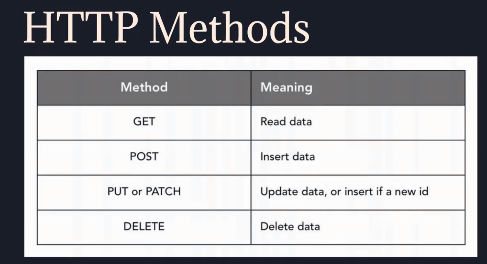
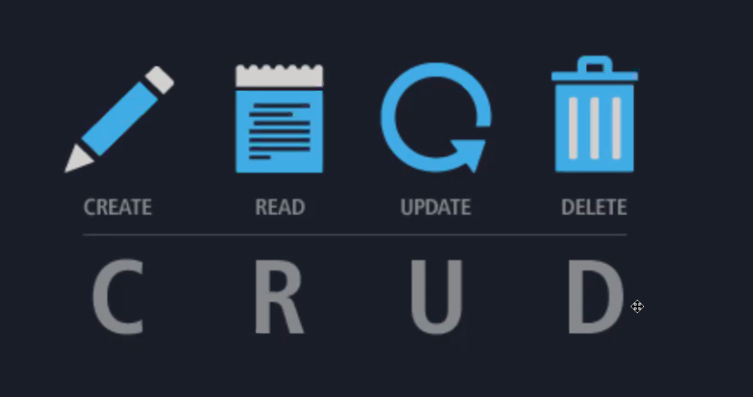
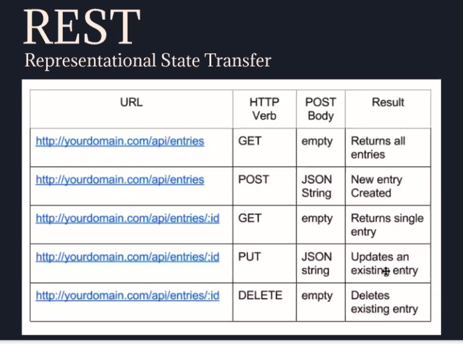

Module Materials:\
Module Project: <https://github.com/LambdaSchool/web-module-project-testing-react>\
GP Slides: <https://docs.google.com/presentation/d/1Z4obtWznnMDpVcRQ0A5g9rn2HLpRuva497SfaTSPaWs/edit?usp=sharing>\
Thursday's Module Project Review: <https://www.loom.com/share/7102e4c7b8f3427b916e6b4a9fb8b31d> PW: i31J4k\
Alternative GP Video: [Dustin Myers](https://youtu.be/KmCecD3z6HI) | [Josh Jacobson](https://youtu.be/w_w5Vosl_Ow)| [Warren C. Longmire](https://youtu.be/_YOicxJJpqU) | [Brian Kirkby](https://youtu.be/YC1opaqs6WM)**Key Terminology:**

-    *mock functions* - [Function placeholders use to monitor function execution within a test.](https://jestjs.io/docs/en/mock-functions.html)
-    *mock spys* - [Function placeholders that mock the execution of external libraries](https://silvenon.com/blog/mocking-with-jest/functions)
-    *rerender* - [A react testing library module use to render a component more then once in a test.](https://testing-library.com/docs/react-testing-library/api/#rerender)
-    *async / await* - [A javascript syntax that allows simpler, cleaner async code.](https://javascript.info/async-await)
-    *wait / waitFor* - [React testing library modules that allow a component test to wait until an async call or state chance occurs.](https://testing-library.com/docs/dom-testing-library/api-async/)

**Key Concepts:**

-    *unit testing* - [description](https://www.guru99.com/unit-testing-guide.html)
-    *integration testing* - [description](https://www.edureka.co/blog/what-is-integration-testing-a-simple-guide-on-how-to-perform-integration-testing/)

**Reference Materials:**

-    [React Testing Library query cheatsheet](https://testing-library.com/docs/react-testing-library/cheatsheet/)
-    [Jest expect functions](https://jestjs.io/docs/en/expect.html)
-    [Jest Mock functions reference](https://www.w3resource.com/jest/mock-functions-api-reference.php)

**Module Materials:**\
Module Project: <https://github.com/LambdaSchool/web-module-project-client-auth>\
GP Slides: <https://docs.google.com/presentation/d/1pWlfJhuZpeX054EgZGjElnWuzNPX2YQ1UXkUSw9QXBk/edit?usp=sharing>\
Monday's Module Project Review: <https://www.loom.com/share/e01d193711004a64ba265329f5337329> PW: lSwXpF\
Alternative GP Video: [Dustin Myers](https://youtu.be/ATr7QQP7lw4) | [Josh Jacobson](https://youtu.be/0AvJFNiqhD4)| [Warren C. Longmire](https://youtu.be/zVSH2n1wZCY) | [Brian Kirkby](https://youtu.be/hGICwuTH6Ag)**Key Terminology:**

-    *...rest* - [A means to get capture the remaining values within a javascript array or object easily.](https://medium.com/wesionary-team/spread-and-rest-operator-in-javascript-db3f15cec185)
-    *Redirect Route* - [A redirect method used through react-router.](https://medium.com/@alexfarmer/redirects-in-react-router-dom-46198938eedc)
-    *this.history redirect* - [A redirect method used through Route props.](https://www.codesd.com/item/react-this-props-history-push-does-not-redirect.html)
-    *window.location redirect* - [A redirect method used through the windows location object.](https://developer.mozilla.org/en-US/docs/Web/API/Window/location)
-    *Route* - [A react router component that allows programmers to connect a component to a url path](https://reactrouter.com/web/api/Route)
-    *axios.create* - [A means to create a stub of an axios call with preset values attached](https://masteringjs.io/tutorials/axios/create)
-    *jwt tokens* - [The current web standard for encrypted authentication tokens](https://dzone.com/articles/what-is-jwt-token)

**Key Concepts:**

-    *Token Saving* - [A great writeup on techniques in saving authentication tokens.](https://medium.com/@ryanchenkie_40935/react-authentication-how-to-store-jwt-in-a-cookie-346519310e81)
-    *Authentication* - [The process for identifying user identity.](https://www.youtube.com/watch?v=woNZJMSNbuo)
-    *Authorization* - [The process for identifying user permissions.](https://www.youtube.com/watch?v=I0poT4UxFxE)
-    *http headers* - [Additional data added to http requests for interperation within your backend code](https://developer.mozilla.org/en-US/docs/Web/HTTP/Headers)

# HTTP Methods:

  

