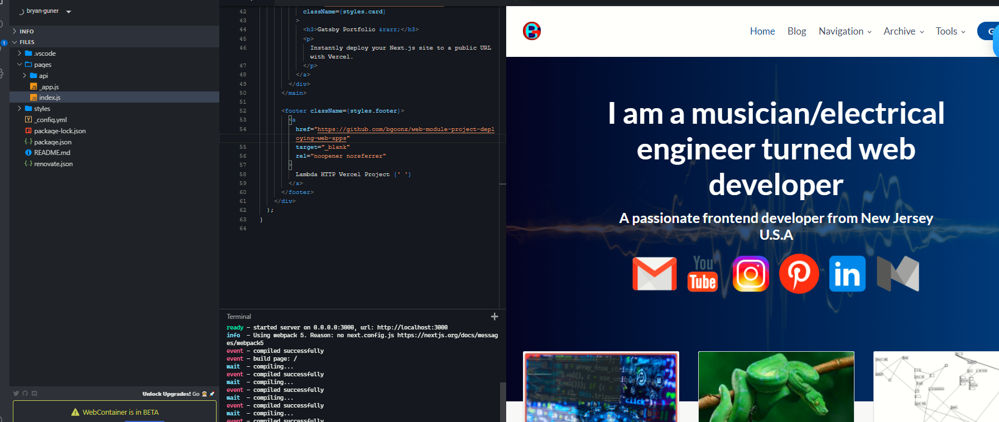

# Module Project: Deploying Web Apps - Portfolio Piece

# Edit:

[stackblitz](https://stackblitz.com/edit/lambda-vercel?file=pages/index.js)

## Introduction

In this module you will use what you've learned about deploying a web application, and deploy one of the apps you've built so that you can add it to your portfolio page

## Instructions 

### Task 1: Project Set Up

Think about which project you are most proud of up to this point that you have built from the ground up. For this project, you will work on deploying that project using Vercel, and prepare it to be added to your portfolio site. 

Follow these steps for completing your project.

- [ ] Send your team lead the link to your web app 
- [ ] Show them that it has been added to your portfolio
- [ ] If you don't have a portfolio, use this project time to create a portfolio, and deploy it with Vercel ([here](https://github.com/LambdaSchool/portfolio-website) is a guide for this)
- [ ] Once you have finished, your TL will count the project as completed

### Task 2a: MVP

# Lambda Vercel Deploy

[Live Site](https://lambda-http-vercel-project.vercel.app/)

After you have figured out which project you want to deploy, sign up for an account with Vercel and start the deployment process as outlined in training kit for this module. Once the project is deployed, you will add it to your porfolio site. Finally, work on updating this project so that it is polished and bug free! Good luck!

### Task 3: Stretch Problems

Do not attempt stretch problems until MVP has been reached and a final commit has been made.

Work on deploying a second, or even third portfolio project. If you have extra time, go back and update the styles, add features, fix bugs, etc, on all the sites so that they will look good for potential employers.

## Submission Format
* [ ] Submit a Pull-Request to merge `<firstName-lastName>` Branch into `main` (student's  Repo). **Please don't merge your own pull request**
