# Long Term Github visitor traffic statistics

**Produced by Dave Lusty**

## Introduction

This is a demo showing you how to use an Azure Logic App to export Github traffic statistics using the API detailed at [https://developer.github.com/v3/repos/traffic/#get-page-views](https://developer.github.com/v3/repos/traffic/#get-page-views). We'll then write the most recent statistics into a database instance, in this case SQL Server but any database supported by Logic Apps would work the same way. The reason for this is that Github only stores 14 days of visitor traffic in the traffic insights section for standard repositories. Using this technique we'll export all of the statistics and keep them longer term to see how much traffic there is over time on the repository. I have then connected Power BI to the database to create a report showing visitor numbers.

There is a [video of this demo](https://youtu.be/S5kxhPDQaxs)

## Github

### Set up Personal Access Token

<table>
<tr>
<td width="60%">In your Github, click on the account button in the top right corner and then settings.</td>
<td width="40%">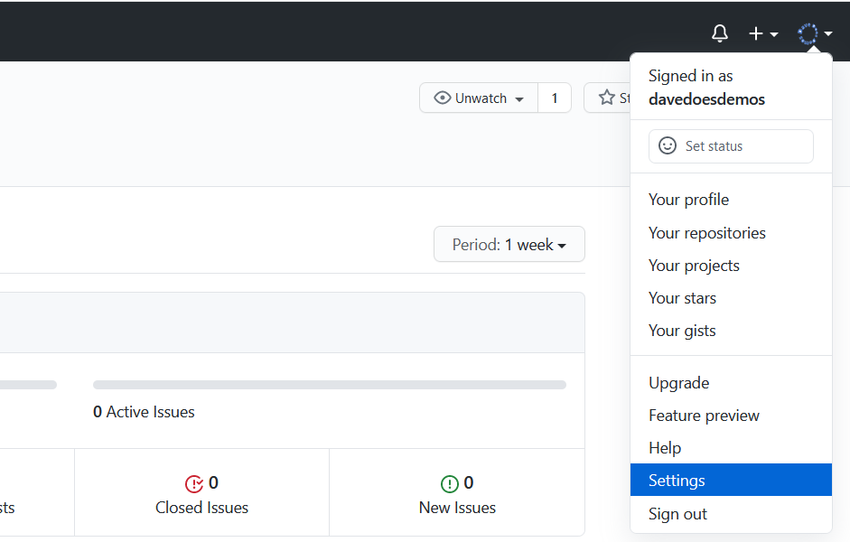</td>
</tr>
<tr>
<td width="60%">Next, click Developer settings</td>
<td width="40%"></td>
</tr>
<tr>
<td width="60%">Click on Personal Access Tokens, then Generate new token. You'll need to reconfirm your login details</td>
<td width="40%"></td>
</tr>
<tr>
<td width="60%">Give your token a descriptive name such as "Traffic Logic App" and select repo under scopes to give the token permissions</td>
<td width="40%">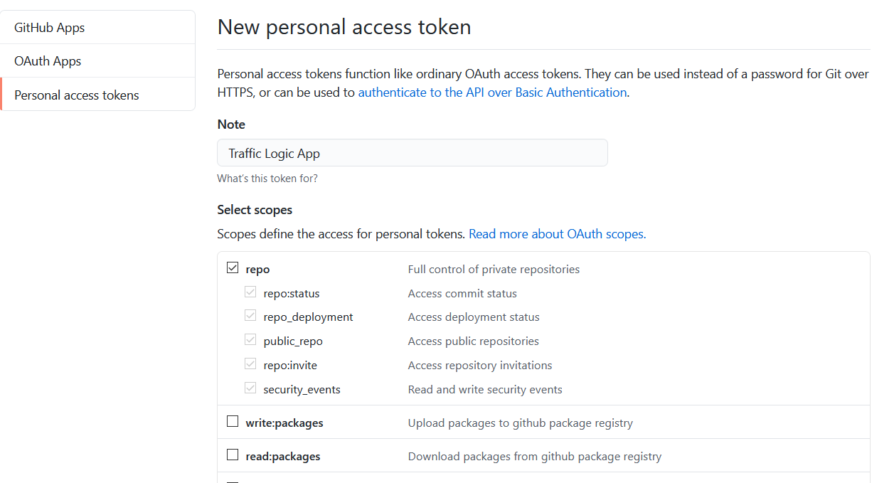</td>
</tr>
<tr>
<td width="60%">Copy the token and store it somewhere secure for now, we'll need it when setting up the Logic App</td>
<td width="40%">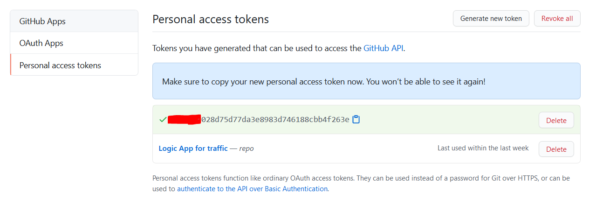</td>
</tr>
</table>

## Create Azure Resources

For this demo, we just need a Logic App and a SQL Database instance.

<table>
<tr>
<td width="60%">Log into the Azure portal and click create a new resource. Search for Logic App and click create.</td>
<td width="40%"></td>
</tr>
<tr>
<td width="60%">Choose a resource group, region and name then create the Logic App.</td>
<td width="40%"></td>
</tr>
<tr>
<td width="60%">Next, choose create a new resource and search for SQL Database then click create.</td>
<td width="40%">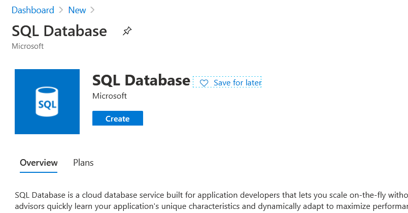</td>
</tr>
<tr>
<td width="60%">Click new server to create a new SQL Server instance. Give the server a name and username/password</td>
<td width="40%">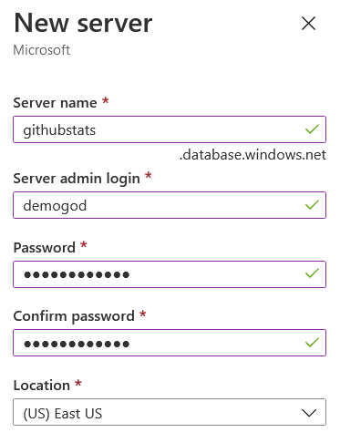</td>
</tr>
<tr>
<td width="60%">Click Configure Database to set up the size of your SQL Server. Click the "looking for basic, standard, premium?" button then choose basic. Select the smallest data size since the statistics will be tiny. If you have a lot of repositories or you think you'll store a lot of statistics you may need a larger size here.</td>
<td width="40%">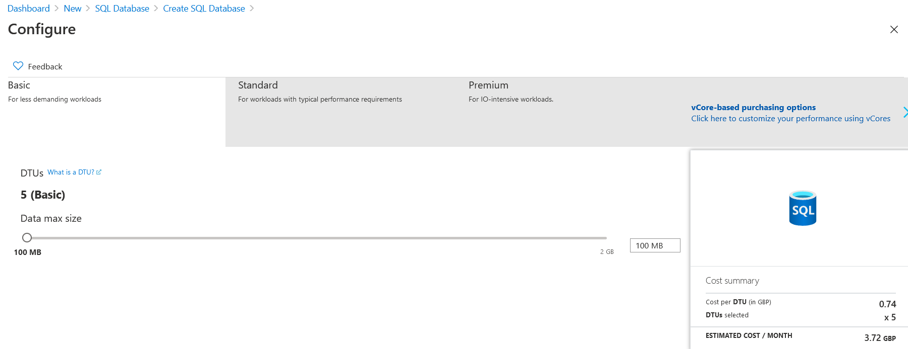</td>
</tr>
<tr>
<td width="60%">finally, give the database a name and click create</td>
<td width="40%"></td>
</tr>
<tr>
<td width="60%">Once the server is created, go to the firewalls and virtual networks tab and add your client IP as well as allowing access from Azure services then click save.</td>
<td width="40%">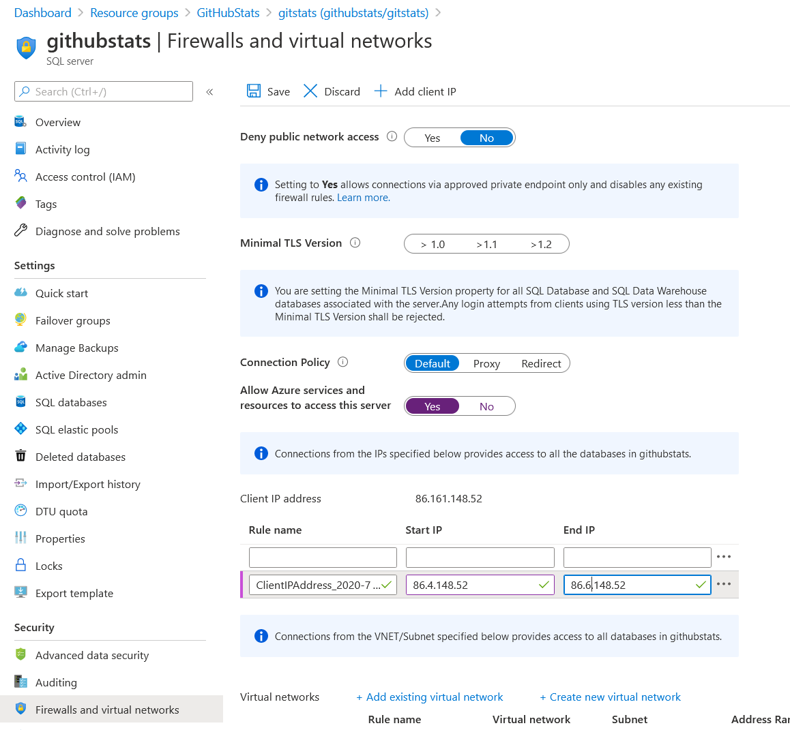</td>
</tr>
</table>

## Set up the database

<table>
<tr>
<td width="60%">On the SQL Server Database, click the Query Editor tab and log in.</td>
<td width="40%">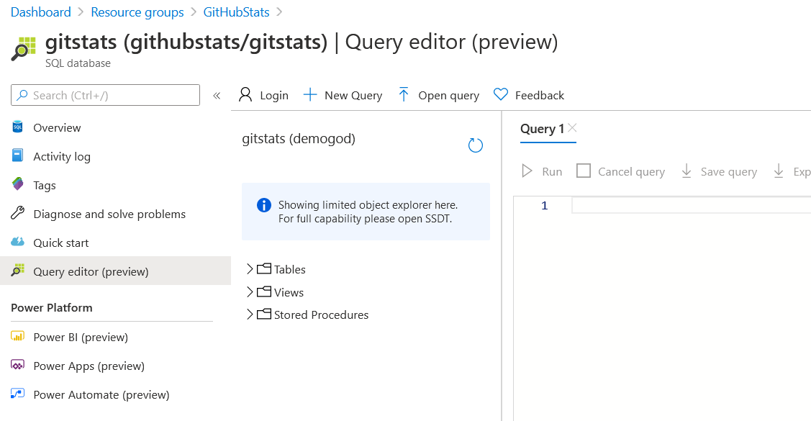</td>
</tr>
<tr>
<td width="60%">Run the following query to set up the database:  
CREATE TABLE repotraffic ( 
    statID  int IDENTITY(1,1) PRIMARY KEY, 
    repository varchar(255), 
    count int, 
    uniques int, 
    timestamp datetime 
);  
</td>
<td width="40%">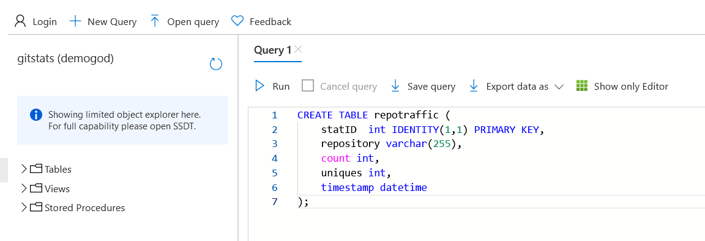</td>
</tr>
</table>

## Set up the Logic App

<table>
<tr>
<td width="60%">Navigate to the Logic App created earlier and click on Blank Logic App to enter the designer</td>
<td width="40%">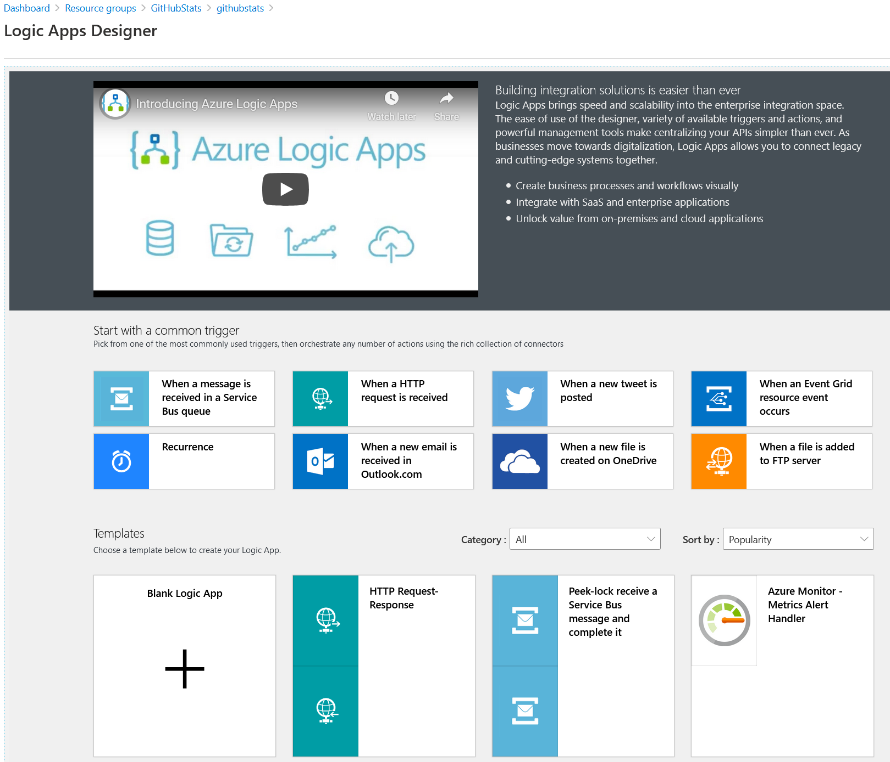</td>
</tr>
<tr>
<td width="60%">Add a recurrence trigger and set it to run once a day at a time of your choosing. This time will be UTC so ensure it's late enough to capture the entire previous day of statistics.</td>
<td width="40%"></td>
</tr>
<tr>
<td width="60%">Next add an initialize variable task to create an array. The array will be in JSON format with one repository name per line:
 
[ 
    "repository1", 
    "repository2 
] 
</td>
<td width="40%"></td>
</tr>
<tr>
<td width="60%">Next, add a For Each loop to iterate through the array and select the array for the output from previous step.</td>
<td width="40%">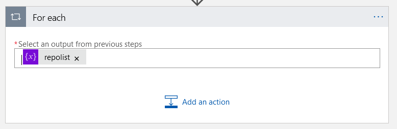</td>
</tr>
<tr>
<td width="60%">Next, click "Add an Action", but make sure you click the one inside the For Each loop box, not the lower one. Add an HTTP task and select Get as the method. For the URI you'll need to add "https://api.github.com/repos/<strong>&lt;yourusername&gt;</strong>/" and then add the current item variable from your dynamic content ment followed by "/traffic/views" 
Next, add a header for "Authorization" and add your token into the value box with "token " in front of it. It won't work without this extra text so ensure you add it. 
Finally, add in a query parameter called "per" with a value of "day" to get the daily stats.</td>
<td width="40%">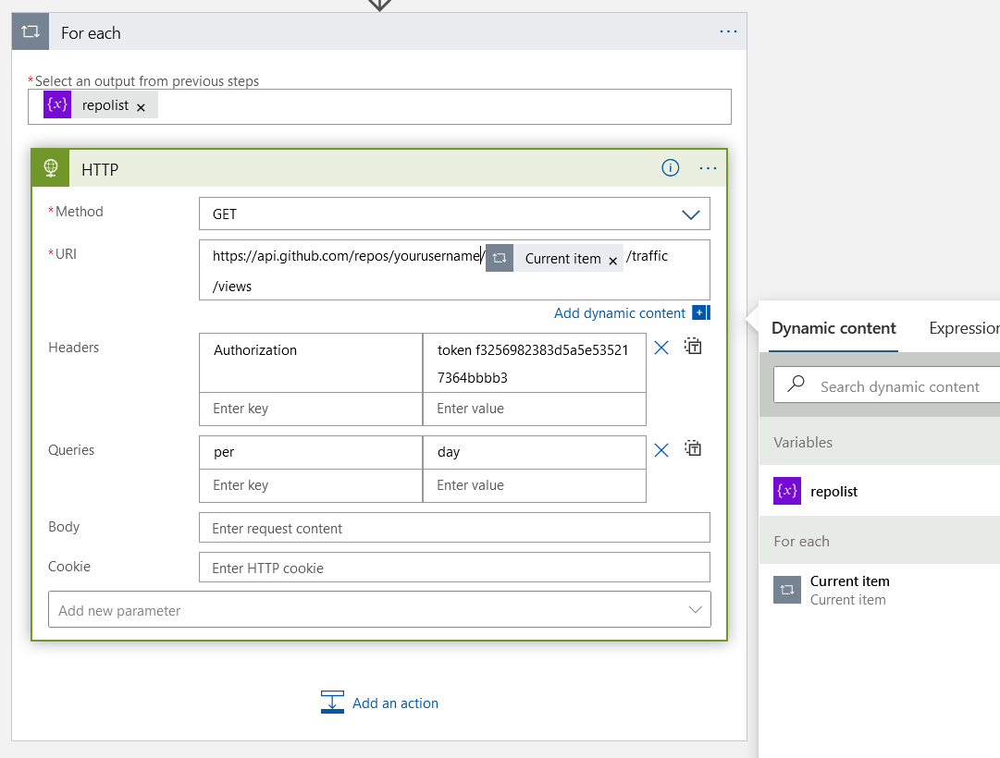</td>
</tr>
<tr>
<td width="60%">Now add a Parse JSON task to split out the response so we can iterate through the JSON. You can call the API manually with curl on the command line to get sample data, or add the following directly:  
{ 
    "properties": { 
        "count": { 
            "type": "integer" 
        }, 
        "uniques": { 
            "type": "integer" 
        }, 
        "views": { 
            "items": { 
                "properties": { 
                    "count": { 
                        "type": "integer" 
                    }, 
                    "timestamp": { 
                        "type": "string" 
                    }, 
                    "uniques": { 
                        "type": "integer" 
                    } 
                }, 
                "required": [ 
                    "timestamp", 
                    "count", 
                    "uniques" 
                ], 
                "type": "object" 
            }, 
            "type": "array" 
        } 
    }, 
    "type": "object" 
} 
This will give you each part of the JSON as variables to use in the next task.</td>
<td width="40%">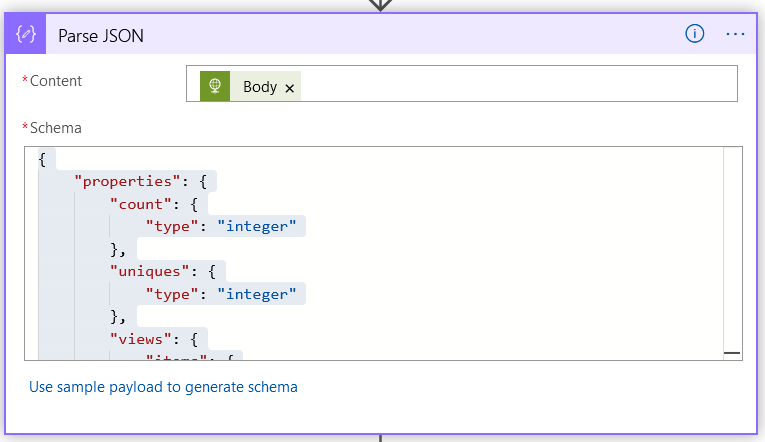</td>
</tr>
<tr>
<td width="60%">Now add another For Each loop and choose the views variable from the parse operation. This is an array of daily statistics.</td>
<td width="40%">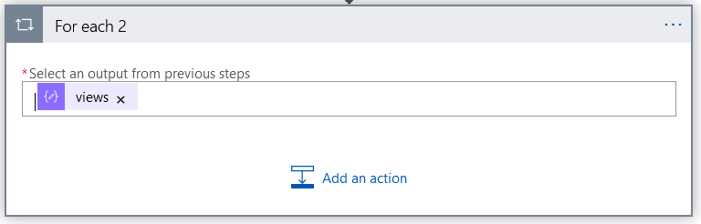</td>
</tr>
<tr>
<td width="60%">Inside of this loop add another parse task to get the date from the current item. This time the schema is just the array part:  
{ 
    "properties": { 
        "count": { 
            "type": "integer" 
        }, 
        "timestamp": { 
            "type": "string" 
        }, 
        "uniques": { 
            "type": "integer" 
        } 
    }, 
    "type": "object" 
}</td>
<td width="40%"></td>
</tr>
<tr>
<td width="60%">Now add a condition to compare the current date to the one in the current item from the array. We need to do this so we collect the statistics from yesterday, which will be complete rather than today which might not be. The first part will be a formatDateTime on the timestamp from the parse job to get just the date portion in a suitable format: 
formatDateTime(body('Parse_JSON_2')?['timestamp'], 'yyyy-MM-dd') 
Then we format the current timestamp to compare it to, but subtract a day: 
formatDateTime(addDays(utcNow(), -1), 'yyyy-MM-dd')
</td>
<td width="40%">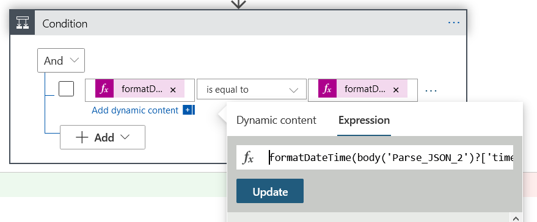</td>
</tr>
<tr>
<td width="60%">Under the "If True" side, add a SQL Server insert row task. Set up a connection using SQL Server Authentication and add in your server and database name etc. from the server we set up earlier.</td>
<td width="40%"></td>
</tr>
<tr>
<td width="60%">Next, select the table from the drop down boxes and then add all columns from the database as parameters. This parameter box may take a few seconds to show since it has to run a SQL query to find the columns.</td>
<td width="40%"></td>
</tr>
<tr>
<td width="60%">Fill in the current item from the first for each loop (repository name) and then count, uniques and timestamp from the second parse task. Save the app and run to test it.</td>
<td width="40%"></td>
</tr>
</table>

## Reporting

<table>
<tr>
<td width="60%">Finally, you can now set up a Power BI report to look at your data. You'll need to wait a while for data to build up since it comes in one day at a time, but you could load 14 days using an initial run without the date comparison step in the logic app to get your first batch of information.</td>
<td width="40%"></td>
</tr>
</table>
