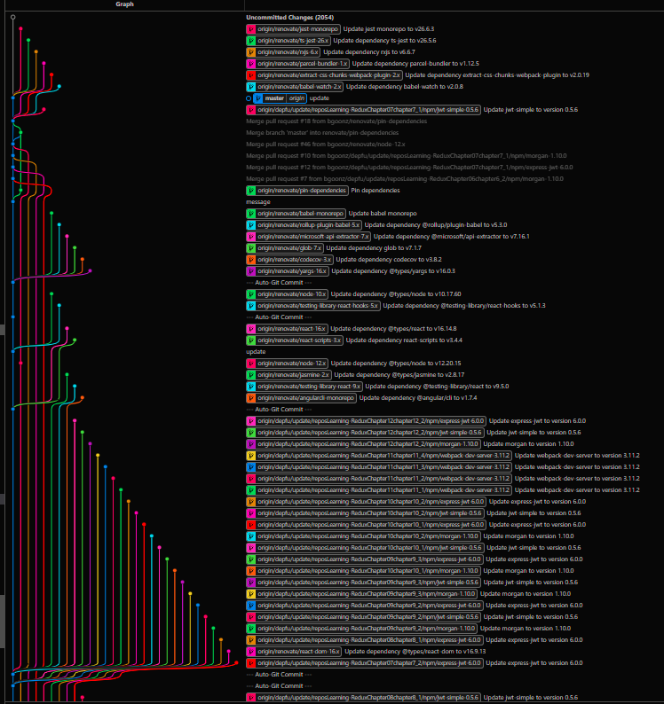

# Redux Libraries & Learning Material 

> Redux is a state container for JavaScript apps.

- Official website: [`devarchy.com/redux`](https://devarchy.com/redux)
- Use devarchy to add a library to the catalog

  

#### Contents

- [Code Architecture](#code-architecture)
- [Utilities](#utilities)
- [Code Style](#code-style)
- [Dev tools / Inspection tools](#dev-tools--inspection-tools)
- [React Integration](#react-integration)
- [Other Integrations](#other-integrations)
- [Boilerplate](#boilerplate)
- [Miscellaneous](#miscellaneous)
- [Learning Material](#learning-material)
- [Community](#community)

 

## Code Architecture

_Aims to improve the overall structure of the source code. Makes reasoning about the code easier._

- [redux-schema](https://github.com/ddsol/redux-schema) - Automatic actions, reducers and validation for Redux.
- [redux-tcomb](https://github.com/gcanti/redux-tcomb) - Immutable and type-checked state and actions for Redux.
- [redux-action-tree](https://github.com/cerebral/redux-action-tree) - The Cerebral signals running with Redux.
- [redux-elm](https://github.com/salsita/redux-elm) - The Elm Architecture in JavaScript.

## Utilities

- [redux-orm](https://github.com/tommikaikkonen/redux-orm) - Small, simple and immutable ORM to manage relational data in your Redux store.
- [redux-api-middleware](https://github.com/agraboso/redux-api-middleware) - Redux middleware for calling an API.
- [redux-ignore](https://github.com/omnidan/redux-ignore) - Higher-order reducer to ignore Redux actions.
- [redux-modifiers](https://github.com/calvinfroedge/redux-modifiers) - Collection of generic functions for writing Redux reducers to operate on various data structures.
- [rereduce](https://github.com/slorber/rereduce) - Reducer library for Redux.
- [redux-search](https://github.com/treasure-data/redux-search) - Redux bindings for client-side search.
- [redux-logger](https://github.com/evgenyrodionov/redux-logger) - Logger middleware for Redux.
- [redux-immutable](https://github.com/gajus/redux-immutable) - Redux-immutable is used to create an equivalent function of Redux combineReducers that works with Immutable.js state.
- [reselect](https://github.com/reactjs/reselect) - Selector library for Redux.
- [redux-requests](https://github.com/idolize/redux-requests) - Manages in-flight requests with a Redux reducer to avoid issuing duplicate requests.
- [redux-undo](https://github.com/omnidan/redux-undo) - Higher order reducer to add undo/redo functionality to Redux state containers.
- [redux-bug-reporter](https://github.com/dtschust/redux-bug-reporter) - Bug reporter and bug playback tool for Redux.
- [redux-transducers](https://github.com/acdlite/redux-transducers) - Transducer utilities for Redux.

### Store Persistence

- [redux-storage](https://github.com/michaelcontento/redux-storage) - Persistence layer for Redux with flexible backends.
- [redux-persist](https://github.com/rt2zz/redux-persist) - Persist and rehydrate a Redux store.

### Side Effects

_Side Effects / Asynchronous Actions_

- [redux-saga](https://github.com/yelouafi/redux-saga) - Alternative side effect model for Redux apps.
- [redux-promise-middleware](https://github.com/pburtchaell/redux-promise-middleware) - Redux middleware for resolving and rejecting promises with conditional optimistic updates.
- [redux-effects](https://github.com/redux-effects/redux-effects) - You write pure functions, redux-effects handles the rest.
- [redux-thunk](https://github.com/gaearon/redux-thunk) - Thunk middleware for Redux.
- [redux-connect](https://github.com/makeomatic/redux-connect) - Provides decorator for resolving async props in react-router, extremely useful for handling server-side rendering in React.
- [redux-loop](https://github.com/redux-loop/redux-loop) - Port of elm-effects and the Elm Architecture to Redux that allows you to sequence your effects naturally and purely by returning them from your reducers.
- [redux-side-effects](https://github.com/salsita/redux-side-effects) - Redux toolset for keeping all the side effects inside your reducers while maintaining their purity.
- [redux-logic](https://github.com/jeffbski/redux-logic) - Redux middleware for organizing business logic and action side effects.
- [redux-observable](https://github.com/redux-observable/redux-observable) - RxJS middleware for action side effects in Redux using &quot;Epics&quot;.
- [redux-ship](https://github.com/clarus/redux-ship) - Composable, testable and typable side effects.

## Code Style

_Aims to make parts of the source code easier to read/write._

- [redux-act](https://github.com/pauldijou/redux-act) - Opinionated lib to create actions and reducers for Redux.
- [redux-crud](https://github.com/Versent/redux-crud) - Set of standard actions and reducers for Redux CRUD Applications.

## Dev tools / Inspection tools

- [redux-devtools-inspector](https://github.com/alexkuz/redux-devtools-inspector) - Another Redux DevTools Monitor.
- [redux-diff-logger](https://github.com/fcomb/redux-diff-logger) - Diff logger between states for Redux.
- [redux-devtools-chart-monitor](https://github.com/romseguy/redux-devtools-chart-monitor) - Chart monitor for Redux DevTools.
- [redux-devtools](https://github.com/gaearon/redux-devtools) - DevTools for Redux with hot reloading, action replay, and customizable UI.
- [redux-devtools-dispatch](https://github.com/YoruNoHikage/redux-devtools-dispatch) - Dispatch your actions manually to test if your app Reacts well.
- [redux-devtools-dock-monitor](https://github.com/gaearon/redux-devtools-dock-monitor) - Resizable and movable dock for Redux DevTools monitors.
- [redux-devtools-filterable-log-monitor](https://github.com/bvaughn/redux-devtools-filterable-log-monitor) - Filterable tree view monitor for Redux DevTools.
- [redux-devtools-log-monitor](https://github.com/gaearon/redux-devtools-log-monitor) - The default monitor for Redux DevTools with a tree view.
- [remote-redux-devtools](https://github.com/zalmoxisus/remote-redux-devtools) - Redux DevTools remotely.

## React Integration

- [redux-test-recorder](https://github.com/conorhastings/redux-test-recorder) - Redux middleware to automatically generate tests for reducers through ui interaction.
- [react-redux](https://github.com/reactjs/react-redux) - Official React bindings for Redux.
- [react-easy-universal](https://github.com/keystonejs/react-easy-universal) - Universal Routing &amp; Rendering with React &amp; Redux was too hard. Now it&#39;s easy.
- [redux-form-material-ui](https://github.com/erikras/redux-form-material-ui) - Set of wrapper components to facilitate using Material UI with Redux Form.

### Routing

- [redux-async-connect](https://github.com/Rezonans/redux-async-connect) - It allows you to request async data, store them in Redux state and connect them to your React component.
- [redux-tiny-router](https://github.com/Agamennon/redux-tiny-router) - Router made for Redux and made for universal apps. Stop using the router as a controller, it's just state.
- [redux-router](https://github.com/acdlite/redux-router) - Redux bindings for React Router &ndash; keep your router state inside your Redux store.
- [react-router-redux](https://github.com/reactjs/react-router-redux) - Ruthlessly simple bindings to keep react-router and Redux in sync.
- [ground-control](https://github.com/raisemarketplace/ground-control) - Scalable reducer management &amp; powerful data fetching for React Router &amp; Redux.

### Forms

- [redux-form](https://github.com/erikras/redux-form) - Higher Order Component using react-redux to keep form state in a Redux store.
- [react-redux-form](https://github.com/davidkpiano/react-redux-form) - Create forms easily in React with Redux.

### Component State

- [redux-react-local](https://github.com/threepointone/redux-react-local) - Local component state via Redux.
- [redux-ui](https://github.com/tonyhb/redux-ui) - Easy UI state management for React Redux.

## Other Integrations

### Flux

- [redux-actions](https://github.com/acdlite/redux-actions) - Flux Standard Action utilities for Redux.
- [redux-promise](https://github.com/acdlite/redux-promise) - FSA-compliant promise middleware for Redux.

### Backbone

- [backbone-redux](https://github.com/redbooth/backbone-redux) - Easy way to keep your backbone collections and Redux store in sync.

### Falcor

- [redux-falcor](https://github.com/ekosz/redux-falcor) - Connect your Redux front-end to your falcor back-end.

### RxJS

- [redux-observable](https://github.com/redux-observable/redux-observable) - RxJS middleware for action side effects in Redux using &quot;Epics&quot;.
- [rx-redux](https://github.com/jas-chen/rx-redux) - Reimplementation of Redux using RxJS.
- [redux-rx](https://github.com/acdlite/redux-rx) - RxJS utilities for Redux.
- [redurx](https://github.com/shiftyp/redurx) - Redux&#39;ish Functional State Management using RxJS.

### Electron

- [redux-electron-store](https://github.com/samiskin/redux-electron-store) - Redux store enhancer that allows automatic synchronization between electron processes.

### Deku

- [deku-redux](https://github.com/troch/deku-redux) - Bindings for Redux in deku &lt; v2.

### Other

- [redux-rollbar-middleware](https://github.com/netguru/redux-rollbar-middleware) - Redux middleware that wraps exceptions in actions and sends them to Rollbar with current state.
- [kasia](https://github.com/outlandishideas/kasia) - React Redux toolset for the WordPress API.

## Boilerplate

_Boilerplates / Scaffolds / Starter Kits / Generators / Stack Ensembles_

- [redux-cli](https://github.com/SpencerCDixon/redux-cli) - Opinionated CLI for building Redux/React apps quicker.
- [reactuate](https://github.com/reactuate/reactuate) - React/Redux stack (not a boilerplate kit).
- [react-chrome-extension-boilerplate](https://github.com/jhen0409/react-chrome-extension-boilerplate) - Boilerplate for Chrome Extension React.js project.
- [universal-redux](https://github.com/bdefore/universal-redux) - Npm package that lets you jump right into coding React and Redux with universal (isomorphic) rendering. Only manage Express setups or Webpack configurations if you want to.
- [generator-react-aspnet-boilerplate](https://github.com/pauldotknopf/react-aspnet-boilerplate) - Starting point for building isomorphic React applications with ASP.NET Core 1, leveraging existing techniques.
- [generator-redux](https://github.com/banderson/generator-redux) - CLI tools for Redux: next-gen functional Flux/React with devtools.
- [generator-react-webpack-redux](https://github.com/stylesuxx/generator-react-webpack-redux) - React Webpack Generator including Redux support.
- [socrates](https://github.com/matthewmueller/socrates) - Small (8kb), batteries-included Redux store to reduce boilerplate and promote good habits.

## Miscellaneous

- [redux-core](https://github.com/jas-chen/redux-core) - Minimal Redux.

## Learning Material

- **Redux's concepts**

  [Redux official documentation](http://redux.js.org/) does a great job at explaining Redux's core principles.

- **Why immutable data structures**

  The [guide on performance](https://facebook.github.io/react/docs/advanced-performance.html) of React's official documentation explains well what immutable data structures are and why they play an important role.

- **Side Effects**

  [Redux Loop's readme](https://github.com/redux-loop/redux-loop) gives a good insight on Side Effects in the context of Redux.

Reading the aforementioned material will get you a good start for writing apps with Redux.
If you are curious for more, check out following resources.

- **Functional Programming - Basics**

  This [post](http://jaysoo.ca/2016/01/13/functional-programming-little-ideas/) goes over basic concepts of functional programming while building a YouTube instant search demo app.

- **Reactive Programming**

  This [introduction to Reactive Programming](https://gist.github.com/staltz/868e7e9bc2a7b8c1f754) explains Reactive Programming with clarity.

- **Functional Programming - Going beyond**

  Well written [article](https://medium.com/@chetcorcos/functional-programming-for-javascript-people-1915d8775504) that talks about interesting computer science concepts implemented in functional languages and how these apply to JavaScript.

- **Monads**

  Curious about monads? Wikipedia gives a good [overview on monads](<https://en.wikipedia.org/wiki/Monad_(functional_programming)>) and [this article](http://adit.io/posts/2013-04-17-functors,_applicatives,_and_monads_in_pictures.html) explains monads in more details with graphics and simple examples.

## Community

- [Reddit](https://www.reddit.com/r/reduxjs/)
- [Stack Overflow](http://stackoverflow.com/questions/tagged/redux)
- [Discord](https://discord.gg/0ZcbPKXt5bZ6au5t)
- [Slack](http://slack.redux.io/)
- [Gitter](https://gitter.im/reactjs/redux)
- [`#rackt` on freenode](https://webchat.freenode.net/)

# Getting Started with React Redux | React Redux

> Introduction > Getting Started: First steps with React Redux

[React Redux](https://github.com/reduxjs/react-redux) is the official [React](https://reactjs.org/) UI bindings layer for [Redux](https://redux.js.org/). It lets your React components read data from a Redux store, and dispatch actions to the store to update state.

## Installation[#](#installation "Direct link to heading")

React Redux 7.1+ requires **React 16.8.3 or later**, in order to make use of React Hooks.

### Using Create React App[#](#using-create-react-app "Direct link to heading")

The recommended way to start new apps with React and Redux is by using the [official Redux+JS template](https://github.com/reduxjs/cra-template-redux) or [Redux+TS template](https://github.com/reduxjs/cra-template-redux-typescript) for [Create React App](https://github.com/facebook/create-react-app), which takes advantage of **[Redux Toolkit](https://redux-toolkit.js.org/)** and React Redux's integration with React components.

### An Existing React App[#](#an-existing-react-app "Direct link to heading")

To use React Redux with your React app, install it as a dependency:

You'll also need to [install Redux](https://redux.js.org/introduction/installation) and [set up a Redux store](https://redux.js.org/recipes/configuring-your-store/) in your app.

If you are using TypeScript, the React Redux types are maintained separately in DefinitelyTyped, but included as a dependency of the `react-redux` package, so they should be installed automatically. If you still need to install them manually, run:

## API Overview[#](#api-overview "Direct link to heading")

### `Provider`[#](#provider "Direct link to heading")

React Redux includes a `<Provider />` component, which makes the Redux store available to the rest of your app:

### Hooks[#](#hooks "Direct link to heading")

React Redux provides a pair of custom React hooks that allow your React components to interact with the Redux store.

`useSelector` reads a value from the store state and subscribes to updates, while `useDispatch` returns the store's `dispatch` method to let you dispatch actions.

## Learning React Redux[#](#learning-react-redux "Direct link to heading")

### Learn Modern Redux Livestream[#](#learn-modern-redux-livestream "Direct link to heading")

Redux maintainer Mark Erikson appeared on the "Learn with Jason" show to explain how we recommend using Redux today. The show includes a live-coded example app that shows how to use Redux Toolkit and React-Redux hooks with Typescript, as well as the new RTK Query data fetching APIs.

See [the "Learn Modern Redux" show notes page](https://www.learnwithjason.dev/let-s-learn-modern-redux) for a transcript and links to the example app source.

## Help and Discussion[#](#help-and-discussion "Direct link to heading")

The **[#redux channel](https://discord.gg/0ZcbPKXt5bZ6au5t)** of the **[Reactiflux Discord community](http://www.reactiflux.com/)** is our official resource for all questions related to learning and using Redux. Reactiflux is a great place to hang out, ask questions, and learn - come join us!

You can also ask questions on [Stack Overflow](https://stackoverflow.com/) using the **[#redux tag](https://stackoverflow.com/questions/tagged/redux)**.

## Docs Translations[#](#docs-translations "Direct link to heading")

- [Portuguese](https://fernandobelotto.github.io/react-redux)

[Source](https://react-redux.js.org/introduction/getting-started)

## [Introduction](#introduction "Direct link to heading")

Welcome to the Redux Essentials tutorial! **This tutorial will introduce you to Redux and teach you how to use it the right way, using our latest recommended tools and best practices**. By the time you finish, you should be able to start building your own Redux applications using the tools and patterns you've learned here.

In Part 1 of this tutorial, we'll cover the key concepts and terms you need to know to use Redux, and in [Part 2: Redux App Structure](chrome-extension://cjedbglnccaioiolemnfhjncicchinao/tutorials/essentials/part-2-app-structure) we'll examine a basic React + Redux app to see how the pieces fit together.

Starting in [Part 3: Basic Redux Data Flow](chrome-extension://cjedbglnccaioiolemnfhjncicchinao/tutorials/essentials/part-3-data-flow), we'll use that knowledge to build a small social media feed app with some real-world features, see how those pieces actually work in practice, and talk about some important patterns and guidelines for using Redux.

### [How to Read This Tutorial](#how-to-read-this-tutorial "Direct link to heading")

This page will focus on showing you _how_ to use Redux the right way, and explain just enough of the concepts so that you can understand how to build Redux apps correctly.

We've tried to keep these explanations beginner-friendly, but we do need to make some assumptions about what you know already:

**If you're not already comfortable with those topics, we encourage you to take some time to become comfortable with them first, and then come back to learn about Redux**. We'll be here when you're ready!

You should make sure that you have the React and Redux DevTools extensions installed in your browser:

- React DevTools Extension:
  - [React DevTools Extension for Chrome](https://chrome.google.com/webstore/detail/react-developer-tools/fmkadmapgofadopljbjfkapdkoienihi?hl=en)
  - [React DevTools Extension for Firefox](https://addons.mozilla.org/en-US/firefox/addon/react-devtools/)
- Redux DevTools Extension:
  - [Redux DevTools Extension for Chrome](https://chrome.google.com/webstore/detail/redux-devtools/lmhkpmbekcpmknklioeibfkpmmfibljd?hl=en)
  - [Redux DevTools Extension for Firefox](https://addons.mozilla.org/en-US/firefox/addon/reduxdevtools/)

## [What is Redux?](#what-is-redux "Direct link to heading")

It helps to understand what this "Redux" thing is in the first place. What does it do? What problems does it help me solve? Why would I want to use it?

**Redux is a pattern and library for managing and updating application state, using events called "actions".** It serves as a centralized store for state that needs to be used across your entire application, with rules ensuring that the state can only be updated in a predictable fashion.

### Why Should I Use Redux?[#](#why-should-i-use-redux "Direct link to heading")

Redux helps you manage "global" state - state that is needed across many parts of your application.

**The patterns and tools provided by Redux make it easier to understand when, where, why, and how the state in your application is being updated, and how your application logic will behave when those changes occur**. Redux guides you towards writing code that is predictable and testable, which helps give you confidence that your application will work as expected.

### When Should I Use Redux?[#](#when-should-i-use-redux "Direct link to heading")

Redux helps you deal with shared state management, but like any tool, it has tradeoffs. There are more concepts to learn, and more code to write. It also adds some indirection to your code, and asks you to follow certain restrictions. It's a trade-off between short term and long term productivity.

Redux is more useful when:

- You have large amounts of application state that are needed in many places in the app
- The app state is updated frequently over time
- The logic to update that state may be complex
- The app has a medium or large-sized codebase, and might be worked on by many people

**Not all apps need Redux. Take some time to think about the kind of app you're building, and decide what tools would be best to help solve the problems you're working on.**

### Redux Libraries and Tools[#](#redux-libraries-and-tools "Direct link to heading")

Redux is a small standalone JS library. However, it is commonly used with several other packages:

#### React-Redux[#](#react-redux "Direct link to heading")

Redux can integrate with any UI framework, and is most frequently used with React. [**React-Redux**](https://react-redux.js.org/) is our official package that lets your React components interact with a Redux store by reading pieces of state and dispatching actions to update the store.

#### Redux Toolkit[#](#redux-toolkit "Direct link to heading")

[**Redux Toolkit**](https://redux-toolkit.js.org/) is our recommended approach for writing Redux logic. It contains packages and functions that we think are essential for building a Redux app. Redux Toolkit builds in our suggested best practices, simplifies most Redux tasks, prevents common mistakes, and makes it easier to write Redux applications.

#### Redux DevTools Extension[#](#redux-devtools-extension "Direct link to heading")

The [**Redux DevTools Extension**](https://github.com/zalmoxisus/redux-devtools-extension) shows a history of the changes to the state in your Redux store over time. This allows you to debug your applications effectively, including using powerful techniques like "time-travel debugging".

## Redux Terms and Concepts[#](#redux-terms-and-concepts "Direct link to heading")

Before we dive into some actual code, let's talk about some of the terms and concepts you'll need to know to use Redux.

### State Management[#](#state-management "Direct link to heading")

Let's start by looking at a small React counter component. It tracks a number in component state, and increments the number when a button is clicked:

It is a self-contained app with the following parts:

- The **state**, the source of truth that drives our app;
- The **view**, a declarative description of the UI based on the current state
- The **actions**, the events that occur in the app based on user input, and trigger updates in the state

This is a small example of **"one-way data flow"**:

- State describes the condition of the app at a specific point in time
- The UI is rendered based on that state
- When something happens (such as a user clicking a button), the state is updated based on what occurred
- The UI re-renders based on the new state

However, the simplicity can break down when we have **multiple components that need to share and use the same state**, especially if those components are located in different parts of the application. Sometimes this can be solved by ["lifting state up"](https://reactjs.org/docs/lifting-state-up.html) to parent components, but that doesn't always help.

One way to solve this is to extract the shared state from the components, and put it into a centralized location outside the component tree. With this, our component tree becomes a big "view", and any component can access the state or trigger actions, no matter where they are in the tree!

By defining and separating the concepts involved in state management and enforcing rules that maintain independence between views and states, we give our code more structure and maintainability.

This is the basic idea behind Redux: a single centralized place to contain the global state in your application, and specific patterns to follow when updating that state to make the code predictable.

### Immutability[#](#immutability "Direct link to heading")

"Mutable" means "changeable". If something is "immutable", it can never be changed.

JavaScript objects and arrays are all mutable by default. If I create an object, I can change the contents of its fields. If I create an array, I can change the contents as well:

This is called _mutating_ the object or array. It's the same object or array reference in memory, but now the contents inside the object have changed.

**In order to update values immutably, your code must make _copies_ of existing objects/arrays, and then modify the copies**.

We can do this by hand using JavaScript's array / object spread operators, as well as array methods that return new copies of the array instead of mutating the original array:

**Redux expects that all state updates are done immutably**. We'll look at where and how this is important a bit later, as well as some easier ways to write immutable update logic.

### Terminology[#](#terminology "Direct link to heading")

There are some important Redux terms that you'll need to be familiar with before we continue:

#### Actions[#](#actions "Direct link to heading")

An **action** is a plain JavaScript object that has a `type` field. **You can think of an action as an event that describes something that happened in the application**.

The `type` field should be a string that gives this action a descriptive name, like `"todos/todoAdded"`. We usually write that type string like `"domain/eventName"`, where the first part is the feature or category that this action belongs to, and the second part is the specific thing that happened.

An action object can have other fields with additional information about what happened. By convention, we put that information in a field called `payload`.

A typical action object might look like this:

#### Action Creators[#](#action-creators "Direct link to heading")

An **action creator** is a function that creates and returns an action object. We typically use these so we don't have to write the action object by hand every time:

#### Reducers[#](#reducers "Direct link to heading")

A **reducer** is a function that receives the current `state` and an `action` object, decides how to update the state if necessary, and returns the new state: `(state, action) => newState`. **You can think of a reducer as an event listener which handles events based on the received action (event) type.**

##### info

"Reducer" functions get their name because they're similar to the kind of callback function you pass to the [`Array.reduce()`](https://developer.mozilla.org/en-US/docs/Web/JavaScript/Reference/Global_Objects/Array/reduce) method.

Reducers must _always_ follow some specific rules:

- They should only calculate the new state value based on the `state` and `action` arguments
- They are not allowed to modify the existing `state`. Instead, they must make _immutable updates_, by copying the existing `state` and making changes to the copied values.
- They must not do any asynchronous logic, calculate random values, or cause other "side effects"

We'll talk more about the rules of reducers later, including why they're important and how to follow them correctly.

The logic inside reducer functions typically follows the same series of steps:

- Check to see if the reducer cares about this action
  - If so, make a copy of the state, update the copy with new values, and return it
- Otherwise, return the existing state unchanged

Here's a small example of a reducer, showing the steps that each reducer should follow:

Reducers can use any kind of logic inside to decide what the new state should be: `if/else`, `switch`, loops, and so on.

#### Detailed Explanation: Why Are They Called 'Reducers?'

The [`Array.reduce()`](https://developer.mozilla.org/en-US/docs/Web/JavaScript/Reference/Global_Objects/Array/reduce) method lets you take an array of values, process each item in the array one at a time, and return a single final result. You can think of it as "reducing the array down to one value".

`Array.reduce()` takes a callback function as an argument, which will be called one time for each item in the array. It takes two arguments:

- `previousResult`, the value that your callback returned last time
- `currentItem`, the current item in the array

The first time that the callback runs, there isn't a `previousResult` available, so we need to also pass in an initial value that will be used as the first `previousResult`.

If we wanted to add together an array of numbers to find out what the total is, we could write a reduce callback that looks like this:

Notice that this `addNumbers` "reduce callback" function doesn't need to keep track of anything itself. It takes the `previousResult` and `currentItem` arguments, does something with them, and returns a new result value.

**A Redux reducer function is exactly the same idea as this "reduce callback" function!** It takes a "previous result" (the `state`), and the "current item" (the `action` object), decides a new state value based on those arguments, and returns that new state.

If we were to create an array of Redux actions, call `reduce()`, and pass in a reducer function, we'd get a final result the same way:

We can say that **Redux reducers reduce a set of actions (over time) into a single state**. The difference is that with `Array.reduce()` it happens all at once, and with Redux, it happens over the lifetime of your running app.

#### Store[#](#store "Direct link to heading")

The current Redux application state lives in an object called the **store** .

The store is created by passing in a reducer, and has a method called `getState` that returns the current state value:

#### Dispatch[#](#dispatch "Direct link to heading")

The Redux store has a method called `dispatch`. **The only way to update the state is to call `store.dispatch()` and pass in an action object**. The store will run its reducer function and save the new state value inside, and we can call `getState()` to retrieve the updated value:

**You can think of dispatching actions as "triggering an event"** in the application. Something happened, and we want the store to know about it. Reducers act like event listeners, and when they hear an action they are interested in, they update the state in response.

We typically call action creators to dispatch the right action:

#### Selectors[#](#selectors "Direct link to heading")

**Selectors** are functions that know how to extract specific pieces of information from a store state value. As an application grows bigger, this can help avoid repeating logic as different parts of the app need to read the same data:

### Redux Application Data Flow[#](#redux-application-data-flow "Direct link to heading")

Earlier, we talked about "one-way data flow", which describes this sequence of steps to update the app:

- State describes the condition of the app at a specific point in time
- The UI is rendered based on that state
- When something happens (such as a user clicking a button), the state is updated based on what occurred
- The UI re-renders based on the new state

For Redux specifically, we can break these steps into more detail:

- Initial setup:
  - A Redux store is created using a root reducer function
  - The store calls the root reducer once, and saves the return value as its initial `state`
  - When the UI is first rendered, UI components access the current state of the Redux store, and use that data to decide what to render. They also subscribe to any future store updates so they can know if the state has changed.
- Updates:
  - Something happens in the app, such as a user clicking a button
  - The app code dispatches an action to the Redux store, like `dispatch({type: 'counter/increment'})`
  - The store runs the reducer function again with the previous `state` and the current `action`, and saves the return value as the new `state`
  - The store notifies all parts of the UI that are subscribed that the store has been updated
  - Each UI component that needs data from the store checks to see if the parts of the state they need have changed.
  - Each component that sees its data has changed forces a re-render with the new data, so it can update what's shown on the screen

Here's what that data flow looks like visually:

## What You've Learned[#](#what-youve-learned "Direct link to heading")

Redux does have a number of new terms and concepts to remember. As a reminder, here's what we just covered:

##### Summary

- **Redux is a library for managing global application state**
  - Redux is typically used with the React-Redux library for integrating Redux and React together
  - Redux Toolkit is the recommended way to write Redux logic
- **Redux uses a "one-way data flow" app structure**
  - State describes the condition of the app at a point in time, and UI renders based on that state
  - When something happens in the app:
    - The UI dispatches an action
    - The store runs the reducers, and the state is updated based on what occurred
    - The store notifies the UI that the state has changed
  - The UI re-renders based on the new state
- **Redux uses several types of code**
  - _Actions_ are plain objects with a `type` field, and describe "what happened" in the app
  - _Reducers_ are functions that calculate a new state value based on previous state + an action
  - A Redux _store_ runs the root reducer whenever an action is _dispatched_

## What's Next?[#](#whats-next "Direct link to heading")

We've seen each of the individual pieces of a Redux app. Next, continue on to [Part 2: Redux App Structure](chrome-extension://cjedbglnccaioiolemnfhjncicchinao/tutorials/essentials/part-2-app-structure), where we'll look at a full working example to see how the pieces fit together.

[Source](https://redux.js.org/tutorials/essentials/part-1-overview-concepts)

---

---

## When to use Redux

Lately one of the biggest debates in the frontend world has been about Redux. Not long after its release, Redux became one of the hottest topics of discussion. Many favored it while others pointed out issues.

Redux allows you to manage your app’s state in a single place and keep changes in your app more predictable and traceable. It makes it easier to reason about changes occurring in your app. But all of these benefits come with tradeoffs and constraints. One might feel it adds up boilerplate code, making simple things a little overwhelming; but that depends upon the architecture decisions.

One simple answer to this question is you will realize for yourself when you need Redux. If you’re still confused as to whether you need it, you don’t. This usually happens when your app grows to the scale where managing app state becomes a hassle; and you start looking out for making it easy and simple.

## What is state management in Redux?

State management is essentially a way to facilitate communication and sharing of data across components. It creates a tangible data structure to represent the state of your app that you can read from and write to. That way, you can see otherwise invisible states while you’re working with them.

Most libraries, such as React, Angular, etc. are built with a way for components to internally manage their state without any need for an external library or tool. It does well for applications with few components, but as the application grows bigger, managing states shared across components becomes a chore.

In an app where data is shared among components, it might be confusing to actually know where a state should live. Ideally, the data in a component should live in just one component, so sharing data among sibling components becomes difficult.

For instance, in React, to share data among siblings, a state has to live in the parent component. A method for updating this state is provided by the parent component and passed as props to these sibling components.

Here’s a simple example of a login component in React. The input of the login component affects what is displayed by its sibling component, the status component:

class App extends React.Component { constructor(props) { super(props); this.state \= { userStatus: "NOT LOGGED IN"} this.setStatus \= this.setStatus.bind(this); } setStatus(username, password) { const newUsers \= users; newUsers.map(user \=> { if (user.username \== username && user.password \=== password) { this.setState({ userStatus: "LOGGED IN" }) } }); } render() { return ( 
 <Status status\={this.state.userStatus} /> <Login handleSubmit\={this.setStatus} /> </div\> ); } });

>  Remember, this data is not needed by the parent component, but because its children need to share data, it has to provide a state.

Now imagine what happens when a state has to be shared between components that are far apart in the component tree. The state has to be passed from one component to another until it gets to where it is needed.

Basically, the state will have to be lifted up to the nearest parent component and to the next until it gets to an ancestor that is common to both components that need the state, and then it is passed down. This makes the state difficult to maintain and less predictable. It also means passing data to components that do not need it.

It’s clear that state management gets messy as the app gets complex. This is why you need a state management tool like Redux that makes it easier to maintain these states. Let’s get a good overview of Redux concepts before considering its benefits.

## How Redux works

The way Redux works is simple. There is a central store that holds the entire state of the application. Each component can access the stored state without having to send down props from one component to another.

There are three building parts: actions, store, and reducers. Let’s briefly discuss what each of them does. This is important because they help you understand the benefits of Redux and how it’s to be used. We’ll be implementing a similar example to the login component above but this time in Redux.

### Actions in Redux

Simply put, actions are events. They are the only way you can send data from your application to your Redux store. The data can be from user interactions, API calls, or even form submissions.

Actions are sent using the `store.dispatch()` method. Actions are plain JavaScript objects, and they must have a type property to indicate the type of action to be carried out. They must also have a payload that contains the information that should be worked on by the action. Actions are created via an action creator.

Here’s an example of an action that can be carried out during login in an app:

{ type: "LOGIN", payload: { username: "foo", password: "bar" } }

Here is an example of its action creator:

const setLoginStatus \= (name, password) \=> { return { type: "LOGIN", payload: { username: "foo", password: "bar" } } }

As explained earlier, the action must contain the type property and then the other payload to be stored.

### Reducers in Redux

Reducers are pure functions that take the current state of an application, perform an action, and return a new state. These states are stored as objects, and they specify how the state of an application changes in response to an action sent to the store.

It is based on the `reduce` function in JavaScript, where a single value is calculated from multiple values after a callback function has been carried out.

Here is an example of how reducers work in Redux:

const LoginComponent \= (state \= initialState, action) \=> { switch (action.type) { case "LOGIN": return state.map(user \=> { if (user.username !== action.username) { return user; } if (user.password \== action.password) { return { ...user, login_status: "LOGGED IN" } } }); default: return state; } };

>  Reducers take the previous state of the app and return a new state based on the action passed to it.

As pure functions, they do not change the data in the object passed to them or perform any side effect in the application. Given the same object, they should always produce the same result.

### Store in Redux

The store holds the application state. It is highly recommended to keep only one store in any Redux application. You can access the state stored, update the state, and register or unregister listeners via helper methods.

Let’s create a store for our login app:

const store \= createStore(LoginComponent);

Actions performed on the state always return a new state. Thus, the state is very easy and predictable.

Now that we know a little more about Redux, let’s go back to our login component example that was implemented earlier and see how Redux can improve the component.

class App extends React.Component { render() { return ( 
 <Status user\={this.props.user.name}/> <Login login\={this.props.setLoginStatus}/> </div\> ) } }

With Redux, there’s one general state in the store, and each component has access to the state. This eliminates the need to continuously pass state from one component to another. You can also select the slice from the store for a particular component; this makes your app more optimized.

## Redux middleware

Redux allows developers to intercept all actions dispatched from components before they are passed to the reducer function. This interception is done via middlewares.

Building on the example Login component discussed in the last section, we might want to sanitize the user’s input before it reaches our store for further processing. This can be achieved via [Redux middleware](https://redux.js.org/understanding/history-and-design/middleware).

Technically, middlewares are functions that call the next method received in an argument after processing the current action. These are called after every dispatch.

Here’s what a simple middleware looks like:

function simpleMiddleware({ getState, dispatch }) { return function(next){ return function(action){ const nextAction \= next(action); const state \= getState(); return nextAction; } } }

This might look a little overwhelming, but in most cases, you might not need to create your own middleware since the huge Redux community has already made a number of them available. If you feel middleware is required, you will enjoy it because it gives you a lot of power to do tons of great work with the best abstraction.

## Why use Redux?

When using Redux with React, states will no longer need to be lifted up. This makes it easier for you to trace which action causes any change.

As you can see in the example above, the component does not need to provide any state or method for its children components to share data among themselves. Everything is handled by Redux. This greatly simplifies the app and makes it easier to maintain.

This is the primary reason why you should use Redux, but it’s not the only benefit. Take a look at the list below for a summary of what you stand to gain by using Redux for state management.

### Redux makes the state predictable

In Redux, the state is always predictable. If the same state and action are passed to a reducer, the same result is always produced because reducers are pure functions. The state is also immutable and is never changed. This makes it possible to implement arduous tasks like infinite undo and redo. It is also possible to implement time travel — that is, the ability to move back and forth among the previous states and view the results in real time.

### Redux is maintainable

Redux is strict about how code should be organized, which makes it easier for someone with knowledge of Redux to understand the structure of any Redux application. This generally makes it easier to maintain. This also helps you segregate your business logic from your component tree. For large scale apps, it’s critical to [keep your app more predictable and maintainable.](https://buttercms.com/blog/react-best-practices-maintaining-large-scale-projects)

### Debugging is easy in Redux

Redux makes it easy to debug an application. By logging actions and state, it is easy to understand coding errors, network errors, and other forms of bugs that might come up during production.

Besides logging, it has [great DevTools that allow you to time-travel actions](https://blog.logrocket.com/redux-devtools-tips-tricks-for-faster-debugging/), persist actions on page refresh, etc. For medium- and large-scale apps, debugging takes more time then actually developing features. Redux DevTools makes it easy to taker advantage of all Redux has to offer.

### **Performance Benefits**

You might assume that keeping the app’s state global would result in some performance degradation. To a large extent, that’s not the case.

React Redux implements many performance optimizations internally so that your own connected component only rerenders when it actually needs to.

### Ease of testing

It is easy to test Redux apps since functions used to change the state of pure functions.

### State persistence

You can persist some of the app’s state to local storage and restore it after a refresh. This can be really nifty.

### Server-side rendering

Redux can also be used for server-side rendering. With it, you can handle the initial render of the app by sending the state of an app to the server along with its response to the server request. The required components are then rendered in HTML and sent to the clients.

The LogRocket Redux middleware package adds an extra layer of visibility into your user sessions. LogRocket logs all actions and state from your Redux stores.

## Conclusion

We have discussed the major features of Redux and why Redux is beneficial to your app. While Redux has its benefits, that does not mean you should go about adding Redux in all of your apps. Your application [might still work well without Redux](https://blog.logrocket.com/when-and-when-not-to-use-redux-41807f29a7fb/).

One major benefit of Redux is to add direction to decouple “what happened” from “how things change.” However, you should only implement Redux if you determine your project needs a state management tool.
