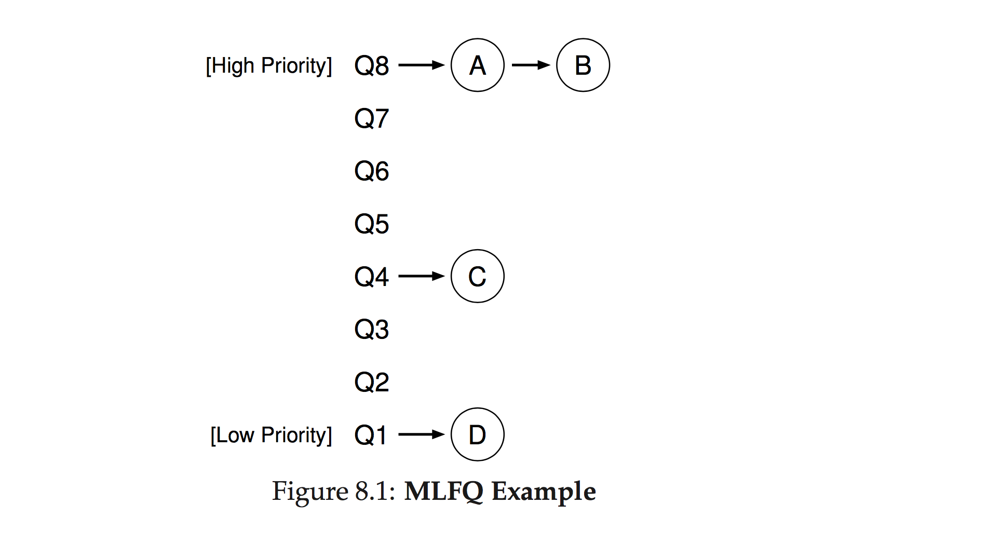

# Multi-Level Feedback Queue

### Motivation

After talking about one of the most popular scheduling algorithms used by operating systems to schedule processes, let's implement it! This will be an implementation that simulates an actual multi-level feedback queue processing blocking and non-blocking processes with multiple priority levels.

### Reiterating on How Scheduling Works

One of the main jobs of operating system kernels is that they need to be able to execute all of the processes running on your computer efficiently such that high priority processes are completed as quickly as possible, while also ensuring that there is some fairness in how they schedule processes; even if a process is a low priority, it eventually needs to complete execution.

In order to achieve this, a scheduler looks through the queues for the highest priority process and then executes it for a time quantum (a slice of time), which has been allocated to that queue by the processor. Once the time quantum is up, the process has either completed or it hasn't. If it hasn't, then the process is shunted to the next lower priority queue to wait for its turn again. If the process completed during the initial time quantum, then it gets discarded and the scheduler moves on to the next process in line. Queues are processed in first-in-first-out (FIFO) order.

The time quantum is further divided into smaller amounts of time called `work time`. A process is allowed to work for this work time, and then the scheduler will begin the loop over. If the process has not finished, and has not become a blocking process, then it will be processed again for the work time. The same process is repeatedly allowed to work until the full quantum time has been reached, or it finishes, at which point, if the process has not finished, it will be sent to the next lower-priority queue, or if already in the lowest priority queue, sent to the back of the line in that queue.

One thing to note is that processes in higher priority queues are allocated less CPU time than processes in a lower priority queue. The logic here is that the scheduler wants to get through as many of the short, high priority processes first, then the long, high priority processes, followed by the short low priority processes, before finally getting around to the long, low priority processes. Oftentimes, these long-running low priority processes only get allocated CPU time when your computer is idle, because during high usage periods, new processes are constantly being added to the highest-priority queue by the scheduler.

### Setup

Nothing special here. Just run `npm install` in the root directory, then start working on your implementation, using the provided skeleton code and comments for guidance / pointers. Run `npm test` when you want to check your code against the test suite, or `npm test:watch` if you'd like to keep the tests running as you work. You can also do `npm run test <name-of-test-suite>` to run one suite out of the three.

### Architecture



Our MLFQ implementation will be comprised of two types of queues: blocking queues and CPU queues. There will be one blocking queue and three CPU queues in our implementation. The blocking queue is where blocking processes go; all other processes go into the CPU queues. Each queue will have a different priority level, with a different time quantum allocation (which designates how much time each process in the associated queue receives from the CPU).

The blocking queue will have the highest priority (since we want to get through blocking processes as soon as possible), followed by the three CPU queues. You'll be implementing three classes, a Process class to represent blocking and non-blocking processes, a Queue class to represent the different types of queues, and a Scheduler class to represent the scheduler itself. Then, inside `main.js` is where these classes will be executed to simulate a scheduler working through processes.

Another important aspect that should be touched on is how queues, processes, and the scheduler all communicate with each other. For example, a process may need to let the scheduler and its parent queue know that the process has started a blocking operation, and thus needs to be moved to the blocking queue. Or conversely, a blocking process will need to notify the scheduler and its queue that it has finished its blocking operation, and can thus be moved to a CPU queue. The classes handle this communication by emitting interrupts at the appropriate times.

### Algorithm

The pseudo code for our MLFQ implementation is as follows:

```
Loop:
    If a process exists in the blocking queue:
        Work on removing each process in the blocking queue on a First In First Out (FIFO) basis
        Do blocking work for the amount of time specified for the current iteration
        When a process completes its blocking operation, emit an interrupt to the scheduler
        The scheduler removes the process from the blocking queue and
        adds it to the highest priority level CPU queue

    Beginning with the top priority CPU queue, look through each queue for a process to run; processes should be processed in FIFO order
    If a process is found:
        Do non-blocking work for the amount of time specified for the current iteration
            If the process becomes blocking:
                Emit an interrupt to the scheduler notifying it that the process has become blocking
                The scheduler removes the now-blocking process from the CPU queue
                Places it on the blocking queue
                Restarts the time quantum with the next process in the CPU queue

            If the end of the time quantum has been reached:
                Remove the process that is currently being worked on from the top of the CPU queue
                If the process is not finished:
                    If the process is already in the lowest priority queue:
                        Add it to the back of the same queue
                    Else:
                        Add the process to the back of the next lower priority queue
                Break out of the current iteration and continue looping

    If no processes are found in any queues, the scheduler can idle while waiting for new processes
        (in our case, the program will be done)
```

### Stretch Goals

Implement priority boosting within your MLFQ. Priority boosting is the idea that there is a global time quantum of, say, 500 ms that elapses. Once that global time quantum hits 0, it should reset, and every process in any of the available queues should all be moved back up to the top-level priority queue. This is one such scheme that is used in order to ensure that the bottom-of-the-barrel processes receive some additional attention.

Think about how this feature should be incorporated into your current MLFQ implementation. Which component of the MLFQ should be responsible for the global time quantum? How should processes be notified that they're recieving a priority boost, and how should that be facillitated?

### Further Reading

Here's a chapter from an operating systems textbook that dives a lot deeper into the theory and motivation behind the multi-level feedback queue: [http://pages.cs.wisc.edu/~remzi/OSTEP/cpu-sched-mlfq.pdf](http://pages.cs.wisc.edu/~remzi/OSTEP/cpu-sched-mlfq.pdf)

Also this link to some dude's copious notes on the topic of process scheduling on Unix kernels: https://notes.shichao.io/lkd/ch4/
