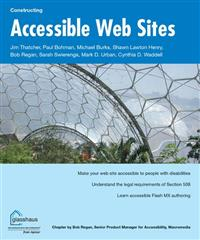

# Apress Source Code

This repository accompanies [_Constructing Accessible Web Sites_](http://www.apress.com/9781590591482) by Cynthia Waddell, Bob Regan, Shawn Lawton Henry, Michael R. Burks, Jim Thatcher, Mark D. Urban, and Paul Bohman (Apress, 2002).

Download the files as a zip using the green button, or clone the repository to your machine using Git.

## Releases

Release v1.0 corresponds to the code in the published book, without corrections or updates.

## Contributions

See the file Contributing.md for more information on how you can contribute to this repository.
