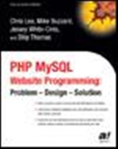

# Apress Source Code

This repository accompanies [*PHP MySQL Website Programming*](http://www.apress.com/9781590591505) by Dilip Thomas, Jessey Cinis, Chris Lea, and Michael Buzzard (Apress, 2002).

Download the files as a zip using the green button, or clone the repository to your machine using Git.

## Releases

Release v1.0 corresponds to the code in the published book, without corrections or updates.

## Contributions

See the file Contributing.md for more information on how you can contribute to this repository.
