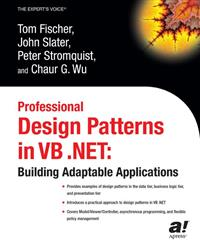

# Apress Source Code

This repository accompanies [_Professional Design Patterns in VB .NET_](http://www.apress.com/9781590592748) by Chaur Wu, Tom Fischer, Peter Stromquist, and John Slater (Apress, 2002).

Download the files as a zip using the green button, or clone the repository to your machine using Git.

## Releases

Release v1.0 corresponds to the code in the published book, without corrections or updates.

## Contributions

See the file Contributing.md for more information on how you can contribute to this repository.
